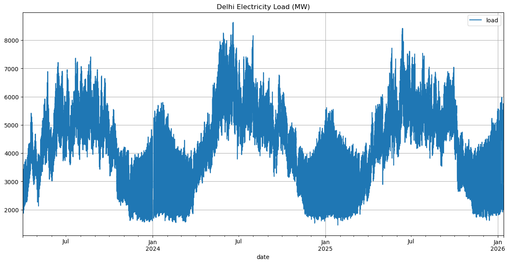
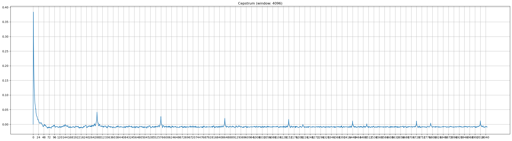

# Introduction
This submission is for BEEM012's first coursework over the year 2025-2026. Note that typesetting has been adapted from a Jupyter notebook, so some sections may not appear exactly (e.g., code blocks have been broken up here with explicit explanations to aid reasoning and preserve readability).

## Code Setup

```python
import logging
import matplotlib.pyplot as plt
import numpy as np
import pandas as pd
import seaborn as sns
import statsmodels.api as sm

from datetime import datetime
from matplotlib.figure import Figure
from statsmodels.graphics.tsaplots import plot_acf, plot_pacf
from statsmodels.graphics.gofplots import qqplot
from statsmodels.tsa.stattools import adfuller
from sklearn.metrics import root_mean_squared_error

logging.basicConfig()
logger = logging.getLogger(__name__)
logger.setLevel(logging.INFO)
rng = np.random.default_rng(seed=42)
```

# Before We Begin
It's _highly_ recommended to read the appendiceal section on philosophy before proceeding with this submission, as a refresher on the underlying motivation behind why we're interested in the studies we take here, and what kind of framework they emerge from. Specifically, it's important to recognise the importance that "residuals" carry from linear algebra. Much of the terminology and environment in what follows exists within that context. With that being said, let's begin.

# Descriptive Analysis (Week 1)

## Data Description
We're looking at electricity load in Delhi over time, between 2023-04-01 (01 April, 2023) and 2026-01-12 (12 January, 2026), sourced from @KaggleDelhiLoad. This is simply the city's amount of MW/h, as measured by the local State Load Dispatch Centre. The data is at the 5 minute level and we can aggregate as needed later on.1

## Time Series Plots

```python
>>> df_demand = pd.read_csv(
...     "../data/elec_load/load_data.csv",
...     names       = [
...         "date",
...         "load"
...     ],
...     header      = 0,
...     parse_dates = [0],  # parse `date` as a datetime
...     index_col   = [0],    # use `date` as a `pd.DatetimeIndex`
... )
>>> df_demand.plot(figsize=(15, 7), grid=True, title="Delhi Electricity Load (MW)")
>>> plt.show()
```



This is our feature vector of interest. We're interested in modelling electricity load over time. Theoretically we have 2 vectors: one purely linear one (time), and electricity load (a seasonal one). We're going to use time $t$ as our "`JOIN` key" and talk about our dataset as if we're only concerned with electricity load, $Y(t)$.

As expected, $Y(t)$ is highly seasonal with distinct winters (November $\to$ April) and summers (June $\to$ August), visually different in-season behaviour (winter has more concentrated mass, summers are transient), and daily seasonal spikes. This is indicative of a harmonic ladder (more on this later). There's no global trend visible, but we do have missing data points we ought to address. From inspection, our missingness is Missing Systematically @MaxKuhnFES, @MissingDataNCBI, and because we'll eventually aggregate up to 1h, we'll linearly interpolate. For missingness diagnostics, please see the appendix.

```python
>>> df_demand = df_demand.interpolate("linear")
```

# AR analysis
## Estimate an AR model
An AR model means "autoregressive", or that we try to project a shifted version of our time series onto itself.

```python
>>> y = df_demand["load"]
>>> X = y.shift(1).dropna()
>>> y = y.loc[X.index]
>>> coeff = np.dot(X, y)/np.dot(X, X)
>>> print(coeff)
0.99996
```

Our coefficient is almost 1, meaning a shifted version of our vector almost 1:1 maps onto itself. Or, in other words, electricity load from 5 minutes ago is almost exactly the same as electricity load right now. Let's look at our residuals.

```python
>>> proj = coeff*X
>>> resid = y - proj
```

Now, we're interested in the variance of our residuals, $\sigma^2$ and how that spreads over our degrees of freedom/degrees of variation.

```python
>>> resid_variance = np.dot(resid, resid) / (len(X)-1)
>>> print(resid_variance)
1540.76
```

For posterity, this is exactly what `np.var(resid, ddof=1)` will give us. We have 1 degree of freedom because we estimated 1 parameter (or in other words, we had just one unknown to solve for, amongst many equations).

Incredibly, we can relate our data-centric findings back to the data itself. If we divide the variance of our residuals, $\sigma^2$, over the variance in our data $\mathbf{X}^{\top}\mathbf{X}$, we effectively get how well our dataset constrains the free parameters, had we been able to estimate them. Our data generating function is a stochastic process, so the rationale is that the longer we look at it (the more data we have), the tighter the spread for misspecification is. We're effectively describing the distribution of our residuals relative to our dataset with this step as:

$$ \text{SE} = \sqrt{\frac{\sigma^2}{\vec{x} \cdot \vec{x}}} $$

Which is very neat application of asymptotic theory: at the limit as the length of our dataset $n \to \infty$, we get Student's T-distribution, which allows us to also account for heavier tails, if at all.

If this feels uncannily similar to Bayesian inference, it is. A lot of the assumptions here (uncertainty around the parameter, noisiness in the parameter relative to the size of our dataset, asymptotic limit as our dataset length tends to infinity, etc.) relate to behaviour that emerges around the maximum a-posterior (MAP, or the zenith of the posterior distribution) in Bayesian inference. At the zenith of the posterior distribution, our parameters are extremely well estimated and so vary quite little, given the length of our dataset (leading us to the Bayesian Information Criterion, more on this later). The underlying difference between approaching parameter estimation from a Bayesian sense, and using these inferred statistics, is that Bayesian inference actually gives us the entire posterior to play with. What we have here - a single point solution - _implicitly assumes_ that we're at the posterior zenith.

As a small aside, it gets interesting when we have, instead of $\vec{x}$, a matrix $\mathbf{X}$ because a couple of very cool things happen:
1. Briefly, $\mathbf{X}^{\top}\mathbf{X}$ in the denominator is a Gram matrix; unnormalised covariance between the columns in $\mathbf{X}$. Its inverse is, instead of variance in $\mathbf{X}$ which tells us how related each column is, _amount of orthogonality_ in $\mathbf{X}$ (the invese of how closely each column is related to each other). Dividing anything by this quantity effectively attributes it orthogonally to each column in $\mathbf{X}$.
2. Since $\mathbf{X}^{\top}\mathbf{X}$ is square with the number of columns in $\mathbf{X}$, when we divide $\sigma^2$ by it we'll get an incredibly useful piece of information. The resulting matrix's diagonal encodes the variance of each coefficient by itself relative to the data, while the off-diagonals give us the covariances between coefficients.

But that's getting ahead of ourselves; for now, we have a simple vector $\vec{x}$ acting a single vector in $\mathbf{X}$. We'll concern ourselves with only that.

```python
>>> param_se = np.sqrt(resid_variance / np.dot(X, X))
>>> print(param_se)
1.61e-05
```

The standard error (square root of our parameter's variance) for our parameter is extremely tiny because we have such a large dataset. So now the question is, how far from the actual MAP are we? If we divide our parameter by this standard error, we get a t-statistic that we can compare to a T-distribution that has $N-1$ degrees of freedom (or in other words, compare our $|t|$ to a $N-1$ T-distribution).

```python
>>> t_stat = coeff / param_se
>>> print(t_stat)
62289.11
```

This t-statistic tells us how far away from $0$ we are, in terms of standard deviations. In this case, we're ~62k standard deviations away, which is astronomically significant. In other words, our Ar(1) coefficient is pretty much stable (we don't need to compute quantiles of the T-distribution to make sense of it).

---

So let's move on. We'll wrap up this statistical analysis into a neat function that we can reuse, and then inspect our results for AR(1..4), as the worksheet requests. The only change we'll make to whatever we've seen so far is adding a column to $X$ that's a vector of $\vec{1}$, which will act as our affine offset. What we've effectively looked at until now is just $y=mx$, but we do need to account for the $b$ in $y=mx+b$. That $b$ is going to act as the mean of our projection vector $\hat{y}$, relative to the target data $\vec{y}$.

We'll also adjust our approach to only using the normal equation:
$$ \vec{b} = (\mathbf{X}^{\top}\mathbf{X})^{-1} \mathbf{X}^{\top}\vec{y} $$

Because for the most part, we'll always be dealing with a 2D object rather than a vector (computational inconveniences indeed). And because we're almost always dealing with a 2D object, we'll adjust to using just the diagonal for the t-test here. Finally, we need to be cognisant of the fact that with NumPy, `1/(X.T@X)` is not the same as `np.linalg.inv(X.T@X)`. The former is element-wise reciprocals, the latter is a matrix inverse.

```python
>>> def estimate_ar(data: pd.DataFrame, target: pd.Series, lag: int):
...     X = sm.add_constant(data)
...     y = target.loc[X.index]
...     XTX = np.linalg.inv(X.T @ X)
...     coeff = XTX @ (X.T @ y)
...     proj = X @ coeff
...     resid = y - proj
...     resid_variance = np.dot(resid, resid) / (len(X)-1)
...     param_se = np.sqrt(resid_variance * XTX)
...     t_stat = coeff / np.diag(param_se)
...     return (coeff, t_stat)
>>> maxlag = 4
for lag in range(1, maxlag+1):
...     coeffs, t_stats = estimate_ar(
...         data   = df_demand["load"].shift(range(1, lag+1)).dropna(),
...         target = df_demand["load"],
...         lag    = lag
...     )
...     print(f"Lag={lag}, coeffs={coeffs}, t-stats={t_stats}")
```

### Panel A - AR Coefficients
_Entries are coefficient (t-statistic)_

| Variable | AR(1)               | AR(2)              | AR(3)               | AR(4)               |
| -------- | ------------------- | ------------------ | ------------------- | ------------------- |
| const    | `1.8932 (7.693)`    |  `2.0860 (8.522)`  |  `2.7867 (12.103)`  |  `3.5706 (16.166)`  |
| load_1   | `0.9996 (1.83e+04)` |  `1.1029 (600.41)` |  `1.0678 (614.77)`  |  `0.9715 (548.48)`  |
| load_2   | —                   | `-0.1034 (-56.30)` |  `0.2715 (105.26)`  | ` 0.3484 (138.24)`  |
| load_3   | —                   | —                  | `-0.3400 (-195.73)` | `-0.0377 (-14.94)`  |
| load_4   | —                   | —                  | —                   | `-0.2831 (-159.83)` |

In all cases, our shifted parameters are extremely well estimated. The affine shifts (constants), not so much. But that's alright, because we're interested in how well this kind of projection estimates our data: is it worth it, useful, to project a shifted version of electricity load onto itself to infer the most likely next period behaviour? It would appear so, because our coefficient for the first lag is almost always 1.

From the lecture notes, we know that if any time series has a unit root, parameter estimates using that time series as a target will be biased downwards in accordance with this formula:

$$ \hat{\beta_1} = 1 − \frac{5.3}{T} $$

Applying this to our problem where $T$ is just the length of our dataset, we get $1 - \frac{5.3}{293184} \approx 0.999 \bar{9}$. So it _looks_ like we have a unit root, but a formal test will help.

---

There is another aspect we can look at to identify a "best model", which we touched upon earlier: the Bayesian Information Criterion (BIC). It's recommended to read the appendiceal section on the Bayesian Information Criterion for a background and an explanation on what this function does:

```python
>>> def compute_bic(y: np.ndarray, X: np.ndarray, coeffs: np.ndarray) -> float:
...     n, k = X.shape
...     proj = X @ coeffs
...     resid = y - proj
...     resid_variance = np.dot(resid, resid) / (n-k)
...
...     log_2pi = np.log(2*np.pi)
...     half_data = -n/2
...     log_resid_variance = np.log(resid_variance)
...     LLF = half_data*(log_2pi + 1 + log_resid_variance)
...     BIC = -2*LLF + k*np.log(n)
...     return BIC
>>> maxlag = 4
>>> for lag in range(1, maxlag+1):
...     _X = df_demand["load"].shift(range(1, lag+1)).dropna()
...     _X = sm.add_constant(_X)
...     _y = df_demand["load"].loc[_X.index]
...     coeffs, t_stats = estimate_ar(
...         data   = df_demand["load"].shift(range(1, lag+1)).dropna(),
...         target = df_demand["load"],
...         lag    = lag
...     )
...
...     bic = compute_bic(_y, _X, coeffs)
...     print(f"Lag={lag}, bic={bic}")
```

### Panel B - AR Model BIC
| Lag | BIC        |
| --- | ---------- |
| 1   | `2.98e+06` |
| 2   | `2.98e+06` |
| 3   | `2.94e+06` |
| 4   | `2.92e+06` |

AR(4) has the lowest BIC. Or, given the length of our dataset and the number of parameters we're estimating from it with OLS, it's the model that maximises the log-likelihood the most (remember that the likelihood is the distribution we assume our dataset came from). Now, it might seem like the BIC has significance by itself - and it does, indeed, because it summarises data length, free parmaeters, and dataset information - but relative BIC between models is what we focus on to select better models:

### Panel C - AR Model $\Delta BIC$
| Lag | BIC       | $\Delta$ BIC |
| --- | --------- | ------------ |
| 1   | `2.98+06` |            — |
| 2   | `2.98+06` |      `-3139` |
| 3   | `2.94+06` |     `-35993` |
| 4   | `2.92+06` |     `-24483` |

We have very strong evidence to discard AR(1) in favour of AR(4). Luckily it's the last model we fit, so its coefficients are:

```python
>>> pd.Series(index=_X.columns, data=coeffs)
const     3.57
load_1    0.97
load_2    0.35
load_3   -0.04
load_4   -0.28
```

### Unit Root Tests
We'll use ADF since that's easy to interpret, though the KPSS is also worth supplementing with. Going in blind, we're looking at electricity load over time, so economically we anticipate strong seasonality and, for various reasons, a mild trend:
- Population growth $\implies$ increasing electricity level, though mild because of counter-forces like shared utility, infrastructural efficiency, etc.
- Grid capacity being added slowly over time, resulting in an increase in level.
- Global warming increasing electricity consumption level over time.

However given our data's 5 minute resolution, we expect to be - and visually are - dominated by seasonality, with a trend almost undiscernible. Now, the ADF test is a very interesting twist: instead of projecting shifted and/or scaled versions of our dataset onto itself, we project a lagged version of $\vec{y}$ onto the first temporal difference of $\vec{y}$ with itself. We can include lags of the first temporal difference as additional columns that help span the subspace. In other words, we're doing this projection where $Y(t-1)$ is a lagged version of $Y(t)$, and $\Delta(d)$ denotes the first, second, $d$th difference of $Y(\cdot)$:

$$
\Delta(1) Y(t) =
    \beta_0
    + \delta Y(t-1)
    + \gamma_1 \Delta(1) Y(t-1)
    + \gamma_2 \Delta(2) Y(t-2)
    + \dots
    + \gamma_{p-1} \Delta(p) Y(t-(p-1))
    + \varepsilon(t)
$$

From that regression, we get a projection of $Y(t-1)$ onto $\Delta(1) Y(t)$. The t-statistic of the coefficient for $Y(t-1)$, $\delta$, is what we're interested in, because if we're close to 0 equal to it, it's strong evidence for a unit root. The rationale is that:
1. A white noise process is $Y(t) = \varepsilon(t)$, where $\varepsilon(t)$ is some random process.
2. A process with a _unit root_, a random walk, is $Y(t) = Y(t-1) + \varepsilon(t)$. Every random perturbation adds to the current level.
3. If we subtract $Y(t-1)$ from both sides, we get $Y(t) - Y(t-1) = \varepsilon(t)$, meaning the difference in each step is random.
4. We then project $Y(t-1)$ onto $Y(t) - Y(t-1)$ (and lags of that first difference if we choose to), because if $Y(t) - Y(t-1)$ can be perfectly predicted by $Y(t-1)$, it means we have a unit root.

Lags of $\Delta(1) Y(t)$ are just there to orthogonalise $\mathbf{X}$, so that we can clearly get a read on the coefficient attributable to $Y(t-1)$ without interfering collinearity, if any. We'll use the first 4 lags of $\Delta(1) Y(t)$. Additionally, the `statsmodels` implementation, `sm.adfuller`, provides 3 different trend checks:
- `c` : constant only (default).
- `ct` : constant and trend, which includes a constant column and a linear column (something like `np.arange(0, len(data), 1)`).
- `ctt` : constant, and linear and quadratic trend, which includes a constant, linear, and quadratic column (something like `np.arange(0, len(data), 1)**2`)

We'll add a constant to our regression problem and estimate that. So, we prepare our data accordingly:

```python
>>> adf_y = y.diff(1).dropna()
>>> adf_X1 = y.shift(1).dropna().rename()
>>> adf_XN = adf_y.shift([1, 2, 3, 4]).dropna()
>>> adf_X = pd.concat([adf_X1, adf_XN], axis=1, join="inner")
>>> adf_X = sm.add_constant(adf_X)
>>> adf_y = adf_y.loc[adf_X.index]

>>> adf_XTX = np.linalg.inv(adf_X.T.dot(adf_X))
>>> adf_coeffs = adf_XTX @ adf_X.T.dot(adf_y)

>>> n, k = adf_X.shape
>>> adf_proj = adf_X @ adf_coeffs
>>> adf_resid = adf_y - adf_proj
>>> adf_resid_variance = np.dot(adf_resid, adf_resid) / (n-k)
>>> adf_param_se = np.sqrt(adf_resid_variance * adf_XTX)
>>> tau_adf = adf_coeffs / np.diag(adf_param_se)
>>> pd.Series(index=adf_X.columns, data=tau_adf)
```

### Panel D - ADF Results

| Variable | ADF $\tau$ |
| -------- | ---------- |
| const    | ` 20.20`   |
| 0        | `-21.13`   |
| load_1   | `-49.86`   |
| load_2   | `144.86`   |
| load_3   | `167.41`   |
| load_4   | `122.19`   |

That variable `0`'s t-statistic is what we're interested in: it is _very_ negative, and 21 standard deviations away from $0$. So surely enough, we don't have a unit root, and we don't need to transform our data; however, it is important to understand that we have a _seasonal_ unit root with stochastic seasonality @RS_ADF, @RS_StochSeasonal that does need addressing. We'll reserve deseasonalised modelling for the appendix, for now we'll use seasonal data and assume our series is stationary.

### Tests For Breaks
Our choice of the QLR test is itself based on a Chow test and uses F-statistics. F-tests are dealt with in more detail in the section on Granger causality, but essentially they measure whether a restricted model (a linear model without certain regressors in $\mathbf{X}$) performs better of worse than an unrestricted model (a linear model with certain regressors); a comparison of "model premium" between the unrestricted and restricted versions. For a test for breaks, the "certain regressors" are indicator column(s): a binary column of 0s where the time index $t$ is not before, at, and after a break; and 1s where $t$ is just before, at, and after a break. For example if we had:
- A break on 2023-05-15, our interaction column $D$ would be $[\dots, 0, 0, 1, 0, 0, \dots]$ with $1$ at time $t=$ 2023-05-15 and $0$ elsewhere.
- A break from 2023-05-14 to 2023-05-16 (a constant stock rally for example), $D$ would be $[\dots, 0, 0, 1, 1, 1, 0, 0, \dots]$ with $1$ at times $t \in$ [2023-05-14, 2023-05-15, 2023-05-16] and $0$ elsewhere.

We might include $D$ as an interaction column, $D \cdot X(t)$, rather than pure binary so that our coefficients don't soak up a lot of affine offset when $D=1$. In our case however, we don't formally test for breaks for a couple of reasons:
1. Visually and intuitively, there are no breaks in our time series of electric load, $Y(t)$. Just clear seasonality.
2. In conjunction with the QLR test, our dataset is ~290k rows in size. Trimming 15% off both ends and going over what's left would still require ~205k iterations. Even if one iteration takes 5 seconds, we end up waiting for $17,102$ minutes, or $\approx 285$ hours or 12 days. So we'll just assert that there are no breaks in electric load.

## Estimate an ARDL model
Our second variable $X(t)$ is hourly weather data for Delhi over time, from 2023-01-04 (04 January, 2023) to 2025-12-31 (31 December, 2025), sourced from @OpenMeteo.

```python
df_weather = pd.read_csv(
    "../data/weather/weather_data.csv",
    names = [
        "date",
        "temperature",
        "relative_humidity"
    ],
    header = 0,
    parse_dates = [0],  # parse `date` as a datetime
    index_col = [0],    # use `date` as a `pd.DatetimeIndex
)

df_weather.plot(subplots=True, figsize=(20, 12), grid=True)
plt.tight_layout()
plt.show()
```


Before proceeding, we need to aggregate our electric load data from 5m $\to$ 1h.

```python
load_1h = df_demand.loc[:, "load"].resample("1h").sum()
```

**Note** that we use _seasonal_ load from 5m $\to$ 1h; for deseasonalised modelling, please see the appendix. We're going to proceed as if we don't know about stochastic seasonality.

When we started earlier, we spoke about projecting a shifted version of our time series onto itself. Now, we've introduced another variable, $X(t)$. Mathematically nothing has changed, we're still doing basic OLS and all of the things that come with it; _statistically_ we've introduced a regressor that ought to help us explain the behaviour of $Y(t)$ over time. But interestingly enough, $X(t)$ itself can behave in different ways over time.

When modelling cross-influences, a very helpful tool - equivalent to the (P)ACF for a univariate time series - is cross-correlation. Just as the variance in $\mathbf{X}$ is given by $\frac{\mathbf{X}^{\top}\mathbf{X}}{n-1}$, the covariance between $\mathbf{X}, \mathbf{Y}$ is given by $\frac{\mathbf{X}^{\top}\mathbf{Y}}{n-1}$. Normalising these values gives us autocorrelation and cross-correlation, and cross-correlation across different lags of a time series is an excellent diagnostic to use when trying to infer behaviour over time. It's so ubiquitous, in fact, that just as the equivalent of ACF/PACF is AR modelling, the equivalent of cross-correlation is ARDL modelling. With ARDL, now we're not including lags of $Y(t)$ but we're also including lags of $X(t)$ as well, to help explain behaviour in $Y(t)$ over time.

We'll omit cross-correlation in this submission for brevity, however, and because we know we have stochastic seasonality in $Y(t)$ (and quite possibly in $X(t)$), so the only way cross-correlation will help is if we whiten our time series by removing the seasonal unit root @RS_WhiteCops. ARDL is equivalent, however, and is what we'll do.

```python
>>> df_ardl = (
...     df_weather
...     .loc[:, ["temperature"]]
...     .merge(
...         load_1h,
...         left_index  = True,
...         right_index = True,
...         how         = "inner"
...     )
... )
>>> X = df_ardl.loc[:, "temperature"]
>>> y = df_ardl.loc[:, "load"]
```

For an ARDL(1,1), we include these columns in $\mathbf{X}$: $Y(t-1), X(t), X(t-1)$. For an ARDL(4,4), we'd include 4 lags of $Y(t)$, $X(t)$, and 4 lags of $X(t)$. We've already shown how we can do this step by step, so we'll pick up the pace slightly and just do the loop over 4 lags, along with the BIC for each lag.

```python
>>> maxlag = 4
>>> for lag in range(1, maxlag+1):
...     shift = list(range(1, lag+1))
...     _X = (
...         pd
...         .concat([y.shift(shift), X, X.shift(shift)], axis=1, join="inner")
...         .dropna()
...     )
...     _X = sm.add_constant(_X)
...     _y = y.loc[_X.index]
...     n, k = _X.shape
...     XTX = np.linalg.inv(_X.T.dot(_X))
...     coeffs = XTX @ (_X.T.dot(_y))
...     proj = _X.dot(coeffs)
...     resid = _y - proj
...     resid_variance = resid.dot(resid) / (n-k)
...     param_se = np.sqrt(resid_variance * XTX)
...     t_stat = coeffs / np.diag(param_se)
...     bic = compute_bic(y=_y, X=_X, coeffs=coeffs)
...
...     print(f"Lag={lag}, bic={bic}")
...     display(
...         pd.DataFrame(
...             index = _X.columns,
...             data  = {"coeffs": coeffs, "t_stat": t_stat}
...         )
...     )
```

### Panel E - ARDL Coefficients
_Entries are coefficient (t-statistic)_

| Variable      | ARDL(1,1)         | ARDL(2,2)        | ARDL(3,3)        | ARDL(4,4)        |
| ------------- | ----------------- | ---------------- | ---------------- | ---------------- |
| const         | `-785.37 (-0.07)` | `553.16 (0.07)`  | `246.22 (0.03)`  | `284.34 (0.04)`  |
| load_1        |    `0.94 (3.96)`  |   `1.65 (2.41)`  |   `1.85 (1.92)`  |   `1.86 (1.86)`  |
| load_2        | —                 |  `-0.70 (-1.06)` |  `-1.16 (-0.67)` |  `-1.20 (-0.58)` |
| load_3        | —                 | —                |   `0.27 (0.28)`  |   `0.32 (0.16)`  |
| load_4        | —                 | —                | —                |  `-0.03 (-0.03)` |
| temperature   |  `119.79 (0.05)`  | `145.25 (0.07)`  |  `73.26 (0.03)`  |  `76.86 (0.04)`  |
| temperature_1 |   `43.26 (0.02)`  |   `5.99 (0.00)`  |  `78.21 (0.02)`  |  `69.71 (0.02)`  |
| temperature_2 | —                 | `-64.24 (-0.03)` | `-73.57 (-0.02)` | `-99.16 (-0.03)` |
| temperature_3 | —                 | —                |   `2.66 (0.00)`  |  `86.75 (0.02)`  |
| temperature_4 | —                 | —                | —                | `-56.01 (-0.03)` |
| BIC           |       `453150.95` |      `434579.33` |      `432685.80` |      `432650.65` |

Now this is quite interesting. Except for coefficients of electric load, all the other coefficients are highly imprecise (remember that a t-statistic is the parameter divided by its standard error, which in turn is the variance of our residuals orthogonalised over $\mathbf{X}$), all lying just $\pm 1$ standard deviation away from $0$. Projection coefficients for load however are stable and significant, except for `load_4` which minimally spans the subspace $\in \mathbf{X}$ that $Y(t)$ lies in. This shows that - at least as far as our results here go - load lags $Y(t-1), Y(t-2)$, and minimally $Y(t-3)$ are the biggest weighted vectors that project well onto $Y(t)$, or that lags 1 and 2 carry the most information when projecting onto $Y(t)$. Our data strongly identifies load dynamcis, but doesn't carry information to discern temperature effects. That the others don't is a sign of multicollinearity, because they aren't really needed - statistically, at least. In fact, looking at our condition number $\kappa(\mathbf{X}$ at each iteration:

### Panel F: ARDL Condition Numbers
| Lag       | $\kappa$    |
| --------- | ----------- |
| ARDL(1,1) | `208229.37` |
| ARDL(2,2) | `298661.55` |
| ARDL(3,3) | `369708.19` |
| ARDL(4,4) | `430144.30` |

Confirms this. So we have a huge multicollinear system that we're inverting at each step when projecting onto $Y(t)$, and since the dominant eigenvalue (presumebly just the first couple of lags of $Y(t)$) stretches the entire system, the other coefficients end up tagging along as numerical noise. We can inspect the loadings onto the right-singular vectors of $\mathbf{X}$ via SVD corresponding to the largest singular-values to identify which columns those are precisely, but that's a different discussion altogether. Our condition numbers for the AR models earlier were large as well, as a matter of fact.

### Granger Causality
So we know that there some kind of a relationship between temperature $X(t)$ and electric load $Y(t)$, and that slapping both of these together creates a large nonlinear system. The Granger causality framework essentially lets us see whether including lags of $X(t)$ brings a premium over modelling without them (as an aside, Mutual Information is a much more informative (pun intened) tool).

The F-test for Granger causality involves looking at a ratio of ratios. When we project a vector onto a vector (or a matrix onto a vector), we get coefficients for each projecting column, which is the best projection we can do (the least squares projection). As explained in the appendix, the variance of the residuals (the orthogonal bits of the subspace we're projecting onto that get left over/overshot) matters because the data generating process is stochastics. That residual variance is the so-called "sum of squared errors", or SSE. Subtly, the SSE is model dependent: if I pick another model for the underlying process $Y(t)$, I get a different vector of residuals with a different amount of variance.

The Granger causality F-test uses this to its advantage. We have regressors that we believe influence $Y(t)$ (in this case, temperature), along with lags of $Y(t)$ itself. We:
1. Project lags of $Y(t)$ onto itself _without_ the explanatory variables. This is the "restricted" model, denoted with a subscript $r$, and gives us restricted variance of residals, $\text{SSR}_r$.
2. Project lags of $Y(t)$ onto itself _with_ the explanatory variables. This is the "unrestricted" model, denoted with subscript $u$, and gives us unrestricted variance of residuals, $\text{SSR}_u$.

The difference in the variance of residuals between both models is a kind of model premium. Accounting for the number of regressors we're withholding ($q$) and total degrees of freedom ($\text{dof}$), the ratio between both SSRs is the F-statistic:

$$
\begin{align*}
    \text{Restricted Premium} &= \frac{SSR_r - SSR_u}{q} \\
    \text{Unrestricted Freedom} &= \frac{SSR_u}{\text{dof}} \\
    \therefore F &= \frac{\text{Restricted Premium}}{\text{Unrestricted Freedom}}
\end{align*}
$$

In other words, we look at how much we gain per "unit" of unrestricted freedom by removing/withholding regressors. If we lose out on expressive power by withholding, $F$ reduces because the numerator shrinks relative to the denominator. If we gain by withholding, $F$ increases. So we're trying to see if including temperature brings a premium to just using lags of $Y(t)$, meaning we're trying to see if "temperature Granger-causes load".

```python
>>> lags = []
>>> for i in range(1, 5):
...     lags.append(i)
...     lagged_y = y.shift(lags).dropna()
...     lagged_X = X.shift(lags).dropna()
...
...     # restricted dataset
...     r_X = sm.add_constant(lagged_y)
...     r_y = y.loc[r_X.index]
...     r_coeffs = np.linalg.inv(r_X.T @ r_X) @ (r_X.T @ r_y)
...     r_resids = r_y.sub(r_X @ r_coeffs)
...     r_sse = r_resids @ r_resids
...
...     # unrestricted dataset
...     u_concat = pd.concat([lagged_y, lagged_X], axis=1, join="inner")
...     u_X = sm.add_constant(u_concat)
...     u_y = y.loc[u_X.index]
...     u_coeffs = np.linalg.inv(u_X.T @ u_X) @ (u_X.T @ u_y)
...     u_resids = u_y.sub(u_X @ u_coeffs)
...     u_sse = u_resids @ u_resids
...
...     # f-stat
...     n, k_u = u_X.shape
...     r_premium = (r_sse-u_sse)/i
...     u_freedom = u_sse/(n-k_u)
...     F = r_premium / u_freedom
...     print(f"Lags={lags}, F={F:.4f}")
```

### Panel G: Granger Causality F-Statistics
| Lags | F-Statistic |
| ---- | ----------- |
| 1    | `3017.47`   |
| 2    | `1114.43`   |
| 3    |  `642.52`   |
| 4    |  `491.24`   |

We see a pretty big decrease in $F$ as we add regressors, meaning we lose out significantly on expressive power by withholding them. This aligns with the fact that our ARDL(4,4) model was the best by BIC, and we can conclude that temperature strongly "Granger-causes" load at all seasonal lag lengths. In other words, lags of $X(t)$ are jointly significant predictors of $Y(t)$ in a model where we also include lags of $Y(t)$ - with the caveat that we haven't deseasonalised yet. This is interesting because electric load being short-term predictable has great impacts on the activities of hedgers and speculators in the energy markets; effectively meaning the short-term energy markets have highly efficient pricing. This also ties in somewhat to the short Lyapunov time in weather forecasting.

## Forecasting
**NOTE:** As mentioned, we're proceeding here with _seasonal_ forecasting - i.e., retaining our seasonal component in $Y(t)$. For deseasonalised forecasting, please see the appendix.

The pipeline here is very straightforward: we first split our data into 75% and 25% blocks, calling the 25% block our test split (the other is our train split). We estimate ARDL projection coefficients on the training split, then we multiply those coefficients with _only_ $X(t)$ data in the testing split - the lags of $Y(t)$, if any - are the values we get by multiplying our coefficients with each row in $X(t)$, and are recursively appended onto $\hat{X}(t)$. We do this for the length of forecasting time we need. We can quantify the accuracy of our forecasts using the norm of the residual vector, divided by the sample size (so-called "RMSE").

```python
>>> def split_data(
...         df: pd.DataFrame|pd.Series,
...         test_ratio: float=0.25
...     ) -> tuple[pd.DataFrame, pd.DataFrame]:
...     N = len(df)
...     test_idx = int(N*test_ratio)
...     train = df.iloc[:-test_idx]
...     test = df.iloc[-test_idx:]
...     return train, test

>>> def resid_t(y_true: np.ndarray, y_pred: np.ndarray) -> float:
...     resid = y_true.sub(y_pred)
...     N = len(resid)
...     mean = resid.mean()
...     sdev = resid.std(ddof=1)
...     stat = mean / (sdev/np.sqrt(N))
...     return stat
```

We'll also plot out some diagnostics for our residuals:

```python
>>> def plot_forecasts(
...         y_true: pd.Series,
...         y_pred: pd.Series,
...         figsize: tuple[int, int] = (40, 30),
...     ) -> Figure:
...     """
...     Plot forecasts `y_pred` versus ground truth `y_true` along with residuals and
...     residual QQ and ACF plots (diagnostics).
...     """
...     rmse = root_mean_squared_error(y_true=y_true, y_pred=y_pred)
...     residuals = y_true - y_pred
...     residuals = (residuals-np.mean(residuals)) / np.std(residuals)
...     layout = [
...         ["ts", "ts",],  # top row: all 3 cells for fcast accuracy
...         ["rs", "rs",],  # middle row: residuals
...         ["d1", "d2",],  # bottom row: diagnostics
...     ]
...     fig, axes = plt.subplot_mosaic(
...         layout,
...         figsize     = figsize,
...         gridspec_kw = {"hspace": 0.1, "wspace": 0.1}
...     )
...     axes["ts"].plot(y_true, label="ground")
...     axes["ts"].plot(y_pred, label="fcasts")
...     axes["ts"].set_title(f"Forecast vs. Ground - RMSE: {rmse:.4f}")
...     axes["ts"].grid(True)
...     axes["ts"].legend()
...
...     axes["rs"].plot(residuals, label="standardised residuals")
...     axes["rs"].set_title("Standardised Residuals (z_norm(y_true-y_pred))")
...     axes["rs"].grid(True)
...     axes["rs"].legend()
...
...     qqplot(residuals, line="45", ax=axes["d1"])
...     axes["d1"].set_title("Normal Q-Q")
...     axes["d1"].grid(True)
...
...     plot_acf(residuals, ax=axes["d2"], zero=False, title="Correlogram")
...     axes["d2"].grid(True)
...
...     fig.tight_layout()
...     return fig
```

Our forecasting function:

```python
>>> def iterative_forecast(
...         ahead: int,
...         train_y: pd.Series,
...         test_X: pd.DataFrame,
...         params: np.ndarray,
...         in_sample: bool=False,
...     ) -> np.ndarray:
...     results = np.zeros(ahead+1)
...     results[0] = train_y.iloc[-1, :].item()
...
...     for t in range(1, ahead+1):
...         if in_sample:
...             X = np.concatenate([train_y.iloc[t-1, :], test_X.iloc[t-1, :]])
...         else:
...             X = np.concatenate([[results[t-1]], test_X.iloc[t-1, :]])
...         results[t] = X.dot(params)
...
...     results = pd.Series(index=test_X.index, data=results[1:])
...     return results
```

Data preparation:

```python
>>> train_X, test_X = split_data(X, test_ratio=0.25)
>>> train_y, test_y = split_data(y, test_ratio=0.25)
>>> # we need that list syntax in `shift` because without it, we'd need to
>>> # manually rename our shifted column.
>>> train_X = pd.concat(
...     [
...         train_y.shift([1]).dropna(),
...         train_X,
...         train_X.shift([1]).dropna()
...     ],
...     axis = 1,
...     join = "inner"
... )
>>> train_X = sm.add_constant(train_X)
>>> train_y = train_y.loc[train_X.index]
>>> test_X = pd.concat(
...     [
...         test_X,
...         test_X.shift([1]).dropna()
...     ],
...     axis = 1,
...     join = "inner"
... )
>>> test_X = sm.add_constant(test_X)
>>> test_y = test_y.loc[test_X.index]
```

Note that we're taking explicit advantage of Pandas' internal index-matching logic. `statsmodels` by default prepends constants. In `train_X` we have column order `const, load_1, ...`, whilst in `test_X` we have `const, temperature, ...`.  During forecasting, iteratively appending `load_1` onto a NumPy array will trash the order of coefficients, whereas correctly named columns/rows in Pandas are always matched with errors being raised in case of a mismatch. Hence the dependence on Pandas (and additional steps like creating a `pd.Series` with `coeffs`, etc.) in `iterative_forecast()` and `resid_t()`.

**Note** that our best performing model was ARDL(4,4), however the assignment explicitly asks for ARDL(1,1) which makes our work much easier. We need to ensure we have the right train/test columns: training regressors are lagged $Y(t)$ _only_ with contemporary and lagged $X(t)$; testing regressors must not include $Y(t)$ in any capacity - which is great, because with ARDL(1,1) we only need the previous $\hat{Y}(t)$. If we were using ARDL(4,4), we'd have some juggling to do.


### Out-Of-Sample Forecasting (Seasonal)
And finally, our out-of-sample results:

```python
>>> iter_res = iterative_forecast(
...     ahead = len(test_X),
...     train_X = train_X,
...     train_y = train_y,
...     test_X = test_X,
...     in_sample = False
... )
>>> print(resid_t(test_y, iter_res))
7.5070
>>> plot_forecasts(test_y, iter_res)
>>> plt.show()
```


### In-Sample Forecasting (Seasonal)

```python
>>> iter_res_insample = iterative_forecast(
...     ahead = len(train_y),
...     train_X = train_X,
...     train_y = train_y,
...     test_X = train_X.drop(columns="load_1"),
...     in_sample = True
... )
>>> print(resid_t(train_y, iter_res_insample))
-0.2229
>>> plot_forecasts(train_y, iter_res_insample)
>>> plt.show()
```


## Conclusion
Our ARDL(1,1) model is incapable of adequately forecasting out-of-sample, possibly due to some misspecification. Our in-sample forecast errors are very close to $0$, evidenced by their t-statistic, as compared to our out-of-sample forecast errors.

# Appendix
## Some Philosophy
We know that from pure linear algebra, we have a technique of "projecting" one vector onto another. This gives us, in the regular wordage used, a "shadow" of the projector onto the projectee. So for example, if we had 2 lines:
$$ \vec{x}=\begin{bmatrix}3\\1\end{bmatrix},\; \vec{y}=\begin{bmatrix}4\\2\end{bmatrix} $$

If we wanted to get the "projection" of $\vec{x}$ onto $\vec{y}$, eliding the derivation, we'd traditionally solve this kind of equation:

$$
\begin{align*}
    \text{Proj}_{\vec{y}}(\vec{x}) &=
        \frac{\vec{x} \cdot \vec{y}}{\vec{x} \cdot \vec{x}} \cdot \vec{x} \\
    \implies &= \frac{13}{10} \cdot \vec{x} \\
    \implies &= 1.3 \cdot \vec{x} \\
    &= \begin{bmatrix}3.9\\1.3\end{bmatrix}
\end{align*}
$$

That resulting vector is the projection of $\vec{x}$ onto $\vec{y}$, and we can see how close the numbers are. The scaling factor, $3.9$, is our coefficient for $\vec{x}$. If we just expand this to a matrix projection onto a vector, we get the normal equation:
$$
\begin{align*}
    \mathbf{X}\vec{b} &= \vec{y} \\
    \implies \vec{b} &= (\mathbf{X}^{\top}\mathbf{X})^{-1} \mathbf{X}^{\top}\vec{y}
\end{align*}
$$

Where $\mathbf{X}$ is some matrix (again, eliding the derivation and the fact that matrices are linear transformations/functions, etc.) As a quick example, if:
$$ \mathbf{X} = \begin{bmatrix}3& 2\\1& -5\end{bmatrix} $$

We get coefficients for each column in $\mathbf{X}$, $1.29$ and $0.06$ such that $\mathbf{X}\vec{b} = \vec{y}$:

$$
\begin{bmatrix}3& 1\\1& -5\end{bmatrix}
\cdot
\begin{bmatrix}1.29\\0.06\end{bmatrix} =
    \begin{bmatrix}3.94\\2.29\end{bmatrix}
$$

We can visually see, in both instances, that we get results that aren't perfectly $\vec{y}$; they're the best "shadows" we can get closely onto $\vec{y}$, but not quite. As such, these are our _residuals_. They're the amounts, of/in each dimension in $y$, that are - by definition - orthogonal to the best projection we can make. So in the first case, our _residuals_ are:

$$
\vec{r} =
    \begin{bmatrix}4\\2\end{bmatrix} - \begin{bmatrix}3.9\\1.3\end{bmatrix}
    = \begin{bmatrix}0.1\\-0.3\end{bmatrix}
$$

And in the second case:

$$
\vec{r} =
    \begin{bmatrix}4\\2\end{bmatrix} - \begin{bmatrix}3.94\\2.29\end{bmatrix}
    = \begin{bmatrix}0.06\\-1.29\end{bmatrix}
$$

In pure linear algebra, our coefficients are applicable over our entire vector $\vec{x}$, whether our projection vector is by itself or in a matrix. In reality however, our data is never fixed - even though we might have a data matrix, the point to keep in mind is that our data is _one realisation from a stochastic process_. So our residuals assume great importance now: they're the components left over that our "model" cannot explain. They are, by definition, orthogonal to our model of the data.

This is crucial because it helps connect why we ought to be concerned with our residuals, rather than calling it a day at saying, "they're orthogonal to our projection". This orthogonality matters, because if our data generating process is stochastic, it means our model is going to face some variance it cannot handle. As such, we're concerned with:
- How significant/noisy our estimate is, given the length of the dataset that we have?
- How do our residuals vary/how much variance do they carry?
- How are our residuals distributed?

And additionally, one more important point: we don't always have data matrices that are nice and square like $\mathbf{X}$ in our example here. We, almost always, have data matrices that are either long, with more rows than columns; or wide, with more columns than rows. When we estimate our best projection's - dubbed the "least squares" projection - coefficients, it's imperative to recognise always that we're solving a large system of linear equations. When we have a square matrix like $\mathbf{X}$, we have the the exact number of equations as we have unknowns, so we have a unique solution. If we have more rows than columns, we have more equations than unknowns; if we have more columns than rows, more unknowns than equations. In both cases, we ought to account for this overconstrainedness/underconstrainedness using _degrees of freedom_.

In the overdetermined case (more equations than unknowns), we can only estimate as many coefficients as we have columns. This is very apparent when solving a linear system using Gaussian elimination: the rest of the equations have _free parameters_, or parameters that are allowed to vary. If we have an exact number of equations as parameters, nothing is allowed to vary and we get an exact fit. If we have more parameters than equations, we overfit. And if we have many degrees of freedom, then given that our residuals are the components of our model orthogonal to it, its variance can naturally be understood to vary _across the degrees of freedom_. The residuals have variance, and the degrees of freedom tell us over how many parameters we can vary.


## Missing Data
First and foremost, as explained in @MaxKuhnFES and @MissingDataNCBI: are our missing values structural, Missing Completely At Random (MCAR), Missing At Random (MAR), or Missing Not At Random (MNAR)? Inspecting with a spreadsheet shows us that:
- The SLDC apparently misses data regularly between the hours of 22:00 and 00:00.
- Sometimes within a month, the SLDC appears to reset entirely across a few days, missing data from 15:00 all the way up to a few days later again from 22:00.

This is perhaps best represented with a heatmap, though admittedly highlighting all 7.3k missing values and their patterns is a bit finicky:

```python
>>> _missing = df_demand["load"].isnull()
>>> missing_mat = (
...     _missing
...     .to_frame()
...     .pivot_table(
...         columns = _missing.index.date,
...         index   = _missing.index.time
...     )
... )
>>> plt.figure(figsize=(20, 12))
>>> sns.heatmap(
...     data       = missing_mat,
...     cmap       = "Reds",
...     linewidths = 0,
...     rasterized = True,
...     cbar       = False
... )
>>> plt.title("Missing Values By Hour & Day")
>>> plt.xlabel("Date")
>>> plt.ylabel("Hour")
>>> plt.tight_layout()
>>> plt.show()
```


\FloatBarrier

We can get a finer-grained look at behaviour over time but within these hours to see if there's anything structural (does load tank to 0 indicating a shutdown, e.g.), and whether we can impute seasonally:

```python
>>> df_demand.groupby(df_demand.index.time).mean().plot(figsize=(15, 7))
>>> plt.title("Mean Electricity Load vs. Time of Day")
>>> plt.xlabel("Time")
>>> plt.ylabel("Load Level")
>>> plt.grid()
>>> plt.show()
```


Not _quite_ anything structural, though it is interesting to see a little dip around midday, and a jump up at midnight leading to the predictable low at around 5am. So our data is Missing Systematically @RS_MNAR!

We'll opt for linear interpolation because we need to aggregate to the 1h level; removing the missing values will cost us a lot when we aggregate. Quadratic, cubic, and higher-order interpolation methods land us up with boundary effects and skew our data. If we try to use the intraday average to interplate, we end up with serious seasonal misspecification. Bayesian interpolation with a Gaussian Process runs us into memory errors because our dataset is dense.

## The Bayesian Information Criterion
Personally, I find Bayesian probability a very fascinating topic. We'll start from the end and work our way back to here. Recall that the BIC helps us select a "simpler" model, based on the number of parameters we've estimated, just as discussed:

$$ \text{BIC} = k \ln(n) - 2 \ln(\hat{L}) $$

Where:
- $\hat{L}$ is the maximised likelihood function of the model,
- $n$ is the length of our dataset, and
- $k$ is the number of parameters in the model.

So far so good. For the rest of this, we'll use Wikipedia's notation @WikiBIC. "Bayesian" implies something to do with Bayes' theorem and Bayesian inference, and indeed the BIC comes from Bayesian inference. In Bayesian inference, we start with assuming that the uncertainty in our parameters is distributed a certain way: the _prior_ probability distribution, $\pi(\theta | M)$ ($\theta$ is the parameter(s), $M$ is our model form). We also assume that our observed data is distributed a certain way: the _likelihood_ distribution, $p(x | \theta, M)$ ($x$ is a data point, $M$ is our model form). At each guess of a parameter (or a set of parameters, if we have many), we evaluate the prior distribution to find out how plausible the guess is; we evaluate the likelihood at that guess to find out how plausible our data is given guess, and we finally end up with a _posterior_ distribution  - the asymptotic, joint distribution over parameter- and data-space, $p(x | M)$. This is a slight rewrite of Bayes' theorem, which cuts out the normalising factor because it's usually difficult to compute that:

$$ p(x|M) = \int p(x | \theta, M)\ \pi(\theta | M) d\theta $$

As mentioned, the best final parameter estimates are at the zenith of the posterior function (MAP). We usually use Metropolis-Hastings/HMC/NUTS as iterative solvers to give us a posterior, but in some cases we can actually use Taylor's expansion to discern the structure of the posterior (a technique known as Laplace approximation). We expand around $\hat{\theta}$, the region where our parameters are well-estimated (we don't know the optimal parameters, but we can study the geometry around whatever maximum we might come upon). For example, a Gamma prior on a Beta likelihood lends itself to Taylor's expansions around the MLE, as do conjugate-prior and likelihood pairs. Proceeding alongside Wikipedia, we must keep in mind that $\hat{\theta}$ is a maximum point, so the first derivative will be zero and the second derivative will be concave down around that region:

$$\ln(p(x | \theta, M)) = \ln(\hat{\mathcal{L}}) - \frac{n}{2} (\theta - \hat{\theta})^{\top} \mathcal{I}(\hat{\theta})(\theta - \hat{\theta}) + R(x, \theta) $$

This might appear different from a regular Taylor expansion because of that 2nd term, but the Hessian (2nd derivative) is contained in $\mathcal{I}(\hat{\theta})$, the Fisher information per observation, or the amount of information our dataset $\mathbf{X}$ carries about the parameter(s) we're trying to estimate, $\theta$. Naturally, the more data we have the more information we have. But to see exactly where that expression came from, recall the log-likelihood function for $n$ i.i.d. data points is a sum (in log-space) of the distribution for each data point, $p(x_i \mid \theta)$, assuming independence:

$$ \ell_n(\theta)=\sum_{i=1}^n \log p(x_i\mid \theta) $$

For example, if we have 10 data points and we assume that each of them are independent of each other and Gaussian distributed, then $\ln \left( \ell_n(\theta) \right)$ is the sum of 10 Gaussians. By definition, the observed Fisher information is the negative of this this log-likelihood's second derivative (the Hessian matrix):

$$ -\nabla^2 \ell_n(\hat\theta) \approx n \mathcal I(\hat\theta) $$

That linear scaling in $n$ is what we see in the quadratic above. From earlier, we have that $R(x, \theta)$ are the higher-order terms which we can disregard insofar as they're negligible. Now, this statement on Wikipedia requires a bit of an understanding: _"given that we're at a maximum with $\hat{\theta}$, we can assume it's in a linear region, so we can integrate out $\theta$"_. Because $\hat{\theta}$ is a maximum, what that means is the likelihood is sharply peaked around $\hat{\theta}$ and has width $O(n^{-1/2})$ because of that $n$ in the quadratic. Over that very small neighbourhood, a _smooth prior_ satisfies this condition:

$$ \pi(\theta) \approx \pi(\hat\theta) + O(|\theta-\hat\theta|) $$

What's a "smooth prior"? Recall that we can only do a Taylor expansion if our function is twice differentiable $\implies$ smooth, or at least smooth enough to differentiate twice. So in an infinitesimal region around $\hat{\theta}$, the prior is essentially a constant. The _antiderivative_ of a constant is $\int 2 dx = 2x + C$, but here we have a definite integral. So we can take $\pi(\theta) \approx \pi(\hat{\theta})$:

$$
\begin{align*}
    p(x|M) &= \int \exp \left(
            \ln(\hat{\mathcal{L}})
            - \frac{n}{2} (\theta - \hat{\theta})^{\top}
            \mathcal{I}(\hat{\theta})(\theta - \hat{\theta})
        \right)
        \cdot \pi(\theta | M) d\theta \\
    &= \hat{\mathcal{L}} \int \exp \left(
            - \frac{n}{2} (\theta - \hat{\theta})^{\top}
            \mathcal{I}(\hat{\theta})(\theta - \hat{\theta})
        \right)
        \cdot \pi(\theta | M) d\theta \\
    &= \hat{\mathcal{L}} \pi(\hat{\theta}) \int \exp \left(
            - \frac{n}{2} (\theta - \hat{\theta})^{\top}
            \mathcal{I}(\hat{\theta})(\theta - \hat{\theta})
        \right)
        d\theta
\end{align*}
$$

Lo and behold, recognise that this term:

$$ \exp \left( - \frac{n}{2} (\theta - \hat{\theta})^{\top} \mathcal{I}(\hat{\theta})(\theta - \hat{\theta}) \right) $$

Is the unnormalised kernel of a multivariate Gaussian @WikiMvarGaussian. So, proceeding with Wikipedia's derivation:

$$
\begin{align*}
    p(x|M) &=
        \hat{\mathcal{L}} \pi(\hat{\theta}) \int \exp \left(
            - \frac{n}{2} (\theta - \hat{\theta})^{\top}
            \mathcal{I}(\hat{\theta})(\theta - \hat{\theta})
        \right)
        d\theta \\
        &\approx \hat{\mathcal{L}} \pi(\hat{\theta}) \left( \frac{2\pi}{n} \right)^{\frac{k}{2}} |\mathcal{I}(\hat{\theta})|^{-\frac{1}{2}}
\end{align*}
$$

As $n$ increases, $|\mathcal{I}(\hat{\theta})|^{-\frac{1}{2}}$ and $\pi(\hat{\theta})$ become negligible as they're fixed - the prior over the parameter(s) doesn't change with an increase in data, and the amount of information _about_ those parameters given by the dataset doesn't change the more data we collect. Only the likelihood and posterior do. In other words, the more data we have, the more precise our parameter estimates become because the likelihood becomes more concentrated at a rate of $O(n^{-1/2})$, dominating the fixed-width prior. So in the limit as $n \to \infty$:

$$
\begin{align*}
    p(x|M) &= \exp \left( \ln(\hat{\mathcal{L}}) - \frac{k}{2} \ln(n) + O(1) \right) \\
    \therefore \text{BIC} &= \ln(\hat{\mathcal{L}}) - \frac{k}{2} \ln(n)
\end{align*}
$$

How is this related to Bayesian inference? It's really cool: what's different is what we keep and what we throw away. When using HMC/NUTS, we approximating the entire posterior, which is possibley multi-modal, skewed, heavy-tailed, etc. But if we (can) do a Laplace approximation (expand the log-posterior around $\hat{\theta}$, retain only the quadratic term, and end up approximating the posterior as Gaussian), it's still Bayesian inference. The BIC however lets us study what happens if we let the amount of data we have, $n$, tend to $\infty$ asymptotically but still try and estimate the parameter(s) we're interested in. It thus drops all constants not growing with $n$. Importantly, this relates to a choice of model because "model" in a Bayesian sense is "probability mixture": a joint space between parameter priors and data likelihood. Not a curve or an equation, _but a genuine probabiliy space_. Parameters are random variables in the Bayesian sense, and if we have too many parameters $k$, we have too many degrees of freedom and thus more chance to overfit, unless the data forces precision. Marginal likelihood automatically penalises this. Hence, the BIC helping us choose a simpler "model".

So let's compute the BIC for our AR(1..4) models here. As established, we're using OLS. We need our likelihood function, which we'll assume to be Gaussian, over $n$ data points. Following @StatLect, we have that for one observation, the density is:

$$
p(y_i \mid \hat y_i, \sigma^2) = \frac{1}{\sqrt{2\pi\sigma^2}} \exp \left(
    -\frac{(y_i - \hat y_i)^2}{2\sigma^2}
\right)
$$

For $n$ observations we multiply, but log turns products into sums, giving us:

$$
\ln \mathcal L =
    -\frac{n}{2}\ln(2\pi)
    -\frac{n}{2}\ln(\sigma^2)
    -\frac{1}{2\sigma^2}
    \sum_{i=1}^n (y_i - \hat y_i)^2
$$

Those final terms at the end are the variance of our residuals (so-called "sum of squared errors"), and our residuals themselves. So:

$$
\ln \mathcal L =
    -\frac{n}{2}\ln(2\pi)
    -\frac{n}{2}\ln(\sigma^2)
    -\frac{\text{SSE}}{2\sigma^2}
$$

For a Gaussian, the MLE is $\hat\sigma^2 = \frac{\text{SSE}}{n}$. Substituting that into the log-likelihood gives us what we need to compute:
- Second term:

    $$ -\frac{n}{2}\ln(\hat\sigma^2) = -\frac{n}{2}\ln\left(\frac{\text{SSE}}{n}\right) $$

- Third term:

    $$ -\frac{\text{SSE}}{2\hat\sigma^2} = -\frac{\text{SSE}}{2(\text{SSE}/n)} -\frac{n}{2} $$

And finally:

$$
\ln \mathcal L = -\frac{n}{2} \left[
    \ln(2\pi)
    \cdot \ln\left(\frac{\text{SSE}}{n}\right)
    \cdot 1
\right]
$$

This is exactly what we need to compute as our log-likelihood function (LLF) in order to get a BIC. Note the tight coupling between a well-specified LLF, and the existence of a BIC statistic for a given "model".

## Deseasonalising
**Note** that here we're assuming $Y(t)$ is linearly-interpolated 5-minute demand straight from `df_demand["load"]`, not aggregated to 1h.

Before modelling, we ought to spend some time on how we diagnose a seasonal unit root. A great supplement to AR modelling is the ACF/PACF of our data, both of which are what AR modelling does at heart anyway. As mentioned in the section Estimate an ARDL model, when $\mathbf{X}$ consists only of lags of any time series $S(t)$, then a measure of variance between the time series and itself some time ago is given by $\frac{\mathbf{X}^{\top}\mathbf{X}}{n-1}$. If we want the correlation, we just divide again by the outer product of the standard deviation - this gives us the Autocorrelation Function (ACF) of $\mathbf{X}$:

$$
\begin{align*}
    \mathbf{G} &= \frac{X^{\top} X}{N-1} \\
    \sigma &= \sqrt{\text{diag}(\mathbf{G})} \\
    \therefore \text{ACF} &= \frac{\mathbf{G}}{\sigma \otimes \sigma} \\
\end{align*}
$$

We only use the outer product to computationally align our matrix division. So:

```python
>>> _tmp = y.sub(y.mean()).shift(range(10)).dropna()
>>> _n = len(_tmp)
>>> gram = _tmp.T.dot(_tmp).div(_n-1)  # this is variance in $Y(t)$ over time
>>> diag = np.diag(gram)
>>> std = np.sqrt(diag)
>>> acf = gram / np.outer(std, std)
>>> acf.iloc[:, 0]  # only need the 1st column
```

### Panel H - Autocorrelation of $Y(t)$

| Lag | Correlation |
| --- | ----------- |
| 0   | `1.0000`    |
| 1   | `0.9995`    |
| 2   | `0.9990`    |
| 3   | `0.9982`    |
| 4   | `0.9971`    |
| 5   | `0.9957`    |
| 6   | `0.9941`    |
| 7   | `0.9922`    |
| 8   | `0.9901`    |
| 9   | `0.9878`    |


The ACF gives us a cumulative picture, showing us the cumulative effect of shocks that are correlated through time. If we want to identify the specific times where shocks have happened, and how much they contribute, we look at the _partial_ ACF. We complete 2 normal equations: we project $\mathbf{X}$ onto $Y(t)$ and $Y(k)$, get the variance in their respective residuals via $\vec{r} \cdot \vec{r}$, then we normalise their covariance $r_t \cdot r_k$ by their combined, respective standard-deviations, $\sqrt{(r_t \cdot r_t)(r_k \cdot r_k)}$. For context, recall that the standard deviation of a vector is its norm; the square root of its own dot product divided by the sample size, minus any degrees of freedom. That result is the PACF, or the amount that a specific lag $Y(t-k)$ is correlated with $Y(t)$:

```python
>>> _tmp = y.sub(y.mean()).shift(range(10)).dropna()  # pacf is always demeaned
>>> _n = len(_tmp)
>>> for k in range(1, 10):
...     if k == 1:
...         # no lower lags to partial out
...         yt = _tmp.iloc[:, 0]
...         yk = _tmp.iloc[:, 1]
...     else:
...         Z = _tmp.iloc[:, 1:k]  # lags 1,...,k-1
...         ZTZ = np.linalg.inv(Z.T @ Z)
...         # get y_t residuals
...         coeff_t = ZTZ @ (Z.T @ _tmp.iloc[:, 0])
...         proj_t = Z @ coeff_t
...         yt = _tmp.iloc[:, 0] - proj_t
...         # get y_{t-k} resids
...         coeff_k = ZTZ @ (Z.T @ _tmp.iloc[:, k])
...         proj_k = Z @ coeff_k
...         yk = _tmp.iloc[:, k] - proj_k
...     pacf = (yt @ yk) / np.sqrt((yt @ yt) * (yk @ yk))
...     print(pacf)
```

### Panel I - Partial Autocorrelation of $Y(t)$

| Lag | PAC       |
| --- | --------- |
| 1   |  `0.9995` |
| 2   | `-0.1034` |
| 3   | `-0.3399` |
| 4   | `-0.2831` |
| 5   | `-0.2201` |
| 6   | `-0.1458` |
| 7   | `-0.1275` |
| 8   | `-0.0635` |
| 9   | `-0.0340` |

If we look at the full ACF and PACF of our data, we catch a glimpse of what's going on:

```python
>>> fig, (acf_ax, pacf_ax) = plt.subplots(nrows=2, ncols=1, figsize=(15, 14))
>>> plot_acf(df_demand, zero=False, ax=acf_ax)
>>> acf_ax.grid()
>>> acf_ax.set_title("ACF of Electricity Load")
>>> plot_pacf(df_demand, zero=False, ax=pacf_ax)
>>> pacf_ax.grid()
>>> pacf_ax.set_title("PACF of Electricity Load")
>>> fig.tight_layout()
>>> plt.show()
```


We know our data is seasonal. We can see there's a kind of unit root at play. ADF confirms stationarity. This is important for us to understand because it's subtle:
- ACF and PACF (and AR) use lagged versions of the time series, which is not at all the same as differenced versions of the time series.
- ADF uses the first difference, a lag, and subsequent lags of that first difference. The central object, the regressand, is the first difference.
- ACF/PACF show a high correlation at lag 1.
- AR shows a high coefficient at lag 1.
- ADF rejects non-stationarity by testing at the first difference level (i.e., regressing the first difference against the first lag & subsequent lags of the first difference).
- But we know we have a seasonal unit root.

In other words, we have stochastic seasonality at play. If we modify the ADF to work with our seasonal lag instead of just the first lag, we'd see a unit root - this is what the HEGY test does. Pole-zero analysis of our data can give us a good read into this sort of thing, but that's a different discussion. Now, ideally we'd deseasonalise by muting the source harmonic in the FFT and then inverse-transforming, but we can also infer the offending lag and difference with it using a cepstrum. We'll do the latter. Our data's FFT:

```python
>>> def plot_fourier_decomp(
...         data: pd.Series,
...         sampling_interval: int = 1,
...         use_degrees: bool = True,
...         hasconst: bool = True
...     ) -> tuple[Figure, np.ndarray, np.ndarray]:
...     """
...     Plots the FFT decomposition of `data`. Presents the raw FFT (real and
...     imaginary) and amplitude.
...     """
...     fig, (fft_ax, amp_ax) = plt.subplots(nrows=2, ncols=1, figsize=(20, 10))
...
...     if hasconst:
...         data -= data.mean()
...
...     length = len(data)
...     A = np.fft.rfft(data)
...     freqs = np.fft.rfftfreq(len(data), d = sampling_interval)
...     amplitude = np.abs(A) / length
...     amp_peaks = (-amplitude).argsort()[:4]
...
...     # raw fft
...     fft_ax.plot(freqs, A.real, freqs, A.imag)
...     fft_ax.set_xlabel("Frequencies")
...     fft_ax.set_ylabel("Magnitude (coefficient)")
...     fft_ax.set_title(f"FFT Real & Imag ({length} records)")
...     fft_ax.grid(True)
...
...     # amplitude
...     amp_ax.plot(freqs, amplitude)
...     amp_ax.set_xlabel("Frequencies")
...     amp_ax.set_ylabel("Amplitude")
...     amp_ax.scatter(freqs[amp_peaks], amplitude[amp_peaks], c="red", marker='D')
...     amp_ax.set_title("Amplitude spectrum (np.abs)")
...     amp_ax.grid(True)
...     for i in amp_peaks:
...         x, y = freqs[i], amplitude[i]
...         amp_ax.annotate(
...             f"  f = {x:.4f}\n  a = {y:.2f}", (x, y),
...             textcoords = "offset points",
...             ha         = "center",
...             xytext     = (0, 10)
...         )
...     fig.tight_layout()
...     return fig, A, freqs
```

![Fourier spectrogram of electric load. Top: real- and complex-valued FFT frequency vectors; bottom: Power Spectral Density (PSD) of FFT amplitude (PSD = |amplitude|$^2$). Because of the length of our data we can resolve extremely narrow frequency components, implying strong seasonality. Dominant frequencies marked in the PSD; we have a dominant frequency of $f=0.0035$, or $1/0.0035 \approx 285$ periods. At the 5 minute scale, this is ~24 hours; periodic "echoes" across the spectrogram suggest a harmonic ladder.](./images/28Jan26-electric-load-FFT.png)

And cepstrum:

```python
>>> def plot_cepstrum(
...         X: pd.Series,
...         window_length: int,
...         figsize: tuple[int, int]
...     ) -> Figure:
...     # assumes a sampling interval of 1
...     hop_length = window_length//2  # 50% overlap
...     N = len(X)
...     batches = np.arange(0, N-window_length + 1, hop_length)
...
...     cepstra = []
...     for b in batches:
...         seg = X[b:b+window_length]
...         seg -= seg.mean()
...
...         spectrum = np.fft.fft(seg)
...         log_mag = np.log(np.abs(spectrum) + 1e-10)
...         log_mag -= log_mag.mean()
...
...         ceps = np.real(np.fft.ifft(log_mag))
...         cepstra.append(ceps)
...
...     cepstra = np.vstack(cepstra)
...     avg_ceps = cepstra.mean(axis = 0)
...     cep_len = len(avg_ceps)
...     avg_quef = np.arange(cep_len)
...
...     fig, ax = plt.subplots(nrows = 1, ncols = 1, figsize = figsize)
...     ax.plot(avg_quef[:cep_len//2], avg_ceps[:cep_len//2])
...     ax.set_xticks(np.arange(0, cep_len//2, 24))  # ticks every 24h
...     ax.set_title(f"Cepstrum (window: {window_length})")
...     ax.grid(True)
...     fig.tight_layout()
...     return fig
```



Besides the persistent DC signal, we see a spike at the daily (24h) period ($288$ lags):

$$
\begin{align*}
    \frac{60 \text{min}}{5 \text{min}} &= 12 \text{obs}/\text{h} \\
    \implies \frac{288}{12} &= 24 \text{h}
\end{align*}
$$

```python
>>> diff_demand = df_demand.diff(288).dropna().diff(1).dropna()
>>> fig, (acf_ax, pacf_ax) = plt.subplots(nrows=2, ncols=1, figsize=(15, 14))
>>> plot_acf(diff_demand, zero=False, ax=acf_ax)
>>> acf_ax.grid()
>>> acf_ax.set_title("ACF of Electricity Load (Differenced: 288, 1)")
>>> plot_pacf(diff_demand, zero=False, ax=pacf_ax)
>>> pacf_ax.grid()
>>> pacf_ax.set_title("PACF of Electricity Load (Differenced: 288, 1)")
>>> fig.tight_layout()
>>> plt.show()
```


Prudently, we should check if our differenced data is still stationary to make sure we didn't destroy and/or induce artefacts (we'll use `statsmodels`):

```python
>>> adf_test(diff_y, reg='c')
Results of Dickey-Fuller Test:
Series is stationary.
Test Statistic                    -81.601185
p-value                             0.000000
Num Lags Used                      49.000000
Number of Observations Used    292844.000000
Critical Value (1%)                -3.430372
Critical Value (5%)                -2.861550
Critical Value (10%)               -2.566775
dtype: float64
```

We have an even more negative ADF $\tau$, which is a good sign (pun intended). Now we can rerun our AR, ARDL, Granger causality tests and forecast routines.

### Panel J - AR Coefficients (Deseasonalised)
_Entries are coefficient (t-statistic)_

| Variable | AR(1)              | AR(2)               | AR(3)               | AR(4)               |
| -------- | ------------------ | ------------------- | ------------------- | ------------------- |
| const    |  `0.0013 (0.017)`  |    `0.0013 (0.018)` | ` 0.0013 (0.0171)`  | ` 0.0013 (0.017)`   |
| load_1   | `-0.3325 (-190.8)` | `-0.3503 (-201.35)` | `-0.3494 (-200.85)` | `-0.3504 (-201.77)` |
| load_2   | —                  | `-0.0536 (-30.82)`  | `-0.0475 (-27.33)`  | `-0.0447 (-25.79)`  |
| load_3   | —                  | —                   | ` 0.0173 (9.96)`    | ` 0.0376 (21.69)`   |
| load_4   | —                  | —                   | —                   | ` 0.0581 (33)`      |

### Panel K - AR Model BIC (Deseasonalised)
| Lag | BIC          |
| --- | ------------ |
| 1   | `3016502.80` |
| 2   | `3015663.15` |
| 3   | `3015579.31` |
| 4   | `3014589.84` |

AR(4) still has the lowest BIC, and its coefficients are also well-estimated. That the coefficient is close to zero both numerically and statistially is a good sign. If we aggregate our deseasonalised data to the 1h level and rerun our ARDL and Granger tests, we get different results:

### Panel L - ARDL Coefficients
_Entries are coefficient (t-statistic)_

| Variable        | ARDL(1,1)            | ARDL(2,2)            | ARDL(3,3)            | ARDL(4,4)           |
| --------------- | -------------------- | -------------------- | -------------------- | ------------------- |
| const           | `-0.3292 (-0.0027)`  | `-0.3158 (-0.0026)`  | `-0.9911 (-0.0081)`  | `-0.8820 (-0.0073)` |
| load_1          | `0.1974 (0.2014)`    | `0.2050 (0.2093)`    | `0.2026 (0.2072)`    | `0.1973 (0.2025)`   |
| load_2          | —                    | `-0.0388 (-0.0396)`  | `-0.0255 (-0.0261)`  | `-0.0276 (-0.0283)` |
| load_3          | —                    | —                    | `-0.0644 (-0.0659)`  | `-0.0477 (-0.0490)` |
| load_4          | —                    | —                    | —                    | `-0.0823 (-0.0845)` |
| temperature     | `0.1669 (0.0362)`    | `0.1537 (0.0333)`    | `0.3726 (0.0810)`    | `0.4019 (0.0876)`   |
| temperature_1   | `-0.1535 (-0.0333)`  | `-0.1616 (-0.0350)`  | `0.1340 (0.0291)`    | `0.1370 (0.0299)`   |
| temperature_2   | —                    | `0.0208 (0.0045)`    | `-1.5003 (-0.3261)`  | `-1.7566 (-0.3831)` |
| temperature_3   | —                    | —                    | `1.0332 (0.2246)`    | `1.4448 (0.3151)`   |
| temperature_4   | —                    | —                    | —                    | `-0.1918 (-0.0418)` |

### Panel G: Granger Causality F-Statistics (Deseasonalised)

| Lags | F-Statistic |
| ---- | ----------- |
| 1    | `0.0121`    |
| 2    | `0.0145`    |
| 3    | `0.4433`    |
| 4    | `0.4238`    |

The first lag of load, $Y(t-1)$ is a significant predictor of deseasonalised load $Y(t)$, while temperature - though its coefficients are well-estimated - doesn't significantly Granger-cause deseasonalised $Y(t)$. Forecasting with our deseasonalised data (using the same ARDL(1,1) type model) gives us the following performance:

### Out-Of-Sample Forecasting (Deseasonalised)

![Out-Of-Sample forecast of deseasonalised electric load. Top: forecast line in orange, ground-truth (actual) data in blue. Middle: time series of standardised residuals. Bottom left: QQ plot, relative to a standard normal, of residuals. Bottom right: residual ACF. Residual t-statistic: `-0.0288`. Because we've removed seasonal forcing, we're left with pure mean-reverting differences in electric load, unexplained by temperature. As such, the best forecast line is the mean of the dataset with random noise. Residuals are heavy-tailed and still carry some AR structure.](./images/28Jan26-oos-deseasonalised-fcast.png)

\FloatBarrier

### In-Sample Forecasting (Deseasonalised)

![In-Sample forecast of deseasonalised electric load. Top: forecast line in orange, ground-truth (actual) data in blue. Middle: time series of standardised residuals. Bottom left: QQ plot, relative to a standard normal, of residuals. Bottom right: residual ACF. Residual t-statistic: `-0.0011`. We have a better fit versus out-of-sample deseasonalised and in-sample seasonalised. Interestingly, the model missed a regime shift in July 2024 (or over compensated for it), induced by temperature at that time while load was stable..](./images/28Jan26-is-deseasonalised-fcast.png)

\FloatBarrier

### Conclusion
Deseasonalised, our model is stable and has generalised somewhat. But we can do more. A potential alternative that implicitly addresses seasonal behaviour involves Fourier bases as regressors. As experimented with, we generate Fourier harmonics with $k$ base frequencies (e.g. 10 harmonics of the daily frequency, 5 harmonics of the 6-hour frequency, etc.) that we can discover using bicoherence @RS_Bicoh, append $X(t:t-4)$ (the first 4 lags of temperature) onto the Fourier regressor set, and then forecast OOS with ridge regression. Whether or not we choose to include $Y(t-1)$ (the first lag of load) is special:
1. As pointed out in @RS_SlapLagged, adding AR features onto a dataset can blow up condition number. Including $Y(t-1)$ with the Fourier regressors and $X(t:t-4)$ provides great numerical instability ($\kappa \approx 48k$), but we get a great OOS forecast. Techniques like QR, PCA, VIF or nonlinear feature selection methods are necessary.
2. If we don't include $Y(t-1)$, our residuals will miss strong AR structure but we gain numerical stability ($\kappa \approx 33$).

We can opt for common ground wherein we orthogonalise $Y(t-1)$ by projecting onto the Fourier regressors including $X(t:t-4)$, so that whatever dynamics $Y(t-1)$ carries are absorbed, then add the residuals of $Y(t-1)$ onto the regressor-set as pseudo-AR $Y(t)$, and forecast OOS. We save slightly on numerical instability ($\kappa$ is still $\approx 33k$) and get a respectable OOS forecast. Detailed code for such an alternative are excluded for brevity however, as it's beyond the scope of the assignment and this appendix is already quite large.

# References