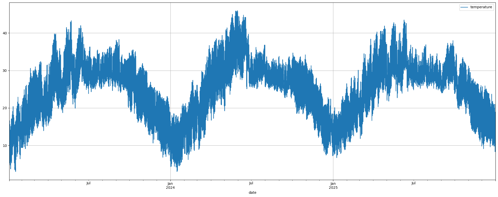
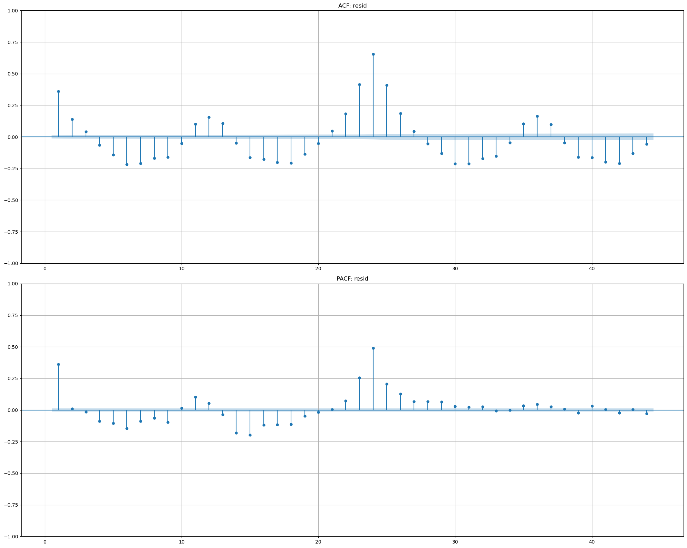
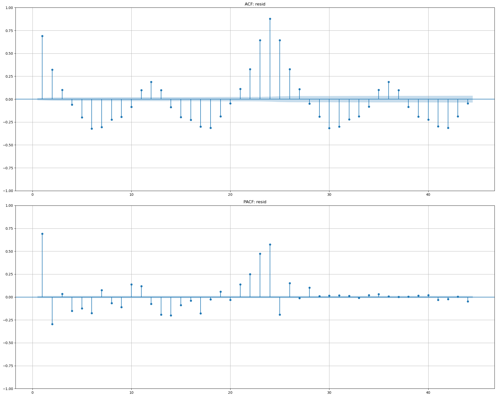
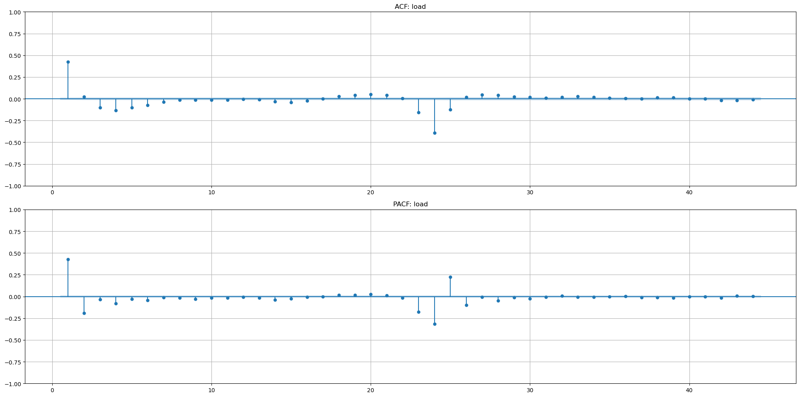
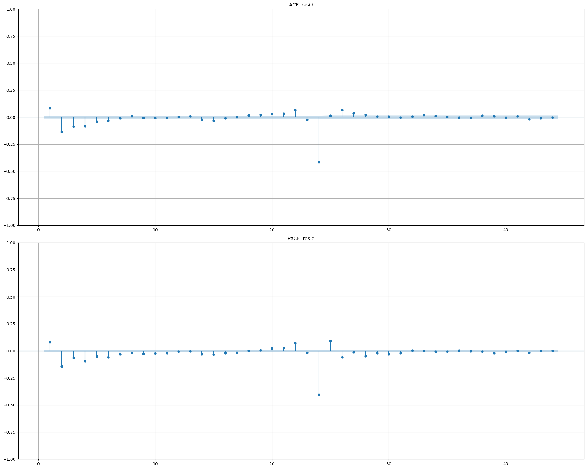

# Introduction
This submission is for BEEM012's second coursework over the year 2025-2026. Note that typesetting has been adapted from a Jupyter notebook, so some sections may not appear exactly (e.g., code blocks have been broken up here with explicit explanations to aid reasoning and preserve readability).

## Code Setup

```python
import logging
import matplotlib.pyplot as plt
import numpy as np
import pandas as pd
import statsmodels.api as sm

from datetime import datetime
from matplotlib.figure import Figure
from statsmodels.graphics.tsaplots import plot_acf, plot_pacf
from statsmodels.graphics.gofplots import qqplot
from statsmodels.tsa.stattools import adfuller
from sklearn.metrics import root_mean_squared_error
from typing import Literal

logging.basicConfig()
logger = logging.getLogger(__name__)
logger.setLevel(logging.INFO)

rng = np.random.default_rng(seed=42)
```

\newpage
# Data Load
As with last time, we have:
- $Y(t)$ as electricity load in Delhi over time, between 2023-04-01 (01 April, 2023) and 2026-01-12 (12 January, 2026), sourced from @KaggleDelhiLoad. This is simply the city's amount of MW/h, as measured by the local State Load Dispatch Centre. The raw data:
    - Is at the 5 minute level which, here, we interpolate up to 1h to match $X(t)$.
    - Contains structurally missing values @RS_MNAR, which we choose to linearly interpolate because other methods either cause boundary effects or skew actual data behaviour. For diagnosing missing values, please see the appendix.
- $X(t)$ as hourly weather data for Delhi over time, from 2023-01-04 (04 January, 2023) to 2025-12-31 (31 December, 2025), sourced from @OpenMeteo.

A small note: we know for a fact that $Y(t)$ and $X(t)$ have seasonal unit roots @RS_StochSeasonal.

```python
>>> df_demand = (
...     pd
...     .read_csv(
...         "../data/elec_load/load_data.csv",
...         names       = ["date", "load"],
...         header      = 0,
...         parse_dates = [0],
...         index_col   = [0],
...     )
...     .interpolate("linear")
...     .resample("1h")
...     .sum()
... )
...
>>> df_weather = pd.read_csv(
...     "../data/weather/weather_data.csv",
...     names = ["date", "temperature", "relative_humidity"],
...     usecols = ["date", "temperature"],
...     header = 0,
...     parse_dates = [0],  # parse `date` as a datetime
...     index_col = [0],    # use `date` as a `pd.DatetimeIndex
... )
...
>>> df_demand.plot(figsize=(20, 8), grid=True)
>>> plt.tight_layout()
>>> plt.show()

>>> df_weather.plot(subplots=True, figsize=(20, 8), grid=True)
>>> plt.tight_layout()
>>> plt.show()
```




\FloatBarrier

# Dynamic Causal Effects (Week 5)

## Generalised Least Squares (1-step Cochrane-Orcutt)
For a review of what GLS aims to help with and how the effects of correlated residuals can arise in a purely linear-algebraic context, please see the appendix. Cochrane-Orcutt (C-O) is operationally very straightforward: we fit a linear model and inspect the residuals' P/ACF. If the residuals show serial correlation, they're biased and naturally need to be debiased. C-O does this:

$$ Y(t) - \rho Y(t-1) = \alpha(1 - \rho) + \beta (X(t) - \rho X(t-1)) + \varepsilon(t) $$

Now, it may look like as if we either:
1. Fit a linear model, compute residuals, then model the residuals with AR:

    ```python
    import statsmodels.api as sm
    mod = sm.OLS(y, X)
    fit = mod.fit()
    resid = fit.residuals
    mod2 = sm.ARIMA(resid, order=(1,0,0)
    fit2 = mod2.fit()
    fit2.summary()
    ```

2. Or, difference $Y(t)$ to decorrelate it from itself and then fit a model:

    ```python
    diff_y = y.diff(period).dropna()
    mod = sm.OLS(diff_y, X)
    fit =  mod.fit()
    fit.summary()
    ```

However, C-O is a bit more nuanced than that. In option (2), we assume that the differencing `period` is fixed. C-O refutes this assumption and instead estimates `period` from the data in an iterated fashion - fit OLS and compute residuals, AR(1)-model residuals to get `period`, then quasi-difference the data using `period` and refit OLS on the quasi-differenced data. Option (1) isn't even relevant, then. If we repeat C-O until `period` stops moving (a lot), we have _iterated_ C-O. Here we'll just do one iteration. Our OLS function:

```python
>>> def fit_linear(
...         data: pd.DataFrame,
...         target: pd.Series,
...         add_constant: bool=True
...     ) -> tuple[np.ndarray, np.ndarray, np.ndarray]:
...     if add_constant:
...         X = sm.add_constant(data)
...     else:
...         X = data.copy()
...
...     y = target.loc[X.index]
...
...     n, k = X.shape
...     XTX = np.linalg.inv(X.T.dot(X))
...     coeff = XTX @ (X.T.dot(y))
...     coeff = pd.Series(index=X.columns, data=coeff, name="coeff")
...     proj = X.dot(coeff)
...     resid = y.sub(proj)
...
...     resid_variance = resid.dot(resid) / (n-k)
...     param_se = np.sqrt(resid_variance * XTX)
...     t_stat = coeff / np.diag(param_se)
...     t_stat = pd.Series(index=X.columns, data=t_stat, name="t_stat")
...     resid.name = "resid"
...     return (coeff, resid, t_stat)
```

And we'll put our dataset together, lags and all:

```python
>>> df_all = (
...     df_demand
...     .merge(
...         right       = (
...             df_weather
...             .shift([0, 1, 2])
...             .dropna()
...         ),
...         left_index  = True,
...         right_index = True,
...         how         = "inner"
...     )
... )
>>> X = df_all.drop(columns="load")
>>> y = df_all["load"]
```

And now do our first OLS fit to get our correlated residuals, and inspect their P/ACF:

```python
>>> first_ols, first_resid, first_t = fit_linear(X, y, add_constant=True)
>>> print(pd.concat([first_ols, first_t], axis=1))
                  coeff  t_stat
const          17217.43   67.26
temperature_0   -401.27   -5.04
temperature_1  -1134.30   -7.86
temperature_2   2901.75   36.46
```


\FloatBarrier

Indeed our residuals $R(t)$ are heavily correlated, meaning their covariance metric is not equal to the Euclidean metric (for more information, see the appendiceal section on GLS). We must also be aware that $R(t)$ carries stochastic seasonal structure from $Y(t)$, making this a little more complicated than just AR(1). Now we estimate $\rho$ from AR(1) on $R(t)$:

```python
>>> resid_ar = first_resid.shift([0, 1]).dropna()
>>> second_ols, second_resid, second_t = fit_linear(
...     data         = resid_ar[["resid_1"]],
...     target       = resid_ar["resid_0"],
...     add_constant = False  # don't want a constant for this
... )
>>> print(pd.concat([second_ols, second_t], axis=1))
        coeff  t_stat
resid_1  0.95  474.43
```



\FloatBarrier

Clearly, C-O is very effective for us! AR(1) on our $R(t)$ actually helped us massage out our seasonal unit root, just as more involved FFT/Cepstral analyses would have. Now we quasi-difference and project a final time, completing the 1-step C-O:

```python
>>> rho = second_ols["resid_1"]
>>> oc_X_lag = X.shift(1).dropna()
>>> oc_X = X.sub(rho*oc_X_lag).dropna()
>>> oc_y = y.sub(rho*y.shift(1)).dropna().loc[oc_X.index]
>>> final_ols, final_resid, final_t = fit_linear(oc_X, oc_y)
>>> print(pd.concat([final_ols, final_t], axis=1))
                 coeff  t_stat
const          1641.20   58.29
temperature_0  -259.35  -12.69
temperature_1   309.38   12.99
temperature_2   692.87   33.90
```



\FloatBarrier

And we're left with only the strong seasonal eigenmodes to mute. Our one-iteration O-C model is thus:

$$
\begin{align*}
    \rho=0.9503,\; \alpha=1641.20,\; \beta_0&=-259.35,\; \beta_1=309.38,\; \beta_2=692.87 \\
    Y(t) - \rho Y(t-1) &=\
        \alpha(1-\rho) \\
        &+ \beta_0 \left[ X(t) - \rho X(t-1) \right] \\
        &+ \beta_1 \left[ X(t-1) - \rho X(t-2) \right] \\
        &+ \beta_2 \left[ X(t-2) - \rho X(t-3) \right] \\
        &+ \varepsilon(t)
\end{align*}
$$

With results identical to:

```python
>>> model_glsar = sm.GLSAR(
...     endog    = y,
...     exog     = sm.add_constant(X),
...     rho      = rho,
...     hasconst = True
... )
>>> res_glsar = model_glsar.iterative_fit(maxiter=1)
>>> print(res_glsar.summary())
                    coef    std err          t      P>|t|      [0.025      0.975]
---------------------------------------------------------------------------------
const          3.303e+04    566.717     58.289      0.000    3.19e+04    3.41e+04
temperature_0  -259.3513     20.438    -12.690      0.000    -299.411    -219.292
temperature_1   309.3797     23.818     12.989      0.000     262.695     356.064
temperature_2   692.8667     20.438     33.901      0.000     652.807     732.927
```

And a condition number $\kappa=88.5$ after quasi-differencing. So what do we make of all this? Let's consider exogeneity. Strict exogeneity implies that $X(t)$ in no way is correlated with unobserved future shocks in $Y(t)$. If this is true, then $X(t)$ is strictly exogenous relative to $Y(t)$. In our case, $X(t)$ is `temperature` and $Y(t)$ is electric `load`. If $X$ were correlated with future shocks in $Y$, it would mean temperature _now_ is correlated with electricity load shocks _tomorrow_ (or some time in the future); which is impossible, because we can't control the weather. As such, in our case, $X(t)$ is, in fact, strictly exogenous compared to $Y(t)$. As a matter of fact, the argument might appear that "electric load increases temperature because of a circular effect on global warming", but changes in electricity load must still precede a change in temperature.

But let's say we want to consider when strict exogeneity would be violated. If we look at the reverse argument: is $Y(t)$ strictly exogenous to $X(t)$? Probably not, because in response to anticipated climate shocks in the future, people can go out and buy large batteries and charge them today, spiking load. Another interesting example is electricity _price_ versus temperature: hedging in a forward market is a direct violation of strict exogeneity since hedging takes place with specifically future shocks in mind.

We can prove whether our data obeys strict exogeneity or not by regressing the residuals from our first model, the DL(3), on the future values of $X(t)$ and inspecting our t-statistic:

```python
>>> forward_X = (
...     X
...     .loc[:, "temperature_0"]
...     .shift(-1)
...     .dropna()
...     .rename("temperature_1+")
... )
>>> exog_ols, exog_resid, exog_t = fit_linear(
...     data         = forward_X,
...     target       = first_resid,
...     add_constant = True
... )
>>> print(pd.concat([exog_ols, exog_t], axis=1))
                coeff  t_stat
const          -52.23  -0.21
temperature_1+   2.05   0.22
```

We can see that our t-statistic for lead-temperature is insignificant given the size of our dataset, meaning we do indeed have strict exogeneity. But this isn't the be-all, end-all of our story because we still have to deal with that seasonal unit root (and, as mentioned in @RS_WhiteCops statistical tests can be confounded by the presence of very strong seasonality). For our GLS however, ideally we'd also perform an F-test (or a test of restricted vs. unrestricted model premium) to infer how important future values of $X(t)$ are, but for our intents and purposes from the results above, that strict exogeneity holds implies our one-step C-O is well-posed.

Coming to our dynamic multipliers (coefficients of $X$), they are:
1. $\beta_0 X(t) \approx -259.35$
2. $\beta_1 X(t-1) \approx 309.37$
3. $\beta_2 X(t-2) \approx 692.86$

And they change over time. Contemporary temperature has a negative influence on quasi-differenced $Y(t)$, whilst the first & second lags of temperature start to pull it up in an overall mean-reverting fashion. And our quasi-differenced coefficients are significant, given the size of our dataset.

# Multiperiod Forecasts (Week 6)
The original text of the assignment said this:
> Using both methods that we have learned for multiperiod forecasting, forecast the next ten periods of your time series past the end of your data using your ADL(p,p) model above. Plot the forecasts of the next ten periods after the end of your dataset. How do the two forecasts differ?

Apparently this is misintended, because it's not referring to our C-O model from earlier (that's not ARDL, that's just DL(3)). The intended interpretation (after checking with professor Dyer) is to use our best-performing ARDL model from assignment #1 to forecast both ways. In our case, our best performing model was ARDL(4,4).

## ARDL Refit
Our **seasonal** ARDL(4,4) model from assignment #1 was effectively this:

$$
\begin{align*}
Y(t) &= 284.34     \\
    &+1.86\; Y(t-1)  \\
    &-1.20\; Y(t-2)  \\
    &+0.32\; Y(t-3)  \\
    &-0.03\; Y(t-4)  \\
    &+76.86\; X(t)   \\
    &+69.71\; X(t-1) \\
    &-99.16\; X(t-2) \\
    &+86.75\; X(t-3) \\
    &-56.01\; X(t-4) \\
\end{align*}
$$

But we'll re-estimate it here to be safe. Additionally, we'll use a train-test split because otherwise we don't have our exogenous $X(t)$ into the future, and we need that. So, some functions to get us started:

```python
>>> def split_data(
...         df: pd.DataFrame,
...         test_ratio: float=0.25
...     ) -> tuple[pd.DataFrame, pd.DataFrame]:
...     N = len(df)
...     test_idx = int(N*test_ratio)
...     train = df.iloc[:-test_idx, :]
...     test = df.iloc[-test_idx:, :]
...     return train, test
...
>>> def resid_t(
...         y_true: np.ndarray,
...         y_pred: np.ndarray,
...     ) -> float:
...     resid = y_true.values - y_pred.values
...     N = len(resid)
...     mean = resid.mean()
...     sdev = resid.std()
...     stat = mean / (sdev/np.sqrt(N))
...     return stat
```

Our dataset prep:

```python
>>> df_multiforecast = (
...     df_demand
...     .shift([0, 1, 2, 3, 4])
...     .dropna()
...     .merge(
...         right       = (
...             df_weather
...             .shift([0, 1, 2, 3, 4])
...             .dropna()
...         ),
...         left_index  = True,
...         right_index = True,
...         how         = "inner"
...     )
... )
>>> train, test = split_data(
...     df         = df_multiforecast,
...     test_ratio = 0.0005  # should be ~12 records
... )
>>> print(f"train_len={len(train)}, test_len={len(test)}")
train_len=24128, test_len=12

>>> train_X = train.drop(columns="load_0")
>>> train_X = sm.add_constant(train_X, prepend=False)  # append for alignment
>>> train_y = train.loc[:, "load_0"]

>>> test_X = test.drop(columns="load_0")
>>> test_X = sm.add_constant(test_X, prepend=False)  # append for alignment
>>> test_y = test.loc[:, "load_0"]
```

## Iterative Forecasting
And now for the actual modelling. The thing here is, we can't let $Y(t)$ be seen into the future. Meaning `test_X` _cannot_ contain lags of $Y(t)$. Instead, we need to:
- Ensure `test_X` only contains future levels of $X(t)$ and lags.
- Start with the 4 $Y(t)$ lags from `train_X`.
- Get $\hat{Y}(t)$ by multiplying our ARDL params.
- Push our $\hat{Y}(t)$ onto the stack of `train_X` $Y(t)$ lags _from the front_, pushing off the oldest lag from `train_X`. Because we've forecasted for $t+1$, when we move onto $t+2$ our $\hat{Y}(t)$ becomes our lagged $t-1$ and replaces the corresponding value in `train_X`. Then when we move onto forecasting for $t+3$, $\hat{Y}(t+1)$ moves up as lag $t-2$, $\hat{Y}(t+2)$ becomes lag $t-1$, so on and so forth. Repeat for 12 future positions.

Because we push forecasted values of $Y(t)$ onto a lag-stack, we cannot have `statsmodels` prepending constant column onto $\mathbf{X}$ because this will completely destroy our alignment - even though Pandas ensures indices align before performing any operations between series/dataframes, it's probably for the better to just not prepend anything. Our ARDL fit:

```python
>>> n, k = train_X.shape
>>> XTX = np.linalg.inv(train_X.T.dot(train_X))
>>> coeffs = XTX @ (train_X.T.dot(train_y))
>>> proj = train_X.dot(coeffs)
>>> resid = train_y - proj
>>> resid_variance = resid.dot(resid) / (n-k)
>>> param_se = np.sqrt(resid_variance * XTX)
>>> t_stat = coeffs / np.diag(param_se)
>>> ardl_params = pd.DataFrame(
...     index = train_X.columns,
...     data  = {"coeffs": coeffs, "t_stat": t_stat}
... )
>>> print(ardl_params.round(2))
               coeffs  t_stat
load_1           1.86    1.86
load_2          -1.20   -0.58
load_3           0.32    0.16
load_4          -0.03   -0.03
temperature_0   76.95    0.04
temperature_1   69.29    0.02
temperature_2  -98.27   -0.03
temperature_3   85.97    0.02
temperature_4  -55.77   -0.03
const          284.25    0.04
```

Coefficients are the same. Onto the forecasting loop:

```python
>>> params = ardl_params["coeffs"]
>>> # initial $Y(t)$ lags come from the end of training
>>> y_buffer = train_y.iloc[-4:].values[::-1]
>>> results = []
>>> for t in range(len(test)):
...     temperature_future = test_X.iloc[t, 4:].values  # `test_X` future levels
...     _X = np.r_[y_buffer, temperature_future]  # need a row vector out
...     _X = pd.Series(index=ardl_params.index, data=_X)
...     y_hat = _X.dot(params)
...     results.append(y_hat)
...     y_buffer = np.r_[y_hat, y_buffer[:-1]]  # up8: push newest, pop oldest
>>> iter_fcast = pd.Series(results, index=test.index, name="load_yhat")
>>> print(resid_t(y_true=test_y, y_pred=iter_fcast))
4.33
```


\FloatBarrier

For context, our results are identical to:

```python
>>> from statsmodels.tsa.api import ARDL
>>> mod = ARDL(
...     endog = train_y,
...     lags  = 4,
...     exog  = train_X[["temperature_0"]],
...     order = 4,
...     trend = 'c'
... )
>>> res = mod.fit()
>>> res.predict(
...     start    = test.index[0],
...     end      = test.index[-1],
...     exog_oos = test_X[["temperature_0"]],
...     dynamic  = False
... )
```

## Direct Forecasting
Let's think about what's happening here for a second. From the notes:

> _[...] Direct multiperiod forecasts, where we directly estimate $t+2$ using information up to $t$. Here's an example in an AR(2) model, where we shift back the time subscripts:_
> $$ \hat{Y}(t) = \hat{\beta}_0 + \hat{\beta}_1 Y(t−2) + \hat{\beta}_2 Y(t−3) + \dots + \varepsilon(t) $$
>
> _So instead of regressing on Y(t−1) and Y(t−2), we regress on Y(t−2) and Y(t−3). Now if we substitute in our values for $t$, we forecast $t+2$:_
> $$ \hat{Y}(t+2) = \hat{\beta}_0 + \hat{\beta}_1 Y(t) + \hat{\beta}_2 Y(t-2) + \dots + \varepsilon(t) $$
>
> _By shifting the time subscripts again, we could estimate three periods ahead, etc._

The idea is that if we're trying to predict the behaviour of $Y(t)$ 10 days ahead, we include 10 lags of $Y(t)$ in our regressor set $\mathbf{X}$. Because we're effectively trying to model behaviour 10 days from now using data up to now. We can do this in a couple of ways, which is what the lecture notes are talking about:
1. We can either keep $Y(t)$ static and just use lags further away in the regression, like so:

    $$ Y(t) \sim [Y(t-2), Y(t-3), Y(t-4), Y(t-5), X(t), X(t-1), \dots] $$

    Or,
2. We can move $Y(t)$ ahead and keep our lags static in the regression, like so:

    $$ Y(t+1) \sim [Y(t-1), Y(t-2), Y(t-3), Y(t-4), X(t), X(t-1), \dots] $$

Computationally, we need something to compare our forecasts against, which is where our train/test split comes into the picture. As with iterative/recursive forecasting, `test_X` can only contain temperature and its lags (i.e., contemporaenous and lagged $X(t)$) because if not, we end up leaking information from $Y(t)$. Managing a static `test_y` whilst moving around lags of $Y(t)$ in the train set can become very cumbersome. So instead we'll opt for the 2nd option, because that way we only need to iterate over columns of $X(t)$ whilst keeping our lags of $Y(t)$ static over periods $t-1$, $t-2$, $t-3$, $t-4$. So, our data prep:

```python
>>> df_direct = (
...     df_demand
...     .merge(
...         right       = (
...             df_weather
...             .shift([0, 1, 2, 3, 4])
...             .dropna()
...         ),
...         left_index  = True,
...         right_index = True,
...         how         = "inner"
...     )
... )
>>> train_d, test_d = split_data(
...     df         = df_direct,
...     test_ratio = 0.0005  # should be ~12 records
... )
>>> print(f"train_len={len(train_d)}, test_len={len(test_d)}")
train_len=24132, test_len=12

>>> train_Xd = train_d.drop(columns="load")
>>> train_Xd = sm.add_constant(train_Xd, prepend=False)
>>> train_yd = train_d.loc[:, "load"]

>>> test_Xd = test_d.drop(columns="load")
>>> test_Xd = sm.add_constant(test_Xd, prepend=False)
>>> test_yd = test_d.loc[:, "load"]
```

And our forecasting loop:

```python
>>> results = np.empty_like(test_yd)
>>> yd_shift = train_yd.shift([1, 2, 3, 4])
>>> for t in range(len(test)):
...     y_target = train_yd.shift(-(t+1))
...     iter_df = (
...         pd
...         .concat([y_target, yd_shift, train_Xd], axis=1, join="inner")
...         .dropna()
...     )
...     coeffs, *_ = fit_linear(
...         data   = iter_df.drop(columns="load"),
...         target = iter_df["load"]
...     )
...     iter_test = (
...         pd
...         .concat([yd_shift.iloc[-1], test_Xd.iloc[t]], axis=0, join="inner")
...         .dropna()
...     )
...     results[t] = iter_test.dot(coeffs)
>>> direct_fcast = pd.Series(results, index=test.index, name="load_yhat")
>>> print(resid_t(y_true=test_y, y_pred=direct_fcast))
1.97
```

![Direct forecast performance with our ARDL(4,4). Top: forecast (orange) with ground-truth (blue). Middle: standardised residuals (y-axis is standard deviation $\sigma$). Bottom left: QQ plot of residuals vs. a standard normal. Bottom right: ACF of residuals. Versus iterative forecasting, direct forecasting's trajectory swings wildly - presumebly because direct forecasting models the conditional relationship (mean) $N$ periods ahead, whilst iterative forecasting effectively builds an autoregressive trajectory.](./images/13Feb26-direct-fcast-performance.png)

# Cointegration (Week 7)
Very simply: we have 2 time series, $Y(t)$ and $X(t)$ (in our case, electricity load and temperature). We want to see if they're "cointegrated", or whether they share a trend. That they share a trend prerequisites that a trend (unit root) exists in each of them; and of course, we test for trends using ADF. The twist (pun intended) is that if they share a trend, subtracting one from the other should remove that trend (and indeed, cointegration is not symmetric). Then if the ADF test confirms that the difference is stationary, it suggests that $Y(t), X(t)$ are/were cointegrated, otherwise not. Another speciality is in the way we difference $Y(t)$ and $X(t)$ from each other: we don't difference them 1:1, we instead perform $Y(t) - \theta X(t)$ where $\theta$ is approximated by projecting $X(t)$ onto $Y(t)$. In effect, quasi-differencing again.

Now in our case, we already know that $Y(t)$ `load` has stochastic seasonality (a seasonal unit root), and we know that doing anything involving cross-interactions between two highly seasonal series can yield very skewed results, despite the ADF confirming stationarity (again, because the ADF only works at the first-difference level which can completely miss the actual seasonal unit root). Let's see what happens. A few functions to tighten everything up:

```python
>>> def compute_adf(data: pd.Series, nlags: int) -> tuple:
...     adf_y = data.diff(1).dropna()
...     adf_X1 = data.shift(1).dropna().rename()
...     adf_XN = adf_y.shift(range(1, nlags+1)).dropna()
...     adf_X = pd.concat([adf_X1, adf_XN], axis=1, join="inner")
...     coeffs, resid, t_stat = fit_linear(data=adf_X, target=adf_y)
...     return (coeffs, resid, t_stat)
...
>>> def test_cointegration(
...         X: pd.Series,
...         y: pd.Series,
...         adf_lags: int=5,
...         return_full: bool=False
...     ) -> tuple|float:
...     coeffs, resid, t_stat = fit_linear(data=X, target=y)
...     theta = coeffs[X.name]
...     resid = y.sub(X.mul(theta))
...     adf_coeffs, adf_resid, adf_t = compute_adf(data=resid, nlags=adf_lags)
...     if return_full:
...         return (coeffs, resid, t_stat, adf_t)
...     else:
...         return adf_t.iloc[1]
...
>>> coint_coeffs, coint_resid, coint_t, coint_adf_t = test_cointegration(
...     X           = X["temperature_0"],
...     y           = y,
...     adf_lags    = 4,
...     return_full = True
... )
>>> print(coint_adf_t.iloc[1])
-38.77
```


\FloatBarrier

The ADF flagged our intra-series difference as stationary, just as it would have done raw $Y(t)$, meaning $Y(t)$ truly is stationary, just not _seasonally_. Additionally, cointegration is not symmetric, so we'd better look in the mirror.

```python
>>> moint_coeffs, moint_resid, moint_t, moint_adf_t = test_cointegration(
...     X           = y,
...     y           = X["temperature_0"],
...     adf_lags    = 4,
...     return_full = True
... )
>>> print(moint_adf_t.iloc[1])
-41.66
```


\FloatBarrier

We see an almost similar if not idential waveform, despite ADF saying our series is stationary - in both cases. What do we make of this? Firstly, does it make sense to test for cointegration? Yes indeed: if temperature trends higher over years (as it has been for a while now, during the time of this writing), electricity demand will also increase (HVAC usage, refrigeration, etc. also increases). As such, a trend in temperature must also accompany a trend in electricity demand. Interestingly, a component of electricity load's trend will also come parasitically (or rather, strictly endogenously): hotter temperatures means the load balancers have to cool themselves first before disbursment, so they'll eat more electricity as well - as will transmission infrastructure. The effect might be minimal, but it does exist.

From our results, the seasonal unit root dominates everything and we'd be remiss if we didn't look under the hood. As mentioned before, ideally we'd remove the source harmonic by muting it in the FFT and then inverse transforming, but discrete differencing is sufficient as well. Note that traditional cointegration is specifically concerned with the existence of a unit root; now that we're removing our seasonal unit root kind of defeats the purpose, but it's still a good exercise to see what we're missing.

```python
>>> diff_y = y.diff(24).dropna().diff(1).dropna()
>>> diff_X = X.loc[diff_y.index]
```



\FloatBarrier

We can see that differencing $Y(t)$ at the 24h and subsequent 1h periods removed nearly all seasonality (though we can definitely use a more targeted approach by muting the source harmonic in the FFT, or using bicoherence @RS_Bicoh to inspect the entire harmonic latter and then remove problem sources). Now if we do two-way cointegration:

```python
>>> diff_coeffs, diff_resid, diff_t, diff_adf_t = test_cointegration(
...     X           = diff_X["temperature_0"],
...     y           = diff_y,
...     adf_lags    = 4,
...     return_full = True
... )
>>> print(diff_adf_t.iloc[1])
-75.16
```


\FloatBarrier

We can see that now, after deseasonalising, our resultant series is properly flagged as extremely stationary - and we can trust these results. Looking the other way:

```python
>>> fidd_coeffs, fidd_resid, fidd_t, fidd_adf_t = test_cointegration(
...     X           = diff_y,
...     y           = diff_X["temperature_0"],
...     adf_lags    = 4,
...     return_full = True
... )
>>> print(fidd_adf_t.iloc[1])
-28.36
```


\FloatBarrier

We see that our heavy seasonality has returned. How come this happened one way and not the other? Inspecting our coefficients tells us what happened:

```python
>>> print(diff_coeffs)
const           -0.16
temperature_0    0.01

>>> print(fidd_coeffs)
const    25.36
load     4.07e-07
```

When looking at the cointegration of $X(t)$ and $Y(t)$ (the first test that gave us `-75.16`, the proper direction), barely anything got removed -the `const` coefficient is miniscule, and contemporaneous temperature is practically nonexistant as far as deseasonalised electric load goes (this also aligns with our Granger causality tests from assignment #1 that showed temperature doesn't in any way Granger-cause deseasonalised load). However, looking at the cointegration of $Y(t)$ and $X(t)$ (the second mirrored case), we can see that the constant absorbs a lot of projection weight, presumebly because of scale differences betwixt the two series after deseasonalising $Y(t)$. Since more of temperature is being subtracted from load, the differencing itself reintroduces seasonality - because we never deseasonalised $X(t)$, only $Y(t)$, which is also why we only see massive AR(1) and mean-reverting (with AR(2)) type seasonality, which is clinically diagnostic of temperature and not electric load.

### Conclusion
So what does all this exploration mean for us? First and foremost, our time series are not cointegrated with one another, seasonal or deseasonalised. And secondly, strict exogeneity holds for us, meaning FGLS (feasible GLS/one-step Cochrane-Orcutt) is a well-posed method - and an extremely helpful one - at modelling electric load given temperature in a 3rd-order distributed lag (DL(3)) fashion. Iterative forecasting seems to have more benefit than direct forecasting, however, presumebly because we lose a few records every time we realign lags or our horizon is too far ahead, especially in conjunction with our seasonal unit root. In other words, one-step modelling electric load dynamics given weather is a better estimate than directly projecting temperature dynamics onto load at some point in the future.

---

# Appendix
## Missing Data
First and foremost: are our missing values structural, Missing Completely At Random (MCAR), Missing At Random (MAR), or Missing Not At Random (MNAR) (see @MaxKuhnFES and @MissingDataNCBI)? Inspecting with a spreadsheet shows us that:
- The SLDC apparently misses data regularly between the hours of 22:00 and 00:00.
- Sometimes within a month, the SLDC appears to reset entirely across a few days, missing data from 15:00 all the way up to a few days later again from 22:00.

Programmatically this is best represented with a heatmap, though admittedly programmatically highlighting all 7.3k missing values and their patterns is a bit finicky:

```python
>>> _missing = df_demand["load"].isnull()
>>> missing_mat = (
...     _missing
...     .to_frame()
...     .pivot_table(
...         columns = _missing.index.date,
...         index   = _missing.index.time
...     )
... )
>>> plt.figure(figsize=(20, 12))
>>> sns.heatmap(
...     data       = missing_mat,
...     cmap       = "Reds",
...     linewidths = 0,
...     rasterized = True,
...     cbar       = False
... )
>>> plt.title("Missing Values By Hour & Day")
>>> plt.xlabel("Date")
>>> plt.ylabel("Hour")
>>> plt.tight_layout()
>>> plt.show()
```


\FloatBarrier

We can get a finer-grained look at behaviour over time but within these hours to see if there's anything structural (does load tank to 0 indicating a shutdown, e.g.). Hopefully this would give us good direction on how to impute.

```python
>>> df_demand.groupby(df_demand.index.time).mean().plot(figsize=(15, 7))
>>> plt.title("Mean Electricity Load vs. Time of Day")
>>> plt.xlabel("Time")
>>> plt.ylabel("Load Level")
>>> plt.grid()
>>> plt.show()
```


Not _quite_ anything structural, though it is interesting to see a little dip around midday, and a jump up at midnight leading to the predictable low at around 5am. That we have clear effects showing up like this _over 3 years at the 5m level_ lends further credence to a harmonic latter. We see nothing structural, so this is Missing Systematically (see @RS_MNAR)!

Now, we _could_ go ahead and just remove the missing values. But because we know what's coming up in this assignment, we'll instead opt to linearly interpolate so that we actually have usable data when aggregating to the 1h level. Quadratic, cubic, and higher-order interpolation methods end up with boundary effects skewing our actual data, and interpolating with seasonal averaging is more involved than the scope of this assignment.

## Correlated Residuals & GLS
Let's think about what's happening here for a second. Foundationally, we have a linear model of the form $y=mx+b$, wherein we try to "project" a subspace $x$ onto another, $y$, by estimating a coefficient $m$. In vector notation, the projection of $\vec{x}$ onto $\vec{y}$ is given by:

$$
\begin{align*}
    \beta &= \frac{\vec{x}\cdot\vec{y}}{\vec{x}\vec{x}} \\
    \therefore \text{Proj}_{\vec{y}}(\vec{x}) &= \beta \cdot \vec{x}
\end{align*}
$$

In matrix notation:

$$
\begin{align*}
    \vec{\beta} &= (\mathbf{X}^{\top}\mathbf{X})^{-1} \mathbf{X}^{\top}\vec{y} \\
    \therefore \text{Proj}_{\vec{y}}(\mathbf{X}) &= \mathbf{X}\vec{\beta}
\end{align*}
$$

Mathematically, the projections are the least-squares estimates (in the Euclidean sense), and are the best linear projections we can do. The "residuals" of a projection are guaranteed to always be orthogonal to $\vec{x}$ or $\mathbf{X}$:

$$
\begin{align*}
    \vec{r} &= \vec{y} - \text{Proj} \\
    \vec{x} \cdot \vec{r} &= 0 \\
    \mathbf{X} \cdot \vec{r} &= 0
\end{align*}
$$

That is, by definition, the nature of a least squares residual (which holds provided the model includes an intercept; interpretation changes slightly for centred regressors). Statistically, coefficients $\beta$ or $\vec{\beta}$ are estimated from the data, and as such may or may not be the exact coefficients that correctly define $\vec{y}$. Anyway, projections are not guaranteed to always line up 1:1 with a true $\vec{y}$ - this is an even more significant problem in our case, because $\mathbf{X}$ and $\vec{y}$ in our case aren't fixed algebraic objects or cross-sectional & temporally static, but underlying stochastic processes $X(t)$ and $Y(t)$ that have an explicit ordering through time. Naturally, even residuals $R(t)$ are ordered through time. And we're concerned with residual $R(t)$ behaviour because our underlying data generating processes are time-dependent and stochastic.

Now, it's a known fact that whenever there is a [distance relationship](https://theoreticalecology.github.io/AdvancedRegressionModels/4C-CorrelationStructures.html) between observations, autocorrelation can occur. Importantly, this is not limited to time series: spatial, grouped, [clustered](https://en.wikipedia.org/wiki/Clustered_standard_errors), networked, image, etc. data can all carry autocorrelation because there is a distance relationship between neighbouring data points; temporal data just happens to be the most ubiquitous and pathological case. Since we're dealing with time series, it can so happen that our _residuals_ are autocorrelated over time. The best way to explain this is to consider a matrix of lagged residuals:

$$
\mathbf{R} = \begin{bmatrix}
      | &   |   & \cdots&   |   \\
    r(t)& r(t-1)& \cdots& r(t-n)\\
      | &   |   & \cdots&   |   \\
\end{bmatrix}
$$

Each column is the residual vector one moment ago. If the covariance matrix

$$ \Sigma = \frac{\mathbf{R}^{\top}\mathbf{R}}{n} $$

Doesn't have mass purely along its diagonal, it means residuals at one time are correlated with residuals at another time. This is a signiicant issue both statistically and algebraically, because:
1. Reporting the standard error of parameters depends on the covariance matrix of residuals being full-rank and diagonal (i.e., having mass only along the diagonals such that $\Sigma = \sigma^2 I$). If this is violated, standard errors, confidence intervals, t- and F-tests, etc. are invalid.
2. Perhaps most importantly, it means there is a latent substructure in the data that isn't being orthogonalised entirely by the linear model. In other words, OLS is the wrong orthogonal projection for the true geometry of the data.

That last point requires some digging: we know OLS is the best orthogonal projection in the Euclidean sense. Off-diagonal entries in $\Sigma$ means that lengths and angles computed using the Euclidean dot product are distorted, so Euclidean projections discard information unevenly across eigen-directions. Put simply, our data lives in a completely different space, parameterised by a different covariance structure than OLS assumes.

So autocorrelation changes the metric/geometry — the ordinary orthogonal projection is no longer the best linear estimator under the true error geometry. Correlated residuals mean that the natural metric is the $\Sigma^{-1}$-weighted inner product rather than the Euclidean inner product - this is what Generalised Least Squares attempts to do: decorrelate the residuals by multiplying them with their inverse covariance matrix. GLS thus tries to estimate the projection coefficients $\beta$ or $\vec{\beta}$ by minimising the squared Mahalanobis distance of the residuals:

$$
\beta_{\text{GLS}} =
    (\mathbf{X}^{\top}\Sigma^{-1}\mathbf{X})^{-1}
    \mathbf{X}^{\top}\Sigma^{-1}\vec{y}
$$

Rather than the Euclidean norm of the $X(t)$ and $Y(t)$ (or $R(t)$ even, for that matter). One way to estimate the correlation structure of $R(t)$ is AR modelling: we model $\vec{r}$ with an AR(1) model, use that coefficient $\rho$ to _quasi-difference_ $Y(t)$ and all regressors $X(t)$, and then project again:

$$ Y(t) - \rho\ Y(t-1) = \alpha(1-\rho) + (X(t)-\rho\ X(t-1))^{\top}\vec{\beta} + \varepsilon(t) $$

For $t=2, \dots, n$. This is what Cochrane-Orcutt estimation attempts to do: linearly whiten the residuals. Strictly speaking, whitening is effected by multiplying both $Y(T)$ and $X(t)$ with $\Sigma^{-1/2}$ (note: decisively **not** the same as $1/\sqrt{\Sigma}$):

$$ y^* = \Sigma^{-1/2} \vec{y},\; \mathbf{X}^* = \Sigma^{-1/2}\mathbf{X} $$

Such that OLS with $y^*, \mathbf{X}*$ yields GLS on the originals. When $\Sigma$ has an AR(1) form:

$$ R(t) = \rho\ R(t-1) + \varepsilon(t) : \varepsilon(t) \sim (0, \sigma^2),\, |\rho| < 1 $$

Then Cochrane-Orcutt is an equivalent, structured approximation to $\Sigma^{-1/2}$. And AR(1) forms are easy enough to identify in matrix form: variances along the diagonal are constant, while the off-diagonals decay geometrically in powers of $\rho$ (or whatever value the first off-diagonal has). For example:

```python
>>> time_vec = np.empty(200)
>>> time_vec[0] = 3
>>> for t in range(1, 200):
...     time_vec[t] = time_vec[t-1] + np.sin(t) - np.cos(t) + rng.normal(scale=0.3)
>>> mat = pd.Series(time_vec).shift([1, 2, 3, 4, 5]).dropna()
>>> mat = mat.sub(mat.mean())
>>> mat_cov = mat.T.dot(mat).div(len(mat)-1)
>>> print(mat_cov)
| lag |       0_1 |       0_2 |      0_3 |       0_4 |       0_5 |
| 0_1 |  1.834011 |  1.322607 | 0.299582 | -0.325534 | -0.006791 |
| 0_2 |  1.322607 |  1.843918 | 1.330639 |  0.298406 | -0.322082 |
| 0_3 |  0.299582 |  1.330639 | 1.850272 |  1.330022 |  0.300696 |
| 0_4 | -0.325534 |  0.298406 | 1.330022 |  1.849693 |  1.330698 |
| 0_5 | -0.006791 | -0.322082 | 0.300696 |  1.330698 |  1.849253 |
```

That mightn't be a textbook AR(1) process, but it does show how quickly off-diagonal structure can emerge. So because our datasets are high-resolution, highly seasonal, and on an abstract level, are spatially close enough such that they individually capture a certain aspect of the periodic behaviour in human life, we can certainly expect correlated residuals.

## Deseasonalised Cochrane-Orcutt
In the main text, we found that C-O effectively help sharpen our unit root - so what happens if we deseasonalise and then run C-O? Recall that we differenced electric load, $Y(t)$, at the 24h and 1h levels:

```python
>>> diff_y = y.diff(24).dropna().diff(1).dropna()
>>> diff_X = X.loc[diff_y.index]
```

Now, rerunning our C-O routine:

```python
>>> first_ols, first_resid, first_t = fit_linear(
...     diff_X, diff_y, add_constant=True
... )
>>> print(pd.concat([first_ols, first_t], axis=1))
               coeff  t_stat
const           0.90    0.03
temperature_0 -10.19   -1.14
temperature_1  15.84    0.98
temperature_2  -5.69   -0.64
```

We can see that estimating the first model itself, DL(3), that contemporaneous and lagged temperature barely has any effect on $Y(t)$ - which lines up with Granger causality results we've seen earlier (in another assignment) that suggest temperature does not Granger-cause deseasonalised load. Looking at the P/ACF of our residuals:


\FloatBarrier

They're decisively cleaner after deseasonalising electric load $Y(t)$, however there is still some seasonal behaviour because we haven't deseasonalised temperature.

```python
>>> resid_ar = first_resid.shift([0, 1]).dropna()
>>> second_ols, second_resid, second_t = fit_linear(
...     data = resid_ar[["resid_1"]],
...     target = resid_ar["resid_0"],
...     add_constant = False  # no constant
... )
>>> print(pd.concat([second_ols, second_t], axis=1))
        coeff t_stat
resid_1  0.43  72.97
```


\FloatBarrier

Our residuals' AR(1) coefficient is not as strong as it was before: $0.43$ now vs. $0.95$ from earlier, and AR(1) on them has completely removed the minor unit root present leaving only seasonality induced by temperature. Applying this shows us how effective C-O really is:

```python
>>> rho = second_ols["resid_1"]
>>> oc_X_lag = diff_X.shift(1).dropna()
>>> oc_X = diff_X.sub(rho*oc_X_lag).dropna()
>>> oc_y = diff_y.sub(rho*diff_y.shift(1)).dropna().loc[oc_X.index]
>>> final_ols, final_resid, final_t = fit_linear(oc_X, oc_y)
>>> print(pd.concat([final_ols, final_t], axis=1))
                  coeff    t_stat
const         -2.893212 -0.113263
temperature_0 -3.555560 -0.451778
temperature_1  6.131952  0.498611
temperature_2 -2.372821 -0.301494
```



# References