# Introduction
This submission is for BEEM012's third coursework over the year 2025-2026. Note that typesetting has been adapted from a Jupyter notebook, so some sections may not appear exactly (e.g., code blocks have been broken up here with explicit explanations to aid reasoning and preserve readability).

## Code Setup

```python
import logging
import matplotlib.pyplot as plt
import numpy as np
import pandas as pd
import statsmodels.api as sm

from matplotlib.figure import Figure
from scipy.optimize import minimize
from scipy.stats import norm
from scipy.stats import t as t_dist
from statsmodels.graphics.tsaplots import plot_acf, plot_pacf
from statsmodels.graphics.gofplots import qqplot

logging.basicConfig()
logger = logging.getLogger(__name__)
logger.setLevel(logging.INFO)

rng = np.random.default_rng(seed=42)
```

\newpage
# Data Load
For this submission we're using Nifty 50 pricing data as $Y(t)$. The S&P Nifty 50 is India's premier stock index, managed by the National Stock Exchange (NSE) of India @AboutNSE. Our dataset spans 2000-01-03 to 2025-12-12, is at the daily (1D) resolution, and has been merged from two sources (for more information on data provenance, please see the appendix).

```python
df_nifty = pd.read_csv(
    "../data/nse_d.csv",
    names      = ["date", "close"],
    header     = 0,
    parse_dates= [0],
    index_col  = [0]
)
```

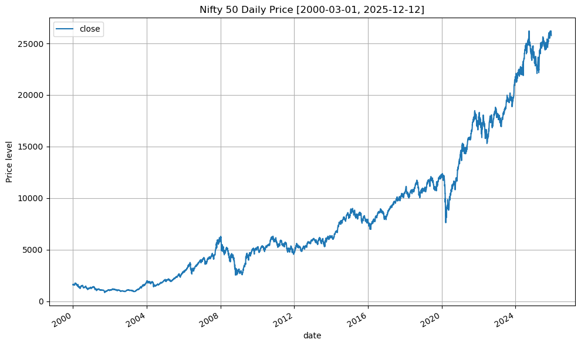

# Volatility Clustering With ARMA(1,1)-GARCH(1,1)
For a full treatment on vol clustering please see the appendix; in summary, we have returns as:

$$ r(t) = \ln \left( \frac{S(t)}{S(t-1)} \right) $$

And assuming some generic model $\mu(t)$ for $r(t)$, we have our residuals $\epsilon(t)$ as:

$$
\begin{align*}
    r(t) &= \mu(t) + \epsilon(t) \\
    \implies r(t)-\mu(t) &= \epsilon(t)
\end{align*}
$$

We're interested in whether $\epsilon(t)^2$ changes over time and exhibits serial dependence. Note that since we're at the daily level our returns' average is negligible:

```python
>>> returns = (
...     np
...     .log(df_nifty.loc[:, "close"])
...     .diff()
...     .dropna()
... )
>>> print(f"Average daily returns: {returns.mean():.4f}")
Average daily returns: 0.0004
```

But nevertheless we'll demean anyway.

```python
>>> returns = returns.sub(returns.mean())
>>> returns2 = returns**2
>>> ax = returns2.plot(figsize=(14, 7), grid=True)
>>> ax.set_title("Nifty 50 squared returns")
>>> ax.set_ylabel("squared returns level")
>>> plt.show()
>>> plot_autocorrel_wrapper(returns2.rename("returns^2"), figsize=(14, 7))
>>> plt.show()
```

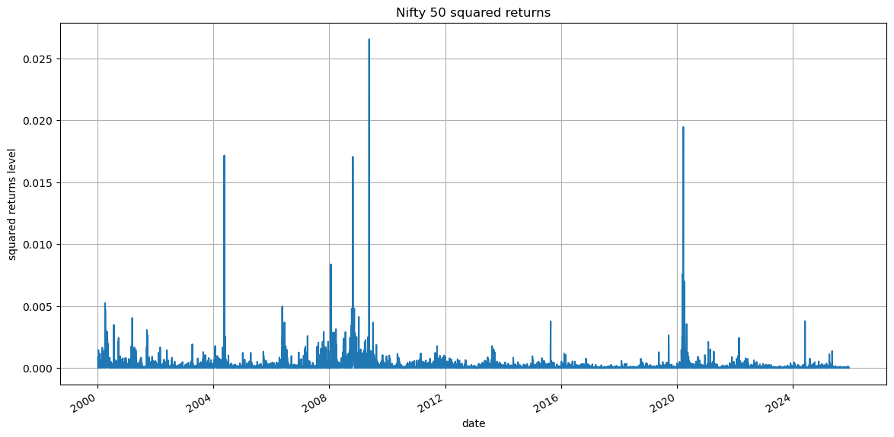

\FloatBarrier

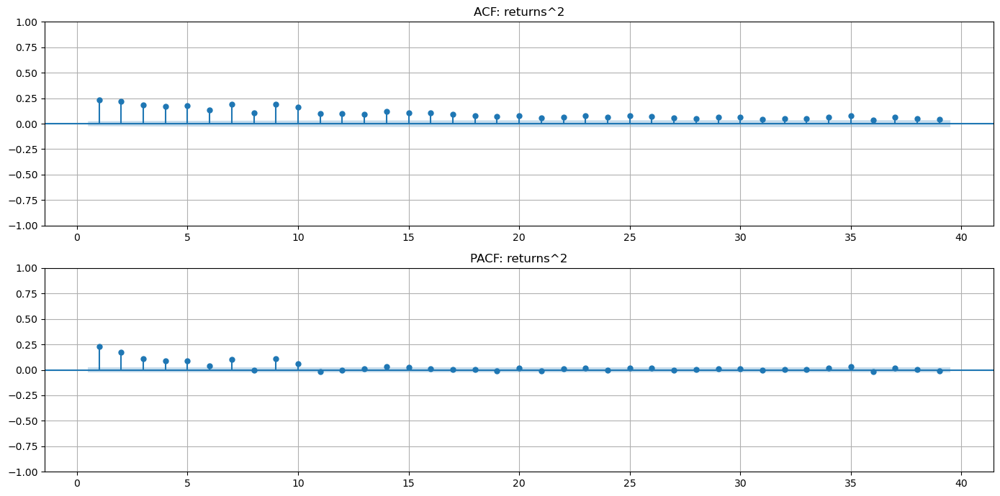

\FloatBarrier

Indeed, our returns' quadratic deviation changes over time and exhibits serial dependence.

## ARMA(1,1)
We're trying to capture our returns' conditional mean (first-moment) dynamics $\mu(t)$ with an ARMA(1,1) model:

$$
\begin{align*}
    r(t) &= \text{ARMA}(1,1) \\
    \text{ARMA}(1,1) &= \mu + \phi_1 r(t-1) + \theta_1 \epsilon(t-1) + \epsilon(t)
\end{align*}
$$

Where $\mu$ is a constant affine offset parameter. Due to the endogenous dependency on past residuals per $t$, estmating $\phi, \theta$ with OLS is inapplicable. Instead, we estimate them jointly using maximum likelihood estimation (MLE) with a Gaussian likelihood function under quasi-MLE @WikiQMLE, @StataQMLE. (for an overview of our implementation and choice of distribution & likelihood function, please see the appendix). Note that in our loop, we're modelling $\epsilon(t)$ explicitly as residuals. This is a bit unintuitive if we view ARMA as our object if interest; $\epsilon(t)$ is actually the object of interest given the log-likelihood approach:

```python
>>> def arma_llf(params: tuple, y: pd.Series) -> float:
...     mu, phi, theta = params
...     T = len(y)
...     eps = np.zeros(T)
...
...     # actual ARMA loop
...     for t in range(1, T):
...         eps[t] = y[t] -mu -phi*y[t-1] -theta*eps[t-1]
...
...     eps = eps[1:]
...     T = len(eps)
...     sigma2 = np.var(eps, ddof=0)
...     sigma2 = max(sigma2, 1e-12)  # prevents log(0)
...
...     llf_terms = norm.logpdf(eps, scale=np.sqrt(sigma2))
...     llf = np.sum(llf_terms)
...     return -llf
```

We start with guess parameters of $0$ and importantly, constrain them to lie $\in (-1, 1)$ so that our recursion doesn't blow up. We'll use SciPy's default L-BFGS solver so that we get a Hessian that we can use to compute our parameters' standard errors (more on this shortly):

```python
>>> # (mu, phi, theta)
>>> ansatz = (0., 0., 0.)
>>> # we removed returns' mean earlier, we need to add it back
>>> # otherwise we have nothing to model lol
>>> y = np.log(df_nifty).diff().dropna().loc[:, "close"]
>>> res = minimize(
...     arma_llf,
...     x0     = ansatz,
...     args   = (y.values,),
...     bounds = [(-0.99,0.99), (-0.99,0.99), (-0.99,0.99)]
... )
>>> print(res)
  message: CONVERGENCE: RELATIVE REDUCTION OF F <= FACTR*EPSMCH
  success: True
   status: 0
      fun: -18399.31200184737
        x: [ 7.299e-04 -7.001e-01  7.450e-01]
      nit: 14
      jac: [-2.488e-01  5.202e-02  5.020e-02]
     nfev: 116
     njev: 29
 hess_inv: <3x3 LbfgsInvHessProduct with dtype=float64>
```

Success! Now, while we could use our optimiser's Hessian to compute our parameters' standard errors:

```python
>>> est_mu, est_phi, est_theta = res.x
>>> se = np.sqrt(np.diag(res.hess_inv.todense()))
>>> t_stat = res.x / se
```

### Model Results

|       |    coeffs |    t_stat |
| ----- | --------- | --------- |
| mu    |  0.000730 |  0.008407 |
| phi   | -0.700092 | -0.124047 |
| theta |  0.744981 |  0.151449 |

We're using an L-BFGS derived Hessian _under quasi-MLE_, which means our t-stats aren't reliable. Instead, we already know that $\mathbb{E}[r(t)]$ is negligible; our constant coefficient $\mu$ here reaffirms that, and $\phi+\theta \approx 0.05$ meaning barely any persistence from previous returns & shocks. So we can still say WLOG that ARMA's done its job. We run our loop a final time to get $\epsilon(t)$:

```python
>>> est_resid = np.zeros(len(y))
>>> for t in range(1, len(y)):
...     est_resid[t] = (
...         y.iloc[t]
...         -est_mu
...         -est_phi*y.iloc[t-1]
...         -est_theta*est_resid[t-1]
>>> est_resid = pd.Series(est_resid, index=y.index).iloc[1:]
>>> ax = est_resid.plot(grid=True, label="residuals")
>>> ax.set_title(r"ARMA-estimated $\epsilon(t)$")
>>> ax.set_ylabel("Level")
>>> ax.axhline(y=est_resid.mean(), c="red", ls="--", label="mean")
>>> ax.legend()
>>> plt.show()
```

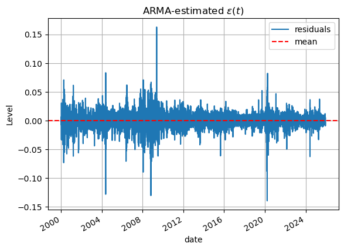

\FloatBarrier

We can tell immediately that we have vol clustering: a period of high volatility tends to be long-lived. Squared residuals make this most apparent:

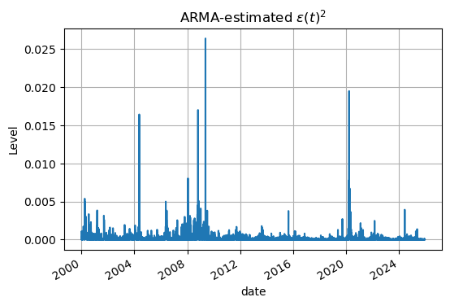

\FloatBarrier

## GARCH(1,1)
We also fit GARCH with MLE, but this time we use a Student-T distribution likelihood function (for more information, please see the appendix). The general GARCH(p,q) form is:

$$ \sigma(t)^2 = \omega + \alpha_1 \epsilon(t-1)^2 + \dots + \alpha_p \epsilon(t-p)^2 + \beta_1 \sigma(t-1)^2 + \dots + \beta_q \sigma(t-q)^2 $$

```python
>>> def garch_llf(params: tuple, y: pd.Series) -> float:
...     # y = resid
...     omega, alpha, beta, nu = params  # nu is t-dist dof
...
...     T = len(y)
...     sigma2 = np.zeros(T)
...     sigma2[0] = np.var(y)
...
...     # actual GARCH loop
...     for t in range(1, T):
...         sigma2[t] = omega + alpha*(y[t-1]**2) + beta*sigma2[t-1]
...
...     sigma2 = np.maximum(sigma2, 1e-12)  # prevents log(0)
...
...     # -> epsilon_t^2 = sigma_t^2 * z_t^2
...     # -> epsilon_t^2 / sigma_t^2 = z_t^2
...     z = y / np.sqrt(sigma2)
...
...     # need to standardise student-t so we get Var(z_t)=1, since SciPy's
...     # t_dist.logpdf() is a nonstandard student-t
...     scale = np.sqrt(nu / (nu-2))
...     z /= scale
...
...     # -> z_t^2 = epsilon_t^2 / sigma_t^2
...     # to get the PDF of epsilon_t, change-of-variables formula for continuous
...     # RVs under a smooth transformation says:
...     # -> pdf_epsilon(epsilon) = pdf_z(epsilon/sigma) * 1/sigma
...     # which in log-space is subtraction:
...     llf_terms = t_dist.logpdf(z, df=nu) -np.log(scale) -np.log(np.sqrt(sigma2))
...     llf = np.sum(llf_terms)
...     return -llf
```

A couple of things to note about our implementation:
1. Most literature standardises the distribution so that $\mathbb{E}[z(t)^2]=1$ @FRF_Garch, @QuantSX_GARCH, because as explained, if $\mathbb{E}[z(t)^2]\ne 1$, identifiability of $\sigma(t)^2$ is lost. Some implementations include this standardisation as part of their likelihood function implicitly @PyArchTllf; here, we standardise separately for convenience.
2. To quickly discuss the change-of-variables formula @WikiPDFs: when modelling $sigma(t)^2$ in an attempt to isolate $z(t)$ we require the likelihood of our observed data $\epsilon(t)$ given model parameters. Hence:

$$
\begin{align*}
    f_{\epsilon}(\epsilon(t)) &= f_z(z(t)) \left( \frac{\epsilon(t)}{\sigma(t)} \right) \cdot \frac{1}{\sigma(t)} \\
    \implies \ln(f_{\epsilon}) &= \ln(f_z) - \ln(\sigma(t))
\end{align*}
$$

If we skip this adjustment, we are implicitly asserting that $\epsilon(t)$ has the same density as $z(t)$. Note that we didn't need these adjustments with ARMA because GARCH models $\epsilon(t)$ as a multiplicative process; ARMA on the other hand is additive, and already included scaling in `norm.logpdf(eps, scale=np.sqrt(sigma2))`.

Coming to our optimiser call, we also need to upscale $\epsilon(t)$ because its raw magnitude is of order $0.001 \implies \epsilon(t)^2 << 0$, which is very small (even `arch` warns about this @PyArchDataScaleWarn, and suggests multiplying by $100^2$). So we'll do the following:
- Multiply $\epsilon(t)$ by 100 and then unscale later;
- Use an empirical $\nu$ in our ansatz, and constrain $\nu > 2$ so that variance is identifiable;
- Like with ARMA, constrain parameters $\alpha, \beta \in [0, 1)$ so that our recusion doesn't blow up;
- Constrain all parameters $\omega, \alpha, \beta > 0$ so our recursion remains positive; and finally
- Use SciPy's default L-BFGS solver so that we get a Hessian that we can use when computing our parameters' standard errors.

```python
>>> resid_scaled = est_resid*100
>>> # (omega, alpha, beta, nu)
>>> ansatz = (0., 0., 0., df)  # df from t-fit to arma resids
>>> bounds = [
...     (0, None),  # omega
...     (0, 0.99),  # alpha
...     (0, 0.99),  # beta
...     (2, None),  # nu
... ]
>>> res = minimize(
...     garch_llf,
...     x0     = ansatz,
...     args   = resid_scaled.values,
...     bounds = bounds,
... )
>>> print(res)
  message: CONVERGENCE: RELATIVE REDUCTION OF F <= FACTR*EPSMCH
  success: True
   status: 0
      fun: 9674.865203605104
        x: [ 1.093e-02  4.957e-02  8.941e-01  7.199e+00]
      nit: 39
      jac: [-2.086e-01 -2.241e-01 -1.399e-01  9.095e-04]
     nfev: 290
     njev: 58
 hess_inv: <4x4 LbfgsInvHessProduct with dtype=float64>
```

Success! Now because all of this exists in $\epsilon(t) \cdot 100^2$ space, we need to unscale our Hessian for t-statistics:

```python
>>> est_omega, est_alpha, est_beta, est_nu = res.x
>>> se = np.sqrt(np.diag(res.hess_inv.todense()) / 100**2)
>>> t_stat = res.x / se
```

### Model Results

|       | coeffs   | t_stat    |
| ----- | -------- | --------- |
| omega | 0.010933 |  3.384765 |
| alpha | 0.049575 | 28.932430 |
| beta  | 0.894096 | 72.134137 |
| nu    | 7.198656 | 13.778407 |

Our coefficients are tremendously significant, and $\alpha + \beta \approx 0.9437$ which indicates textbook vol clustering: Nifty returns demonstrate conditional heteroscedasticity, and a period of high volatility will decay slowly. Secondly for our final $\sigma(t)^2$, we need to carefully rerun our loop:
- $\sigma(t)^2$ must come from parameters obtained on upscaled data (`resid_scaled`).
- We find the raw $z(t)$ by:
    $$
    z(t) = \frac{100\epsilon(t)}{\sigma(t)^2} \cdot
        \frac{1}{\sqrt{\hat{\nu} / \hat{\nu} - 2}}
    $$
    Matching exactly our GARCH loop: dividing by $\sigma(t)$ obtains raw $z(t)$, and because SciPy's T-distribution is unstandardised, we standardise using the T-distribution's theoretical variance with our estimated $\hat{\nu}$ @QuantSX_GARCH, bringing $\mathbb{E}[z(t)^2]=1$.
- Finally after retrieving $z(t)$, we unscale $\sigma(t)^2$ since its found by squaring the previous residual value. We used $\epsilon(t) \cdot 100$, so squared residuals are $\times 100^2$.

Now we're back in unscaled territory completely.

```python
>>> T = len(resid_scaled)
>>> sigma2 = np.zeros(T)
>>> sigma2[0] = np.var(resid_scaled)
>>> for t in range(1, T):
...     sigma2[t] = (
...         est_omega
...         +est_alpha * resid_scaled.iloc[t-1]**2
...         +est_beta * sigma2[t-1]
...     )
>>> z = resid_scaled/np.sqrt(sigma2)
>>> z /= np.sqrt(est_nu / (est_nu-2))
>>> sigma2 = pd.Series(sigma2/100**2, index=est_resid.index)
>>> print(f"z.autocorr()={pd.Series(z**2).autocorr(lag=1):.4f}")
z.autocorr()=0.0316
```

We can see that residual serial dependence has been succesfully captured. Looking at how well $\sigma(t)^2$ tracks empirical vol scale:

```python
ax = (est_resid**2).plot(label="arma_resid**2")
sigma2.plot(ax=ax, grid=True, label="garch_sigma**2")
ax.set_ylabel(r"ARMA $\epsilon(t)^2$ level")
ax.set_title(r"ARMA squared residuals $\epsilon(t)^2$ vs. GARCH $\sigma(t)^2$ fit")
ax.legend()
plt.show()
```

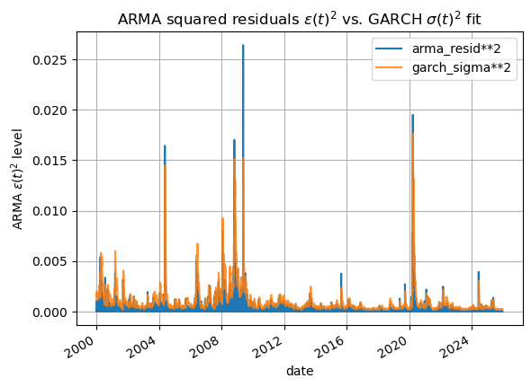

\FloatBarrier

It appears our time-varying scale has been captured well. Finally, looking at diagnostics for $z(t)$:

```python
>>> fig, (raw_ax, hist_ax, qq_ax) = plt.subplots(nrows=1, ncols=3, figsize=(15, 5))

>>> z.plot(ax=raw_ax, grid=True)
>>> raw_ax.set_title("Z-standardised z(t)")
>>> raw_ax.set_ylabel("Level")

>>> z.hist(bins=200, density=True, ax=hist_ax)
>>> hist_ax.set_title("Histogram of Z-standardised z(t)")
>>> pd.DataFrame(t_dist.rvs(est_nu, size=10_000)).plot.kde(ax=hist_ax)
>>> hist_ax.grid()

>>> qqplot(z, line="45", ax=qq_ax, dist=t_dist, distargs=(est_nu,))
>>> qq_ax.set_title("Z-standardised z(t) vs. Student-t")
>>> qq_ax.grid()

>>> plt.tight_layout()
>>> plt.show()
```


\FloatBarrier

Though we miss out ever so slightly on distribution peakedness, we're still quite close in goodness-of-fit given a finite sample. Importantly, sometimes the assumption that heavy tails as per Student-T is constant is a bit fallacious; sometimes time-varying models for the Nth moments are also necessary @FinancialEconometrix. For reference, our approach is identical to that of Python's `arch`. Thus, our final returns model:

$$
r(t) =
    \underbrace{
        \mu + \phi_1 r(t-1) + \theta_1 \epsilon(t-1)
    }_{\text{ARMA(1,1)}}
    +
    \underbrace{
        \sqrt{\alpha \epsilon_{t-1}^2 + \beta \sigma_{t-1}^2}\;\; z_t
    }_{\text{GARCH(1,1)}}
$$

As an aside, if we wanted to forecast with this ARMA/GARCH pair, we'd do it stepwise: first project the mean with ARMA, then project variance with GARCH.

# SETAR
Here we assert that if $Y(t)$ operates in _regimes_, we can opt to model each regime separately (each with their own model), and then combine them with a function that switches between them based on a discrete threshold:

$$
Y(t) = \begin{cases}
    \beta_{1,0} + \beta_{1,1} Y(t-1) + \dots + \beta_{1,p} Y(t-p) + \epsilon_1(t)& Y(t-d) \le c_1 \\
    \beta_{2,0} + \beta_{2,1} Y(t-1) + \dots + \beta_{2,p} Y(t-p) + \epsilon_2(t)& c_1 < Y(t-d) \le c_2 \\
    \vdots \\
    \beta_{N,0} + \beta_{N,1} Y(t-1) + \dots + \beta_{N,p} Y(t-p) + \epsilon_N(t)& c_{N-1} \le Y(t-d)
\end{cases}
$$

Where:
- $N$ is the number of regimes we have. In our case we assume a "high" and "low" regime, so $N=2$.
- $d$ is a "delay" parameter; that which determines the (historical) value of $Y(t)$ regimes must switch on. For example, $d=14$ at the daily level means returns from 14 days ago determines regimes now.
- $c_1, c_2, \dots, c_{N-1}$ are threshold values. If $Y(t-d)$ is above or below these thresholds, a regime switch occurs. For example, $c=0.03$ means if returns are above or below $+3\%$, regimes must switch. In conjunction with $d$, if returns from 14 days ago are above or below $+3\%$, we're in a different regime.

We'll use the BIC to select the optimal delay $d$ and threshold $c$ parameters (for a brief review of the BIC please see the appendix), but leave the AR(1) params within each regime as exactly specified via linear algebra. Recall that with AR(1) we're simply projecting a lagged version of our vector $Y(t)$ onto itself. a Projection in vector form given by:

$$ \text{Proj}_{\vec{y}}(\vec{x}) = \frac{\vec{x} \cdot \vec{y}}{\vec{x} \cdot \vec{x}} \cdot \vec{x} $$

Correspondingly, in matrix form:

$$
\begin{align*}
    \mathbf{X}\vec{b} &= \vec{y} \\
    \implies \vec{b} &= (\mathbf{X}^{\top}\mathbf{X})^{-1} \mathbf{X}^{\top}\vec{y}
\end{align*}
$$

```python
>>> def ar(y: pd.Series, order: int=1, add_const: bool=True) -> tuple:
...     X = y.shift(order).dropna()
...     X = sm.add_constant(X) if add_const else X
...     y = y.loc[X.index]
...     n, k = X.shape
...     XTX = np.linalg.inv(X.T.dot(X))
...     coeff = XTX.dot(X.T.dot(y))
...     proj = X.dot(coeff)
...     resid = y.sub(proj)
...     resid_variance = resid.dot(resid) / (n-k)
...     param_se = np.sqrt(resid_variance*XTX)
...     t_stat = coeff / (np.diag(param_se))
...     return (coeff, resid, t_stat)
...
>>> def setar(
...         params: tuple,
...         y: pd.Series,
...         ar_order: int=1,
...         return_model: bool=False
...     ):
...     # params = (c, d)
...     threshold, delay = params
...     y_lo = y.loc[y.shift(delay).lt(threshold)].dropna()  # y[t-d] <  c
...     y_hi = y.loc[y.shift(delay).ge(threshold)].dropna()  # y[t-d] >= c
...
...     # low regime
...     coeff_lo, resid_lo, tstat_lo = ar(y_lo, order=ar_order)
...     resid_std_lo = resid_lo.std()
...     LLF_lo = np.sum(t_dist.logpdf(resid_lo, df=df))
...
...     # high regime
...     coeff_hi, resid_hi, tstat_hi = ar(y_hi, order=ar_order, add_const=True)
...     resid_std_hi = resid_hi.std()
...     LLF_hi = np.sum(t_dist.logpdf(resid_hi, df=df))
...
...     LLF = LLF_lo+LLF_hi
...     k = 4  # 4 params: 2*(AR, AR variance)
...     BIC = -2*LLF + k*np.log(len(y))
...
...     if return_model:
...         coeffs_lo = pd.DataFrame(
...             index = ["const", "ar1"],
...             data  = {"coeffs": coeff_lo, "t_stat": tstat_lo}
...         )
...         coeffs_hi = pd.DataFrame(
...             index = ["const", "ar1"],
...             data  = {"coeffs": coeff_hi, "t_stat": tstat_hi}
...         )
...         return {
...             "threshold": threshold,
...             "delay"    : delay,
...             "param_lo" : coeffs_lo,
...             "param_hi" : coeffs_hi,
...             "resid_lo" : resid_lo,
...             "resid_hi" : resid_hi,
...             "LLF"      : LLF,
...             "BIC"      : BIC
...         }
...     else:
...         return BIC
```

As mentioned in the appendix, gradient-based optimisastion for SETAR is a difficult due to the disjointedness between regimes @ReparamSTAR_GARCH, @GeneralTAR. Instead, we perform a grid search over:
- The 10th to 90th percentiles of our dataset for $c$.
- A maximum delay of 14 days.

```python
>>> candidates = np.linspace(returns.quantile(0.15), returns.quantile(0.85), 100)
>>> maxdelay = 14
>>> best_bic = np.inf
>>> best_params = None
>>> for c in candidates:
...     for d in range(1,maxdelay+1):
...         bic = setar((c,d), returns)
...         if bic < best_bic:
...             best_bic = bic
...             best_params = (c,d)
>>> setar_model = setar(best_params, returns, return_model=True)
>>> print(setar_model)
```

## Model Summary
| Parameter      | Value      |
| -------------- | ---------- |
| Threshold (c)  | 0.01048    |
| Delay (d)      | 14         |
| Log-Likelihood | -6383.4940 |
| BIC            | 12802.0475 |

## Regime Definition
| Regime                        | Condition              | Observations | Std. Dev |
| ----------------------------- | ---------------------- | ------------ | -------- |
| Low (low return, higher vol)  | $y_{t-14} < 0.01048$   | 5407         | 0.01637  |
| High (high return, lower vol) | $y_{t-14} \ge 0.01048$ | 983          | 0.01317  |

## Parameter Estimates
### Low Regime
**Low returns, high volatility**

| Variable | Coefficient | t-Statistic |
| -------- | ----------- | ----------- |
| Const    | -0.000050   | -0.281687   |
| AR(1)    | 0.054415    | 4.007068    |

### High Regime
**High returns, low volatility**

| Variable | Coefficient | t-Statistic |
| -------- | ----------- | ----------- |
| Const    | 0.000300    | 0.572977    |
| AR(1)    | 0.016853    | 0.527961    |

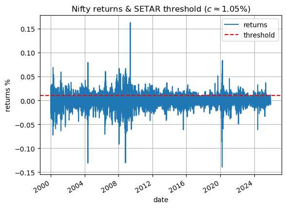

\FloatBarrier

We have a threshold return value of 1.05% and a delay of 14 days (2 weeks): if returns from 2 weeks ago $\ge 1.05\%$ we're in a high regime, otherwise a low regime. Most of Nifty's data resides in a low regime, and in said low regime returns' AR(1) behaviour is significant; high regime AR(1) is negligible. In other words, in a high regime Nifty tends to be mostly unpredictable given past information whilst in the low regime, runaway and self-reinforcing effects are relatively more predictable. This can also be construed as saying that long, persistent trends are rare. Looking at the distributions of returns within each regime:

![Histograms of returns within SETAR-estimated regimes. Regime switching threshold on returns $c \approx 1.05%$, delay parameter $d=14$ days. Returns within both high and low regimes are well parameterised with a Student-T distribution, and the threshold seems to segregate returns rather well, on the basis of histogram tails. Low regime Student-T DoF $\nu \approx 2.8471$, high regime Student-T DoF $\nu \approx 3.1864$. The Student-T KDE fits, like with ARMA residuals, still downplay the frequency if 0 returns (absolute peakedness isn't met properly).](./images/19Mar26-nifty-returns-setar-thresh-distribs.png)

\FloatBarrier

# Markov Switching
Instead of a discrete boundary dependent on $Y(t)$, we can use a Markov Chain to determine a smooth transition between regimes with AR still being the model for returns' conditional mean within a regime. Note that we use `statsmodels` here because a ground-up implementation far exceededs the time available for this assignment.

```python
mod_mar = sm.tsa.MarkovRegression(
    endog              = returns.iloc[1:],
    k_regimes          = 2,
    exog               = returns.shift(1).dropna(),
    switching_trend    = True,
    switching_exog     = True,
    switching_variance = True,
)

res_mar = mod_mar.fit()
res_mar.summary()
```

## Regime 0 (Low volatility, high returns) parameters

| Variable | Coefficient | Std. Error | z-Statistic | p-Value |
| -------- | ----------- | ---------- | ----------- | ------- |
| const    | 0.0005      | 0.000      | 3.784       | 0.000   |
| x1       | 0.0899      | 0.015      | 5.837       | 0.000   |
| σ²       | 7.275e-05   | 2.11e-06   | 34.480      | 0.000   |

## Regime 1 (High volatility, low returns) parameters

| Variable | Coefficient | Std. Error | z-Statistic | p-Value |
| -------- | ----------- | ---------- | ----------- | ------- |
| const    | -0.0017     | 0.001      | -2.744      | 0.006   |
| x1       | 0.0307      | 0.026      | 1.173       | 0.241   |
| σ²       | 0.0006      | 2.56e-05   | 21.516      | 0.000   |

## Regime Transition Parameters

| Transition  | Probability | Std. Error | z-Statistic | p-Value |
| ----------- | ----------- | ---------- | ----------- | ------- |
| $P(0\to 0)$ | 0.9859      | 0.002      | 433.272     | 0.000   |
| $P(1\to 0)$ | 0.0447      | 0.007      | 6.187       | 0.000   |

## Transition Matrix

|          | regime_0 | regime_1 |
| -------- | -------- | -------- |
| regime_0 | 0.985927 | 0.014073 |
| regime_1 | 0.044677 | 0.955323 |

### Transition Matrix Analysis
We know from basic Markov Chain theory that given a transition matrix $A^{\{n \times n\}}$ with $n$ states:
1. The dominant left-eigenvector of $A$, $\vec{v}_1=1$ once normalised, represents $A$'s steady-state distribution over all its states $\Omega$.
2. The subdominant left-eigenvectors of $A$, $\vec{v}_{n>1}<1\; \forall\; n$, help infer transient dynamics, and how alternate direction mix towards the steay state at rates governed by $|\lambda|^n$. This is simple enough to see: $0.9^n \to 0$ as $n \to \infty$, with the shrinkage accelerating the lower the base is.
3. Since eigen/spectral decomposition of a matrix involves rooting a polynomial, $A$ can have complex eigenvalues. In this case, $A$ is oscillatory making the Markov Chain periodic in two regimes:
    1. If $|\lambda|<1$, the corresponding complex left-eigenvector will cause periodic decay towards the steady-state.
    2. If $|\lambda|=1$, the system cycles indefinitely.

Our transition matrix:

```python
>>> e_vals, e_vecs = np.linalg.eig(transition_mat.T)  # note the transpose!

>>> print("Eigenvalues:\n{e_vals}")
Eigenvalues:
array([1.        , 0.94125013])

>>> print("\nEigenvectors:\n{e_vecs}")
Eigenvectors:
array([[ 0.95379966, -0.70710678],
       [ 0.30044336,  0.70710678]])
```

Indicates slow mixing, which we inferred earlier from the extremely low probability of states transitioning. Inspecting the dominant eigenvector:

```python
>>> # eigval=1
>>> unit_evec = e_vecs[:, 0]
>>> long_run_proba = np.abs(unit_evec) / np.abs(unit_evec).sum()
>>> long_run_proba
array([0.76045841, 0.23954159])
```

Suggests Nifty spends ~76% of the time in a low-volatility, mildly positive-return regime; ~24% in a volatile, negative-return regime. This is intuitive given the frequency of large crashes in our dataset (sharp crashes like the Dot Com, 2008, and COVID periods versus long, persistent uptrend periods in between). This is also contrary to SETAR which suggested Nifty spends most of its time in a high-volatility, low-return regime, presumebly because of a lack of expressive power: a Markov model conditions its latent state(s) on the data's entire distribution, whilst SETAR forces a split on a hard threshold of returns. Looking at the sub-dominant eigenvector:

```python
# eigval=0.94
print(f"Eigenvector for λ=0.94: {e_vecs[:, 1]}")
Eigenvector for λ=0.94: [-0.70710678  0.70710678]
```

By sign we can tell that probability mass mixes by deviating from the steady-state, with $\lambda$ close to 1 reinforcing the persistence of such a dynamic. This is quite interesting because it means if we start in a low-volatile regime, we slowly redistribute into a high-vol one. If we start in a high-vol regime, we take much longer to redistribute into a low-vol one:

```python
>>> vec_p = [1, 0]  # start in high regime
>>> steps = 50
>>> state_i = vec_p @ np.linalg.matrix_power(transition_mat, n=steps)
>>> print(state_i)
[0.7720631  0.2279369 ]

vec_p = [0, 1]  # start in low regime
state_i = vec_p @ np.linalg.matrix_power(transition_mat, n=steps)
print(state_i)
[0.72361771 0.27638229]
```

## State Analysis
Perhaps most interestingly, the Markov Switching model identified that low-vol regimes have a slightly higher AR(1) coefficient than high-vol regimes (which also aligns with SETAR). This is intuitive because we know from practice that extensive, persistent trends form in low-vol periods whilst a lot of sideways and sharp behaviour emerges in high-vol periods. Additionally, we can see from a plot of returns:


\FloatBarrier

Looking at our expected durations, $\mathbb{E}[R_1]$ and $\mathbb{E}[R_2]$:

$$
\begin{align*}
    \mathbb{E}[R_1] &= \frac{1}{1-p_{11}} \\
    \mathbb{E}[R_2] &= \frac{1}{1-p_{22}}
\end{align*}
$$

```python
>>> res_mar.expected_durations
array([71.05786344, 22.38296423])
```

We can see that the low-vol regime lasts for about 71 days whilst the high-vol regime is ~23 (which also aligns with our steady-state probabilities.) Finally, the distribution of returns within each regime:


\FloatBarrier

# Conclusion
So what have we learned from this little exploration? Because Nifty is an aggregated, free-float cap weighted _index_, a lot of nice statistical properties emerge, one of which is that it exhibits textbook volatility clustering. With GARCH-t(1,1), Nifty's returns' changing variance can be captured pretty well - insofar as we assume a single regime. Between SETAR and a Markov Switching model on returns, SETAR's regime dependence is limited by a deterministic threshold whilst the Markov model provides a probabilistic regime transition, which is more flexible. As such, combining GARCH-t(1,1) with a Markov Switching model should provide the best discrete-time model for Nifty's returns at the daily level.

---

# Appendix
## Nifty 50 Data Collection
Nifty 50 data was amalgamated from two sources: data from 2007-09-17 was collected using Python's `yahooquery` library @Py_yquery, data from 2000-01-03 to 2007-09-16 was collected from Investing.com @InvestingCom. Both sources were combined into a single CSV like so:

```python
>>> # pip install yahooquery==2.4.1
>>> from yahooquery import Ticker
>>> import pandas as pd
>>> yq = (
...     Ticker("^NSEI")
...     .history(period="1d", start="2000-01-03", end="2025-12-12")
... )
...
>>> yq = (
...     yq
...     .reset_index()
...     .loc[:, ["date", "close"]]
...     .astype({"date": "datetime64[us]", "close": float})
...     .set_index("date")
... )
...
>>> inv = pd.read_csv(
...     "in_investing_n50_history_00-07.csv",
...     names       = ["date", "close"],
...     header      = 0,
...     parse_dates = [0],
...     index_col   = [0]
... )
...
>>> df_save = pd.concat(
...     [inv.iloc[:-1], yq],  # 2007-09-17 is an overlapping date, same price
...     axis             = 0,
...     join             = "inner",
...     verify_integrity = True
... )
...
>>> df_save.isnull().sum()
close    0
>>> df_save.reset_index().to_csv("./data/nse_d.csv", index=False)
```

## The Switch From Electricity Load/Price
Indeed, in line with previous assignments the original idea was to use electricity price collected from the Indian Energy Exchange (IEX) databank for Day Ahead Markets (DAM) @IEXDamSnapshot. Interestingly enough, India's Central Electricity Regulatory Commission (CERC) implemented a cap on prices at ~₹12k to prevent runaway effects during crises or shortages, like what happened during 2022. National exchanges were instructed to allow bids only within ₹0 to ₹12 per kWh (= ₹12,000 per MWh) with this ceiling applicable to the DAM, RTM (real-time market) and spot segments @TNDIndiaIEXCap. Because such a move obviously distorts market dynamics, they also eventually came up with a "high-price DAM".

Eliding the ETL necessary to build a robust dataset of Indian electricity price that we can meld with our earlier dataset of temperature and electricity load in Delhi, we opt for Nifty 50 price data.

## Understanding Volatility Clustering
We know that vol clustering can be detected by studying the autocorrelation of squared returns. But what's really going on? Let's take this slowly. Financial returns are formally given by:

$$ r(t) = \ln \left( \frac{S(t+1)}{S(t)} \right) $$

Which is just the percentage change from one timestep to the next - applicable to _any_ time series, not just financial ones, insofar as we opt to work with change over time rather than level. We can treat $r(t)$ like any other time series: we can model it, difference it, look at its FFT or Laplace transform, etc. As such, we know from basic time series analysis that the simplest model we can use is some mean process $\mu(t)$ plus random residuals:

$$
\begin{align*}
    r(t) &= \mu(t) + \epsilon(t) \\
    \implies r(t)-\mu(t) &= \epsilon(t)
\end{align*}
$$

Basic time series theory says that a good forecasting method will yield residuals $\epsilon(t)$ with these properties:
- Will be independent, and not carry serial dependence/autocorrelation.
- Will have zero mean.

If either of these assumptions are untrue, then our model for $\mu(t)$ is misspecified. Note that requiring Gaussian residuals is a convenience, not a necessity @fpp3. For example with Autogen @RSHospoSeries, residuals showed seasonal structure and some AR. So we added in Fourier regressors and an AR component to our model $\mu(t)$, and $\epsilon(t)$ lost all autocorrelation and its mean collapsed to near 0.

We can understand this with our Nifty 50 data (we'll model price here instead of returns, just to keep it intuitive). There is clear exponentially increasing price, so naturally an ansatz for $\mu(t)$ is just some affine-shifted exponential line like $\beta_0 + \beta_1 e^x + \epsilon(t)$:

```python
>>> T = np.linspace(0, 1, len(df_nifty))
>>> T = sm.add_constant(np.exp(T))
>>> model = sm.OLS(endog=df_nifty.close, exog=T)
>>> res = model.fit()
>>> print(f"Residual mean: {res.resid.mean()}")
Residual mean: -1.5190e-11
>>> print(res.summary2())
```

|          | Coefficient | Std. Err. | t         | P>|t|  |
| -------- | ----------- | --------- | --------- | ------ |
| constant | -14216.2015 | 84.8673   | -167.5109 | 0.0000 |
| exp      |  13033.4366 | 47.4817   |  274.4937 | 0.0000 |
| BIC      | 114735.2757 |           |           |        |

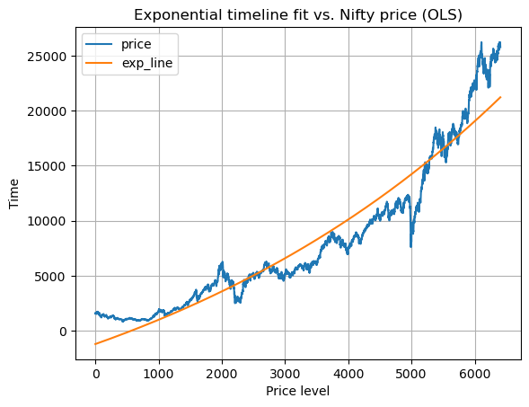

It's an okay fit and we have a computationally 0 mean, but our residuals $\epsilon(t)$ show autocorrelation:

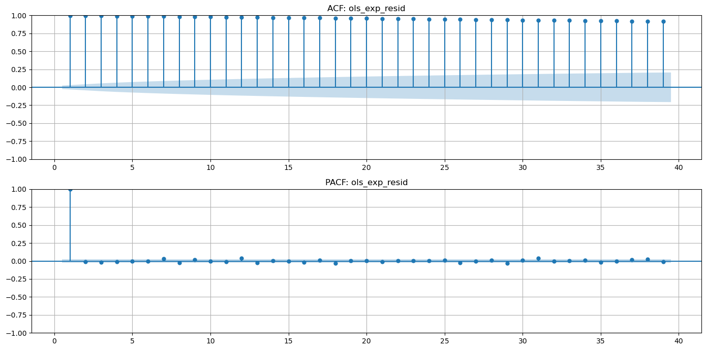

As an aside, we could have instead taken log-price and fitted a square-root line to it. That model actually works significantly better than the exponential one, and still shows residual autocorrelation. Either way, clearly $\mu(t)$ is misspecified. We can make it better by adding an AR(1) component:

```python
T = np.linspace(0, 1, len(df_nifty))
T = df_nifty.shift(1).assign(exp=np.exp(T)).bfill()
T = sm.add_constant(T)
model = sm.OLS(endog=df_nifty.close, exog=T)
res = model.fit()
print(f"Residual mean: {res.resid.mean()}")
Residual mean: 2.4541e-11
print(res.summary2())
```

|          | Coefficient | Std. Err. | t         | P>|t|  |
| -------- | ----------- | --------- | --------- | ------ |
| constant |    -23.5769 |   10.6263 |   -2.2187 | 0.0265 |
| close.1  |      0.9988 |    0.0007 | 1480.2690 | 0.0000 |
| exp      |     21.4766 |    9.1564 |    2.3455 | 0.0190 |
| BIC      |  77338.7035 |           |           |        |

\newpage


\FloatBarrier

Which gives us an almost exact fit with a computationally 0 mean, and $\epsilon(t)$ now shows no more serial correlation (though our $\mu(t)$ regressor dataset has a large condition number):

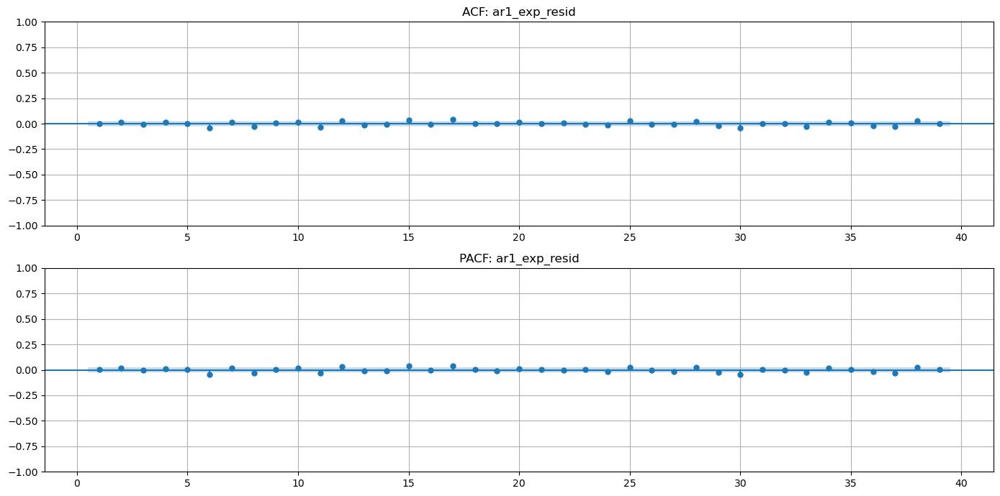

\FloatBarrier

So great, job done - or is it? Let's take a little deviation (pun intended).

### Heteroscedasticity
We know that OLS projects one vector $\vec{x}$ onto another $\vec{y}$, or one subspace $\mathbf{X}$ onto $\vec{y}$. Results aren't perfect projections onto $\vec{y}$, but they're the best we can do. The leftover bits are our residuals, and are by definition orthogonal to the projection.

With a time series, we're dealing with a stochastic, latent data-generating process; any time series data we have is a sample realisation of the underlying process. As such, our choice of model $\mu(t)$ now plays the role of that projection onto the realisation $y(t)$, with residuals $\epsilon(t)$ being the orthogonal components that $\mu(t)$ can't explain. Because of this, the behaviour of $\epsilon(t)$ is now very important, and amongst other diagnostics, we're interested in how their variance applies across our degrees of freedom.

With a square matrix, we have the the exact number of equations as we have unknowns, so we have a unique solution. With more rows than columns, we have more equations than unknowns; with more columns than rows, more unknowns than equations. Our degrees of freedom is thus $n-k$ for $n$ rows and $k$ columns - Gaussian elimination makes this very apparent: once we resolve whatever parameters we can, the remaining equations get _free parameters_. Residuals, cross-sectional or temporal, have variance, and the degrees of freedom tells us over how many parameters it can vary.

Now, at the very least our residuals are expected to have mean $\mu_{\epsilon}=0$, in which case residual variance is simply:

$$
\begin{align*}
    \sigma^2 &= \text{Var}(\epsilon) \\
        &= \mathbb{E} \left[ (\epsilon(t)-\mu_{\epsilon})^2 \right] \\
        &= \mathbb{E} \left[ (\epsilon(t)-0)^2 \right] \\
        &= \mathbb{E} \left[  \epsilon(t)^2 \right]
\end{align*}
$$

We need to break this operation down because it's crucial to understanding how ARCH becomes necessary. We have our residual time series, $\epsilon(t)$ which, if $\mu(t)$ is well-specified, should have mean $\mu_{\epsilon}=0$. Its variance, $\sigma^2$, is clearly the sample average of squared residuals, $\epsilon(t)^2$:

$$ \mathbb{E} \left[ \epsilon(t)^2 \right] = \frac{1}{n-k} \sum_{i=1}^{n} e_i^2 $$

Squared residuals $\epsilon(t)^2$ represents the variance of each residual data point $e_i$ relative to the residual mean. So $\sigma^2$ is just an average of the variance of each residual data point, relative to the residual mean. For example:

```python
>>> # sample residual vector with mean=0
>>> e = np.array([4, -3, -1, 2, 6, -8])
>>> e.mean()
np.float64(0.0)
>>> # mean=0 means its variance is just itself, squared
>>> var_e = e**2
>>> var_e
array([16,  9,  1,  4, 36, 64])
>>> # now sum the squared residuals and divide by dof
>>> sum(var_e)/(len(e)-1)
np.float64(26.0)
>>> np.var(e, ddof=1)
np.float64(26.0)
```

Perhaps the most apparent point:

```python
>>> # sample stats are 1/(n-k), population stats are 1/n
>>> sum(var_e)/len(e)
np.float64(21.6667)
>>> np.mean(var_e)
np.float64(21.6667)
>>> np.var(e)  # ddof=0 is default
np.float64(21.6667)
```

This is critical because can clearly see now that the entire mechanism assumes that residual variance $\sigma^2 = \mathbb{E}[\epsilon(t)^2]$ is actually well-specified by an average! But as per Wikipedia @WikiHomoHeteroscedasticity, which also includes some nice plots:

> _A classic example of heteroscedasticity is that of income versus expenditure on meals. A wealthy person may eat inexpensive food sometimes and expensive food at other times. A poor person will almost always eat inexpensive food. Therefore, people with higher incomes exhibit greater variability in expenditures on food._

In other words, sometimes the deviation of each data point from the residual mean can change over time. Looking at the plot of our Nifty AR(1) residuals:

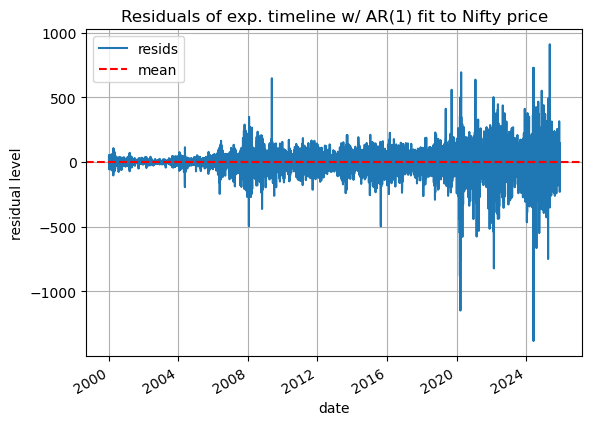

\FloatBarrier

Without even having squared them, we can very clearly see that their deviation from the residual mean (of zero) grows over time - it's not constant! Now imagine: we take a single number for residual variance and use it for our SEs. This is the grave equivalent of saying "oh yeah, Nifty has one average price!" The data-generating stochastic process is a moving target: there is no one average because it's a moving average. The average price of all transactions today, or of the last 5 days, isn't the same as the average of the last 10 days or the set of 5 days starting from 10 days ago. So if we're careful about dealing with changing averages/first moments, we should also be careful when dealing with changing variances/second moments!

In other words, when the variance of each data point in a time series relative to the series' mean is nonconstant over time, we cannot expect an average to specify it well. So we move from dealing with $\mathbb{E}[\epsilon(t)^2]$ to dealing with $\epsilon(t)^2$ directly. Squaring them makes all of this the most apparent:

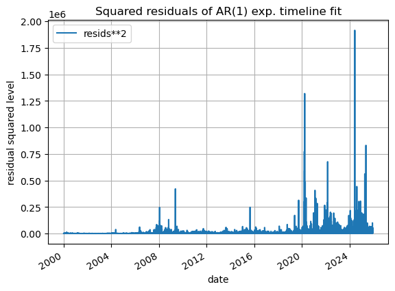

\FloatBarrier

Nonconstant variance is heteroscedasticity; constant variance that can be well-specified by an average is homoscedasticity. And because we clearly have heteroscedastic residuals, it becomes useful to model their heteroscedasticity. Enter the ARCH model: AutoRegressive Conditional Heteroscedasticity.

The last piece of the puzzle before going into ARCH is serial dependence, or autocorrelation in residuals: indeed if $\mu(t)$ is well-specified, $\epsilon(t)$ won't be autocorrelated. However, we aren't dealing with first-order $\epsilon(t)$ anymore - indeed, it can show no autocorrelation - but $\epsilon(t)^2$ - the variance of each residual data point relative to the residual process' mean; or in other words, the squared deviation of each residual from its process' mean - _can_ show autocorrelation. At which point, we really do need to take it into consideration because just like Taylor expansions, sometimes the additional curvature provided by second-order statistics is necessary.

Thus, autocorrelation in residual variance is "volatility clustering". When we look at the ACF of "squared returns", we aren't looking at just squared returns - the mechanism is nuanced. We implicitly assume the best estimate of returns is its unconditional mean, and as good data scientists we debias things by demeaning. Finally, average returns for essentially any sub-annual frequency are negligible, which brings us back to:

$$
\begin{align*}
    r(t) &= \mu_r + \epsilon(t) \\
    r(t)-\mu_r &= \epsilon(t)
\end{align*}
$$

So what we're really looking at when inspecting "squared returns"- theoretically, at least - is, indeed, $\epsilon(t)^2$.

### ARCH
Recall Autogen: when we saw periodic retail bar sales, we thought "some scaled version of $\sin(t)$ should work" - we broke down the periodicity into a basis function with some scaling factor, and ended up with $\beta \sin(t)$ (technically, we used both $\sin(t)$ and $\cos(t)$ as Fourier harmonics). Eventually we also concluded that $\beta$ must be time varying, and we ended up with $\beta(t) \sin(t)$. This is identical to what ARCH does: it breaks $\epsilon(t)^2$ up into two components:
- $\sigma(t)^2$, which is our serially-dependent variance of residuals (this particular $\sigma(t)^2$ notation is unrelated to what we spoke about earlier), and
- $z(t)^2$, which is a white-noise i.i.d. process with mean 0 and unit variance.

Thus, the canonical ARCH form:

$$
\begin{align*}
    \epsilon(t)^2 &= \sigma(t)^2 z(t)^2 \\
    \sigma(t)^2 &= \alpha_0 + \alpha_1 \epsilon(t-1)^2 + \dots + \alpha_p \epsilon(t-p)^2 \\
    z(t) &\sim \text{ i.i.d.}(0, 1)
\end{align*}
$$

As established, residuals are at least $\mu_{\epsilon}=0$, hence the lack of affine offset. $z(t)$ must have variance 1, otherwise multiplication by $\sigma(t)^2$ is ill-posed: we lose identifiability because now $\sigma(t)^2$ is not the only scaling factor, and $z(t)^2$ is confounded. Finally, if instead of AR for $\sigma^2$ we used ARMA, it'd be generalised GARCH:

$$ \sigma(t)^2 = \omega + \alpha_1 \epsilon(t-1)^2 + \dots + \alpha_p \epsilon(t-p)^2 + \beta_1 \sigma(t-1)^2 + \dots + \beta_q \sigma(t-q)^2 $$

On a closing note, with GARCH, in addition to our standard residuals' diagnostics of:
- No serial dependence in $\epsilon(t)$
- $\mathbb{E}[\epsilon(t)] = 0$

We also need to ensure:
- No serial dependence in $z(t)$
- $\mathbb{E}[z(t)] = 0$

### Beyond ARCH
All of this being said, the eccentricity of stochastic calculus and Geometric Brownian Motion (GBM), stochastic volatility (SV), etc. should now me much more approachable! GBM is just one step backwards:

$$ dS(t) = \mu S(t) dt + \sigma S(t) dW(t) $$

With a fixed $\mu$ and $\sigma$ (note that $\sigma$ here is standard deviation, not variance. $\sigma^2$ is variance). $dW(t)$ now plays the continuous-time role of $z(t)$: the Wiener process, a scaled contiuous-time limit at $N \to \infty$ of a $\pm 1$ Bernoulli(0.5) random walk. GARCH is a step up because we replace the fixed $\mu$ and $\sigma$ with deterministic functions like ARMA or Prophet for $\mu(t)$, and ARCH or otherwise for $\sigma(t)^2$. A step adjacent is stochastic volatility, like the Heston model:

$$
\begin{align*}
    dS(t) &= \mu S(t) dt + \sqrt{\nu(t)} S(t) dW(t)^{(S)} \\
    d\nu(t) &= \kappa(\theta - \nu(t)) dt + \xi \sqrt{\nu(t)} dW(t)^{(\nu)} \\
    \text{Corr}(dW_t^S, dW_t^{\nu}) &= \rho
\end{align*}
$$

Where we still retain a fixed $\mu$ coefficient but replace a fixed (or deterministic) $\sigma$ with its own stochastic process (here, $\sqrt{\nu(t)}$ is standard deviation. $\nu(t)$ is variance) correlated with the randomness in returns. Finally, to touch upon $dW(t)$: assume a random process $w(t)$ is i.i.d. with this kind of source distribution:

$$
w(t) \begin{cases}
    +1,& \text{ with probability } \frac{1}{2} \\
    -1,& \text{ with probability } \frac{1}{2}
\end{cases}
$$

We get specific amounts for the first two moments:
1. The mean, $\mu$, of each increment is 0:
    $$ \mu_w = \frac{1-1}{2} = \frac{0}{2} = 0 $$
2. The variance, $\text{Var}(w(t))$, is 1:
    $$
    \begin{align*}
        \text{Var}(w(t)) &= \frac{1}{2} \sum_{i=1}^2 (x_i - \mu_w)^2 \\
        &= \frac{1}{2} \left( (1-0)^2 + (-1-0)^2 \right) \\
        &= \frac{1}{2} \left( 1+1 \right) \\
        &= \frac{2}{2} \\
        &= 1
    \end{align*}
    $$

Since the variance of each step is $1$, $N$ steps will have variance $N$ with standard deviation $\sqrt{N}$. When comparing different quantities with different natural magnitudes like airline speeds and blood-potassium concentrations, like good data scientists we z-standardise:

$$ z_x = \frac{x-\mu_x}{\sigma_x} $$

With zero mean, $w(t)$ is just scaled by $\frac{1}{\sqrt{N}}$. In the limit as $N \to \infty$, $w(t) \to \mathcal{N}(0, 1)$ by the CLT which is the Wiener process $W(t)$.

## ARMA(1,1) and MLE
We're trying to capture our returns' conditional mean (first-moment) dynamics $\mu(t)$ with an ARMA(1,1) model:

$$
\begin{align*}
    r(t) &= \text{ARMA}(1,1) \\
    \text{ARMA}(1,1) &= \mu + \phi_1 r(t-1) + \theta_1 \epsilon(t-1) + \epsilon(t)
\end{align*}
$$

Where $\mu$ here is a constant. Note that we aren't talking about $\epsilon(t)^2$ just yet. Because ARMA has an endogenous dependency on past residuals per $t$, OLS as a pure mathematical tool is inapplicable here. Instead, we estimate the $\phi, \theta$ parameters jointly using maximum likelihood estimation (MLE). True Bayesian inference has 3 components:
1. A prior distribution $\pi(\theta \vert M)$ over parameters given a model $M$ (this $\theta$ is unrelated to $\theta_1$ above, and $M$ here is ARMA),
2. A likelihood distribution $L(x \vert \theta, M)$ describing the probability of the observed data $x$ under those parameters & model,
3. A posterior distribution $p(\theta \vert x, M)$ of parameters given the data & model form, obtained by combining the prior and likelihood via Bayes' theorem.

MLE only requires a reasonable likelihood because we treat the ARMA parameters as fixed but unknown constants (if instead we wanted the full posterior distribution, we'd use a sampling scheme like M-H/HMC/NUTS). When specifying that likelihood, we assume that the residuals $\epsilon(t)$, not the raw data, are i.i.d. (note that "identically" distributed is a property applicable to discrete-time; in continuous time, noise scales as $\sqrt{t}$) and pick a distribution we think they best follow.

It's important to recognise that independence is a special case of conditional probability, wherein probabilities don't change at each step $t$. In contrast, dependence is when probabilities do change at each step. For example, consider drawing a ball 5 times from a bag with 3 green and 2 red balls. Drawing a green on the first try has probability $(3/5)$. If we always place the chosen ball back into the back (sampling with replacement), the probability of drawing green on each try is always 3/5, so draws are independent:

$$ P(G,G) = \frac{3}{5} \times \frac{3}{5} = \frac{9}{25} $$

But without replacement, the probability changes after each draw (e.g., green on the second draw now has probability 2/4), so the draws are dependent:

$$ P(G,G) = \frac{3}{5} \times \frac{2}{4} = \frac{6}{20} $$

Both are conditional probabilities, but in the independent case conditioning on the past does not change the distribution. Assuming i.i.d. data is exactly this: each observation behaves like an independent draw. When data is dependent, we use models (like ARMA(1,1)) to capture that dependence leaving residuals that behave i.i.d. Maximising the likelihood function is what lets us say, "these model parameters are most likely to result in i.i.d. residuals, given this choice of their distribution", and because of independence we can write our likelihood as a simple cumprod of distributions that we can numerically optimise.

Now, some discussion can be had around the choice of likelihood function. The usual way to go about this is to start with some reference distribution (normally a Gaussian), optimise parameters, and inspect residual behaviour. However, in our case:
- Average daily returns is negligible (~0.04%), so the choice of distribution here is irrelevant.
- Even if the true residuals are abnormal, quasi-MLE still obtains consistent estimations @WikiQMLE, @StataQMLE. Standard errors may need some adjustment, but again daily returns mean is negligible.
- We're supplementing residual variance modelling with GARCH, so there's _really_ no need to spend time on this.

So in this case, we can use a Gaussian likelihood WLOG, making the likelihood function just a cumulative product of Gaussians across time $t$. Now, we can easily compute our likelihood using SciPy's `norm.logpdf()`, but for posterity we'll run through a quick derivation. The probability of one $\epsilon$ is:

$$ f(\epsilon_t) = \frac{1}{\sqrt{2\pi\sigma^2}} \exp \left(-\frac{\epsilon_t^2}{2\sigma^2}\right) $$

Which because of independence, means:

$$
\begin{align*}
    L(\theta) &= \prod_{t=1}^T f(\epsilon_t(\theta)) \\
        &= \prod_{t=1}^T \frac{1}{\sqrt{2\pi\sigma^2}} \exp \left(
            -\frac{\epsilon_t(\theta)^2}{2\sigma^2}
        \right)
\end{align*}
$$

Note that $\theta$ here is just a vector of all parameters of our chosen model, including our ARMA's $\theta_1$. Taking logs so that we get sums instead of products:

$$
\begin{align*}
    \ln L(\theta)
        &= \ln \left[ \prod_{t=1}^T \frac{1}{\sqrt{2\pi\sigma^2}} \exp \left(
            -\frac{\epsilon_t(\theta)^2}{2\sigma^2}
        \right) \right] \\
        &= \sum_{t=1}^T \ln \left[ \frac{1}{\sqrt{2\pi\sigma^2}} \exp \left(
            -\frac{\epsilon_t(\theta)^2}{2\sigma^2}
        \right) \right] \\
        &= \sum_{t=1}^T \ln \left[ \frac{1}{\sqrt{2\pi\sigma^2}} \right]
            + \ln \left[ \exp \left( -\frac{\epsilon_t(\theta)^2}{2\sigma^2} \right) \right] \\
        &= \sum_{t=1}^T \ln \left[ \frac{1}{\sqrt{2\pi\sigma^2}} \right]
            -\frac{\epsilon_t(\theta)^2}{2\sigma^2} \\
        &= \sum_{t=1}^T -\frac{1}{2} \ln(2\pi\sigma^2)-\frac{\epsilon_t(\theta)^2}{2\sigma^2}
\end{align*}
$$

$T$ sums of the first term is just the first term repeated $T$ times, and in the second term only $\epsilon_t(\theta)^2$ depends on $t$, so the Guassian likelihood function is:

$$ \boxed{ \therefore \ln L(\theta) = -\frac{T}{2} \ln(2\pi\sigma^2) -\frac{1}{2\sigma^2} \sum_{t=1}^T \epsilon_t(\theta)^2 } $$

Again, $\theta$ here is a collection of all model parameters, not just the ARMA $\theta_1$. This is exactly what `norm.logpdf()` does under the hood, and likewise for other distributions.

## GARCH(1,1) and Likelihood Choice
Recall the canonical ARCH(p) form:

$$
\begin{align*}
    \epsilon(t)^2 &= \sigma(t)^2 z(t)^2 \\
    \sigma(t)^2 &= \alpha_0 + \alpha_1 \epsilon(t-1)^2 + \dots + \alpha_p \epsilon(t-p)^2 \\
    z(t) &\sim \text{ i.i.d.}(0, 1)
\end{align*}
$$

Where $\epsilon(t)$ is the time series of heteroscedastic residuals obtained after fitting some conditional mean model, $\mu(t)$ (in our case, ARMA(1,1)). As discussed elsewhere in the appendix, ARCH assumes that the heteroscedasticity in $\epsilon(t)$ - i.e., the time-varying variance of each data point in $\epsilon(t)^2$ - can be broken into a combination of a stochastic basis function $z(t)^2$ and some deterministic scaling function, $\sigma(t)^2$. From this, $z(t)$ is the time series of our _true_ model residuals: totally random, with $\mathbb{E}[z(t)]=0$ and $\mathbb{E}[z(t)^2]=1$. $z(t)$ must have variance 1, otherwise we lose identifiability because $\sigma(t)^2$ is then no longer the only scaling factor. Finally, if instead of AR for $\sigma^2$ we used another ARMA(p,q), it'd be generalised GARCH(p,q):

$$ \sigma(t)^2 = \omega + \alpha_1 \epsilon(t-1)^2 + \dots + \alpha_p \epsilon(t-p)^2 + \beta_1 \sigma(t-1)^2 + \dots + \beta_q \sigma(t-q)^2 $$

Now, when using ARMA(1,1) for our returns' conditional mean we could get away without specifying a robust likelihood function. But with GARCH(1,1) the choice of distribution we believe residuals $z(t)$ follow is of central importance because after we capture time-varying scale $\sigma(t)^2$, whatever's left over must behave like i.i.d. draws of that distribution. So, inspecting the histograms of $\epsilon(t)$ versus a default Gaussian KDE:

```python
>>> ax = est_resid.hist(bins=200, density=True, label="empirical", figsize=(6, 5))
>>> loc, scale = norm.fit(est_resid)
>>> ref_x = np.linspace(est_resid.min(), est_resid.max(), 10_000)
>>> ref = norm.pdf(ref_x, loc=loc, scale=scale)
>>> ax.plot(ref_x, ref, label="normal")
>>> ax.set_title("Histogram of ARMA residuals vs. Gaussian KDE (matched moments)")
>>> ax.set_xlabel("Residuals")
>>> ax.set_ylabel("Density")
>>> plt.tight_layout()
>>> plt.show()
```


\FloatBarrier

While the heavy tails are captured, the slimmer waistline leading to a more peaked top is distorted. In contrast, a Student-T KDE:

```python
>>> ax = returns.hist(bins=200, density=True, label="empirical", figsize=(6, 5))
>>> df, loc, scale = t_dist.fit(est_resid)
>>> ref_x = np.linspace(est_resid.min(), est_resid.max(), 10_000)
>>> ref = t_dist.pdf(ref_x, df=df, loc=loc, scale=scale)
>>> ax.plot(ref_x, ref, label="studentt")
>>> ax.set_title("Histogram of ARMA residuals vs. Student-T KDE (fitted params)")
>>> ax.set_xlabel("Residuals")
>>> ax.set_ylabel("Density")
>>> plt.tight_layout()
>>> plt.show()
```


\FloatBarrier

Is an exact fit, which is the distribution we'll go with for our GARCH likelihood. Note that SciPy's `pdf.fit()` function uses MLE to find distribution parameters and so also assumes the data given to it is i.i.d. Not something we need to worry about in our case given the assumptions we have on $\epsilon(t)$, but something to be aware of. Additionally, note that inferring a heavy-tailed distribution like our Student-T here holds all the time is a bit fallacious; sometimes, GARCH-t is necessary because the tails (and 3rd, 4th, Nth moments) of a distribution themselves change over time @FinancialEconometrix.

## BIC Review
Recall the BIC @WikiBIC:
1. Start with the Bayesian Inference equation for a prior distribution $\pi$ over parameters $\theta$ given a model $M$, a likelihood function $L$ over data $x$ given parameters and a model, and a resultant posterior distribution $p$:
    $$ p(x \vert M) = \int L(x \vert \theta, M) \pi(\theta \vert M) d\theta $$
    Note that $\theta$ here is our k-tuple of parameters (e.g. if we 3 parameters in our model $M$, the cardinality of $\theta$ is $k=3$). The likelihood function is a cumulative product of PDFs for each of the $n$ data points we have (see our discussion earlier on conditional independence). Note that no specific PDF is assumed. To make a cumprod easier to work with, we'll take logs turning the cumulative product into a cumulative sum.

2. Use Taylor's expansion of the log-likelihood to expand around the max likelihood estimate (MLE) of $\theta$, $\hat{\theta}$:
    $$ \ln(L) = \ln L(\hat{\theta})+(\theta-\hat{\theta})^{\top} \nabla_{\theta} L(\hat{\theta}) + \frac{1}{2} (\theta - \hat{\theta})^{\top} \nabla_{\theta}^2 L(\hat{\theta}) (\theta - \hat{\theta}) + \dots $$

3. Because $\hat{\theta}$ is a maximum, $\nabla_{\theta} L(\hat{\theta})=0$ which means the linear term (the 2nd one) disappears:
    $$ \ln(L) = \ln L(\hat{\theta}) + \frac{1}{2}(\theta-\hat{\theta})^{\top} \nabla_{\theta}^2 L(\hat{\theta})(\theta-\hat{\theta}) $$
    $\nabla_{\theta}^2 L(\hat{\theta})$ is the Hessian (which is negative definite because $\hat{\theta}$ is a maximum - basically all curvature from the maximum points down). Wikipedia writes the Hessian as the Fisher information matrix $\mathcal{I}(\hat{\theta})$, but we'll stick to normal Hessians. The FIM is involved because it just happens to be the expected value of the negative Hessian in this case.

4. Exponentiate the expansion because the integral we need is over the likelihood, not the log-likelihood:
    $$ L(x \vert \theta, M) = L(\hat{\theta}) \cdot \exp \left(\frac{1}{2}(\theta-\hat{\theta})^{\top} \nabla_{\theta}^2 L(\hat{\theta})(\theta-\hat{\theta}) \right) $$

5. Collect terms:
    $$ p(x \vert M) = \int L(\hat{\theta}) \cdot \exp \left(\frac{1}{2}(\theta-\hat{\theta})^{\top} \nabla_{\theta}^2 L(\hat{\theta})(\theta-\hat{\theta}) \right) \pi(\theta \vert M) d\theta $$
    We can move $\pi(\theta \vert M)$ out of the integral as a constant along with $L(\hat{\theta})$ because the prior is pretty much fixed around the maximum likelihood region, and $L(\hat{\theta})$ is the maximum likelihood region:
    $$ p(x \vert M) = L(\hat{\theta}) \; \pi(\theta \vert M) \cdot \int \exp \left(\frac{1}{2}(\theta-\hat{\theta})^{\top} \nabla_{\theta}^2 L(\hat{\theta})(\theta-\hat{\theta}) \right) d\theta $$

6. Lo and behold, recognise that the integral is the multivariate Gaussian integral (of course, right?). Importantly, recognise that the purpose of the BIC is to deal with complicated models that are overparameterised/overfit (large param values for no reason, other than to just fit the data really well and not generalise). So by nature, the BIC works in parameter space. As mentioned, $\theta$ is the k-tuple of parameters so the integral is now over $k$-dimensional parameter space:
    $$ \int \exp \left(\frac{1}{2}(\theta-\hat{\theta})^{\top} \nabla_{\theta}^2 L(\hat{\theta})(\theta-\hat{\theta}) \right) d\theta = (2\pi)^{k/s} |-\nabla_{\theta}^2 L(\hat{\theta})|^{-1/2} $$
    Note that $|-\nabla_{\theta}^2 L(\hat{\theta})|$ is the determinant of the Hessian matrix. Because the Hessian is negative definite, but we need positivity. This requirement arises out of the actual evaluation; without going too much into the weeds here: instead of using the negative definite Hessian $H=\nabla_{\theta}^2 L(\hat{\theta})$, define $A := -H$ so that $A$ is now positive definite. Then diagonalise $A : A=Q\Lambda Q^{\top}$, which turns our exponential into the inner product of its eigenvalues with $QQ^{\top}$. Evaluate using the standard 1D Gaussian integral, take the cumprod over $k$ parameters, and finally switch $A$ back to the Hessian $-H$. Basically, rewrite the Hessian, diagonalise to reduce into a product of 1D Gaussians, evaluate each 1D Gaussian using the standard solution $\sqrt{2\pi/\lambda_i}$ and take the cumprod over $k$ parameters (you should end up with a determinant of $A$). Finally, rewrite $A$ in terms of the Hessian.

7. With our integral evaluated, take logs again because they're just so easy to work with:
    $$ \ln \left( p(x \vert M) \right) = \ln \left( L(\hat{\theta}) \right) + \ln \left( \pi(\theta \vert M) \right) + \frac{k}{2} \ln(2\pi) - \frac{1}{2} \ln \left( |-\nabla_{\theta}^2 L(\hat{\theta})| \right) $$

8. Finally, apply the limit as ${n \to \infty}$:
    - The log-likelihood $\ln \left( L(\hat{\theta}) \right)=\sum \limits_{i=1}^n L(x_i \vert \hat{\theta}, M)$ just grows with $n$, since it's a sum over $n$ i.i.d. data points. It grows linearly.
    - The prior term $\pi(\hat{\theta})$ doesn't change with $n$, so it's negligible in the limit.
    - $(k/2) \ln(2\pi)$ is just a constant, and $\pi$ here **is not the prior**, it's the circle $\pi$.
    - The Hessian is $n$ sums of the 2nd gradient with respect to $\theta$ of the log-likelihood, and the log-likelihood scales with $n$, so the Hessian too scales with $n$. We can factor out $n$ and use the homogenous property of determinants $\det(cA^{n \times n})=c^n \det(A^{n \times n})$ to get $n^k |-\nabla_{\theta}^2 L(\hat{\theta})|$, since the Hessian is $k \times k$ matrix (parameter space). Because we have $\ln \left( |-\nabla_{\theta}^2 L(\hat{\theta})| \right)$, $n^k |-\nabla_{\theta}^2 L(\hat{\theta})$ becomes $k \ln(n) + \ln \left( |-\nabla_{\theta}^2 L(\hat{\theta})| \right)$, and in the limit as $n \to \infty$ only the $k \ln(n)$ term dominates.


Thus, the BIC:

$$
\ln \left( p(x \vert M) \right) = \ln \left( L(\hat{\theta}) \right) - \frac{1}{2} k \ln(n)
$$

What are we doing with the BIC, why are we using this and not (just) MLE? Well, the vox populi is that SETAR is nonlinear and its likelihood function(s) aren't continuous betwixt each other, so trying to optimise with MLE runs into discontinuities @ReparamSTAR_GARCH. It's also been shown @GeneralTAR that a Bayesian estimator actually converges to a more statistically correct value (average of the Poisson delay process) versus the MLE (minimum of the Poisson delay process). Vox mei is that a specialised MLE routine for SETAR looks too complicated for the time at hand. As for what we're doing with the BIC, we're basically adding an analytic penalty proportional to number of parameters $k$ in our SETAR model which, in this case, is just 2. The LLF still exists (that's the $\ln(L(\hat{\theta}))$ bit), a penalty is just slapped on.

# References
