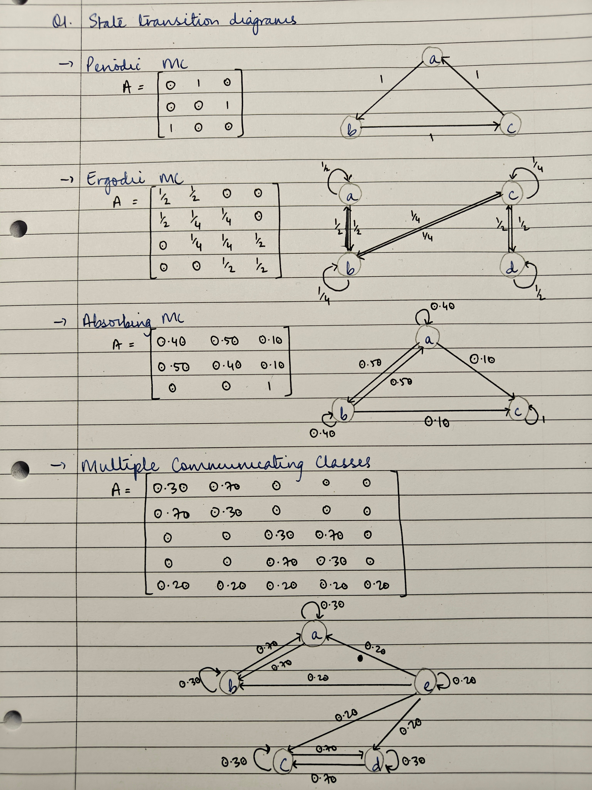
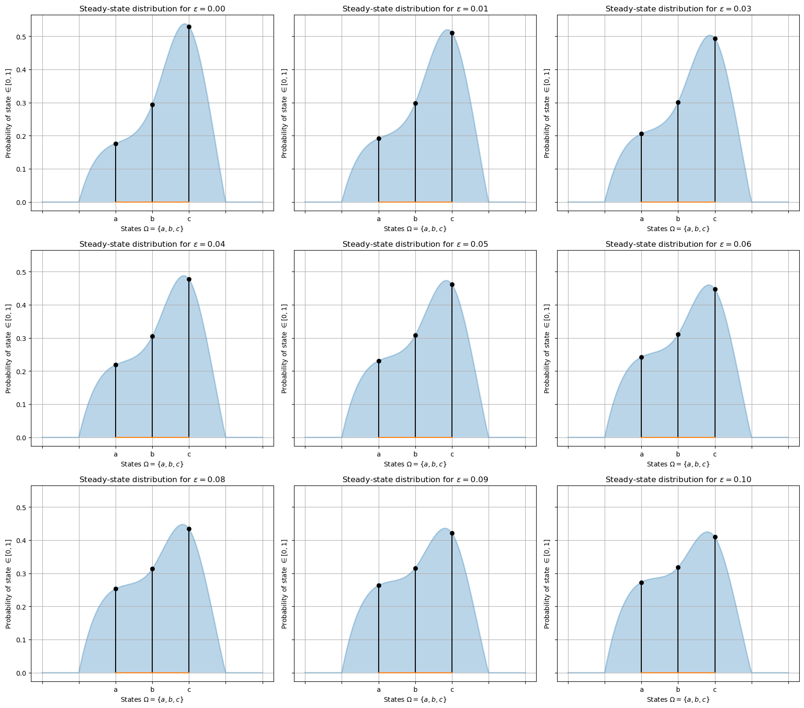
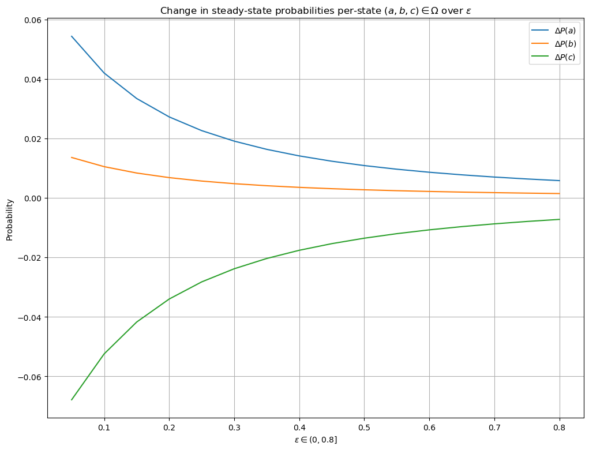
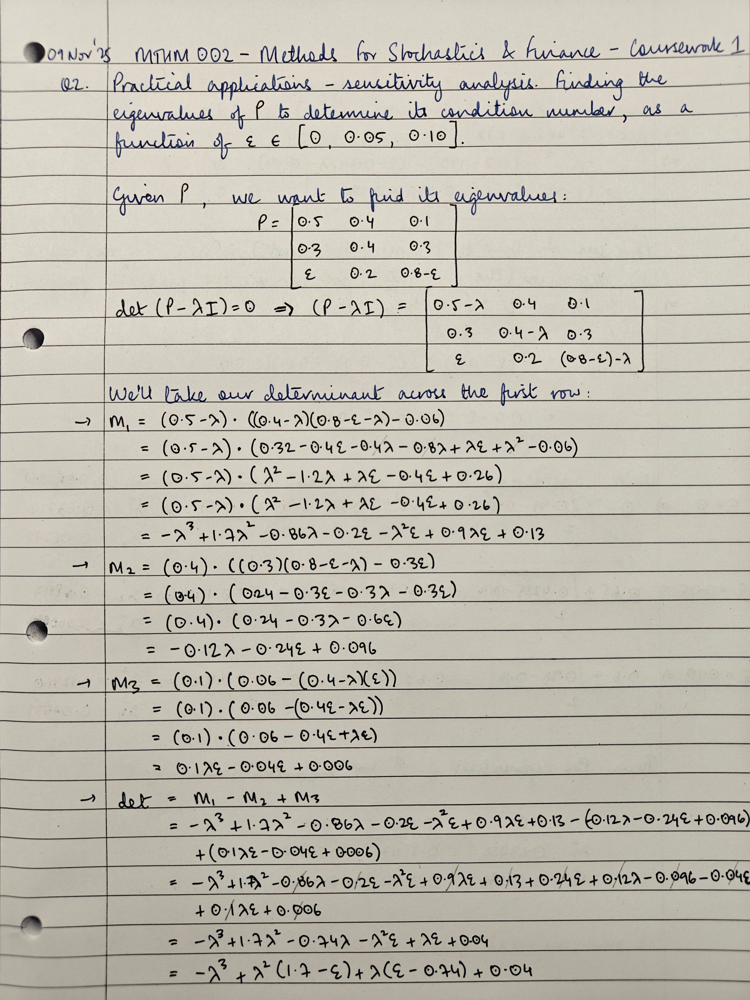
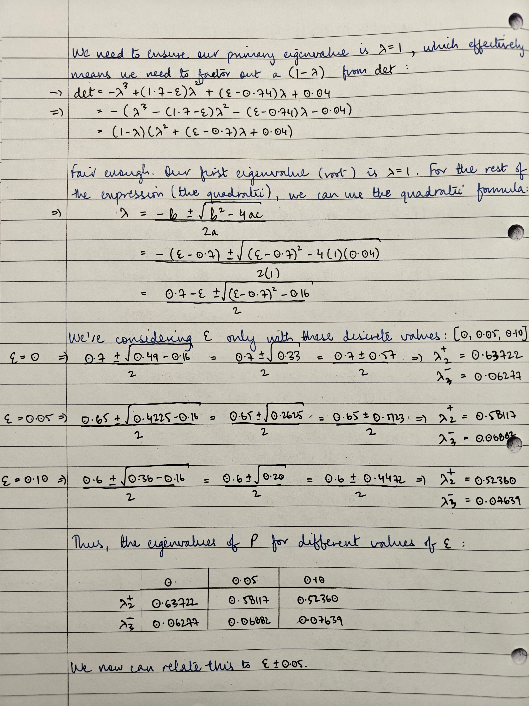

# Introduction
This submission is for MTHM002's first coursework over the year 2025-2026. Note that typesetting has been adapted from a Jupyter notebook, so some sections may not appear exactly (e.g., code blocks have been broken up here with explicit explanations to aid reasoning and preserve readability).

## Code Setup

```python
import logging
import matplotlib.pyplot as plt
import numpy as np

from datetime import datetime
from matplotlib.figure import Figure
from scipy.interpolate import make_interp_spline

# required for local testing
logging.basicConfig()
logger = logging.getLogger(__name__)
logger.setLevel(logging.INFO)

rng = np.random.default_rng(seed=42)
```

\newpage
# Question 1
**Using eigenvalues and eigenvectors to study Markov Chains**

1. Explain how eigenvalues and eigenvectors can be used to investigate properties of individual states, sub-chains, and whole Markov chains.
2. Please create three examples of distinct Markov chains (with at most 5 states), each highlighting different properties (e.g., periodic, ergodic, with absorbing states, with multiple communicating classes, etc.). The Markov chains may share some characteristics. For each Markov chain, provide a state transition diagram and transition matrix. For each example, compute eigenvalues and eigenvectors to demonstrate that your proposed Markov chains have the desired properties.

## Answer
Let's begin by establishing some context. A Markov Chain (MC) is the repeated application of a given transition matrix, $A$, to an input probability state vector, $\vec{p}$. $A$ represents the probabilites of a system that can assume discrete states: say we have some system that moves between 3 states, $\Omega=\{a, b, c\}$. $A$ will be a $3 \times 3$ matrix, with each row $m$ representing the probability of moving from that state to any of the other 3, represented across the columns. The probability state vector $\vec{p}$ represents the initial/current state of the system. Note that the chain is not the transition matrix itself; the chain is obtained by the repeated application of $A$ onto $\vec{p}$.

From an initial probability vector $\vec{p}_0$, a chain can be simulated forward by the operation:
$$ \vec{p}_{t+1} = \vec{p}_t A $$

And given the linearity of matrix operations, can be composed like so:
$$
    \begin{aligned}
      \vec{p}_{t+1} &= \vec{p}_t A \\
      \implies \vec{p}_n &= \vec{p}_0 A^n
    \end{aligned}
$$

Note the specific use of _left_ multiplication with $A$, as compared to traditional linear algebra's _right_ multiplication notation $A \vec{p}$. This is because of certain properties $A$ must meet in order to be considered a valid transition matrix (i.e., these conditions make $A$ a stochastic matrix):
1. $A$ must be square. This is because each state of a system must correspond to every other state. In our exemplar case of $\Omega=\{a, b ,c\}, A$ _must_ be $3 \times 3$ because there must be a probability of each state transitioning to every other state, even if the probability is 0.
2. The rows of $A$ must sum to 1. This is because each row in $A$ represents a probability distribution over the possible future states $\vec{p}_{t+1}$ the system can take, conditioned on the current one $\vec{p}_t$. In other words, for $A^{m \times n}$ with $m$ rows, $n$ columns, $\sum \limits_n A_{mn} = 1$.

Point (2) is a constraint on the rowspace of $A$, and is the reason our notation specifically uses left multiplication - this is especially important when dealing with the eigen/spectral decomposition of $A$, because traditionally, eigenvectors are seen as right multiplicands of their matrix, whereas in our case, we need to use left eigenvectors. Both operations are, naturally, transposes of one other: the left eigenvectors satisfy $w^{\top} A = \lambda w^{\top}$, while right eigenvectors satisfy $A^{\top} w = \lambda w$. So instead of decomposing $A$, we simply decompose $A^{\top}$.

Point (2) is also the reason why $A$ always has eigenvalues $|\lambda| \le 1$. For some types of $A$, as we'll see below, there is a single dominant eigenvalue $|\lambda|=1$ with all other subdominant eigenvalues $|\lambda_i|<1 \; \forall \; i \in {2..n}$, where $n$ is, again, the number of columns in $A$. For other types of $A$, there can be more than one dominant eigenvalue $|\lambda|=1$; as such, the algebraic multiplicity of eigenvalues matters (@mit_ocw_lec08) because it helps expose closed, or periodic, classes.

It is from these basic properties that we can follow through and dive deeper:
1. The dominant left-eigenvector of $A$, $\vec{v}_1$ once normalised, represents $A$'s long-run, steady state, stationary distribution over all its states $\Omega$. In other words, $\vec{v}_1$ represents the probability distribution over $\Omega$ that $\vec{p}$ will eventually converge to, given sufficiently high $n$ applications of $A$. This stems from elementary linear algebra; understanding that any matrix transformation to a vector shifts and scales the space of that vector according to the geometry of the matrix. Since $\vec{v}_1$ is the dominant eigenvector corresponding to $\lambda_1=1$, $A^n$ applications means $\vec{v}_1$ will exert the most influence over $A$'s geometry as compared to the other eigenvectors.
2. The subdominant left-eigenvectors of $A$, $\vec{v}_{n>1}$ help infer the dynamics of $A$. Note that these can be normalised, but can't be interpreted as valid probability distributions because they may carry alternating signage - in contrast to $\vec{v}_1$ which has the same signage throughout - and they sum to $0$ (for a different perspective, see @3145853). There is no linear transformation possible that can turn them into valid probability distributions. However, their signage can help infer how the probability mass in $A$ changes over $A^n$ applications; and how their directions decay towards the long-run distribution of $A$. This is rather simple enough to see: $0.9^n \to 0$ as $n \to \infty$, with the shrinkage accelerating the lower the base is. $\vec{v}_{n>1}$, therefore, are directions along which $A$ shrinks the space around $\vec{p}$, eventually _mixing_ into the steady-state.
3. Since any eigen/spectral decomposition of a matrix involves rooting a polynomial, $A$ can have complex eigenvalues. In this case, $A^n$ applications will cause $\vec{p}$ to oscillate between certain states, making the Markov Chain periodic. Dominant eigenvalues can also be complex (i.e. the multiplicity of an eigenvalue can come from $\mathbb{R}$ and/or $\mathbb{C}$). There are two distinct regimes:
    1. If a complex eigenvalue $|\lambda|<1$, the corresponding left-eigenvector will cause periodic decay to whatever the steady-state is.
    2. If a complex eigenvalue $|\lambda|=1$, decay never occurs and the system cycles indefinitely and no steady-state is reached.

In all cases, we can inspect $A$'s eigendynamics by looking at the loadings onto each eigenvector. Let's look at a few examples of various chains and their transition matrices using NumPy (Numerical Python, @harris2020array). Please note that state transition diagrams are provided at the end of the answer.

### Periodic MC
$$
    A = \begin{bmatrix}
        0& 1& 0\\
        0& 0& 1\\
        1& 0& 0
    \end{bmatrix}
$$

\Needspace{10\baselineskip}
```python
>>> A_periodic = np.array([
...     #a, b, c
...     [0, 1, 0],  # a->b
...     [0, 0, 1],  # b->c
...     [1, 0, 0],  # c->a
... ])

>>> e_vals, e_vecs = np.linalg.eig(A_periodic.T)  # note the transpose
```

The eigenvalues and eigenvectors (across columns) for `A_periodic` are:
$$
    \vec{\lambda} = [
        -0.5+0.8660i,
        -0.5-0.8660i,
        1
    ]; \;
    V = \begin{bmatrix}
         0.2886-0.5i&  0.2886+0.5i& -0.5773\\
         0.2886+0.5i&  0.2886-0.5i& -0.5773\\
        -0.5773     & -0.5773     & -0.5773
    \end{bmatrix}
$$

This is a trivial, purely periodic transition matrix with 3 states, $\Omega=\{a, b, c\}$. State $a$ only leads to state $b$ only leads to state $c$ only leads back to state $a$. Once we leave a state, we can only get back to it after visiting the other 2 states (implying period $=3$). This transition matrix is also irreducible, in that every state can be reached from every other state. $A$ has a conjugate-pair of complex eigenvalues, with the 3rd being $=1$. The absolute value of all eigenvalues is $1$; i.e., $|\lambda_1|=|\lambda_2|=|\lambda_3|=1$. We can see this:

\Needspace{4\baselineskip}
```python
>>> np.abs(e_vals)
array([1., 1., 1.])
```

Despite the _modulus_ of all 3 eigenvalues $=1$, the algebraic multiplicity of $\lambda=1$ is still $1$ because there's only one real-valued $\lambda=1$. The other two eigenvalues are complex and simply have magnitude $=1$. Accordingly, we'll normalise just the real-valued dominant eigenvalue's eigenvector to get our steady-state over $\Omega$:

\Needspace{6\baselineskip}
```python
>>> unit_evec = e_vecs[:, 2]
>>> long_run_proba = np.abs(unit_evec) / np.abs(unit_evec).sum()
>>> long_run_proba
array([0.33333333, 0.33333333, 0.33333333])
```

Note that the dominant eigenvector is fully real in this case; if it wasn't, we'd gently coerce to real (with e.g. `np.real_if_close`) and then compute the steady-state from it. This is important to note because any steady-state distribution must be a real, non-negative vector that sums to 1; sometimes, however, numerical solvers can return eigenvectors with tiny (noisy) imaginary round-off components despite the true vector being real, in which case coercion is necessary as a standard practice since it preserves signage and magnitude (this point was clarified with the help of GenAI @chatgpt-20251112).

Moving on, our findings align with the theory: The presence of complex-valued eigenvalues implies a rotational system, and since their magnitude is exactly $=1$, the oscillation persists without decay, never converging to whatever the steady-state is. The long-run stationary distribution _exists_, however, and is uniform over states $\{a, b, c\}$ with each state having probability $\frac{1}{3}$. $A^n$ applications to any input state vector $\vec{p}$ will simply yield more rotations across each of our 3 states:

```python
>>> vec_p = [1, 0, 0]  # start in state=a
>>> start = True
>>> iters = 10
>>> for i in range(iters):
... if start:
...     state_i = vec_p @ A_periodic
...     start = False
... else:
...     state_i @= A_periodic
... print(i+1, state_i)
1  [0 1 0]
2  [0 0 1]
3  [1 0 0]
4  [0 1 0]
5  [0 0 1]
6  [1 0 0]
7  [0 1 0]
8  [0 0 1]
9  [1 0 0]
10 [0 1 0]

>>> state_i = vec_p @ np.linalg.matrix_power(A_periodic, iters)
>>> print(state_i)
[0 1 0]
```

If our chain were aperiodic, we would have indeed converged to the steady-state; but in this scenario, the steady-state simply means that on average, we spend $\frac{1}{3}$ of the time in one of the 3 states.

### Ergodic MC
$$
    A = \begin{bmatrix}
        \frac{1}{2}& \frac{1}{2}&      0     &      0     \\
        \frac{1}{2}& \frac{1}{4}& \frac{1}{4}&      0     \\
             0     & \frac{1}{4}& \frac{1}{4}& \frac{1}{2}\\
             0     &      0     & \frac{1}{2}& \frac{1}{2}
    \end{bmatrix}
$$

\Needspace{11\baselineskip}
```python
>>> A_ergodic = np.array([
...     #   a,    b,    c,    d
...     [0.50, 0.50, 0   , 0   ],  # a->(a,b)
...     [0.50, 0.25, 0.25, 0   ],  # b->(a,b,c)
...     [0   , 0.25, 0.25, 0.50],  # c->(b,c,d)
...     [0   , 0   , 0.50, 0.50],  # d->(c,d)
... ])

>>> e_vals, e_vecs = np.linalg.eig(A_ergodic.T)  # note the transpose
```

The eigenvalues and eigenvectors (across columns) for `A_ergodic` are:
$$
    \vec{\lambda} = [
        -0.3090,
         0,
         1,
         0.8090
    ]; \;
    V = \begin{bmatrix}
        -0.3717& -0.5& -0.5& -0.6015\\
         0.6015&  0.5& -0.5& -0.3717\\
        -0.6015&  0.5& -0.5&  0.3717\\
         0.3717& -0.5& -0.5&  0.6015
    \end{bmatrix}
$$

$A$ now has 4 states, $\Omega=\{a, b, c, d\}$. $A$ is again irreducible, in that every state can be reached from every other state. Because we have self-loops, $A$ is aperiodic with period $=1$, meaning we can return to a state after exactly 1 timestep (i.e., one application of $A$), in contrast to our earlier example, which was periodic with period $=3$ (i.e., period $>1 \implies$ periodic). This time, because $A$ is both irreducible and aperiodic, $A$ is also ergodic, meaning regardless of $\vec{p}_0$, $A$'s Markov chain will converge to its unique steady-state. That the steady-state is unique implies the eigenvalue $|\lambda|=1$ has an algebraic multiplicity of $1$.

The (absolute) eigenvalues $|\lambda_i|$ here show us that we have slow ($|\lambda_4|=0.81$) and fast ($|\lambda_1|=0.30, |\lambda_2|=0$) mixing of states towards the steady-state ($|\lambda_3|=1$) distribution. Inspecting the dominant eigenvector:

\Needspace{7\baselineskip}
```python
# eigval=1
>>> unit_evec = e_vecs[:, 2]
>>> long_run_proba = np.abs(unit_evec) / np.abs(unit_evec).sum()
>>> long_run_proba
array([0.25, 0.25, 0.25, 0.25])
```

Shows us that, again, $A$'s long-run distribution is uniform over all 4 states. This is because $A$ here is doubly stochastic, with both rows _and_ columns summing to $1$ (@4187408). Inspecting the subdominant eigenvectors, in descending order of eigenvalue, helps us understand how the mixing of states will occur over time:

\Needspace{13\baselineskip}
```python
# eigval=0.8
>>> e_vecs[:, 3]
array([-0.60150096, -0.37174803,  0.37174803,  0.60150096])

# eigval=0.3
>>> e_vecs[:, 0]
array([-0.37174803,  0.60150096, -0.60150096,  0.37174803])

# eigval=0
>>> e_vecs[:, 1]
array([-0.5,  0.5,  0.5, -0.5])
```

That $\lambda_4=0.8$ implies slow mixing over time, as described in the theory. The factor loadings onto this subdominant eigenvector shows us that probability across states $(a, b)$ behaves the opposite to states $(c, d)$; and that in this dynamic, states $(a, d)$ participate the most.

$\lambda_{1, 2} = (0.3, 0)$ imply fast mixing, again as described in the theory: any projection onto these eigenvectors will very quickly decay. It sensibly follows that the states loading the most onto these subdominant eigenvectors are states $(b, c)$ for $\lambda_1=0.3$ - the inverse of the eigenvector corresponding to $\lambda=0.8$. As for the eigenvector corresponding to $\lambda=0$, that an eigenvalue $=0$ implies _immediate_ mixing after just one timestep (i.e., a single application of $A$). This doesn't imply equilibrium is reached at $A^1$, just that any component along that eigenvector disappears after one step.

We can see the effect of $\lambda=0$ in a slightly different way: in $A$, rows 2 and 3 correspond to the probabilities of states $(b, c)$ transitioning into ever other state in $\Omega$. Row 2 (state $b$) transitions maximally into state $a$, and equally (minimally) to itself and $c$. Row 3 (state $c$) transitions maximally into state $d$, and equally (minimally) to itself and row $b$. There is a large probability in both these rows (states) to transition _outward_ into either $a$ or $d$; so large, in fact, that projections onto this subdominant eigenvector dissipate instantly after a single application of $A$. This is also clear from the eigenvector's loadings: negative values for states $(a, d)$ means they behave opposite to states $(b, c)$.

Let's repeatedly apply $A$:

```python
>>> vec_p = [1, 0, 0, 0]  # start in state=a
>>> start = True
>>> iters = 10
>>> for i in range(iters):
...     if start:
...         state_i = vec_p @ A_ergodic
...         start = False
...     else:
...         state_i @= A_ergodic
...     print(i, state_i)
0 [0.5        0.5        0.         0.        ]
1 [0.5        0.375      0.125      0.        ]
2 [0.4375     0.375      0.125      0.0625    ]
3 [0.40625    0.34375    0.15625    0.09375   ]
4 [0.375      0.328125   0.171875   0.125     ]
5 [0.3515625  0.3125     0.1875     0.1484375 ]
6 [0.33203125 0.30078125 0.19921875 0.16796875]
7 [0.31640625 0.29101562 0.20898438 0.18359375]
8 [0.30371094 0.28320312 0.21679688 0.19628906]
9 [0.29345703 0.27685547 0.22314453 0.20654297]

>>> state_i = vec_p @ np.linalg.matrix_power(A_ergodic, iters)
>>> print(state_i)
[0.29345703 0.27685547 0.22314453 0.20654297]
```

We can see a couple of things right off the bat:
1. The long-run probability distribution of $\vec{p}$, is, in fact, converging to the unique steady-state of $A$.
2. The first iteration spread some probability mass from $a \to b$; the second from $b \to c$, and the 3rd from into $d$, reflecting the speed of mixing across states $(b, c)$.

If we start in state $b$:

```python
>>> vec_p = [0, 1, 0, 0]  # start in state=b
>>> start = True
>>> iters = 10
>>> for i in range(iters):
...    if start:
...        state_i = vec_p @ A_ergodic
...        start = False
...    else:
...        state_i @= A_ergodic
>>>    print(i, state_i)
0 [0.5        0.25       0.25       0.        ]
1 [0.375      0.375      0.125      0.125     ]
2 [0.375      0.3125     0.1875     0.125     ]
3 [0.34375    0.3125     0.1875     0.15625   ]
4 [0.328125   0.296875   0.203125   0.171875  ]
5 [0.3125     0.2890625  0.2109375  0.1875    ]
6 [0.30078125 0.28125    0.21875    0.19921875]
7 [0.29101562 0.27539062 0.22460938 0.20898438]
8 [0.28320312 0.27050781 0.22949219 0.21679688]
9 [0.27685547 0.26660156 0.23339844 0.22314453]

>>> state_i = vec_p @ np.linalg.matrix_power(A_ergodic, iters)
>>> print(state_i)
[0.27685547 0.26660156 0.23339844 0.22314453]
```

We can see clearly see the speed of mixing across states $(b, c)$, and the effect of the subdominant eigenvector for $|\lambda|=0$: even we start in state $b$, but _immediately_ on the first iteration we distribute mass across $(a, c)$. Finally, it takes around 30 iterations for the chain to reach its steady-state:
$$ \vec{p}_{30} = \vec{p}_0 A^{30} $$

\Needspace{6\baselineskip}
```python
>>> iters = 30
>>> state_i = vec_p @ np.linalg.matrix_power(A_ergodic, iters)
>>> print(state_i)
[0.25038745 0.25023946 0.24976054 0.24961255]
```


### Absorbing States
$$
    A = \begin{bmatrix}
        0.40& 0.50& 0.10\\
        0.50& 0.40& 0.10\\
        0   & 0   & 1
    \end{bmatrix}
$$

\Needspace{10\baselineskip}
```python
>>> A_absorb = np.array([
...     #   a,    b,    c
...     [0.40, 0.50, 0.10],  # a->(a,b,c)
...     [0.50, 0.40, 0.10],  # b->(a,b,c)
...     [0   , 0   , 1   ],  # c->c
... ])

>>> e_vals, e_vecs = np.linalg.eig(A_absorb.T)  # note the transpose
```

The eigenvalues and eigenvectors (across columns) for `A_absorb` are:
$$
    \vec{\lambda} = [
         1,
         0.9,
        -0.1
    ];\; \;
    V = \begin{bmatrix}
        0&  0.4082&  0.7071\\
        0&  0.4082& -0.7071\\
        1& -0.8164&  0
    \end{bmatrix}
$$

$A$ here has 3 states, $\Omega=\{a, b, c\}$. State $c$ is absorbing, meaning once the system enters $c$ with any amount of probability, it never leaves. Here, $A$ has a dominant eigenvalue of algebraic multiplicity $=1$, but is reducible. We have a subdominant eigenvalue of $0.9$, meaning the other states very slowly mix into $A$'s steady-state.  We can see this in the structure of $A$: there is a lot of probability transfer between states $(a, b)$ and very little into $c$, but once anything reaches $c$ it never leaves. We also have a subdominant eigenvalue that mixes extremely quickly.

Because $c$ is absorbing, it's intuitive that the steady-state over $\Omega$ is, quite simply, 100% probability in $c$ (i.e., the steady-state is simply the absorbing stationary distribution):

\Needspace{6\baselineskip}
```python
>>> unit_evec = e_vecs[:, 0]
>>> long_run_proba = np.abs(unit_evec) / np.abs(unit_evec).sum()
>>> long_run_proba
array([0., 0., 1.])
```

Inspecting our subdominant eigenvalues shows us:

\Needspace{9\baselineskip}
```python
# eigval=0.9
>>> e_vecs[:, 1]
array([ 0.40824829,  0.40824829, -0.81649658])

# eigval=0.1
>>> e_vecs[:, 2]
array([ 0.70710678, -0.70710678, 0]
```

The subdominant eigenvector corresponding to $|\lambda|=0.9$ demonstrates the dynamics of $A$'s slow mixing towards its steady-state: states $(a, b)$ behave opposite to $c$, with $c$'s loading being the additive-inverse of $(a, b)$'s loadings. The fast-mixing subdominant eigenvector corresponding to $|\lambda|=0.1$ demonstrates the dynamics in $A$ that dissipate almost instantaneously (i.e., after a single application of $A$): probabilities projected onto this eigenvector immediately moves between states $(a, b)$ with nothing reaching $c$. Since this eigenvector dissipates its dynamics almost immediately, slow-mixing eventually takes over and some probability begins amassing in $c$.

Repeatedly applying $A$ shows us:

```python
>>> vec_p = [1, 0, 0]  # start in state=a
>>> start = True
>>> iters = 10
>>> for i in range(iters):
...    if start:
...        state_i = vec_p @ A_absorb
...        start = False
...    else:
...        state_i @= A_absorb
... print(i, state_i)
0 [0.4        0.5        0.1       ]
1 [0.41       0.4        0.19      ]
2 [0.364      0.365      0.271     ]
3 [0.3281     0.328      0.3439    ]
4 [0.29524    0.29525    0.40951   ]
5 [0.265721   0.26572    0.468559  ]
6 [0.2391484  0.2391485  0.5217031 ]
7 [0.21523361 0.2152336  0.56953279]
8 [0.19371024 0.19371025 0.61257951]
9 [0.17433922 0.17433922 0.65132156]

>>> state_i = vec_p @ np.linalg.matrix_power(A_absorb, iters)
>>> print(state_i)
[0.17433922 0.17433922 0.65132156]
```

We can see probabilities slowly moving out from states $(a, b)$ into $c$; in fact, by the 35th iteration:
$$ \vec{p}_{35} = \vec{p}_0 A^{35} $$

\Needspace{6\baselineskip}
```python
>>> iters = 35
>>> state_i = vec_p @ np.linalg.matrix_power(A_absorb, iters)
>>> print(state_i)
[0.01251578 0.01251578 0.97496844]
```

We can already see that the system is almost always in $c$ with very little chance of being in states $(a, b)$.

### Multiple Communicating Classes
$$
    A = \begin{bmatrix}
        0.30& 0.70& 0   & 0   & 0   \\
        0.70& 0.30& 0   & 0   & 0   \\
        0   & 0   & 0.30& 0.70& 0   \\
        0   & 0   & 0.70& 0.30& 0   \\
        0.20& 0.20& 0.20& 0.20& 0.20
    \end{bmatrix}
$$

\Needspace{12\baselineskip}
```python
>>> A_multi = np.array([
...     #   a,    b,    c,    d,    e
...     [0.30, 0.70, 0   , 0   , 0   ],  # a->(a,b)
...     [0.70, 0.30, 0   , 0   , 0   ],  # b->(a,b)
...     [0   , 0   , 0.30, 0.70, 0   ],  # c->(c,d)
...     [0   , 0   , 0.70, 0.30, 0   ],  # d->(c,d)
...     [0.20, 0.20, 0.20, 0.20, 0.20],  # e->(a,c)
... ])

>>> e_vals, e_vecs = np.linalg.eig(A_multi.T)
```

The eigenvalues and eigenvectors (across columns) for `A_multi` are:
$$
    \vec{\lambda} = [
         1,
        -0.4,
         1,
        -0.4,
         0.2
    ]; \;
    V = \begin{bmatrix}
        0.7071& -0.7071&  0.    &  0.    & -0.2236\\
        0.7071&  0.7071&  0.    &  0.    & -0.2236\\
        0.    &  0.    &  0.7071& -0.7071& -0.2236\\
        0.    &  0.    &  0.7071&  0.7071& -0.2236\\
        0.    &  0.    &  0.    &  0.    &  0.8944
    \end{bmatrix}
$$

$A$ now has 5 states, $\Omega=\{a, b, c, d, e\}$. States $(a, b)$ communicate only between themselves, as do states $(c, d)$; state $e$ distributes probability evenly across every other state in $\Omega$. Effectively, once the system enters (or if it starts in) either subsets $(a, b)$ or $(c, d)$, it never leaves. If $\vec{p}_0$ starts completely in $e$, it quickly mixes away.

This behaviour is reflected in the eigenvalues of $A$, with 2 eigenvalues $|\lambda|=1$ (algebraic multiplicity of the dominant eigenvalue $=2$). This means we have 2 completely isolated classes, wherein once the system enters it never leaves. The corresponding normalised eigenvectors (1st and 3rd columns in $V$) show a uniform distribution over the pair of closed subsets:

\Needspace{10\baselineskip}
```python
>>> unit_evecs = e_vecs[:, [0, 2]]
>>> long_run_probas = np.abs(unit_evecs) / np.abs(unit_evecs).sum()
>>> long_run_probas  # states [a,b] OR [c,d]
array([[0.25, 0.  ],
       [0.25, 0.  ],
       [0.  , 0.25],
       [0.  , 0.25],
       [0.  , 0.  ]])
```

Meaning the long-run distribution of $A$ is half-and-half between the isolated subsets $(a, b), (c, d)$, and half-and-half (uniform) within each subset.  We also have 2 subdominant eigenvalues $|\lambda|=0.4$ implying, again, an algebraic multiplicity $=2$ for fast mixing towards the steady-state. These subdominant eigenvectors alternate in signage, implying a transfer within the isolated subsets that slowly, over time, tends towards their steady-state uniform distribution within the subset.

Finally, we also have a very fast mixing subdominant eigenvalue $|\lambda|=0.2$. The corresponding subdominant eigenvector, in its signage, indicates a lot of diffusion across states $(a, b, c, d)$ from $e$; that this mixes quickly is reflective of the fact that if the system starts in $e$ (or, rather, if any probability is present in $e$), it immediately dissipates some into one of the two isolated classes. Repeatedly applying $A$ shows us:

```python
>>> vec_p = [0, 0, 0, 0, 1]  # start in state=e
>>> start = True
>>> iters = 10
>>> for i in range(iters):
...    if start:
...        state_i = vec_p @ A_multi
...        start = False
...    else:
...        state_i @= A_multi
...    print(i, state_i)
0 [0.2        0.2        0.2        0.2        0.2    ]
1 [0.24       0.24       0.24       0.24       0.04   ]
2 [0.248      0.248      0.248      0.248      0.008  ]
3 [0.2496     0.2496     0.2496     0.2496     0.0016 ]
4 [0.24992    0.24992    0.24992    0.24992    0.00032]
5 [0.24998    0.24998    0.24998    0.24998    0      ]
6 [0.249996   0.249996   0.249996   0.249996   0      ]
7 [0.2499993  0.2499993  0.2499993  0.2499993  0      ]
8 [0.24999987 0.24999987 0.24999987 0.24999987 0      ]
9 [0.24999997 0.24999997 0.24999997 0.24999997 0      ]

>>> state_i = vec_p @ np.linalg.matrix_power(A_multi, iters)
>>> print(state_i)
[0.24999997 0.24999997 0.24999997 0.24999997 0]
```

We can see how, in just $A^4$ applications, state $e$ has completely lost all chance of participating in the system; and how over time, the chances of the system being in either of the two isolated subsets $(a, b), (c, d)$ is uniform. `A_multi` is thus reducible.

## State Transition Diagrams



\newpage
# Question 2
**Stability analysis of Markov Chains**

Consider a 3-state Markov chain with transition matrix:
$$
    P = \begin{bmatrix}
        0.5& 0.4& 0.1\\
        0.3& 0.4& 0.3\\
        \epsilon & 0.2& 0.8-\epsilon\\
    \end{bmatrix}
$$

Where $0 \le \epsilon \le0.8$ is a parameter.

1. Find the stationary distribution $\pi(\epsilon)$ for the following values:
    1. $\pi(\epsilon=0)$
    2. $\pi(\epsilon=0.05)$
    3. $\pi(\epsilon=0.10)$

   Show your working for one of the values (you may use any valid method to do it).

2. Check how each component of the stationary distribution changes as $\epsilon$ increases from $0 \to 0.1$ (e.g., using a table or a plot). Explain which state is most affected by changes in $\epsilon$, and  why this makes sense given the structure of the transition matrix.

3. Practical implications: Suppose you're modelling customer behaviour between three stores, but you can only estimate the transition probability from Store 3 to Store 1 (the $\epsilon$ parameter) to within $\pm 0.05$ due to limited data. Based on your earlier calculations, answer following questions:
    1. How much uncertainty does this create in your prediction of long-run market shares for each store?
    2. Which store's market share prediction is most reliable, and which is least reliable?
    3. Would you describe this Markov chain as robust or sensitive to estimation errors in transition probabilities? Justify your answer by connecting to the concept of condition number or sensitivity that was discussed in lectures.

## Answer
The stationary (steady-state) distribution for any given transition matrix $A$ is given by the normalised left-eigenvector of $A$, $\vec{v}_1$, that corresponds to $A$'s dominant eigenvalue $\lambda=1$ (regardless of the algebraic multiplicity of $\lambda=1$; i.e., each dominant eigenvalue carries a part of the steady-state. A single dominant eigenvalue $\implies$ only one steady-state).

We can numerically find the steady-states for each $\epsilon \in [0, 0.05, 0.10]$. First, some setup:

\Needspace{29\baselineskip}
```python
def generate_P(epsilon: float) -> np.ndarray:
    """
    Returns a predetermined 3x3 transition matrix:
    [[0.5    , 0.4, 0.1        ],
     [0.3    , 0.4, 0.3        ],
     [epsilon, 0.2, 0.8-epsilon]]

    Raises if $0 \le \epsilon \le 0.8$ isn't satisfied.
    """
    if not (0<=epsilon<=0.8):
        raise ValueError(
            f"{datetime.now()}: Expected `epsilon` to be 0<=`epsilon`<=0.8, "
            f"received `epsilon={epsilon}` instead."
        )

    ret = np.array([
        [0.5    , 0.4, 0.1        ],
        [0.3    , 0.4, 0.3        ],
        [epsilon, 0.2, 0.8-epsilon]
    ])

    return ret
```

Now for the given $P$ transition matrix, we have:
1. With $\epsilon=0$:

   ```python
   >>> P_0 = generate_P(0)
   >>> P_0
   array([[0.5, 0.4, 0.1],
          [0.3, 0.4, 0.3],
          [0. , 0.2, 0.8]])

   >>> e_vals, e_vecs = np.linalg.eig(P_0.T)
   >>> e_vals
   array([0.06277187, 0.63722813, 1.        ])

   >>> e_vecs
   array([[ 0.54772256, -0.54772256,  0.27975144],
          [-0.7982657 , -0.25054315,  0.4662524 ],
          [ 0.25054315,  0.7982657 ,  0.83925433]])

   >>> unit_evec = e_vecs[:, 2]
   >>> long_run_proba = np.abs(unit_evec) / np.abs(unit_evec).sum()
   >>> long_run_proba
   array([0.17647059, 0.29411765, 0.52941176])
   ```

   In this case, the stationary distribution (`long_run_proba`) shows that the system is in state $c$ over half the time, and is in state $b$ more times than it is in state $a$. $P$ also has a slow-mixing eigenvalue $|\lambda|=0.63$ showing a lot of probability transfer from states $(a, b)$ to $c$ (the 2nd eigenvector; the middle column in `e_vecs`); and a fast-mixing eigenvalue $|\lambda|=0.06$ showing quick diffusion out from state $b$ into states $(a, c)$.

2. With $\epsilon=0.05$:

   ```python
   >>> P_005 = generate_P(0.05)
   >>> P_005
   array([[0.5 , 0.4 , 0.1 ],
          [0.3 , 0.4 , 0.3 ],
          [0.05, 0.2 , 0.75]])

   >>> e_vals, e_vecs = np.linalg.eig(P_005.T)
   >>> e_vals
   array([0.06882623, 0.58117377, 1.        ])

   >>> e_vecs
   array([[ 0.52704628, -0.52704628,  0.38411064],
          [-0.80358486, -0.27653859,  0.51214752],
          [ 0.27653859,  0.80358486,  0.76822128]])

   >>> unit_evec = e_vecs[:, 2]
   >>> long_run_proba = np.abs(unit_evec) / np.abs(unit_evec).sum()
   >>> long_run_proba
   array([0.23076923, 0.30769231, 0.46153846])
   ```

   In this case, `long_run_proba` (the stationary distribution) shows that the system no longer spends more than half its time in state $c$; instead, whilst still spending most of its time in state $c$, the probability of being in state $a$ has increased by $\approx$ 31% and state $b$, $\approx$ 5%. The probability of state $c$ has dropped by $\approx$ 13%.This time, the fast-mixing eigenvalue hasn't changed much from when $\epsilon=0$, but the slow-mixing eigenvalue has changed from $|\lambda|=0.63 \to 0.58$, meaning slightly quicker dissipation across the board. We can already draw inferences, but we'll reserve our comments until the end.

3. With $\epsilon=0.10$:

   ```python
   >>> P_010 = generate_P(0.10)
   >>> P_010
   array([[0.5, 0.4, 0.1],
          [0.3, 0.4, 0.3],
          [0.1, 0.2, 0.7]])

   >>> e_vals, e_vecs = np.linalg.eig(P_010.T)
   >>> e_vals
   array([0.0763932, 0.5236068, 1.       ])

   >>> e_vecs
   array([[ 0.5       , -0.5       ,  0.46569032],
          [-0.80901699, -0.30901699,  0.54330537],
          [ 0.30901699,  0.80901699,  0.69853547]])

   >>> unit_evec = e_vecs[:, 2]
   >>> long_run_proba = np.abs(unit_evec) / np.abs(unit_evec).sum()
   >>> long_run_proba
   array([0.27272727, 0.31818182, 0.40909091])
   ```

   Now, `long_run_proba` (the stationary distribution) shows us that the time the system spends in state $c$ is heavily reduced in favour of both $(a, b)$. Compared to when $\epsilon=0.05$, state $a$'s probability has increased by $\approx$ 18%; state $b$, $\approx$ 3%; and state $c$ has reduced again by $\approx$ 11%. The slow-mixing eigenvalue has remained the same, but the fast-mixing eigenvalue has increased noticeably, becoming slightly slower. The stationary distribution is slowly approaching a uniform distribution over $\Omega=\{a, b, c\}$.

These are easier to see in tabulated form:


And for an even more apparent comparison, we can computationally do a few things:
1. Take a finer grid of $\epsilon$ values.
2. Interpolate between $P(a), P(b), P(c)$ so that instead of 3 discrete probabilities, we have a much finer grid that appears smooth.
3. Plot the continuous approximate _shape_ of our steady-state as a full curve (**note** that the integral will not - and need not - sum to 1, because the purpose of this specific visualisation is to highlight the change in probability mass across different values of $\epsilon$).

First, our plotting implementation:

```python
def plot_eigendist(
        states: np.ndarray,
        test_vals: np.ndarray,
        figsize: tuple
    ) -> Figure:
    """
    Plots the apparent shape of probabilities in `states` as a curve. **NOTE**
    the integral *does not* sum to 1 because this function is purely a visual
    aid. Will raise if `states` is not 2D, or `test_vals` is not 1D.
    """
    if (states.ndim != 2) or (test_vals.ndim != 1):
        st = states.ndim
        tt = test_vals.ndim
        raise ValueError(
            f"{datetime.now()}: Please ensure `states` is 2D (probabilities "
            "across rows, with num_tests columns) and `test_vals` is 1D. "
            f"Received `states.ndim={st}`, `test_vals.ndim={tt}`."
        )

    # first pad so we don't get edge artefacts
    padded_states = np.pad(states, ((0,0), (1,2)), "constant")

    # we need 3 things:
    # 1. The length of the padded array
    # 2. The indices of the original nonzero values
    # 3. A much finer `x` grid to interpolate against
    M, N = padded_states.shape
    padded_x = np.arange(N)
    nonzero_x = np.flatnonzero(padded_states[0, :])
    smooth_x = np.linspace(padded_x.min()-1, padded_x.max(), 300)

    # `make_interp_spline` first takes our sampled values and assumes they exist
    # at `padded_x` positions. `spline()` then constructs the spline through all
    # sampled values, but against the much finer `smooth_x` grid. We do a bunch
    # of transposes here because of how the function works over matrices. Lastly
    # we clip to eliminate edge artefacts.
    spline = make_interp_spline(padded_x, padded_states.T)
    smooth_y = spline(smooth_x).T
    smooth_y = np.clip(smooth_y, a_min=0, a_max=1)

    fig, axes = plt.subplots(nrows=3, ncols=3, figsize=figsize, sharey=True)
    axes = np.ravel(axes)

    for ax, eps, y, smooth_y in zip(axes, test_vals, states, smooth_y):
        ax.plot(smooth_x, smooth_y, linewidth=2, alpha=0.3)
        ax.stem(nonzero_x, y, linefmt="black", basefmt="#ff7f0e")
        ax.fill_between(x=smooth_x, y1=0, y2=smooth_y, alpha=0.3)
        ax.set_title(
            r"Steady-state distribution for $\epsilon={0:.2f}$".format(eps)
        )
        ax.grid()

        ax.set_xticks(np.arange(-1, 6), labels=['', '', 'a', 'b', 'c', '', ''])
        ax.set_xlabel(r"States $\Omega=\{a, b, c\}$")
        ax.set_ylabel(r"Probability of state $\in [0, 1]$")

    fig.tight_layout()
    return fig
```

To facilitate easy looping, we'll also make our steady-state computation into a function:

\Needspace{17\baselineskip}
```python
def compute_steady_state(P: np.ndarray) -> np.ndarray:
    """
    Returns the steady-state distribution for a given transition matrix, `P`.
    """
    e_vals, e_vecs = np.linalg.eig(P.T)

    if not (e_vals.round(2)==1).sum():
        raise ValueError(
            f"{datetime.now()}: `P` has more than one dominant eigenvalue."
        )

    idx = np.argmax(e_vals).item()
    unit_evec = np.abs(e_vecs[:, idx])
    long_run_proba = unit_evec / unit_evec.sum()
    return long_run_proba
```

And finally, call our functions:

\Needspace{12\baselineskip}
```python
>>> n = 9
>>> tests = np.linspace(0, 0.1, num=n)
>>> states = []
>>> for eps in tests:
...     P_N = generate_P(eps)
...     steady_state_N = compute_steady_state(P_N)
...     states.append(steady_state_N)
>>> states = np.array(states)
>>> plot_eigendist(states, test_vals=tests, figsize=(17, 15))
>>> plt.show()
```

Looking at how the shape of our smooth curve changes makes the change in steady-states, for different values of $\epsilon$, clearer:



\newpage
Drawing inference, the most apparent effect of changes in $\epsilon$ is that state $c$ loses probability whilst state $a$ gains probability, both at a decreasing pace. This is intuitive from the structure of $P$ because states $(a, c)$ are direct opposites of one one-another. Additionally, we can notice that the probability of $b$ also fluctuates, albeit minimally, along with the slow- and fast-mixing eigenvalues. This is because even though states $(a, c)$ are intrinsically tied together by structure, they also communicate with $b$ over sufficient time steps. So through a change in $\epsilon$, any probability that the system enters states $(a, c)$ also changes the probability it ends up in $b$ - minimally, but observably. In fact:
1. $\Delta P(a), \Delta P(c)$ decrease asymptotically towards $\Delta P(b)$
2. The system has a uniform steady-state at $\epsilon \approx 0.2$
3. At $\epsilon=0$ and $\epsilon=0.8$, the steady-states are _not_ perfect opposites of one another. $\epsilon=0 \; \implies$ the steady state is $[0.1764, 0.2941, 0.5294]$ as we've seen, but at $\epsilon=0.8$ the steady state is $[0.4736, 0.3684, 0.1578]$. There is a higher probability the system enters $b$.

As pointed out, (3) caused by the amount of cross-talk between $(a, b)$: when $\epsilon=0$, the probability that the system moves from $c \to a = 0$ whilst $c \to c = 0.8$. State $c$ only transitions into state $b$ about 20% of the time. However, $\epsilon=0.8 \implies c \to a=0.8, \; c \to c=0$. If the system enters state $c$ somehow, there is a much higher probability of transitioning to $a$, and from $a$ there is a correspondingly higher chance of it entering $b$ as compared to going back to $c$ (self-loop notwithstanding). Because of this dynamic between $(a, b), \; \epsilon=0$ and $\epsilon=0.8$ are not perfect opposites. We can - and should - also visualise the change in steady-state probability values per store (i.e., $\Delta P(\Omega)$) over _all_ $\epsilon \in (0, 0.8]$ along a finer grid:

```python
>>> n = 25  # much finer spaced grid; 25 slices
>>> tests = np.linspace(0, 0.8, num=n)
>>> states = []
>>> for eps in tests:
...     P_N = generate_P(eps)
...     steady_state_N = compute_steady_state(P_N)
...     states.append(steady_state_N)
>>> states = np.array(states)

>>> plt.figure(figsize=(12, 9))
>>> diffs = np.diff(states, axis=0)
>>> plt.plot(tests[1:], diffs[:, 0], label=r'$\Delta P(a)$')
>>> plt.plot(tests[1:], diffs[:, 1], label=r'$\Delta P(b)$')
>>> plt.plot(tests[1:], diffs[:, 2], label=r'$\Delta P(c)$')
>>> plt.title(
...     r"Change in steady-state probabilities per-state $(a, b, c) \in \Omega$ "
...     r"over $\epsilon$"
... )
>>> plt.xlabel(r"$\epsilon \in (0, 0.8]$")
>>> plt.ylabel("Probability")
>>> plt.legend()
>>> plt.grid()
>>> plt.show()
```



\newpage
### Practical Implications
Suppose we're modelling customer churn between 3 different retail stores, and due to ETL limitations, we can only estimate $\epsilon$ to within $\pm 0.05$. Before we discuss the implications of this bound to our findings, we ought to clarify that a common technique to determine the sensitivity of any linear system is via its condition number. Given any matrix $Z$, the condition number $\kappa$ is given by:

$$
  \kappa(Z) = \frac{\sigma_{\max}}{\sigma_{min}}
$$

Where $\sigma_{\max}(Z)$ and $\sigma_{\min}(Z)$ are the maximal and minimal singular values of $Z$. In other words, the ratio of the largest and smallest singular values of $Z$ determine its sensitivity to changing parameter values. In some cases, it so happens that the eigenvalues of $Z$'s eigenvalues are used (in such cases, $Z$ must be complex-normal). In our case however, $P$ is not complex-normal so we cannot substitue our $\lambda_n$ for $\sigma_n$ in $\kappa$. _We do_, however, still leverage our eigenvalues to find $P$'s condition number because usually, sensitivity analysis of a transition matrix involves finding $(I-P)^{-1}$ (for more fantastic information, see especially @Worm01121974, and @Meyer1975, @Spencer2006); or, in other words, the inverse inverse of our eigenvalues, $(1-\lambda_i)^{-1}$ (note that _this_ particular approach of using inverse-eigenvalues is a heuristic as compared to a group-differential approach. This was clarified with the help of GenAI @chatgpt-20251112).

Now, we're given that we can only estimate $\epsilon$ to within $\pm 0.05$. We've already seen how our steady-state distributions change with $\Delta \epsilon$. A good idea worth exploring is analytically trying to find $P$'s condition number as a function of $\epsilon$. To do this, we'll try to solve for $P$'s eigenvalues analytically, and plug in values for $\epsilon \in [0, 0.05, 0.10]$ later:


\newpage

\newpage

For clarity, convenience and completeness, a LaTeX adaptation:
$$
    P = \begin{bmatrix}
        0.5& 0.4& 0.1\\
        0.3& 0.4& 0.3\\
        \epsilon & 0.2& 0.8-\epsilon\\
    \end{bmatrix}
    \\
    \det(P - \lambda I)=0,
    \\
    \therefore P-\lambda I = \begin{bmatrix}
        0.5-\lambda& 0.4& 0.1\\
        0.3& 0.4-\lambda& 0.3\\
        \epsilon& 0.2& (0.8-\epsilon)-\lambda
    \end{bmatrix}
$$

We'll take our determinant across the first row:

\begin{align*}
    M_1 &= (0.5-\lambda) \cdot [(0.4-\lambda)(0.8-\epsilon-\lambda) - 0.06]\\
        &= (0.5-\lambda) \cdot [(0.32-0.4\epsilon-0.4\lambda-0.8\lambda+\lambda \epsilon+\lambda^2-0.06)]\\
        &= (0.5-\lambda) \cdot [\lambda^2-1.2\lambda+\lambda \epsilon-0.4\epsilon+0.26]\\
        &\implies \boxed{ -\lambda^3+1.7\lambda^2-0.86\lambda-0.2\epsilon-\lambda^2\epsilon+0.9\lambda\epsilon+0.13 }
    \\
    \\
    M_2 &= (0.4) \cdot [(0.3)(0.8-\epsilon-\lambda)-(0.3\epsilon)]\\
        &= (0.4) \cdot [0.24-0.3\epsilon-0.3\lambda-0.3\epsilon]\\
        &= (0.4) \cdot [0.24-0.3\lambda-0.6\epsilon]\\
        &\implies \boxed{ -0.24\epsilon-0.12\lambda+0.096 }
    \\
    \\
    M_3 &= (0.1) \cdot [0.06-(0.4-\lambda)(\epsilon)]\\
        &= (0.1) \cdot [0.06-0.4\epsilon+\lambda\epsilon]\\
        &\implies \boxed{ -0.04\epsilon+0.1\lambda\epsilon+0.006 }
    \\
    \\
    \therefore \det &= M_1 - M_2 + M_3\\
        &= -\lambda^3+1.7\lambda^2-0.86\lambda-0.2\epsilon-\lambda^2\epsilon+0.9\lambda\epsilon+0.13\\
        &\quad\;+0.24\epsilon+0.12\lambda-0.096-0.04\epsilon+0.1\lambda\epsilon+0.006\\
        &= -\lambda^3+1.7\lambda^2-0.74\lambda-\lambda^2\epsilon+\lambda\epsilon+0.04\\
        &= -\lambda^3+(1.7-\epsilon)\lambda^2+(\epsilon-0.74)\lambda+0.04\\
        &= -(\lambda^3-(1.7-\epsilon)\lambda^2-(\epsilon-0.74)\lambda-0.04)
\end{align*}

We need to ensure that our primary eigenvalue is $\lambda=1$, which effectively means we need to factor out a $(1-\lambda)$ from this beastly looking thing. This makes our work a little easier:
$$ \det = (1-\lambda)(\lambda^2+(\epsilon-0.7)\lambda+0.04) $$

We have the first root/eigenvalue as $\lambda=1$. For the rest of the expression (the quadratic), we can use the closed-form quadratic formula:
$$ \lambda = \frac{(0.7-\epsilon) \pm \sqrt{(\epsilon-0.7)^2 - 0.16}}{2} $$

Now, we're only concerned with $\epsilon \in [0, 0.05, 0.10]$. We can evaluate these rather straightforwardly:

\begin{align*}
    \epsilon=0 &\implies \frac{0.7 \pm \sqrt{0.49-0.16}}{2} = \frac{0.7 \pm \sqrt{0.33}}{2} = \frac{0.7 \pm 0.57}{2}\\
        &\therefore \lambda_2^+ = 0.63722, \;\; \lambda_3^- = 0.06277
    \\
    \\
    \epsilon=0.05 &\implies \frac{0.65 \pm \sqrt{0.4225-0.16}}{2} = \frac{0.65 \pm \sqrt{0.2625}}{2} = \frac{0.65 \pm 0.5123}{2}\\
        &\therefore \lambda_2^+ = 0.58117, \;\; \lambda_3^- = 0.06882
    \\
    \\
    \epsilon=0.10 &\implies \frac{0.6 \pm \sqrt{0.36-0.16}}{2} = \frac{0.6 \pm \sqrt{0.20}}{2} = \frac{0.6 \pm 0.4472}{2}\\
        &\therefore \lambda_2^+ = 0.52360, \;\; \lambda_3^- = 0.07639
\end{align*}

Interestingly enough, for $\epsilon \in [0.3, \dots]$ we get complex eigenvalues for the other 2 $\lambda$. Even more interestingly, our characteristic polynomial for $P$ simplified rather straightforwardly, and we now have some very interesting behaviour: as mentioned, we need to find the inverse of $1-$ our eigenvalues (i.e., $(1-\lambda_i)^{-1}$) to determine sensitivity. We'll do this using the second-largest eigenvalue after $\lambda_i=1$ for two reasons:
1. The first subdominant eigenvalue governs slow-mixing, or in other words, the second maximal amount of perturbation @chatgpt-20251112. This is quite obvious to see: in the ordered set of all $\lambda$, $\lambda_{i=1}=1$ is steady state; $\lambda_{i+1}$ (the second eigenvalue) is the only eigenvalue that can throw any transition matrix $P$ off its steady state; and $\lambda_{N}$ (the last eigenvalue, assuming for clarity that $N>2$) is the smallest of the set.

   To phrase this completely differently: $\lambda_1=1$ is the steady state; $\lambda_2$ is slow-frequency decay, with frequency increasing the higher $n$ goes from $2..N$.

2. The inverse involves finding $(1-\lambda_i)^{-1}$, or $1 / (1-\lambda_i)$. We can only perform this division if $\lambda_i \ne 1$. We're not looking at the smallest eigenvalue for aforementioned reasons pointed out in (1): quickest decay, smallest perturbation.

Thus, our sensitivity "amounts" per subdominant eigenvalue over different $\epsilon$:

\begin{align*}
    \epsilon=0    &\implies \frac{1}{1-\lambda_2^+} = \frac{1}{1-0.63722} = 2.7566\\
    \epsilon=0.05 &\implies \frac{1}{1-\lambda_2^+} = \frac{1}{1-0.58117} = 2.3876\\
    \epsilon=0.10 &\implies \frac{1}{1-\lambda_2^+} = \frac{1}{1-0.52360} = 2.0991\\
\end{align*}

And this is a good place to move on from. We can conclude that:
1. From our tabular results, we can take the absolute difference of our largest-to-smallest percentage change of each store:

   \begin{align*}
       \Delta P(a) &= |0.2727-0.1764| \approx 9.63  (10\%)\\
       \Delta P(b) &= |0.3181-0.2941| \approx 2.4   (2 \%)\\
       \Delta P(c) &= |0.4090-0.5294| \approx 12.04 (12\%)
   \end{align*}

   And conclude from this that a $\pm 0.05$ uncertainty in $\epsilon$ can change steady-state market shares by up to 12% for store $c$, 10% for store $a$, and only 2% for store $b$.

2. Store $b$'s market share prediction is the most reliable (the least change over $\epsilon$), with store $c$'s market share being the least reliable (the most change over $\epsilon$).

3. As computed earlier, we have 3 sensitivity values for each $\epsilon \in [0, 0.05, 0.10]$ (the inverse of $1-\lambda_2$, our second-largest eigenvalue after $\lambda_1=1$). All of these sensitivity values are quite similar, so we can:
    1. Take an average:
       $$ \frac{2.7566+2.3876+2.0991}{3} \approx 2.414 $$
    2. Relate this to the $\pm 0.05$ restriction (i.e., find out how much sensitivity a $\pm 0.05$ range induces):
       $$ 0.05 \cdot 2.414 \approx 0.1207 $$
    3. Combine our findings: a $\pm 0.05$ bound on our data estimation induces a 12% change in our steady-state. Based on the fact that store $c$'s market share is the most unreliable because of the structure of $P$, revisiting our tabular findings, we can - in fact - see that the maximum induced change in $P(c) \approx -12.82\%$.

All of this aligns surprisingly well with what we've seen so far. Therefore, the Markov chain given by $P$ in its current form (with $\epsilon$ only verifiable to within $\pm 0.05$) is, in fact, rather sensitive to estimation errors in transition probabilities. A 12% change in market share - even pointwise, let alone over time - is a significant change to economic dynamics.

\newpage
# References
_Note that with GenAI @chatgpt-20251112, the entire conversation is relevant and referenced herewith. Independently including all prompts is infeasible._