# Introduction
This submission is for MTHM002's second coursework over the year 2025-2026. Note that typesetting has been adapted from a Jupyter notebook, so some sections may not appear exactly (e.g., code blocks have been broken up here with explicit explanations to aid reasoning and preserve readability).

## Code Setup

```python
import logging
import matplotlib.pyplot as plt
import numpy as np
import pandas as pd

from datetime import datetime
from matplotlib.axes import Axes
from matplotlib.figure import Figure
from matplotlib.gridspec import GridSpec
from scipy import stats
from statsmodels.graphics.gofplots import qqplot
from statsmodels.graphics.tsaplots import plot_acf, plot_pacf
from statsmodels.stats.stattools import jarque_bera
from statsmodels.stats.diagnostic import acorr_ljungbox

# required for local testing
logging.basicConfig()
logger = logging.getLogger(__name__)
logger.setLevel(logging.INFO)

rng = np.random.default_rng(seed=42)
```

\newpage
# Question 1
**Check statistical properties of financial data**

Test whether historical financial data satisfies the key assumptions of Geometric Brownian Motion (GBM). Perform the analysis on two datasets (e.g., one American index and one Asian index) and compare the results. You may use any suitable data of your choice.

## Answer
We're going to look at two premier indices: the Dow Jones Industrial Average (DJIA) from the USA, and the Nifty 50 (NSEI) from India (for more information on how the NSE data was obtained and corrected, please see the [appendix](#nse-data-collection)).

Since we're dealing with a variant of Brownian motion $B_t$ (which itself is the Wiener process, $W_t$), we can derive its key assumptions from grass-roots. $B_t$ is characterised by Gaussian and i.i.d increments - our first 2 assumptions. GBM is given by:
$$ dS_t = \mu S_t dt + \sigma S_t dW_t $$

Where $W_t$ is the Wiener process, and is where the canonical Gaussian i.i.d increment assumption comes from. GBM also holds $\mu, \sigma$ constant over time - our 3rd assumption. Since we're speaking about infintesimal increments, in a financial context this refers to returns:
$$ R_t = \left( \frac{S_{t+1}}{S_t} \right) - 1 $$

GBM is exponential, so our first 2 assumptions change slightly: we're not looking for normality, we're looking for _log-normality_ with _log_ returns:
$$ \ln(R_t) = \bar{R_t} = \ln \left( \frac{S_{t+1}}{S_t} \right) $$

Therefore, we need to inspect whether:
1. Log-returns are Gaussian (i.e., returns are log-normal).
2. Log-returns are i.i.d. (no serial dependence or volatility clustering).
3. Constant μ and σ over time.
4. Continuous paths (no jumps).

For more information on $B_t, W_t$, GBM, and how these assumptions arise, please see the [appendix](#appendix). Before we even touch our price data, let's just talk about what we observe when looking at our price charts.

\Needspace{36\baselineskip}
```python
nse = pd.read_csv(
    "./data/nse_d.csv",
    names      = ["date", "close"],
    header     = 0,
    parse_dates= [0],
    index_col  = [0]
)

dji = pd.read_csv(
    "./data/dji_d.csv",
    names      = ["date", "close"],
    header     = 0,
    parse_dates= [0],
    index_col  = [0]
)

fig, (nse_ax, dji_ax) = plt.subplots(nrows=2, ncols=1, figsize=(20, 11))

# NSE --------------------------------------------------------------------------
nse.plot(ax=nse_ax, grid=True, title="Nifty 50 (NSE) Raw Prices over Time")
nse_ax.set_xlabel("Date")
nse_ax.set_ylabel("Price")

# DJI --------------------------------------------------------------------------
dji.plot(
    ax    = dji_ax,
    grid  = True,
    title = "Dow Jones Industrial Average (DJI) Raw Prices over Time"
)
dji_ax.set_xlabel("Date")
dji_ax.set_ylabel("Price")

plt.tight_layout()
plt.show()
```

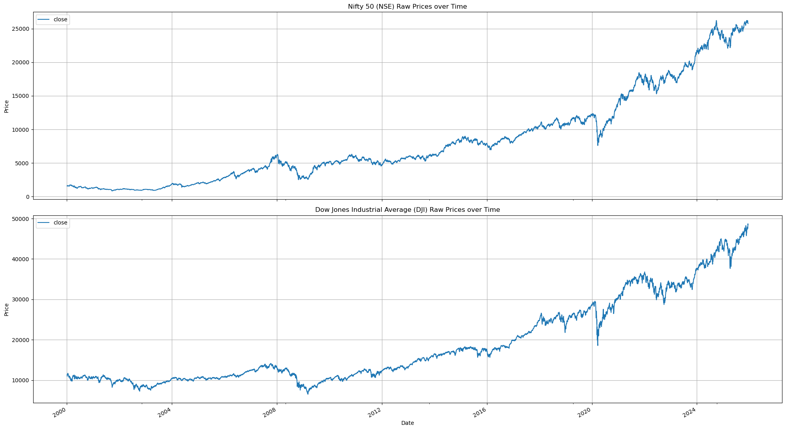

\FloatBarrier

Basic visual inspection shows changing trends over time ($\mu$ isn't constant) and different market regimes (periods of high $\sigma$ and low $\sigma$), suggesting assumption (3) is incorrect. We can also see large moves taking time to dissipate, suggesting assumption (2) is also incorrect (the fact that $\sigma$ is nonconstant also refutes (2)) and that we have serial dependence. We can test normality of $\ln(R_t)$ using histograms and QQ plots. Let's begin.

### Assumption 1: Log-returns Are Gaussian
Or, returns are log-normal. Using log-returns:
$$ \bar{R_t} = \ln(\frac{S_{t+1}}{S_t}) $$

We test with a histogram + Gaussian overlay, a QQ plot, sample skew/kurtosis, and a formal Jarque–Bera (JB) test. The JB metric describes devation from normality by comparing sample skew and kurtosis relative to what's expected from a standard normal distribution. High JB statistics (low p-values) implies non-normality. For reference:

\begin{align*}
  JB &= \frac{n}{6} \left( S^2 + \frac{1}{4} (K-3)^2 \right) \\
  S  &= \frac{\hat{\mu_3}}{\hat{\sigma_3}} = \frac{ \frac{1}{n} \sum \limits_{i=1}^{n} (x_i - \bar{x})^3 }{ \left( \frac{1}{n} \sum \limits_{i=1}^{n} (x_i - \bar{x})^2 \right) ^{3/2} } \\
  K  &= \frac{\hat{\mu_4}}{\hat{\sigma_4}} = \frac{ \frac{1}{n} \sum \limits_{i=1}^{n} (x_i - \bar{x})^4 }{ \left( \frac{1}{n} \sum \limits_{i=1}^{n} (x_i - \bar{x})^2 \right) ^{  2} }
\end{align*}

Where $S$ and $K$ are the sample skewness/kurtosis. We can wrap all of this into a neat function:

```python
def plot_log_returns(
        data: pd.Series,
        nbins: int,
        hist_ax: Axes,
        qq_ax: Axes
    ) -> tuple[Axes, Axes]:
    """
    Plots two diagnostics on log-differenced `data`: a histogram and QQ plot.
    Returns a tuple of populated `(hist_ax, qq_ax)`.
    """
    ln_prices = np.log(data)
    ln_return = ln_prices.diff().dropna()

    jb = jarque_bera(ln_return)[1]

    ln_skew = ln_return.skew()
    ln_kurt = ln_return.kurt()
    ln_return.hist(bins=nbins, ax=hist_ax, density=True)

    mu_hat = ln_return.mean()
    sigma_hat = ln_return.std(ddof=1)
    x_hat = np.linspace(ln_return.min(), ln_return.max(), 1000)
    gaussian = stats.norm.pdf(x_hat, mu_hat, sigma_hat)
    hist_ax.plot(x_hat, gaussian, linewidth=2)

    hist_ax.set_title(
        "Log returns with fitted Gaussian (skew: {:.2f}, kurtosis: {:.2f}, jb: "
        "{:.2f})"
        .format(ln_skew, ln_kurt, jb)
    )
    hist_ax.set_xlabel("Log-returns")
    hist_ax.set_ylabel("Density")

    qqplot(
        ln_return,
        dist  = stats.norm,
        loc   = mu_hat,
        scale = sigma_hat,
        ax    = qq_ax,
        line  = "45"
    )
    qq_ax.grid()
    qq_ax.set_title("Normal Q-Q plot of log-returns")
    return (hist_ax, qq_ax)
```

And inspect:

\Needspace{15\baselineskip}
```python
# NSE --------------------------------------------------------------------------
fig, (hist_ax, qq_ax) = plt.subplots(nrows=1, ncols=2, figsize=(20, 7))
plot_log_returns(nse["close"], nbins=100, hist_ax=hist_ax, qq_ax=qq_ax)
fig.tight_layout()
plt.suptitle("NSE")
plt.show()

# DJI --------------------------------------------------------------------------
fig, (hist_ax, qq_ax) = plt.subplots(nrows=1, ncols=2, figsize=(20, 7))
plot_log_returns(dji["close"], nbins=100, hist_ax=hist_ax, qq_ax=qq_ax)
fig.tight_layout()
plt.suptitle("DJI")
plt.show()
```

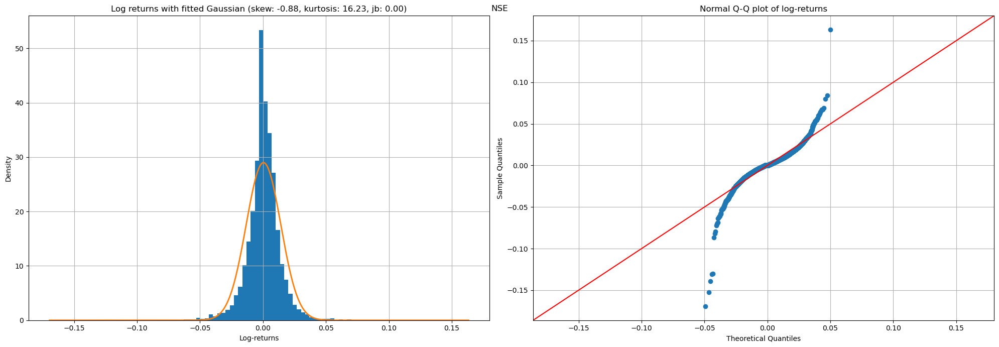


\FloatBarrier

Recall that excess kurtosis is given by $\kappa-3$. We have $\kappa_{\text{NSE}} = 16.23-3 = 13.23, \; \kappa_{\text{DJI}} = 12.94-3 = 9.94$ implying a leptokurtic (aka super-Gaussian) distribution of returns for both indices. This, and our QQ plots, _very emphatically_ refute assumption (1). Between indices, though most central mass is normally distributed, the NSE has slightly more extreme tail movements than the DJI does (perhaps most attributable to the relatively restricted nature of trading in India, and the fact that the DJI has existed for far longer than the NSE). The lower-tailed tendency is also represented by the NSE having slightly lower skew than the DJI. Finally, JB p-values are computationally $0$, strongly suggesting a deviation from normality. All of this **refutes assumption (1)**. Both indices display heavy-tailed behaviour, meaning some stochastic process that allows heavy tail behaviour is necessary for both indices almost equally.

### Assumption 2: Independent Increments
For tests of serial independence, we use very elementary ACF/PACF and Ljung–Box on both $\bar{R_t}$ and $\bar{R_t}^2$, across lags (in days) of 1, 7, 10, 14, 30, 90, and 125. $\bar{R_t}^2$ - squared log returns - helps uncover volatility clustering, because vol clustering suggests that big (small) moves are followed by more big (small) moves - magnitude matters, signs don't. Formally, the LB metric is:
$$ Q = n(n+2) \sum \limits_{k=1}^{h} \frac{\hat{\rho}^2_k}{n-k} $$

Where $n$ is the sample size, $\hat{\rho}_k$ is the sample autocorrelation at lag $k$, and $h$ is the number of lags being tested. Essentially, we divide the squared correlation at lag $k$ by the number of remaining timesteps to get a sense of, "how highly correlated are the remaining timesteps to lag $k$?" A high LB statistic (low p-value) suggests returns are serially dependent (they carry memory). Our function:

```python
def plot_returns_ar(
        data: pd.Series,
        maxlags: int,
        acf_ax: Axes,
        pacf_ax: Axes,
        vol_clustering: bool = False
    ) -> tuple[Axes, Axes]:
    """
    Plots the ACF and PACF of log-returned `data`, and displays results of a
    Ljung-Box test of autocorrelation on log-returned `data` for the following
    lags (days):
    [1, 7, 10, 14, 30, 90, 125]

    Returns a tuple of populated `(acf_ax, pacf_ax)`.
    """
    ln_prices = np.log(data)
    ln_return = ln_prices.diff().dropna()

    if vol_clustering:
        ln_return **= 2

    lb = acorr_ljungbox(ln_return, lags=[1, 7, 10, 14, 30, 90, 125])
    display(lb.round(6))

    plot_acf(ln_return, ax=acf_ax, lags=maxlags, zero=False, adjusted=True)
    acf_ax.grid()
    acf_ax.set_xlabel("Lags")
    acf_ax.set_ylabel("Correlation Coefficient")

    plot_pacf(ln_return, ax=pacf_ax, lags=maxlags, zero=False)
    pacf_ax.grid()
    pacf_ax.set_xlabel("Lags")
    pacf_ax.set_ylabel("Correlation Coefficient")

    return (acf_ax, pacf_ax)
```

And inspect:

```python
# NSE RAW RETURNS --------------------------------------------------------------
fig, (nse_acf, nse_pacf) = plt.subplots(
    nrows=1,
    ncols=2,
    figsize=(20, 6)
)

plot_returns_ar(
    nse["close"],
    maxlags        = 40,
    acf_ax         = nse_acf,
    pacf_ax        = nse_pacf,
    vol_clustering = False
)
nse_acf.set_title("NSE: Autocorrelation")
nse_pacf.set_title("NSE: Partial ACF")

fig.tight_layout()
plt.show()
```

| Lag     | 1        | 7        | 10        | 14        | 30         | 90        | 125        |
| ------- | -------- | -------- | --------- | --------- | ---------- | --------- | ---------- |
| LB_stat | 3.244454 | 26.99952 | 45.783354 | 69.395282 | 128.997956 | 210.96417 | 264.789617 |
| LB_p    | 0.071666 | 0.000333 | 0.000002  | 0         | 0          | 0         | 0          |

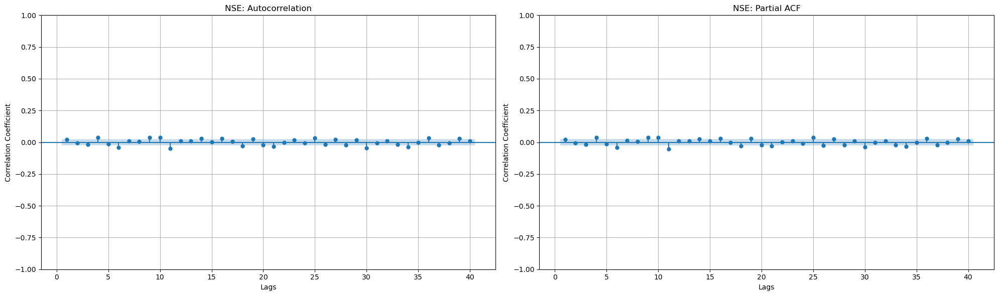

```python
# NSE SQUARED RETURNS ----------------------------------------------------------
fig, (nse_acf, nse_pacf) = plt.subplots(
    nrows=1,
    ncols=2,
    figsize=(20, 6)
)

plot_returns_ar(
    nse["close"],
    maxlags        = 40,
    acf_ax         = nse_acf,
    pacf_ax        = nse_pacf,
    vol_clustering = True
)
nse_acf.set_title("NSE: Autocorrelation (vol_clustering)")
nse_pacf.set_title("NSE: Partial ACF (vol_clustering)")

fig.tight_layout()
plt.show()
```

| Lag     | 1          | 7          | 10         | 14         | 30          | 90         | 125         |
| ------- | ---------- | ---------- | ---------- | ---------- | ----------- | ---------- | ----------- |
| LB_stat | 178.783678 | 742.702121 | 904.697816 | 1086.40378 | 1366.860647 | 1775.28143 | 1955.015655 |
| LP_p    | 0          | 0          | 0          | 0          | 0           | 0          | 0           |

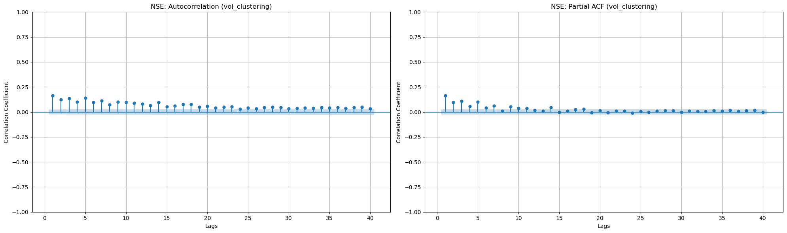

```python
# DJI RAW RETURNS --------------------------------------------------------------
fig, (dji_acf, dji_pacf) = plt.subplots(
    nrows=1,
    ncols=2,
    figsize=(20, 6)
)

plot_returns_ar(
    dji["close"],
    maxlags        = 40,
    acf_ax         = dji_acf,
    pacf_ax        = dji_pacf,
    vol_clustering = False
)
dji_acf.set_title("DJI: Autocorrelation")
dji_pacf.set_title("DJI: Partial ACF")

fig.tight_layout()
plt.show()
```

| Lag     | 1         | 7         | 10         | 14         | 30         | 90         | 125        |
| ------- | --------- | --------- | ---------- | ---------- | ---------- | ---------- | ---------- |
| LB_stat | 61.602198 | 91.768943 | 107.541028 | 119.320506 | 191.450367 | 293.208834 | 337.076735 |
| LP_p    | 0         | 0         | 0          | 0          | 0          | 0          | 0          |


```python
# DJI SQUARED RETURNS ----------------------------------------------------------
fig, (dji_acf, dji_pacf) = plt.subplots(
    nrows=1,
    ncols=2,
    figsize=(20, 6)
)

plot_returns_ar(
    dji["close"],
    maxlags        = 40,
    acf_ax         = dji_acf,
    pacf_ax        = dji_pacf,
    vol_clustering = True
)
dji_acf.set_title("DJI: Autocorrelation (vol_clustering)")
dji_pacf.set_title("DJI: Partial ACF (vol_clustering)")

fig.tight_layout()
plt.show()
```

| Lag     | 1          | 7           | 10          | 14          | 30         | 90           | 125          |
| ------- | ---------- | ----------- | ----------- | ----------- | ---------- | ------------ | ------------ |
| LB_stat | 647.035511 | 4904.573315 | 6220.081473 | 7301.958117 | 8994.15918 | 10023.624548 | 10153.213975 |
| LP_p    | 0          | 0           | 0           | 0           | 0          | 0            | 0            |

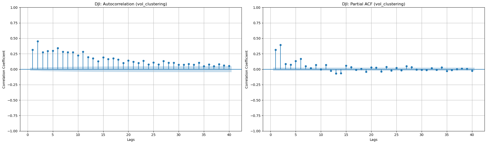

In the case of $\bar{R_t}$, raw log-returns' P/ACF plots show minimal - yet still significant - serial dependence. $\bar{R_t}^2$ shows _very_ strong serial dependence; behaviours consistent across both indices. Almost all LB p-values are computationally $0$, strongly suggesting AR processes in log-space, especially for log-returns. This cleanly matches our intuition, aligns with general market behaviour, and **refutes assumption (2)**.

Between indices, the DJI shows significantly stronger vol clustering than the NSE, but only up to the first 2 periods (AR(2)). The NSE clusters and decays slower over time, similar in nature to a mixed ARMA process. In raw terms, the DJI is negatively autocorrelated with itself at lag 1 versus the NSE, perhaps being more mean-reverting; the latter being a near-perfect RW. It's interesting to see that the NSE's current day is virtually independent from the prior one, but that memory creeps in the longer back we look - however, **this might be an artefact of our forward fill imputation** (see the [appendix](#nse-data-collection) for more clarification).

### Assumption 3: constant $\mu, \sigma$
This one's very straightforward: we just compute a rolling mean and standard deviation over a window of some size. We'll look at 30-day (1 month) windows. Our function:

```python
def plot_rolling_moments(
        data: pd.Series,
        window: int,
        mu_ax: Axes,
        sigma_ax: Axes
    ) -> tuple[Axes, Axes]:
    """
    Plots a windowed mean and standard deviation over log-differenced `data`.
    Window length is determined by `window`. Returns a tuple of populated
    `(mu_ax, sigma_ax)`.
    """
    ln_prices = np.log(data)
    ln_return = ln_prices.diff().dropna()
    rolling = ln_return.rolling(window, min_periods=2)

    rolling.mean().dropna().plot(ax=mu_ax, grid=True)
    mu_ax.set_xlabel("Date")
    mu_ax.set_ylabel("Mean")

    rolling.std().dropna().plot(ax=sigma_ax, grid=True)
    sigma_ax.set_xlabel("Date")
    sigma_ax.set_ylabel("Standard Deviation")
    return (mu_ax, sigma_ax)
```

And inspection:

```python
# NSE --------------------------------------------------------------------------
fig, (mu_ax, sigma_ax) = plt.subplots(nrows=1, ncols=2, figsize=(15, 7))

plot_rolling_moments(nse["close"], window=30, mu_ax=mu_ax, sigma_ax=sigma_ax)
mu_ax.set_title(r"NSE: Rolling 30-day $\mu$")
sigma_ax.set_title(r"NSE: Rolling 30-day $\sigma$")
fig.tight_layout()
plt.show()

# DJI --------------------------------------------------------------------------
fig, (mu_ax, sigma_ax) = plt.subplots(nrows=1, ncols=2, figsize=(15, 7))

plot_rolling_moments(dji["close"], window=30, mu_ax=mu_ax, sigma_ax=sigma_ax)
mu_ax.set_title(r"DJI: Rolling 30-day $\mu$")
sigma_ax.set_title(r"DJI: Rolling 30-day $\sigma$")
fig.tight_layout()
plt.show()
```

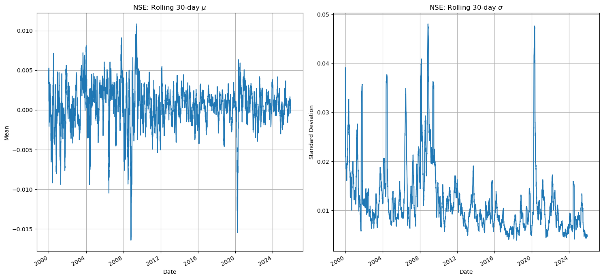


\FloatBarrier

Our diagnostics very cleanly match intuition: Rolling 30-day moments $\mu$ and $\sigma$ change over time; especially $\sigma$ which is potentially itself stochastic, motivating Heston- or SABR-type models. In fact, both moments change rapidly at different time scales (a 15-day window would be vastly different from a 30-day window, for example): a **refutation of assumption (3)**. Between indices, an interesting phenomenon is visible: the DJI's rolling monthly volatility has been relatively consistent over time, except for the two global crashes of 2008 and 2020. The NSE, on the other hand, was turbulent until 2008 after which rolling vol has remained relatively stable.

### In Conclusion
Neither index satisfies the key assumptions of GBM, both violating them to _nearly_ the same degree save for a few specific characteristics. GBM is thus perhaps a poor choice of model for these markets.

\newpage
# Question 2
Consider the following SDE:
$$ dx(t) = \left( \alpha x(t) - \beta x(t)^3 \right) dt + \sigma x(t) dW_t $$

Set deterministic drift parameters to $\alpha=2$ and $\beta=1$. $W_t$ is a standard Wiener process (Brownian motion).
1. Find and analyse the steady state solutions of the deterministic part of the equation (by setting $\sigma=0$ to 0 and treating it as an ordinary differential equation). Specifically, determine the stability of the steady state(s).
2. Simulate the SDE for $\sigma=1, \sigma=2$. Describe quantitatively (e.g., by analysing the average path behaviour) effect of increasing the volatility $\sigma$ on the outcomes of the simulations.
3. Compare the results from part (a) (deterministic steady states) with the long-term behaviour observed in the simulations from part (b) for both values of $\sigma$.
4. Using the Fokker-Planck equation, derive a stationary probability density function (PDF) for this SDE. Compare the properties of the stationary PDF (e.g., the mean and variance) with your deterministic result from part (a) and the observed behaviour from the simulations in part (b) for both values of $\sigma$.

## Answer
Before getting into specifics, let's rewrite our equation with the given parameters:
$$ dX_t = \left( 2 X_t - X_t^3 \right) dt + \sigma X_t dW_t $$

### 1. Linear Stability Analysis (LSA)
@Strogatz2024 introduces LSA in a very succinct manner, which we'll use here (for more information, see the [appendix](#linear-stability-analysis)). To gauge stability of a certain point, we only need look at the sign of the linearised function at that point. For example, if $x^*$ is our point of interest, we just need to look at $\text{sign} f'(x^*)$. Onto our analysis:

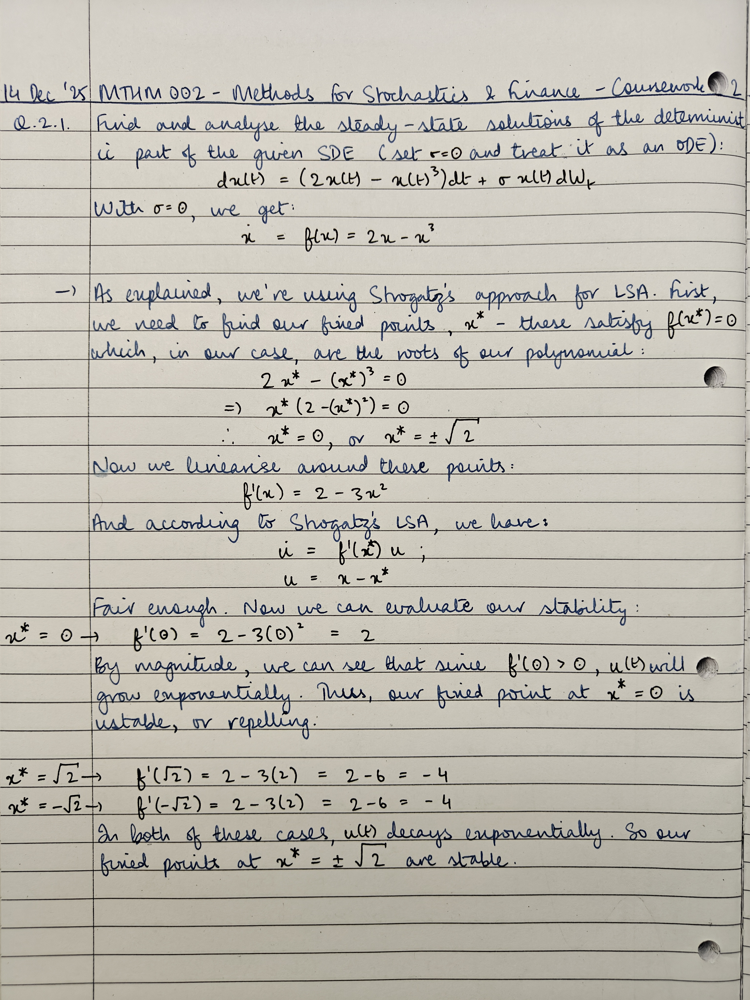

(For a LaTeX adaptation, please see the [appendix](#application-to-the-given-sde)).

By magnitude, we can see that when $x^*=0, f'(x^*)>0$ meaning our system exponentially grows (repels); but when $x^* = \pm \sqrt{2}, f(x^*) < 0$ meaning  our system exponentially decays (attracts). Ergo, trajectories move away from $x=0$ and toward $x=\pm \sqrt{2}$; and since we have positive and negative roots of $2$, it's probably a good guess that we have a system with two sinks at $\pm \sqrt{2}$ and one source at $0$.

### 2. Stochastic Simulation
With parameters $\alpha=2$ and $\beta=1$, our SDE is:
$$ dX_t = \left( 2 X_t - X_t^3 \right) dt + \sigma X_t dW_t $$

We consider $\sigma=1, \sigma=2$, and simulate with Euler-Maruyama whilst paying _very close attention_ to ensuring $N$ is large. This is because of our superlinear cubic drift term, which can cause extreme instability if we're not slow enough (for more information, see the [appendix](#numerical-stability-and-tamed-milstein)). Thus, our function suite:

- Simulate our SDE with Euler-Maruyama:

```python
def simulate_sde(N: int, init_value: float, sigma: float) -> np.ndarray:
    """
    Simulates the following SDE:
    $$ dX_t = \left( 2 X_t - X_t^3 \right) dt + \sigma X_t dW_t $$

    Note that if `N` isn't of magnitude 4 or higher (i.e. if $N < 10^4$) and
    `init_value` is also large (e.g 100+), there is a high likelihood of this
    simulation exploding. Tamed Milstein is not implemented, only E-M is; as
    such, large $N$ are stable.
    """
    dt = 1/(N-1)
    dW = rng.normal(loc=0.0, scale=np.sqrt(dt), size=N-1)
    results = np.empty(N)
    results[0] = init_value

    for t in range(1, N):
        determined = (2*results[t-1] - (results[t-1]**3))*dt
        stochastic = sigma*results[t-1]*dW[t-1]
        results[t] = results[t-1] + determined + stochastic

    return results
```

- Plot a histogram of the last `N-burn_in` averaged values per-path:

\Needspace{31\baselineskip}
```python
def plot_histogram(
        sim_set: np.ndarray,
        burn_in: int,
        init_value: float,
        histogram_data: np.ndarray,
        ax: Axes
    ) -> Axes:
    """
    Plots a histogram with `histogram_data`. Reports mean and variance for the
    bunch of simulations in `sim_set`, after discarding the first `burn_in` vals
    (assumes `histogram_data` has already been burned in with the same `burn_in`
    value as used here).
    """
    burned_set = sim_set[:, burn_in:]

    ax.hist(histogram_data, bins=30, density=True)
    ax.axvline(x=+np.sqrt(2), ls="--", alpha=0.5, c="red")
    ax.axvline(x=0, alpha=0.5, c="grey")
    ax.axvline(x=-np.sqrt(2), ls="--", alpha=0.5, c="red")
    ax.set_xlabel("Level")
    ax.set_ylabel("Proba Density")
    ax.set_title(
        r"$I_0={:.2f}, \mu={:.2f},$ Var={:.2f}"
        .format(i_0, burned_set.mean(), burned_set.var())
    )
    ax.set_xlim(-2.5, 2.5)
    ax.grid()

    return ax
```

- Lastly, large-scale simulation:

```python
def generate_ensemble(
        n_sims: int,
        N: int,
        init_value: float,
        sigma: float,
        burn_in: int,
    ) -> np.ndarray:
    """
    Generates `n_sims` ensembles of the following SDE:
    $$ dX_t = \left( 2 X_t - X_t^3 \right) dt + \sigma X_t dW_t $$

    Computes the average path over time, and a histogram from `burn_in`: time to
    max time $\tau$. Returns (`sims, avg_path, histogram`).
    """
    sims = [
        simulate_sde(N=N, init_value=init_value, sigma=sigma)
        for _ in range(n_sims)
    ]

    sims = np.array(sims)

    # `avg_path` is a column-wise average, i.e. we get 1 value for each time t
    avg_path = sims.mean(axis=0)  # col-wise average, i.e. avg value at each t

    # `histogram` is a row-wise average, i.e. we get 1 value for each path
    # `burn_in` ensures we take the row-wise avg once paths are spatially stable
    histogram = sims[:, burn_in:].mean(axis=1)

    return sims, avg_path, histogram
```

Now we simulate over different initial values $I_0 \in \{3, \sqrt{2}, 0.1, 0, -0.1, -\sqrt{2}, -3\}$, each with $\sigma \in \{1, 2\}$:

```python
# colour range: [darkest->ligher->light->lightest<-light<-lighter<-darkest]
cmap = plt.get_cmap("Blues")
shades_tmp = cmap(np.linspace(0.9, 0.4, 4))
colours = np.vstack([shades_tmp, shades_tmp[-2::-1]])

n_sims = 500
N_steps = 15_000
burn_in = 5_000
init_vals = [3, np.sqrt(2), 0.1, 0, -0.1, -np.sqrt(2), -3]

fig = plt.figure(figsize=(25, 10))
gs = GridSpec(nrows=2, ncols=7, hspace=0.2, wspace=0.2, height_ratios=[2, 1])
ax_ts = fig.add_subplot(gs[0, :])
ax_ts.axhline(y=0, c="grey")
hist_axes = [fig.add_subplot(gs[1, i]) for i in range(7)]

for sigma in [1, 2]:
    for i, (i_0, c) in enumerate(zip(init_vals, colours)):
        sims, avg_path, histogram = generate_ensemble(
            n_sims     = n_sims,
            N          = N_steps,
            burn_in    = burn_in,
            init_value = i_0,
            sigma      = sigma,
        )

        ax_ts.plot(avg_path, label=r"$I_0={:.2f}$".format(i_0), lw=2, color=c)

        plot_histogram(
            sim_set        = sims,
            burn_in        = burn_in,
            init_value     = i_0,
            histogram_data = histogram,
            ax             = hist_axes[i]
        )

    ax_ts.axhline(y=+np.sqrt(2), ls="--", c="red")
    ax_ts.axhline(y=-np.sqrt(2), ls="--", c="red")
    ax_ts.set_title(
        r"Average path behaviour ($N={}, \sigma={}$)"
        .format(N_steps, sigma)
    )
    ax_ts.set_xlabel("Timesteps")
    ax_ts.set_ylabel("Level")
    ax_ts.legend()
    ax_ts.grid()

    plt.show()
```

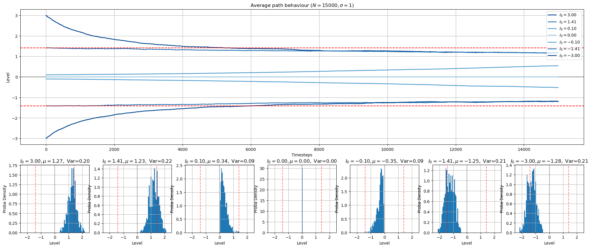

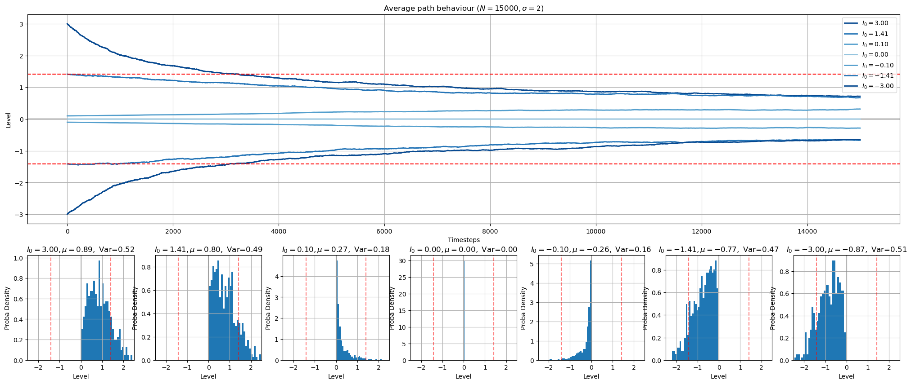

\FloatBarrier

Our plots are quite informative:
1. An increase in $\sigma$ significantly increases path $\text{Var}$ and $\mu$ (as expected), but also pushes our paths away from metastable points $\pm \sqrt{2}$ and towards the instability, $0$, for some reason.
2. $I_0 > 0 \implies$ spread out towards $+\sqrt{2}$; $I_0 < 0 \implies$ we move towards $-\sqrt{2}$. Initial values above/below $\pm \sqrt{2}$ asymptotically move towards a region around the respectively-signed stable point. The further away from a stable point we are, the quicker we drop towards it.
3. In neither case is $\sigma$ able to counteract the effect of deterministic drift, because $\mu dt >> \sigma$. In both $\sigma$ cases we get kicked around stabilities, but still experience deterministic decay towards $\pm \sqrt{2}$. In fact, extremely high $\sigma$ could cause a jump across $0$ from $+\sqrt{2} \to -\sqrt{2}$.
4. At small $I_0$ and high $\sigma$, stochastic noise damps deterministic behaviour but doesn't suppress it (drift scales like $x^3$ but noise is linear) - we can see this in the slower movement from $I_0=\pm 0.1 \to \pm \sqrt{2}$ when $\sigma=2$ versus when $\sigma=1$.
5. An 2x increase in $\sigma$ results in an approximately 2x increase in $\text{Var}$, and a heavy shift in distributions closer toward, but not exactly to, $0$. Interestingly enough, it looks like there's actually some kind of stability/attractor at $y=0.5$ that's apparent in the ensemble mean.

### 3. What can we infer from §1, §2?
Looking purely at average ensemble behaviour, from §1 where we analysed linear stability of the deterministic part of our SDE, we concluded - by magnitude - that there are two sinks (stable points), one each at $\pm \sqrt{2}$, and one source (unstable point) at $0$. In other words, trajectories should settle asymptotically at or around $\pm \sqrt{2}$, and move away from $0$. From §2, we can see behaviour isn't exactly like this: even though there is deterministic decay in all simulated paths towards to $\pm \sqrt{2}$ (initial values close to $\pm 0$ slowly decay towards $\pm \sqrt{2}$), no path actually sticks there. As mentioned, there seems to be some attractor at $y=0.5$. We can see this in how all paths cross the red $\sqrt{2}$ lines but appear to flatten out asymptotically close to $\pm 0.5$ - especially so with initial values exactly at $\pm \sqrt{2}$. Interestingly enough, an initial value of $0$ stays at $0$ despite the size of $\sigma$ - the multiplicative nature of the SDE suggest so, since $X_t=0$ collapses everything. Probably at high enough $\sigma$, stochastic forcing might be so strong as to kick the system across $0$ from one stability to the other (i.e., ping-pong between $\pm \sqrt{2}$).

So from §1 and §2, we can infer that in contrast to the purely deterministic system wherein trajectories converge to fixed-point equilibria, the stochastic system exhibits metastable behaviour! In the stochastic system, the deterministic steady states at $\pm \sqrt{2}$ are no longer absorbing - they act as centres of metastability around which the process fluctuates. The magnitude of fluctuations increases with $\sigma$, with $0$ becoming increasingly visited. In other words, increasing $\sigma$ doesn't change the location of the deterministic steady states, it just weakens their effective stability by broadening the stationary distribution and slowing convergence in the long run.

### 4. Fokker-Planck
For a very simple, direct and intuitive derivation of the Fokker-Planck (F-P) equation (and related theory of semi-group and infinitesimal generators), @Quantpie2019 is highly recommended, with @DWalter2021 as a supplement. We have the general Fokker-Planck:
$$ \frac{\partial p(x, t)}{\partial t} + \frac{\partial}{\partial x} (\mu(x, t) p(x, t)) - \frac{1}{2} \frac{\partial^2}{\partial x^2} (\sigma^2(x, t) p(x, t)) = 0 $$

Which describes how our SDE's PDF evolves over time. Note that using F-P to solve an SDE is identical in spirit to inspecting a Markov transition matrix's eigenvalues for the steady-state distribution, as compared to repeatedly applying the transition matrix to some initial state/integrating the SDE numerically. So for our SDE with the appropriate $\mu, \sigma$:

\begin{gather*}
    dX_t = \left( 2 X_t - X_t^3 \right) dt + \sigma X_t dW_t \\
    \therefore
      \frac{\partial p(x, t)}{\partial t}
    + \frac{\partial}{\partial x} \left( \left( 2X_t - X_t^3 \right) p(x, t) \right)
    - \frac{1}{2} \frac{\partial^2}{\partial x^2} (\sigma^2 X_t p(x, t))
    = 0
\end{gather*}

Right off the bat, we can draw some qualitative inferences:
1. Our SDE's PDF has a negative drift evolution, echoing our deterministic findings in that over time, we have decay towards stable points $\pm \sqrt{2}$ and away from $x=0$, _IFF_ we don't start at $x=0$.
2. The PDF has a positive diffusion term that's $0$ at $x=0$ (actually, everything is $0$ at $x=0$). This is why with $I_0=0$, we never move off that line: there is no forcing to displace us.
3. From (1) and (2) we can see why $0$ is special, and why even the smallest perturbation off $y=0$ draws us towards $\pm \sqrt{2}$ - this is the intention behind $\pm \sqrt{2}$ being stable points, whilst $0$ is repelling! This is very cool.
4. We can also see that unless $x=0$ our diffusion isn't $0$, which is also why once we reach _close_ to $\pm \sqrt{2}$, the ensemble(s) only hover around it: diffusion is non-zero there, so $\pm \sqrt{2}$ is no longer a stable point but a metastable _region_.
5. In the F-P equation, $\sigma$ scales like $x^2$, so for larger $\sigma$ we get much larger stochastic forcing, until some process reaches $x=0$ wherein everything collapses. Ergo, at larger $\sigma$ we should see more realisations of the process tend to $0$ - which is, in fact, what we do see!

Let's derive our stationary PDF:

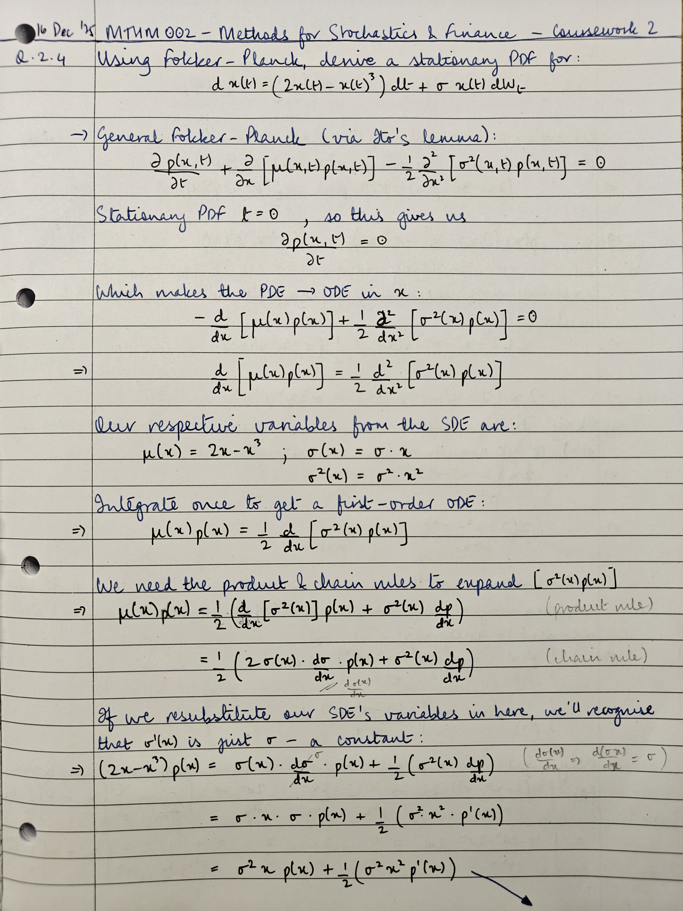

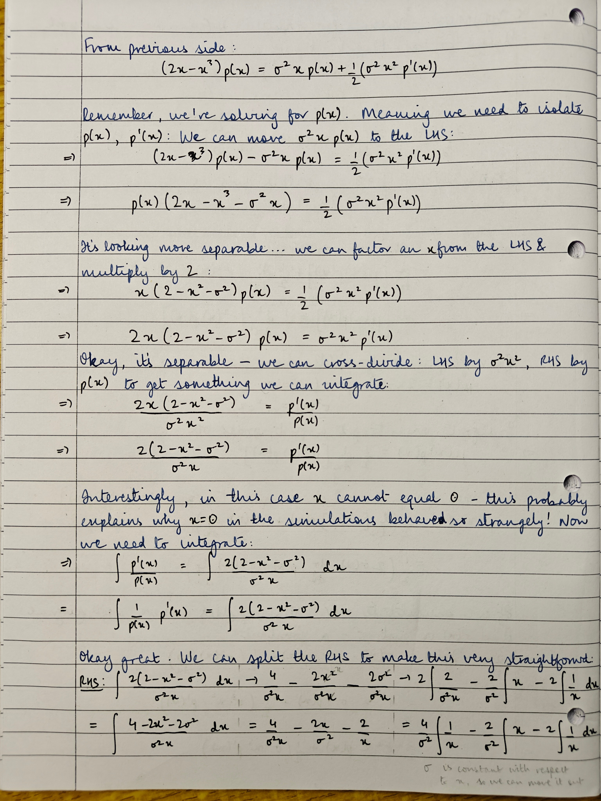

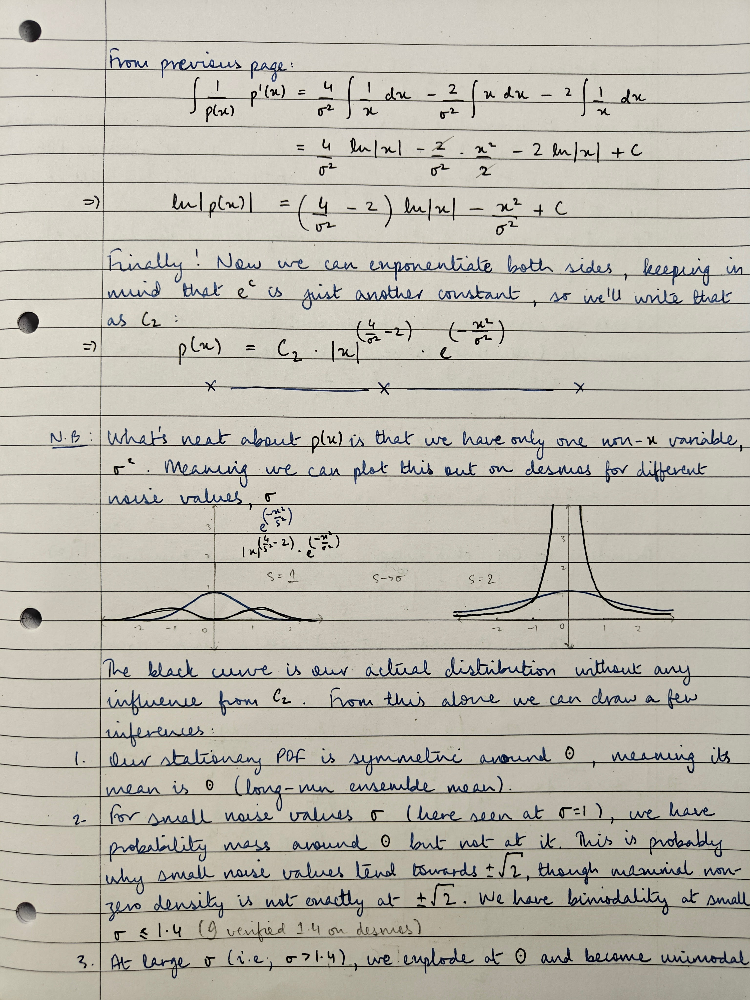

(For a LaTeX adaptation, please see the [appendix](#fokker-planck-for-q2---stationary-distribution)).

From our derivation above, we get that our stationary PDF $p(x)$ is:
$$ p(x) = C_2 \cdot |x|^{\frac{4}{\sigma^2} -2} \cdot e^{- \frac{x^2}{\sigma^2}} $$

As mentioned, we can plot this on Desmos by setting up:
- A variable $s = \sigma$, with a slider from $0 \le s \le 3$ in steps of $0.10$;
- A red curve for $e^{-\frac{x^2}{\sigma^2}}$;
- A purple curve for the entire PDF _without_ C_2: $|x|^{\frac{4}{\sigma^2} -2} \cdot e^{- \frac{x^2}{\sigma^2}}$

Animating that setup along $s$ helps us infer the following:
1. Between $0.03 \le \sigma \le 1.4$ there's bimodality.
2. As $\sigma$ moves across its range, the bimodal peaks squeeze closer and closer around $0$. There is no proper, stationary peak at exactly $x = \pm \sqrt{2}$, the peaks move along $x$ with $\sigma$.
3. At $\sigma=1.4$, the purple curve for the PDF merges with the red curve, moving us from bimodality to unimodality around $x=0$.
4. As $\sigma$ slowly $\uparrow 1.4$, A tiny, tight peak forms at $x=0$ from the zenith of the unimodal hump, similar in style to a Pickelhaube, growing in size with $\sigma$.
5. Once $\sigma > 1.4$, our unimodal peak explodes.
6. Beyond $1.4$, increasing $\sigma$ simply increases the width of the unimodal asymptote (and the red curve).

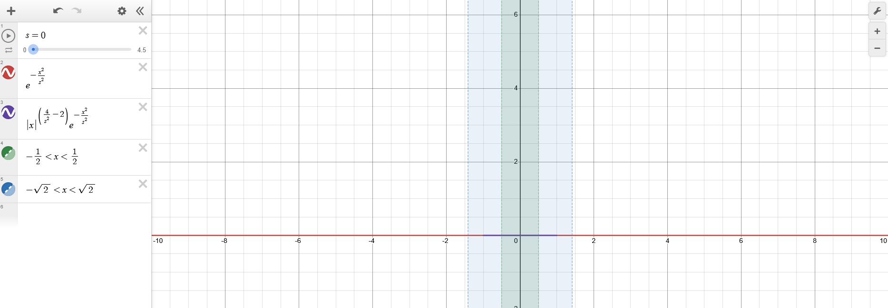

\FloatBarrier

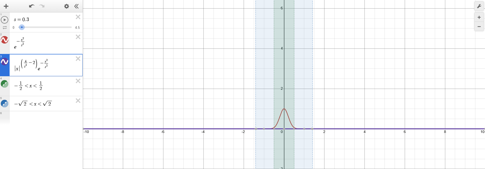

\FloatBarrier

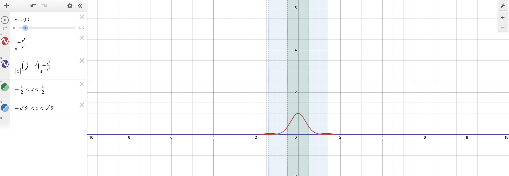

\FloatBarrier

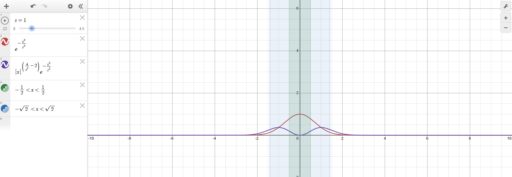

\FloatBarrier

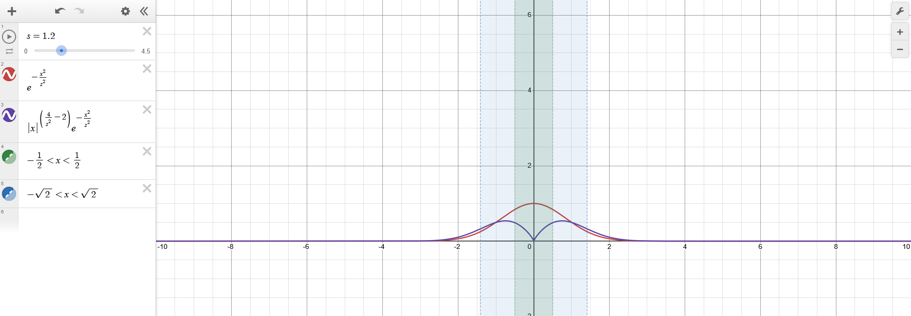

\FloatBarrier

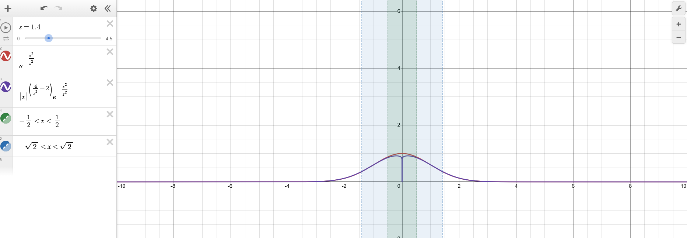

\FloatBarrier

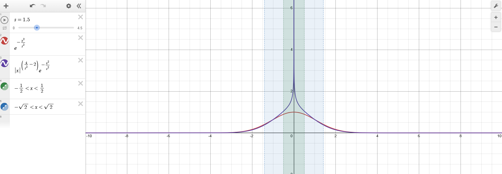

\FloatBarrier

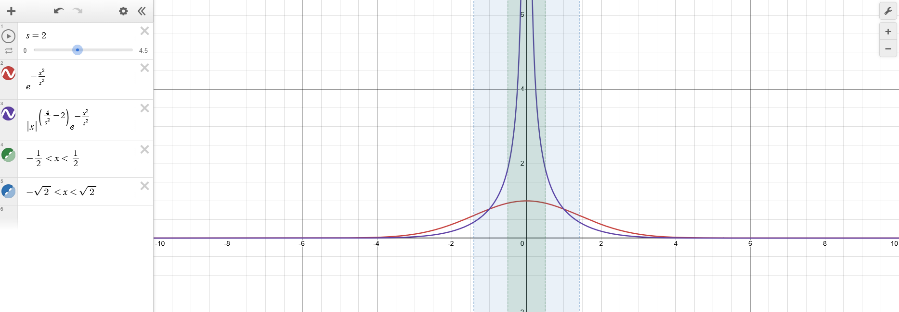

\FloatBarrier

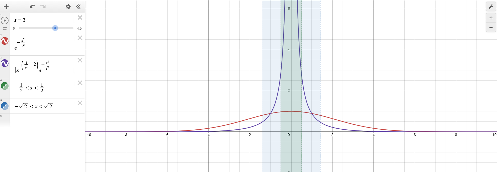

Now, we have that $\mathbb{E}[X^2] = 0$ for our $p(x)$ due to symmetry. We can use this to compute the variance (with help from GPT, @chatgpt-20251217):

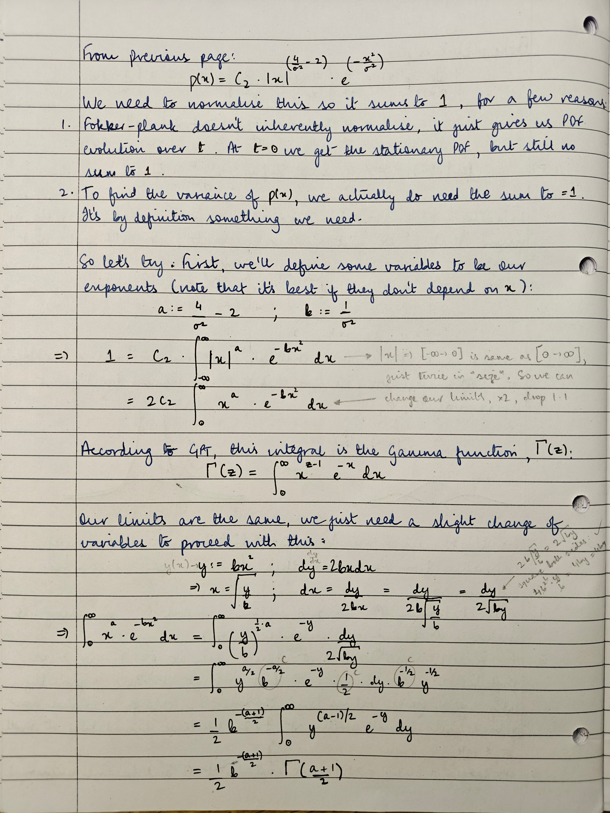

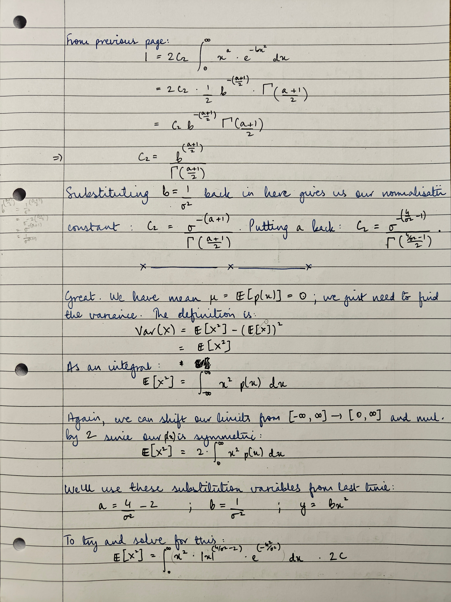

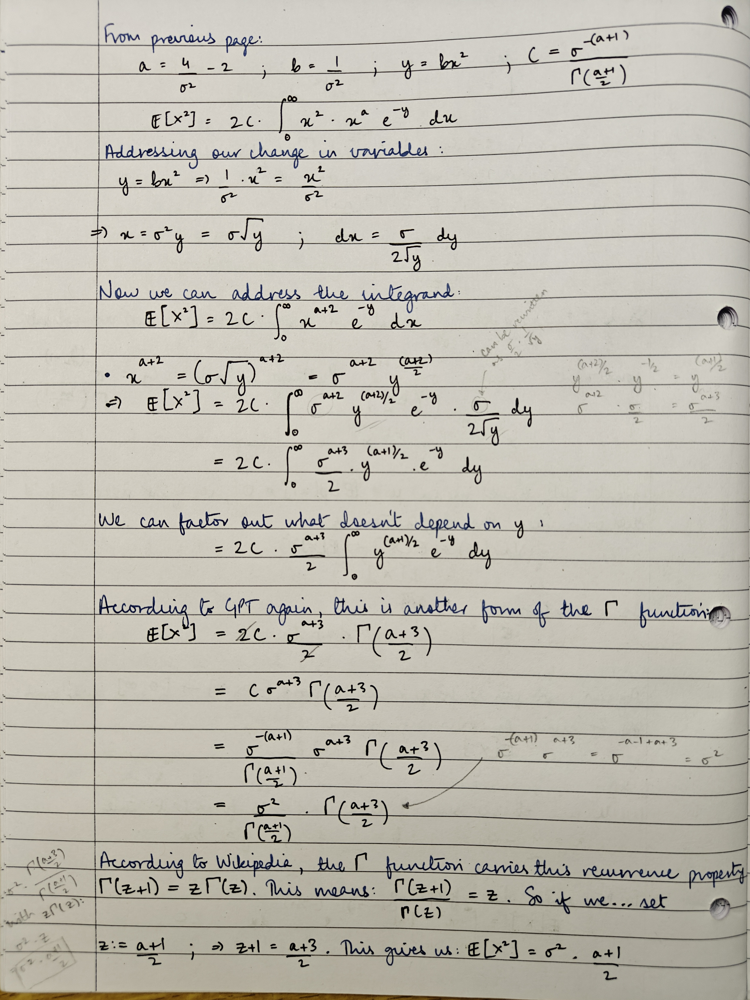

(For a LaTeX adaptation, please see the [appendix](#fokker-planck-for-q2---variance)).

After that (very involved) derivation, we can finish off by substituting $a$ back:

\begin{align*}
    a = \frac{4}{\sigma^2}-2 \implies a+1 = \frac{4}{\sigma^2}-1
    \\
    \boxed{ \therefore \mathbb{E}[X^2] = \sigma^2 \cdot \frac{\frac{4}{\sigma^2}-1}{2} = \frac{4 - \sigma^2}{2} }
\end{align*}

It's important to note that $\sigma^2$ _must be_ $< 4$ for our moments to be finite. So how does this relate to our findings from earlier? Well for starters, the stabilities at $\pm \sqrt{2}$ are actually transient, as our simulations showed! When $\sigma^2<4$ the stationary distribution is bimodal (we've seen this both analytically & visually). As $\sigma^2$ approaches 4 from below (i.e. $\sigma \to 2^-$), stationary variance decreases monotonically and probability mass increasingly concentrates at the origin ($x=0$). This supports our earlier observation that at $x=0$, stochastic forcings vanish since our SDE's diffusion $\propto X_t$. Interestingly enough, it also refutes our earlier intuition that increasing noise necessarily increases variance - an intuition that might be true over short time scales, but apparently not in the stationary regime.

Increasing $\sigma$ strengthens the multiplicative noise away from the origin (remember that $\sigma X_t$ is multiplicative noise in the SDE), but this increased noise drives trajectories toward $x=0$ where diffusion collapses. If the process reaches exactly $x=0$, both drift and diffusion vanish and the path sticks there indefinitely. This explains why we saw probability mass accumulate near $x=0$ in the histograms earlier, as $\sigma$ increased.

This derivation also refutes an earlier intuition that trajectories could jump between the two potential wells at $\pm\sqrt{2}$ at high enough $\sigma$. If we look really closely, we'd notice that such jumps cannot occur discontinuously since solutions of the SDE are continuous in time - paths can only change sign if they cross the origin. Moreover, as trajectories approach the origin, the noise amplitude decreases, making further motion away from it increasingly unlikely and rendering crossings progressively rarer. So jumps _could_ happen, but they'd just be discretised/numerical artefacts.

All of this lends credence to a rather nuanced point about SDEs: they might have deterministic portions that carry their own sinks/sources/peculiar behaviour, but an SDE is anything but some deterministic differential equation with jitter. Noise in an SDE actually fundamentally alters and influences a DE's dynamics.

\newpage
# Appendix
## NSE Data Collection
NSEI data was fetched this way:

```python
# pip install yahooquery==2.4.1
from yahooquery import Ticker
import pandas as pd

nse = Ticker("^NSEI")

df = nse.history(period="1d", start="2000-01-03", end="2025-12-12")

df_save = (
    df
    .reset_index()
    .loc[:, ["date", "close"]]
    .rename(columns={"date": "Date", "close": "Close"})
)

df_save.round(1).to_csv("nse_d.csv", index=False)
```

Row counts, however, didn't match:

```bash
$> grep -c ^ dji_d.csv
6528
$> grep -c ^ nse_d.csv
6408
```

Since US, Indian, and in general global trading days  differ due to local occurrences. Inspecting the missing dates shows its distribution:

```python
dji.index[~dji.index.isin(nse.index)]
# DatetimeIndex(['2000-01-26', '2000-03-17', '2000-03-20', '2000-04-14',
#                '2000-05-01', '2000-08-15', '2000-09-01', '2000-10-02',
#                '2001-01-26', '2001-03-06',
#                ...
#                '2025-03-31', '2025-04-10', '2025-04-14', '2025-05-01',
#                '2025-08-15', '2025-08-27', '2025-10-02', '2025-10-22',
#                '2025-11-05', '2025-12-12'])
```

This was corrected like so, _before_ loading the data used in this submission:

```python
nse = pd.read_csv(
    "./data/nse_d.csv",
    names      = ["date", "close"],
    header     = 0,
    parse_dates= [0],
    index_col  = [0]
)

nse.index = pd.to_datetime(nse.index).normalize()

dji = pd.read_csv(
    "./data/dji_d.csv",
    names      = ["date", "close"],
    header     = 0,
    parse_dates= [0],
    index_col  = [0]
)

dji.index = pd.to_datetime(dji.index, dayfirst=True).normalize()

merged = (
    dji
    .merge(
        right       = nse,
        left_index  = True,
        right_index = True,
        how         = "left",
        suffixes    = ("_dji", "_nse"),
    )
    .ffill()
)

dji = merged.loc[:, ["close_dji"]].reset_index()
dji.to_csv("./data/dji_d.csv", index=False)

nse = merged.loc[:, ["close_nse"]].reset_index()
nse.to_csv("./data/nse_d.csv", index=False)
```

Note that forward-filling (last traded price/last observed price) is the financial standard for imputation.

## Random Walks
Fundamentally, a Random Walk (RW) is a statistical process where each next step in time has an equal, 50-50 chance of moving up (+1) or down (-1) from the current level. In other words, each increment $x_{t+1}-x_t$ takes values $\pm 1$ with equal probability:
$$ \text{RW} = \{+1, -1\} : P(\text{RW}=1) = P(\text{RW}=-1) = \frac{1}{2} $$

This immediately brings with it a couple of properties:
1. The mean, $\mu$, of each increment is 0:
   $$ \mu = \frac{1-1}{2} = \frac{0}{2} = 0 $$
2. The variance, $\text{Var}(\text{RW})$, is 1:

   \begin{align*}
   \text{Var}({\text{RW}}) &= \frac{1}{2} \sum_{i=1}^2 (x_i - \mu)^2 \\
   &= \frac{1}{2} \left( (1-0)^2 + (-1-0)^2 \right) \\
   &= \frac{1}{2} \left( 1+1 \right) \\
   &= \frac{2}{2} \\
   &= 1
   \end{align*}

Observably, if the variance of each _step_ in an entire _walk_ is $1$ then over $10$ steps in a walk, our variance would be $10 \cdot 1 = $100$; with $100$ steps, our variance is $100 \cdot 1 = 100$; likewise for $1,000, \dots, N$ steps. The variance of a RW scales with the number of steps taken, or $\text{Var} \propto N$. So since $\text{Var} \propto N$, and standard deviation $\sigma = \sqrt{\text{Var}}$, it follows that $\sigma \propto \sqrt{N}$.

Now, coming at it from another angle, say we're comparing different sets of quantities with different natural magnitudes like airline speeds across the Atlantic (order $10^3$), and blood-potassium concentrations (order $10^{-3}$), over time (equivalent economic comparisons are currencies, companies' stock prices, GDP flow, etc.). Naturally, raw airline speeds will always dominate blood-potassium concentrations because of scale - so statistically, we z-standardise:

$$ z_X = \frac{X-\mu_X}{\sigma_X} $$

Likewise, if we model different sets of quantities with their own RWs, we run into scale problems if we don't z-standardise - but with RWs we're lucky, because $\mu_{\text{RW}}=0$. So in general, if we let $N \to \infty$ (i.e., we look at a very large number of steps) but scale an entire walk by $\frac{1}{\sqrt{N}}$, then via the CLT we find that the sums of long-run increments converge to a Gaussian:

\Needspace{23\baselineskip}
```python
N_steps = 10_000
N_simulations = 1000
scale = 1/np.sqrt(N_steps)
all_walks = np.empty(N_simulations)

for sim in range(N_simulations):
    # Generate all steps for a walk at once (+1 or -1). Note that this is not the
    # walk itself, but its increments - i.e., its change over time. To see a walk
    # take a cumulative sum (i.e., `plt.plot(np.cumsum(steps))`). We're looking
    # at the final `np.sum()` instead of `np.cumsum()` because we're only
    # interested in our endpoint, not the path.
    steps = rng.choice([-1.0, 1.0], size=N_steps)
    walk = np.sum(steps * scale)
    all_walks[sim] = walk

plt.hist(all_walks, bins=100, density=True, alpha=0.7)
plt.title(f"Distribution of steps in a walk ({N_steps} steps, {N_simulations} simulations)")
plt.xlabel("Direction of walk")
plt.ylabel("Density")
plt.grid(True, alpha=0.3)
plt.show()
```

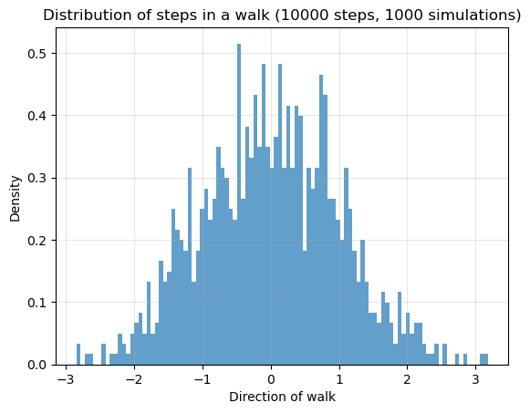

To let $N \to \infty$ in a RW means we're effectively taking $N$ infinitesimally small steps from time $t \to t+1$. Enter the Wiener process, $W_t$, which is exactly this _scaled_ limit of a RW.

## Wiener Processes
A Wiener process, $W_t$, is the limit of a z-standardised Random Walk (RW), the limit being letting the number of steps $N$ in the RW tend to $\infty$. As explained in [Random Walks](#random-walks) modelling different processes with RWs can run us into issues if each process has a different inherent scale (e.g. airline speeds vs. blood-potassium levels). Statistically, we z-score to mitigate the effects of scale. If we take an infinite number of steps in a (scaled) RW, the distribution of increments tends to a Gaussian (via the CLT).

So what does $W_t$ do? It effectively gives us a way of handling infinite(simally small) random increments within a process, which is _fantastic_ because now we can use calculus! $dt$, as a _deterministic_ infinitesimal increment, now has a stochastic equivalent: an increment from the Wiener process, $dW_t$, with mean $\mu=0$ and variance $\text{Var}(dW_t) = dt$ (recall that RW variances scale with the number of steps. $dt$ being infinite(simal) means we have infinite steps, since $N \to \infty$). $dW_t$ is, for all intents and purposes, as infinitely long Random Walk from one time step to the next. $W_t$ is thus continuous, and is characterised by its increments being normally i.i.d over time:

\begin{align*}
    W_{t+\Delta t} &\sim N(0, \Delta t)\\
    dW_t &\sim N(0, \sqrt{dt})
\end{align*}

And given that each step is independent of the previous step, it's evident that RWs and Wiener processes obey the Markov property. An extension to 2D, 3D, ND follows quite naturally: each dimension gets its own independent Gaussian (represented as a multivariate Gaussian), and sometimes a covariance matrix is included to capture dependencies (e.g., two stocks in the same industry) between processes. In these cases, the Markov property isn't violated because the dependence is purely cross-sectional: _increments_ are still i.i.d, there's just co-movement because correlation implies shared contemporaneous shocks.

Notably, processes whose increments are random and independently distributed are known as Levy processes. Examples that use distributions other than a Gaussian are Poisson point processes and Gamma processes (which, naturally, have increments that are Poisson-distributed and Gamma-distributed respectively).

## Brownian Motion
With a continuous Wiener process $W_t$, which is the limit at infinite steps of a z-standardised Random Walk, we can now handle physical problems. Brownian motion - described with $W_t$ - is some process that is characterised by pure randomness over time:
$$ dB_t = \sigma dW_t $$

Where $\sigma$ scales the $W_t$ increment. For traditional Brownian motion, $\sigma=1$. Clearly, Brownian motion as a process can thus move aimlessly in space; with a dependence on time $t$, we get a path over $t$ since time measures are monotonic (i.e., $t+1 > t$). A variation of this introduces deterministic direction via an affine shift:
$$ dB_t = \mu dt + \sigma dW_t $$

Where $\mu$ is colloquially termed a "drift" or "trend". Traditional Brownian motion is thus the case when $\mu=0$. To see the effects of $\mu$ as a drift/trend, let's assume:
- $\sigma=1$.
- We're looking at daily stock prices sampled daily, so $dt=1$ (for context, daily prices sampled hourly $\implies dt=\frac{1}{24}$; or monthly prices sampled weekly $\implies dt=\frac{1}{4}$).
- Our price starts at an initial level of $I_0=5$.
- We're interested in the next 20 days' prices.

Comparing $\mu=0$ and $\mu=1$ with the following Euler-Maruyama implementation:

```python
def plot_brownian_motion(
        N: int,
        p_t: float,
        mu: float,
        sigma: float,
        dt: float,
        ax: Axes
    ) -> Axes:
    """
    Plots a simple Euler-Maruyama implementation of B-M. Returns a populated
    `matplotlib.axes.Axes` object.
    """
    result = np.empty((N,))

    for i in range(N):
        dW_t = rng.normal(loc=0.0, scale=np.sqrt(dt))
        dS_t = mu*dt + sigma*dW_t
        p_t += dS_t
        result[i] = p_t

    ax.plot(result)
    ax.set_title(r"Brownian Motion with $\mu={}, \sigma={}$".format(mu, sigma))
    ax.set_xlabel("Timestep")
    ax.set_ylabel("Price")
    ax.grid()
    return ax
```

And simulating shows us:

```python
fig, (mu0_ax, mu1_ax) = plt.subplots(nrows=1, ncols=2, figsize=(20, 7))

mu1_ax = plot_brownian_motion(
    N     = 20 ,
    p_t   = 5.0,
    mu    = 1.0,
    sigma = 1.0,
    dt    = 1.0,
    ax    = mu1_ax
)

mu0_ax = plot_brownian_motion(
    N     = 20 ,
    p_t   = 5.0,
    mu    = 0.0,
    sigma = 1.0,
    dt    = 1.0,
    ax    = mu0_ax
)

fig.tight_layout()
plt.show()
```

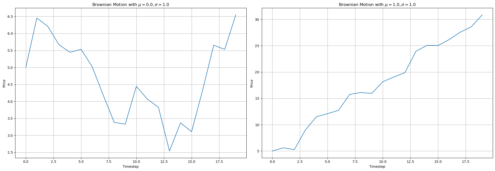

## Geometric Brownian Motion
_Geometric_ Brownian Motion adds an additional important feature of self-relativity:
$$ dS_t = \mu S_t dt + \sigma S_t dW_t $$

Consequently, from elementary calculus we can intuit that GBM's solution is exponential, that it asserts only positive values; and because of self-relativity, per-step increments are scaled by the current level of the process. This is best explained with an example, so making a small change to the function from last time:

```python
def plot_geobrownian_motion(
        N: int,
        p_t: float,
        mu: float,
        sigma: float,
        dt: float,
        ax: Axes
    ) -> Axes:
    """
    Plots a simple Euler-Maruyama implementation of GBM. Returns a populated
    `matplotlib.axes.Axes` object.
    """
    result = np.empty((N,))

    for i in range(1, N+1):
        dW_t = rng.normal(loc=0.0, scale=np.sqrt(dt))
        dS_t = mu*result[i-1]*dt + sigma*result[i-1]*dW_t
        p_t += dS_t
        result[i-1] = p_t

    ax.plot(result)
    ax.set_title(r"GBM with $\mu={}, \sigma={}$".format(mu, sigma))
    ax.set_xlabel("Timestep")
    ax.set_ylabel("Price")
    ax.grid()
    return ax
```

And comparing $\mu=\{0,1\}$:

```python
fig, (mu0_ax, mu1_ax) = plt.subplots(nrows=1, ncols=2, figsize=(20, 7))

mu1_ax = plot_geobrownian_motion(
    N     = 20 ,
    p_t   = 5.0,
    mu    = 1.0,
    sigma = 1.0,
    dt    = 1.0,
    ax    = mu1_ax
)

mu0_ax = plot_geobrownian_motion(
    N     = 20 ,
    p_t   = 5.0,
    mu    = 0.0,
    sigma = 1.0,
    dt    = 1.0,
    ax    = mu0_ax
)

fig.tight_layout()
plt.show()
```

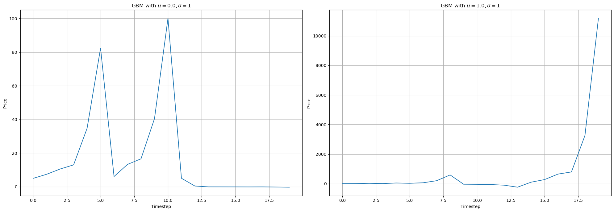

\FloatBarrier

The exponential & self-referential nature is crucial, because (at least financially) a 1\% move on a stock worth \$1, \$10, or \$1,000 is 1%: most of the time we're focused on the relative 1% change, not an absolute \$0.01, \$0.1, or \$10 change. This also appropriately scales portfolio risk.

## Linear Stability Analysis
We have here a quick reproduction of Strogatz's approach to linear stability analysis, as shown in @Strogatz2024. Let $x^*$ be a fixed point, and let:
$$ u(t) = x(t) - x^* $$

Be a small perturbation away from $x^*$. To see whether the perturbation grows or decays, we derive a differential equation for $u$. Differentiation yields:

\begin{align*}
    \dot{u} &= \frac{d}{dt} (x - x^*) \\
            &= \frac{d}{dt} x - \frac{d}{dt} x^* \\
            &= \frac{d}{dt} x - 0 \\
            &= \dot{x}
\end{align*}

Since $x^*$ is a constant, we lose its derivative. Therefore:
$$ \dot{u} = \dot{x} = f(x) = f(x^* + u) $$

Or, in other words, the derivative of $u$ is the same as the derivative of $x$, which we'll term $f(x)$ (note: _not_ $f'(x)$). Since $\dot{u} = \dot{x}$, it means $u=x$, so we can represent $\dot{x}$ as some perturbation of $x$, giving us $\dot{x} = f(x^* + x) = \dot{u} = f(x^* + u)$. Now using Taylor's expansion, we obtain:
$$ f(x^* + u) = f(x^*) + f'(x^*)u + O(u^2) $$

Where $O(u^2)$ denotes quadratically small terms in $u$. Since $x^*$ is a fixed point, $f(x^*)=0$, hence:
$$ \dot{u} = f'(x^*)u + O(u^2) $$

If $f(x^*) \ne 0$, the $O(u^2)$ terms are negligible in comparison to the linear term, so we may write the approximation:
$$ \dot{u} \approx f'(x^*)u $$

This linear differential equation for $u$ is its linearisation about $x^*$, and it shows that $u(t)$ grows exponentially if $f'(x^*) > 0$, or decays exponentially if $f'(x^*) < 0$ If in case $f'(x^*) = 0$, the $O(u^2)$ terms will be non-negligible, and nonlinear analysis is needed to determine stability. This also gives us a relative shortcut: we can determine stability without explicitly needing to compute $\int u(t) dt$, just by looking at the sign of $f'(x^*)$.

### Application to the given SDE
With $\sigma=0$, our ODE is:
$$ \dot{x} = f(x) = 2x - x^3 $$

First, we need to find our fixed points, $x^*$ - these satify $f(x^*)=0$ which, in our case, are the roots of our determinstic polynomial:

\begin{align*}
    2x^* - (x^*)^3 &= 0 \\
    \implies x^*(2-(x^*)^2) &=0 \\
    \therefore x^* = 0, \text{ or } x^* = \pm \sqrt{2}
\end{align*}

Now we linearlise:
$$ f'(x) = 2-3x^2 $$

And evaluate around these points:

\begin{align*}
    x^* = 0 &\implies f'(0) = 2-3(0)^2 = 2\\
    x^* = +\sqrt{2} &\implies f'(+\sqrt{2}) = 2-3(\sqrt{2})^2 = 2-3(2) = 2-6 = -4\\
    x^* = -\sqrt{2} &\implies f'(-\sqrt{2}) = 2-3(-\sqrt{2})^2 = 2-3(2) = 2-6 = -4
\end{align*}

## Numerical Stability and Tamed Milstein
As briefly pointed out in [Question 2.2](#stochastic-simulation), the given SDE to analyse is:
$$ dX_t = \left( 2 X_t - X_t^3 \right) dt + \sigma X_t dW_t $$

When numerically integrating $dX_t$ with Euler-Maruyama, moderate inputs like $N=10^3, I_0=1, \sigma=1$ are well behaved (where $N$ is the number of steps to evolve $X_t$ over, $I_0$ is the initial value, $\sigma$ is diffusion/volatility). But an even _slightly_ wacky initial value like $I_0=100$, ceteris paribus, blows us up - we get outputs well into the orders of $10^120$. This is because of our drift term: the cubic makes our drift superlinear, so with Euler-Maruyama our first _deterministic_ step is:

\begin{align*}
    X_{t+1} &= \left( 2 X_t - X_t^3 \right) dt + \sigma X_t dW_t\\
    X_{1}   &= \left( 2 X_0 - X_0^3 \right) \frac{1}{1000-1} + \sigma X_0 dW_t\\
            &= \left( 2(100) - (100)^3 \right) cdot 0.001001 + \sigma (100) dW_t\\
            &= \left( 200 - 1000000 \right) \cdot 0.001001 + \sigma (100) dW_t\\
            &= \left( -999800 \right) + \sigma (100) dW_t\\
            &= -1000.8008 + \sigma (100) dW_t
\end{align*}

Recall that $W_t$ is a continuous Wiener process, i.e. a random process whose increments $dW_t$ are Gaussian distributed with $\mu=0, \sigma=\sqrt{dt}$. With $\sigma=1$, we scale our Wiener increment by $100$ (with $\sigma=2, 200$ of course). Even though $dW_t$ only has a standard deviation of $\sqrt{0.001001} \approx 0.03163$, it's an infinite range, so scaling by 100 yields additional massive stochastic update steps.

Purely deterministically, our function absolutely _drags_ us down with our first step being an entire order of magnitude larger than the initial value, exacerbated with stochastic forcing, and this just compounds with subsequent steps - as such, we can easily leave regions where our SDE is well-behaved. Only tiny $dt$ values are stable, and since $dt = \frac{1}{N-1}$, we'd need a very large number of steps $N$. Put simply, $dX_t$ is a stiff equation. To this end, we have two options:
1. Use a tamed Milstein (or implicit) scheme.
2. Use a very large $N : N >> 10^3$, say $N \approx 10^4$.

In [Question 2.2](#stochastic-simulation) we opted for option (2) to keep it simple and intuitive, but let's explore (1).  To undestand the Milstein scheme, let's begin with a generic SDE of this form:
$$ dX_t = \mu X_t dt + \sigma X_t dW_t $$

We can handily decompose numerical integration using Taylor's expansion. Recall that Taylor polynomials $p(x)$ evaluate a function $f(x)$ at a point $a$ like so:

\begin{align*}
    p(a) &= f(a) + \frac{f'(a)}{1!}(x-a) + \frac{f''(a)}{2!}(x-a)^2 + \frac{f'''(a)}{3!}(x-a)^3 + \dots \\
         &\implies \sum_{n=0}^{\infty} \frac{f^{(n)}(a)}{n!}(x-a)^n
\end{align*}

This is possible because evaluating $f(x)$ at a certain point $a$ simply yields $f(a)$. Up to only the 0th order, Taylor's polynomial is simply $p(a)$ at $a$. If we plot $p(a)$ versus the function $f(x)$, we'd get a flat line $y=f(a)$. In order to make the approximation more accurate, Taylor's expansion starts to include curvature: if we let the $N$th derivative(s) of $p(x)$ equal the $N$th derivative(s) of $f(x)$ around $a$, we effectively constrain $p(x)$'s local behaviour around $a$ such that it _must_ equal $f(a)$ within a neighbourhood. Assuming $a=0$, we can write:

\begin{align*}
    p(0) &= f(0) \\
    p(x)_0 &= f(0) \\
    p(x)_1 &= f(0) + f'(0)x \\
    p(x)_2 &= f(0) + f'(0)x + \frac{1}{2} f''(0)x^2 \\
    p(x)_3 &= f(0) + f'(0)x + \frac{1}{2} f''(0)x^2 + \frac{1}{2} \frac{1}{3} f'''(0)x^3\\
           &= f(0) + f'(0)x + \frac{1}{2} f''(0)x^2 + \frac{1}{6} f'''(0)x^3\\
    \\
    \\
    \implies p'(x)_0   &= 0\\
    \implies p'(x)_1   &= 0 + f'(0)\\
    \implies p''(x)_2  &= 0 + 0 + \frac{1}{2} 2 f''(0)x = 0 + 0 + f''(0) = f''(0)\\
    \implies p'''(x)_3 &= 0 + 0 + 0 + \frac{1}{6} 3 f''(0)x^2 = \frac{1}{2} f''(0)
\end{align*}

The more derivatives that are included, the more the neighbourhood resembles $f(a)$. Now, Euler-Maruyama is thus effectively only 1st order (we have the initial offset and first derivatives in $t$). The Milstein scheme Milstein simply includes the quadratic term for stronger convergence:

- Euler-Maruyama:

    \begin{align*}
        X_{t+1} - X_t &= \mu X_t \Delta t + \sigma X_t \Delta W_t \\
        &\implies \left( 2 X_t - X_t^3 \right) \Delta t + \sigma X_t \Delta W_t
    \end{align*}

- Milstein:

    \begin{align*}
        X_{t+1} - X_t &= \mu X_t \Delta t + \sigma X_t \Delta W_t + \frac{1}{2} \sigma^2 X_t ((\Delta W_t)^2 - \Delta t) \\
        &\implies \left( 2 X_t - X_t^3 \right) \Delta t + \sigma X_t \Delta W_t + \frac{1}{2} \sigma^2 X_t ((\Delta W_t)^2 - \Delta t)
    \end{align*}

With Milstein's scheme, our first step would thus be:

\begin{align*}
    X_{1} &= \left( 2 X_0 - X_0^3 \right) \frac{1}{1000-1} + \sigma X_0 dW_t + \frac{1}{2} \sigma^2 X_0 ((dW_t)^2 - dt)\\
          &= -1000.8008 + \sigma (100) dW_t + \frac{1}{2} \sigma^2 (100) ((dW_t)^2 - 0.001001)
\end{align*}

We get stronger convergence guarantees, but this does nothing to address our exploding superlinear drift. Enter _taming_, aka normalisation. An applicable approach is:
$$ \hat{\mu} = \frac{\mu}{(1+|\mu|)dt} $$

As explained in @Hutzenthaler2012, @Wang2013, and @248718. With this, our first drift update $\mu dt$ becomes $\approx -0.001001$ - tiny in magnitude and correct in sign. As we reduce $N$ we'd get a larger $\mu$, but it's always bounded to be $> 1$. This adjustment does two things:
1. It doesn't fully reflect the magnitude of $\mu dt$, but it doesn't harm accuracy because as pointed out in @Sabanis2013, taming slows down explosive drift only at the discrete level whilst preserving the correct limit. Basically, we take more steps but we're safer for it.
2. It appears to overemphasise the contribution of untamed diffusion (our $\sigma X_0 dW_t$ values are still scaled by $100$), but because our diffusion is _linear_ in $X_t$ whilst the drift is cubic, we're really more concerned about the drift. If we do tame diffusion as well, we'll actually be modifying the variance of it and thus would bias our higher-order moment measurements. The point of taming is to let the numerical scheme update slowly enough to let determinism actually work its dynamics over time.

It is specifically because of point (2) that we opted to consider tamed Milstein rather than tamed Euler, betting that the slight increase in covergence accuracy is well-reasoned in the face of untamed drift. Our tamed Milstein code changes would simply be two lines:

\Needspace{12\baselineskip}
```diff
@@ -6,6 +6,8 @@
     for t in range(1, N):
         determined = (2*results[t-1] - (results[t-1]**3))*dt
+        determined \= (1.0 + np.abs(determined)*dt)
         stochastic = sigma*results[t-1]*dW[t-1]
+        milstein = 0.5 * (sigma**2) * results[t-1] * (dW[t-1]**2 - dt)
-        results[t] = results[t-1] + determined + stochastic
+        results[t] = results[t-1] + determined + stochastic + milstein

    return results
```

But we can also just let $N$ remain sufficiently large to elide all of this, as we did. Also, initial values $I_0 > 6$ render path plots illegible.

## Fokker-Planck for Q2 - Stationary Distribution
General Fokker-Planck (via Ito's lemma):
$$
    \frac{\partial p(x, t)}{\partial t}
  + \frac{\partial}{\partial x}[\mu(x,t) p(x,t)]
  - \frac{1}{2} \frac{\partial^2}{\partial x^2}[\sigma^2(x,t) p(x,t)]
  = 0
$$

Stationary PDF $\implies t=0$, so this gives us:
$$ \frac{\partial p(x, t)}{\partial t} = 0 $$

Which makes our PDE an ODE in $x$:

\begin{align*}
    0
  + &\frac{d}{d x}[\mu(x,t) p(x,t)]
  - \frac{1}{2} \frac{d^2}{d x^2}[\sigma^2(x,t) p(x,t)]
  = 0
    \\
    \implies
    &\frac{d}{d x}[\mu(x,t) p(x,t)]
  = \frac{1}{2} \frac{d^2}{d x^2}[\sigma^2(x,t) p(x,t)]
\end{align*}

Our variables from our SDE are:

\begin{align*}
    \mu(x)               &= 2x-x^3       \\
    \sigma(x)            &= \sigma x     \\
    \implies \sigma^2(x) &= \sigma^2 x^2
\end{align*}

We can integrate once to get a first-order ODE:
$$ \mu(x,t) p(x,t) = \frac{1}{2} \frac{d}{d x}[\sigma^2(x,t) p(x,t)] $$

And now we need the product and chain rules to expand $[\sigma^2(x)p(x)]$:

\begin{align*}
    \mu(x,t) p(x,t)
        &= \frac{1}{2} \left(
            \frac{d}{dx}[\sigma^2(x)]p(x)
            + \sigma^2(x) \frac{dp}{dx}
            \right)
        \\
        &= \frac{1}{2} \left(
            2 \sigma(x) \cdot \frac{d\sigma(x)}{dx} \cdot p(x)
            + \sigma^2(x) \frac{dp}{dx} \right)
\end{align*}

Back-substituting $\mu(x), \sigma(x)$ in here, we'll recognise that $\sigma$ is just a constant in that it has no dependence on $x$. We'll also expand the $\frac{1}{2}$:

\begin{align*}
    \implies (2x-x^3)p(x)
        &= \sigma(x) \cdot \frac{d \sigma(x)}{dx} \cdot p(x)
         + \sigma^2(x) \frac{dp}{dx}
    \\
        &= \sigma \cdot x \cdot \sigma \cdot p(x)
         + \frac{1}{2} (\sigma^2 \cdot x^2 \cdot p'(x))
    \\
        &= \sigma^2 x p(x) + \frac{1}{2} (\sigma^2 \cdot x^2 \cdot p'(x))
\end{align*}

Remember we're solving for $p(x)$, so we need to isolate that and $p'(x)$. We can move $\sigma^2 x p(x)$ to the other side:

\begin{align*}
    \implies (2x-x^3)p(x) - \sigma^2 x p(x)
        &= \frac{1}{2} (\sigma^2 \cdot x^2 \cdot p'(x))\\
    \implies p(x)(2x-x^3-\sigma^2 x)
        &= \frac{1}{2} (\sigma^2 \cdot x^2 \cdot p'(x))
\end{align*}

It's looking separable...let's factor out an $x$ from the LHS and multiply both sides by 2:
$$ 2x(2-x^2-\sigma^2)p(x) = \sigma^2 \cdot x^2 \cdot p'(x) $$

And it's separable! We just need to cross-divide:

\begin{align*}
    \implies \frac{2x(2-x^2-\sigma^2)}{\sigma^2 x^2} &= \frac{p'(x)}{p(x)} \\
             \frac{2(2-x^2-\sigma^2)}{\sigma^2 x} &= \frac{p'(x)}{p(x)}
\end{align*}

Interestingly, in this case $x$ must not equal $0$, which seems to explain why our simulations behave strangely if $I_0=0$. Now we need to integrate:

\begin{align*}
    \implies \int \frac{p'(x)}{p(x)}
        &= \int \frac{2(2-x^2-\sigma^2)}{\sigma^2 x}
    \\
    \implies \int \frac{1}{p(x)} p'(x)
        &= \int \frac{2(2-x^2-\sigma^2)}{\sigma^2 x}
\end{align*}

Okay great. We can split the RHS to make this straightforward, keeping in mind anything that doesn't involve $x$ is a constant and can be moved out of the integrand:

\begin{align*}
    \int \frac{2(2-x^2-\sigma^2)}{\sigma^2 x}
        &= \int \frac{4-2x^2-2\sigma^2}{\sigma^2 x} \\
        &= \int \frac{4}{\sigma^2 x} dx
           - \frac{2x^2}{\sigma^2 x} dx
           - \frac{2 \sigma^2}{\sigma^2 x} dx \\
        &= \frac{4}{\sigma^2} \int \frac{1}{x} dx
           - \frac{2}{\sigma^2} \int x dx
           - 2 \int \frac{1}{x} dx
\end{align*}

Putting it all together:

\begin{align*}
    \int \frac{1}{p(x)} p'(x)
        &= \frac{4}{\sigma^2} \int \frac{1}{x} dx
           - \frac{2}{\sigma^2} \int x dx
           - 2 \int \frac{1}{x} dx \\
        &= \frac{4}{\sigma^2} \ln(|x|)
           - \frac{2}{\sigma^2} \cdot \frac{x^2}{2}
           - 2 \ln(|x|) + c \\
    \implies \ln(|p(x)|)
        &= (\frac{4}{\sigma^2} - 2)\ln(|x|) - \frac{x^2}{\sigma^2}+C
\end{align*}

Finally! Now we can exponentiate both sides, keeping in mind $e^C$ is just another constant. We'll term that $C_2$. Thus, our stationary PDF $p(x)$:
$$ \boxed{ \therefore p(x) = C_2 \cdot |x|^{(4/\sigma^2)-2} \cdot e^{-(x^2 / \sigma^2)} } $$

## Fokker-Planck for Q2 - Variance
Before computing our variance for $p(x)$, we need to normalise it so that it sums to 1 for a couple of reasons:
- Fokker-Planck doesn't inherently normalise, it just gives us PDF evolution over time. We can get a stationary PDF, but it's not going to sum to 1.
- To find the variance, we actually do need $p(x)$ to sum to 1. By definition we need this.
- It helps us lock down the value of our constant, $C_2$.

So let's try! First we'll define some variables to be our exponents (note that it's best if they don't depend on $x$), and we'll solve for $C$ with $p(x)=1$:

\begin{align*}
    a := \frac{4}{\sigma^2}-2; \quad b := \frac{1}{\sigma^2}
    \\
    \implies 1 = C_2 \int_{-\infty}^{+\infty} |x|^a e^{-bx^2} dx
\end{align*}

Notice that $|x| \in [-\infty, 0]$ is identical to itself over $[0, \infty]$. So we multiply shift our limits, multiply by 2, and drop the $|\cdot|$:
$$ 1 = 2C_2 \int_{0}^{+\infty} |x|^a e^{-bx^2} dx $$

According to GPT (@chatgpt-20251217), the integral is the Gamma function, $\Gamma(z)$. Our limits are the same for $\Gamma$, we just need a slight change of variables:

\begin{align*}
    &y := bx^2\\
    \implies &dy = 2bxdx, \\
             & x = \sqrt{\frac{y}{b}}, \\
             &dx = \frac{dy}{2 bx} = \frac{dy}{2 b \sqrt{\frac{y}{b}}} = \frac{dy}{2\sqrt{by}}
\end{align*}

Now we can proceed, keeping in mind to only keep variables dependent on $y$ - and remembering that $b$ is a constant with respect to both $x$ and $y$ (as defined):

\begin{align*}
    \int_0^{+\infty} x^a e^{-bx^2} dx
        &= \int_0^{+\infty} \left( \frac{y}{b} \right)^{(a/2)} e^{-y} \frac{dy}{2\sqrt{by}}\\
        &= \int_0^{+\infty} y^{a/2} b^{-(a/2)} e^{-y} \frac{1}{2} \cdot dy \cdot b^{-1/2} y^{-1/2}\\
        &= \frac{1}{2} b^{-(a+1)/2} \int_0^{+\infty} y^{(a-1)/2} e^{-y} dy\\
        &= \frac{1}{2} b^{-(a+1)/2} \cdot \Gamma \left( \frac{a+1}{2} \right)
\end{align*}

Putting this back into our expression for $C_2$:

\begin{align*}
    1 &= 2C_2 \cdot \frac{1}{2} b^{-(a+1)/2} \cdot \Gamma \left( \frac{a+1}{2} \right)\\
    C &= \frac{b^{-(a+1)/2}}{\Gamma \left( \frac{a+1}{2} \right)}
\end{align*}

Substituting $a, b$ back in here gives us:

\begin{align*}
    b^{(a+1)/2} &= \frac{1}{\sigma^2} ^{(a+1)/2}\\
                &= \sigma^{-2 \cdot (a+1)/2} \\
                &= \sigma^{-(a+1)}\\
                &= \frac{1}{\sigma^{a+1}}
\end{align*}

$$ \boxed{ \therefore C = \frac{\sigma^{-(4/\sigma^2)-1}}{\Gamma \left( \frac{a+1}{2} \right)} } $$

Alright. Now to actually compute our variance. We have $\mu = \mathbb{E}[X]=0$, we just need to find $\mathbb{E}[X^2]$. Variance as an integral:
$$ \mathbb{E}[X^2] = \int_{-\infty}^{+\infty} x^2 p(x) dx $$

Again, we can shift our limits & multiply by 2 since $p(x)$ is symmetric:
$$ \mathbb{E}[X^2] = 2 \cdot \int_{0}^{+\infty} x^2 p(x) dx $$

We'll use these substitution variables from last time:
$$ a=\frac{4}{\sigma^2}-2; \quad b=\frac{1}{\sigma^2}; \quad y=bx^2 $$

To try and solve for this:
$$ \mathbb{E}[X^2] = 2C \int_{0}^{+\infty} x^2 |x|^{(4/\sigma^2)-2} \cdot e^{-(x^2 / \sigma^2)} dx $$

Let's address our change in variables:

\begin{align*}
    y &= bx^2 = \frac{1}{\sigma^2} x^2 = \frac{x^2}{\sigma^2} \\
    \implies x &= \sigma \sqrt{y} \\
    \implies dx &= \frac{\sigma}{2 \sqrt{y}} dy
\end{align*}

Substituting into the integrand:
$$ \mathbb{E}[X^2] = 2C \int_{0}^{+\infty} x^2 x^a \cdot e^{-y} dx $$

Notice that:

\begin{align*}
    x^2 x^a &= x^{a+2}\\
            &= (\sigma \sqrt{y})^{a+2}\\
            &= \sigma^{a+2} y^(1/2 (a+2))\\
            &= \sigma^{a+2} y^{(a+2)/2}\\
    \\
    \implies \mathbb{E}[X^2]
        &= 2C \int_{0}^{+\infty}
           \sigma^{a+2}
           y^{(a+2)/2}
           \cdot e^{-y}
           \frac{\sigma}{2 \sqrt{y}} dy
\end{align*}

Combining powers of $y$ and $\sigma$:

\begin{align*}
    y^{(a+2)/2} \cdot y^{\frac{1}{2}} &= y^{\frac{a+2}{2} - \frac{1}{2}} = y^{(a+1)/2} \\
    \sigma^{a+2} \cdot \frac{\sigma}{2} &= \frac{\sigma^{a+3}}{2} \\
    &\implies 2C \int_{0}^{+\infty} \frac{\sigma^{a+3}}{2} \cdot y^{(a+1)/2} \cdot e^{-y} dy
\end{align*}

We can remove stuff that doesn't depend on $y$:
$$ \implies \mathbb{E}[X^2] = 2C \cdot \frac{\sigma^{a+3}}{2} \int_{0}^{+\infty} y^{(a+1)/2} \cdot e^{-y} dy $$

According to GPT again (@chatgpt-20251217), this is another form of the Gamma function:

\begin{align*}
    \implies \mathbb{E}[X^2]
        &= 2C \cdot \frac{\sigma^{a+3}}{2} \cdot \Gamma \left( \frac{a+3}{2} \right) \\
        &= C \sigma^{a+3} \Gamma \left( \frac{a+3}{2} \right) \\
        &= \frac{\sigma^{-(a+1)}}{\Gamma \left( \frac{a+1}{2} \right)} \sigma^{a+3} \Gamma \left( \frac{a+3}{2} \right) \\
        &= \sigma^2 \frac{\Gamma \left( \frac{a+3}{2} \right)}{\Gamma \left( \frac{a+1}{2} \right)}
\end{align*}

According to Wikipedia, the $\Gamma$ function carries this recurrence property:

\begin{align*}
    \Gamma(z+1) &= z\Gamma(z) \\
    \implies \frac{\Gamma(z+1)}{\Gamma(z)} &= z
\end{align*}

If we set $z := \frac{a+1}{2}$, it implies $z+1 = \frac{a+3}{2}$. This finally gives us:
$$ \mathbb{E}[X^2] = \sigma^2 \cdot \frac{a+1}{2} $$

Substituting $a$ back gives us our much sought-after variance:

\begin{align*}
    a = \frac{4}{\sigma^2}-2 \implies a+1 = \frac{4}{\sigma^2}-1\\
    \boxed{ \therefore \mathbb{E}[X^2] = \sigma^2 \cdot \frac{\frac{4}{\sigma^2}-1}{2} = \frac{4 - \sigma^2}{2} }
\end{align*}

\newpage
# References
_Note that with GenAI @chatgpt-20251217, the entire conversation is relevant and referenced herewith. Independently including all prompts is infeasible._
