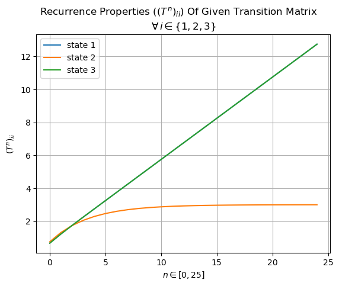
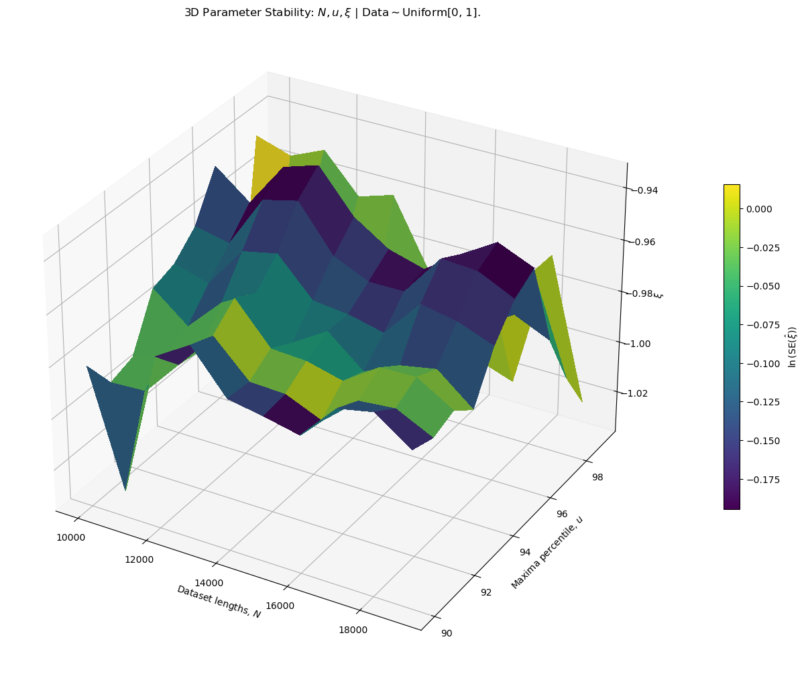
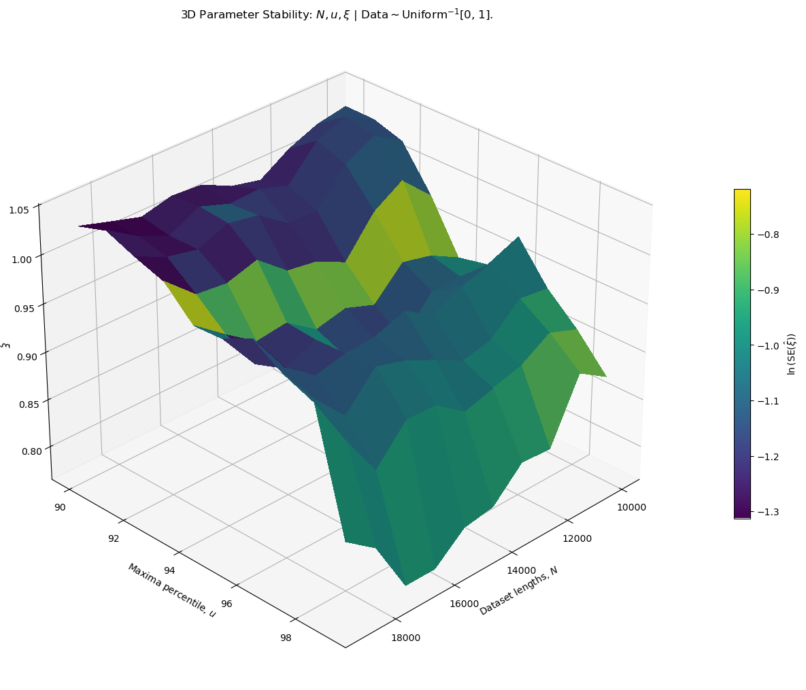
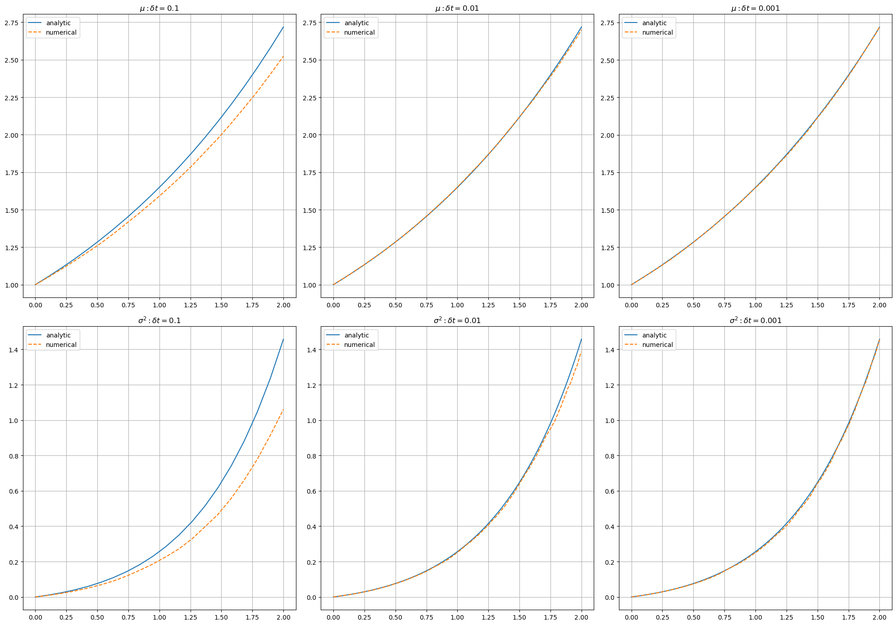

# Introduction
This submission is for MTHM003's second coursework over the year 2025-2026. Note that typesetting has been adapted from a Jupyter notebook, so some sections may not appear exactly (e.g., code blocks have been broken up here with explicit explanations to aid reasoning and preserve readability).

## Code Setup

```python
import logging
import matplotlib.pyplot as plt
import numpy as np
import pandas as pd

from datetime import datetime
from itertools import product
from joblib import Parallel, delayed
from matplotlib import cm
from matplotlib.axes import Axes
from matplotlib.figure import Figure
from matplotlib.gridspec import GridSpec
from scipy.stats import genextreme, genpareto

# required for local testing
logging.basicConfig()
logger = logging.getLogger(__name__)
logger.setLevel(logging.INFO)

rng = np.random.default_rng(seed=42)
```

\newpage
# Question 1
Study the recurrence properties of the three-state Markov chain described by the transition matrix:
$$
    T = \begin{bmatrix}
        2/3& 0& 1/3\\
        1/4& 3/4& 0\\
        1/3& 0& 2/3
    \end{bmatrix}
$$

Consider the quantity $R_i^{(n)} = \sum \limits_{k=1}^{n} (T^k)_{ii}$.
1. Plot a graph of $R_i^{(n)}$ against time $n$ for each of the states $i \in \{1, 2, 3\}$. From your graphs, does $R_i^{(n)}$ remain bounded or diverge to $\infty$ as $n \to \infty$?
2. Prove analytically the behaviour and deduce the recurrence properties.

## Answer
Right away there are a few things worth noticing:
1. Class $B$ only communicates with class $A$.
2. Class $A$ only communicates with itself and class $C$.
3. Class $C$ only communicates with itself and class $A$.

From the structure of the transition matrix alone, we can see $B$ slowly loses probability mass over time to $A$, which in turn redistributes it between $A, C$. Before we analyse $T$'s recurrence properties, it's worth understanding that recurrence is determined by whether the _expected_ total number of returns to a state (the sum of its return probabilities over time) is infinite or finite. Steady-state probabilities can help us determine whether those probabilities decay to, or are bounded away from, zero. So let's look at them:

```python
mat = np.array([
    [2/3, 0, 1/3],
    [1/4, 3/4, 0],
    [1/3, 0, 2/3]
])

e_vals, e_vecs = np.linalg.eig(mat.T)  # NOTE the transpose
print(f"Eigenvalues:\n{e_vals},\n\nEigenvectors:\n{e_vecs}")
# Eigenvalues:
# [1.         0.33333333 0.75      ],

# Eigenvectors:
# [[ 0.70710678 -0.70710678 -0.15430335]
#  [ 0.          0.          0.77151675]
#  [ 0.70710678  0.70710678 -0.6172134 ]]

l_1 = np.argmax(e_vals)
long_run_proba = np.abs(e_vecs[:, l_1]) / np.abs(e_vecs[:, l_1]).sum()
print(long_run_proba)
# [0.5        0.         0.5       ]
```

State $B$ is transient because once left, we can't return to it. Classes $A, C$ are closed communicating classes. Ergo, $T$ is reducible. Because $B$ dissipates probability mass to $A$ with a non-zero probability and it never comes back to it, $B$ can only recurse into itself a finite number of times. From a recurrence standpoint, we're considering whether the average number of returns to $B$ from $B$ is finite or infinite, given we start in it. If we start in $B$, the only way to get back to $B$ is if we remain in it. We remain in $B$ with probability $\frac{3}{4}$, which means:

$$ \sum \limits_{k=1}^n (T^k)_{22} = \sum \limits_{k=1}^n \left( \frac{3}{4} \right)^k $$

By geometric series:

\begin{align*}
    \sum \limits_{k=1}^n \left( \frac{3}{4} \right)^k
        &= \frac{3/4}{1-(3/4)} \\
        &= \frac{3/4}{1/4} \\
        &= 3 < \infty
\end{align*}

Or, that $(T^n)_{22}$ is finite. For $A, C$, their sub-matrix is irreducible and therefore they're both positively recurrent since there's a finite average return time to one of them, given that we started in one of them, and the steady-state probability is non-zero. Because $A, C$ form a closed communicating class, we need to consider their _limit_ behaviour (with $B$, limit _return_ paths and staying in itself are the same thing, because we never "return"). In the limit, $P(X_i = A) = P(X_i = C) = \frac{1}{2}$. From a recurrence standpoint wherein we're considering return paths, if we start in $A$ we can either stay in it (with probability $2/3$) or leave to $C$ (with probability $1/3$) and return (again, with probability $1/3$); and vice-versa for $C$. In either case, since limit behaviour over $A, C$ is $\frac{1}{2}, \frac{1}{2}$, summing over either state ad infinitum is divergent/infinite. Therefore:

\begin{align*}
    \sum_{k=1}^n (T^k)_{11}
        &= \sum_{k=1}^n (T^k)_{33} \\
        &= \sum_{k=1}^n \frac{1}{2} + \frac{1}{2} \cdot \left( \frac{1}{3} \right)^k \\
        &= \infty
\end{align*}

We have a constant probability $\frac{1}{2}$ plus a decaying geometric term. So states $A, C$ are positive recurrent (finite mean return time). We can simulate this:

```python
np.cumsum(
    [np.diag(np.linalg.matrix_power(mat, i)) for i in range(1, 26)],
    axis=0
)
# array([[ 0.66666667,  0.75      ,  0.66666667],
#        [ 1.22222222,  1.3125    ,  1.22222222],
#        [ 1.74074074,  1.734375  ,  1.74074074],
#        [ 2.24691358,  2.05078125,  2.24691358],
#        [ 2.74897119,  2.28808594,  2.74897119],
#        [ 3.24965706,  2.46606445,  3.24965706],
#        [ 3.74988569,  2.59954834,  3.74988569],
#        [ 4.2499619 ,  2.69966125,  4.2499619 ],
#        [ 4.7499873 ,  2.77474594,  4.7499873 ],
#        [ 5.24999577,  2.83105946,  5.24999577],
#        [ 5.74999859,  2.87329459,  5.74999859],
#        [ 6.24999953,  2.90497094,  6.24999953],
#        [ 6.74999984,  2.92872821,  6.74999984],
#        [ 7.24999995,  2.94654616,  7.24999995],
#        [ 7.74999998,  2.95990962,  7.74999998],
#        [ 8.24999999,  2.96993221,  8.24999999],
#        [ 8.75      ,  2.97744916,  8.75      ],
#        [ 9.25      ,  2.98308687,  9.25      ],
#        [ 9.75      ,  2.98731515,  9.75      ],
#        [10.25      ,  2.99048636, 10.25      ],
#        [10.75      ,  2.99286477, 10.75      ],
#        [11.25      ,  2.99464858, 11.25      ],
#        [11.75      ,  2.99598643, 11.75      ],
#        [12.25      ,  2.99698983, 12.25      ],
#        [12.75      ,  2.99774237, 12.75      ]])
```

And graph it:

```python
mat = mat = np.array([
    [2/3, 0, 1/3],
    [1/4, 3/4, 0],
    [1/3, 0, 2/3]
])

N = 25

sims = [np.diag(np.linalg.matrix_power(mat, i)) for i in range(1, N+1)]
sims = np.cumsum(sims, axis=0)

plt.suptitle(
    r"Recurrence Properties ($(T^n)_{ii}$) Of Given Transition Matrix"
)

plt.title(r"$\forall \, i \in \{1, 2, 3\}$")

plt.plot(sims[:, 0], label="state 1")
plt.plot(sims[:, 1], label="state 2")
plt.plot(sims[:, 2], label="state 3")

plt.xlabel(r"$n \in [0, 25]$")
plt.ylabel(r"$(T^n)_{ii}$")
plt.legend()
plt.grid()
plt.show()
```



We can see that numerically as well, the number of returns to state $B$ saturates at $3$ as $n \to \infty$ whilst states $A, C$ continue recurring indefinitely.

\newpage
# Question 2
Consider i.i.d. random variables $\{X_i\}$ drawn from a uniform distribution on $[0, 1]$. In the following, find scaling sequences $a_n$ and $b_n$ such that $(M_n − b_n)/a_n$ converges in distribution to a non-trivial limit function $G$.
1. $Y_i = X_i$, and $M_n = \max\{Y_1, Y_2, \dots, Y_n\}$
2. $U_i = 1/X_i$, and $M_n = \max\{U_1, U_2, \dots, U_n\}$

In each case find first of all the probability distribution function $P(M_n \le a_nu+b_n)$ as a function of $u_n = a_n u + b_n$. Then find suitable scaling sequences $a_n$ and $b_n$ so that you get a non-trivial limit $G(u)$ as $n \to \infty$. The function $G(u)$ will be one of three standard types.

## Answer
To set this one up is straightforward, solving it is a bit involved. Before we get started, a few words on my choice of terminology for the rest of this answer:
1. A _random variable_ (singular) $X_i$ in this case is a vector, or a time series, or basically some collection of a bunch of numbers. Random _variables_ (plural) $\{X_i\}$ are a collection/set of these, i.e. a matrix of random variables/vectors/time series. We're going to treat our problems from this angle, and any computation on _a random variable_ (singular) will be an operation on one of the vectors $X_i$, but applicable to all $X_i \in \{X_i\}$. For example, the mean/variance/etc. of a random variable $X_i$ is effectively the mean/variance/etc. of a single time series/vector. This specificity is to avoid confusion between scalar random variables and their moments which never change, whereas our do.
2. Addressing a rather confusing point, let's talk about the relationship between $u_n(u):= a_n u + b_n$ and the scaling factor, $(M_n - b_n)/a_n$. What we're trying to do is get the maxima series $M_n$, after scaling, to converge to some limit distribution $U$ (for the purposes of this explanation, **not** the same $U$ as $U_i$ in the question):
    $$ \frac{M_n - b_n}{a_n} \Longrightarrow U $$

    Which is the same as saying that we want $M_n$ to be less than or equal to a specific number, $u$:

    \begin{align*}
        \frac{M_n - b_n}{a_n} \le u\\
        \implies M_n - b_n \le a_n u \\
        \implies M_n \le a_n u + b_n
    \end{align*}

    This is going to be helpful when trying to find $a_n, b_n$.

Let's proceed slowly with our derivations. We have a bunch of random variables $\{X_i\}$ that are uniformly distributed on $[0,1] \implies$ we're using the _continuous_ uniform distribution with functions (via Wikipedia):

$$
    \text{CDF} = \begin{cases} 0& x<a\\ \frac{x-a}{b-a}& x \in [a, b]\\ 1& x>b \end{cases},
    \qquad
    \text{PDF} = \begin{cases} \frac{1}{b-a}& x \in [a, b]\\ 0, \text{otherwise} \end{cases}
$$

### Case 1: $Y_i = X_i$
If $Y_i = X_i$, $Y_i$ is also uniformly distributed. In this case, $M_n$ is the maximum value of different $Y_i$. For orientation, consider this:

```python
num_variables = 10  # i
num_observations = 10_000  # time series/vector length
X_i = rng.uniform(low=0.0, high=1.0, size=((num_variables, num_observations)))
print(X_i.shape)  # (rows, columns)
# (10, 10000)

Y_i = X_i
M_n = Y_i.max(axis=1)
print(M_n.shape)
# (10, 1)
```

We're given that we can denote $u_n(u) := a_n u + b_n$; we choose $u_n$ to be a function in $u$ because $a, b$ are the limits of our standard uniform: $a=0, b=1$.

Now, the phrasing, "what's the probability that $M_n$ is less than or equal to some number $u_n$?", should recognisably sound like "cumulative probability of all numbers up to $u_n$". So we just need to use the uniform's CDF from above, substitute in $u_n(u)$, and get the probability that $M_n \le u_n(u)$. The question also asks for the _PDF_ of $M_n \le u_n(u)$, so we also need to differentiate the CDF.

For context, it's important to understand why this matters. We have $\{X_i\}$ shaped as a matrix: a bunch of time series, each time series with e.g. $10,000$ time steps. We're taking the maximum value of each time series and then asking, "what's the probability that this maximum value is less than some number"? If $\{X_i\}$ were time series of river water levels, we'd be asking "what's the probability that the maximum water level is below some limit?" In cases of storms, this helps us quantify the probability of flooding. More topically, if $\{X_i\}$ was a market index, we'd be asking "what's the probability that an entire market doesn't move beyond some percentage in a day?" - extremely invaluable information that not is an advantage in IV trading, but in general provides an additional dimension of model analysis & accuracy.

Coming back, we already have the CDF of the uniform distribution. All we need to do is substitute $x$ in the given CDF with $u_n(u)$, and apply $n$ times for $n$ random variables.

\begin{align*}
    \implies &\left( \frac{u_n(u)-a}{b-a} \right)^n
    \\
    = &\left( \frac{(a_n u+b_n) - a}{b-a} \right)^n
    \\
    = &\left( \frac{a_n u+b_n - a}{b-a} \right)^n
\end{align*}

Fair enough. Now we just need to differentiate this to get the PDF. We can leverage a few things:
1. We're differentiating with respect to $u_n(u)$, and $a, b$ - our distribution's limits - are independent of this. So we can factor these constants out.
2. We need the chain rule.

\begin{align*}
    \implies \frac{d}{du} \left( \frac{a_n u+b_n - a}{b-a} \right)^n
        &= n \left( \frac{a_n u+b_n - a}{b-a} \right)^{n-1}
            \cdot \frac{d}{du} \left[ \frac{a_n u+b_n - a}{b-a} \right]
            \\
    \\
    \frac{d}{du} \left[ \frac{a_n u+b_n - a}{b-a} \right]
        &= \frac{1}{b-a} \cdot \frac{d}{du} [a_n u+b_n - a]
        \\
        &= \frac{1}{b-a} \cdot a_n
        \\
        &= \frac{a_n}{b-a}
        \\
    \\
    \implies \frac{d}{du} \left( \frac{a_n u+b_n - a}{b-a} \right)^n
        &= n \left( \frac{a_n u+b_n - a}{b-a} \right)^{n-1} \cdot \frac{a_n}{b-a}
        \\
        &= \frac{n(a_n)}{b-a} \cdot \left( \frac{a_n u+b_n - a}{b-a} \right)^{n-1}
\end{align*}

Thus, our general CDF and PDF with boundary behaviour:

\begin{align*}
    \text{CDF}_{Y_i} &= \begin{cases}
        0& x<a\\
        \left( \frac{u_n(u) - a}{b-a} \right)^n& x \in [a, b]\\
        1& x>b
    \end{cases}
    \\
    \text{PDF}_{Y_i} &= \begin{cases}
        \frac{n(a_n)}{b-a} \cdot \left( \frac{u_n(u) - a}{b-a} \right)^{n-1}& x \in [a, b]
        \\
        0& \text{otherwise}
    \end{cases}
\end{align*}

And over $[0, 1]$:

$$
\boxed{
    \therefore
    \text{CDF}_{Y_i} = \begin{cases}
        0& x<0\\
        \left( u_n(u) \right)^n& x \in [0, 1]\\
        1& x>1
    \end{cases}
}
$$

$$
\boxed{
    \therefore
    \text{PDF}_{Y_i} = \begin{cases}
        n a_n \cdot \left( u_n(u) \right)^{n-1}& x \in [0, 1]
        \\
        0& \text{otherwise}
    \end{cases}
}
$$

Now we need to find $a_n, b_n : \frac{M_n-b_n}{a_n}$ converges in distribution to some limit function $G(u_n(u))$.

First and foremost, recall the different types of convergence. In the notation below, $\{X_n\}$ is our set of _sample_ time series that we're trying to model the data generating process of, and $X$ is the _population_:
1. $\{X_n\}$ converges to $X$ _almost surely_ (or strongly) as $n \to \infty$ if:
    $$ P \left( \lim_{n \to \infty} \{X_n\} = X \right) = 1 $$

    This says that as we increase the number of samples, if the probability of the sampled processes becoming the population process is 1, then we converge strongly. This is also almost identical to the SLL (hence the "strong" name).

2. $\{X_n\}$ converges to $X$ _in probability_ as $n \to \infty$ if, for some error $\varepsilon > 0$:
    $$ \lim_{n \to \infty} P(|\{X_n\} - X| \le \varepsilon) = 1 $$

   Or, in other words, if the probability that error in measurement falls below a certain number $\varepsilon$ is 1, then we converge in probabilty.

3. $\{X_n\}$ converges to $X$ _in distribution_ (or weakly) as $n \to \infty$ if:
    $$ P \lim_{n \to \infty} P(\{X_n\} \in A) = P(X \in A) $$

    This one's a bit more measure-theoretic, but it basically says that if the probabilities of the samples and the ground truth existing in some set $A$ are equal, then $\{X_n\}$ converges in distribution. This 3rd case is what we're interested in, and luckily has this equivalent reformulation:
    $$ \lim_{n \to \infty} F_n(x) = F(x) $$

    Where $F_n, F$ are CDFs of $\{X_n\}, X$, meaning we don't need to actually worry about using the PDF we derived.

Now recall the 3 standard extreme-value limit distributions (which hopefully we can pattern match with):
1. **Gumbel:**
    $$ G(x) = \exp(-e^{-x}) = e^{-e^{-x}} $$

2. **Frechet:**
    $$ G(x) = \begin{cases} 0& x \le 0\\ \exp(-x^{-\alpha})& x > 0 \end{cases} $$

3. **Weibull:**
    $$ G(x) = \begin{cases} \exp(-|x|^{\alpha})& x < 0\\ 1& x \ge 0 \end{cases} $$

Right off the bat, we can notice that our CDF is $1 \; \forall x > b$. Weibull is also $1 \; \forall x \ge 0$. Meaning that's most likely going to be the best choice. However, the thing with Weibull is $1 \; \forall x \ge 0$ whereas our CDF is $1 \; \forall x > b \implies x > 1$ (remember our uniform distribution is over $[0, 1]$). Since we're scaling as $(M_n - b_n)/a_n$, to shift we choose $b_n=1$ (we pick $b_n$ based on the upper value our distribution tends to/has support at). For $a_n$, we need to step back and think about what we're doing here. Recall that the central variable to all this is $u$. We're studying the behaviour of extremes, meaning we're trying to think about what happens as we increase this value, $u$:
$$ \frac{M_n - b_n}{a_n} \le u $$

Since our data here is uniformly distributed over $[0, 1]$, we actually can't go beyond $1$ and anticipate something informative because it's a hard cap; a uniform's CDF is $1 \; \forall x>1$. So it's intuitive then that as we get infinitesimally closer to 1, we see increasingly lesser fluctuations. Phrased differently, the limit for extreme breaches gets too high and we're bounded by a cap, so the chance of us seeing maximums greater than $u$ as $u \to 1$ reduces the closer we get; ergo, it scales as $\frac{1}{u}$. In our example then, our scaling is $\frac{1}{a_n}$, giving us:

\begin{align*}
    \frac{M_n-1}{1/n} &\le u\\
    \implies M_n-1 &\le \frac{1}{n} u\\
    M_n &\le \frac{u}{n}+1\\
    \therefore u_n(u) &= \left( \frac{u}{n} + 1 \right)^n
\end{align*}

Now we take the limit as $n \to \infty$:
$$ \lim_{n \to \infty} \left( \frac{u}{n} + 1 \right)^n \implies e^u$$

Which, quite beautifully so, is a fundamental limit. So in this first case, our parameters are:
$$ \boxed{ a_n=\frac{1}{n}, \quad b_n=1 } $$

Giving us a Weibull distribution with $\alpha=1$:

$$ \boxed{ G(u) = \begin{cases} \exp(u^1)& x < 0\\ 1& x \ge 0 \end{cases} } $$

### Case 2: $U_i = 1/X_i$
Much of the same theory follows from Case 1 except this time we have the inverse uniform distribution:

$$
    \text{CDF} = \frac{b-\frac{1}{x}}{b-a},
    \qquad
    \text{PDF} = \frac{1}{x^2} \left( \frac{1}{b-a} \right)
$$

Where, instead of our boundaries being $[0, 1]$ with $a=0, b=1$, we have values falling within $\left[ \frac{1}{b}, \frac{1}{a} \right]$. Like earlier, we substitute $u_n(u)$ into the CDF (applied $n$ times) and then differentiate to get our PDF:

$$ \frac{b-\frac{1}{u_n(u)}}{b-a} = \left( \frac{b-\frac{1}{a_n u+b_n}}{b-a} \right)^n $$

Differentiating this requires the chain rule, again:

\begin{align*}
    \frac{d}{du} \left[ \left( \frac{b-\frac{1}{a_n u+b_n}}{b-a} \right)^n \right]
        &= n \left( \frac{b-\frac{1}{a_n u+b_n}}{b-a} \right)^{n-1}
            \cdot
            \frac{d}{du} \left[ \frac{b-\frac{1}{a_n u+b_n}}{b-a} \right]
        \\
    \frac{d}{du} \left[ \frac{b-\frac{1}{a_n u+b_n}}{b-a} \right]
        &= \frac{1}{b-a} \cdot
            \left( \frac{d}{du} \left[ b - \frac{1}{a_n u+b_n} \right] \right)
        \\
        \\
    \implies \frac{d}{du} \left[ b - \frac{1}{a_n u+b_n} \right]
        &= \frac{d}{du}[b] - \frac{d}{du} \left[ \frac{1}{a_n u+b_n} \right]
        \\
        &= 0 - \frac{d}{du} \left[ (a_n u+b_n)^{-1} \right]
        \\
        \\
    \implies \frac{d}{du} \left[ (a_n u+b_n)^{-1} \right]
        &= -(a_n u+b_n)^{-2} \cdot a_n
        \\
        &= - \frac{1}{(a_n u+b_n)^2} \cdot a_n
        \\
        &= - \frac{a_n}{(a_n u+b_n)^2}
        \\
        \\
    \implies \frac{d}{du} \left[ \frac{b-\frac{1}{a_n u+b_n}}{b-a} \right]
        &= \frac{1}{b-a} \cdot \left( 0 - - \frac{a_n}{(a_n u+b_n)^2} \right)
        \\
        &= \frac{1}{b-a} \cdot \left( 0 + \frac{a_n}{(a_n u+b_n)^2} \right)
        \\
        &= \frac{1}{b-a} \cdot \left( \frac{a_n}{(a_n u+b_n)^2} \right)
        \\
    \implies \frac{d}{du} \left[ \left( \frac{b-\frac{1}{a_n u+b_n}}{b-a} \right)^n \right]
        &= n \left( \frac{b-\frac{1}{a_n u+b_n}}{b-a} \right)^{n-1} \cdot
            \frac{1}{b-a} \cdot \left( \frac{a_n}{(a_n u+b_n)^2} \right)
        \\
        &= \left( \frac{b-\frac{1}{a_n u+b_n}}{b-a} \right)^{n-1} \cdot
            \frac{n a_n}{(a_n u+b_n){^2}(b-a)}
        \\
        &= \left( \frac{b-\frac{1}{u_n(u)}}{b-a} \right)^{n-1} \cdot
            \frac{n a_n}{(u_n(u)){^2}(b-a)}
\end{align*}

And so our general CDF and PDF:

\begin{align*}
    \text{CDF}_{U_i} &= \left( \frac{b-\frac{1}{u_n(u)}}{b-a} \right)^n
    \\
    \text{PDF}_{U_i}
        &= \left( \frac{b-\frac{1}{u_n(u)}}{b-a} \right)^{n-1} \cdot
            \frac{n a_n}{(u_n(u)){^2}(b-a)}
\end{align*}

Which, over $[0, 1]$, are:
$$ \boxed{ \therefore \text{CDF}_{U_i} = \left( 1-\frac{1}{u_n(u)} \right)^n } $$

$$
\boxed{
    \therefore
    \text{PDF}_{U_i} =
        \left( 1-\frac{1}{u_n(u)} \right)^{n-1} \cdot \frac{n a_n}{(u_n(u)){^2}}
}
$$

Now considering convergence, last time $Y_i \sim \text{Uniform}[0, 1]$ meaning we support only within $[a=0, b=1]$. This time we've inverted support:

\begin{align*}
    \text{Uniform}[a, b] \implies \text{Uniform}^{-1}\left[ \frac{1}{b}, \frac{1}{a} \right]
    \\
    \implies \text{Uniform}[0, 1] \implies \text{Uniform}^{-1}[1, \infty]
\end{align*}

Our former upper cap of $1$ is now a lower cap, and our upper end is unbounded. The Frechet distribution matches this behaviour. Since we have no upper bound that our distribution tends to, $b_n=0$. Additionally, unlike the uniform distribution wherein $a_n \propto (1/n)$ because the closer we got to the limit of $1$, the lower our probability of maxima exceeding thresholds became, this time we have no upper limit, so $a_n \propto n$ (which is also true given that Frechet's $\alpha$ is $1/$Weibull's $\alpha$):

\begin{align*}
    \frac{M_n}{n} &\le u\\
    \implies M_n &\le nu\\
    \therefore u_n(u) &= nu
\end{align*}

Substitute this back into the CDF and take our limit:

\begin{align*}
    \left( 1-\frac{1}{u_n(u)} \right)^n
        &= \left( 1-\frac{1}{nu} \right)^n \\
        &= \left( 1-\frac{1/u}{n} \right)^n \\
    \\
    \implies \lim_{n \to \infty} \left( 1-\frac{1/u}{n} \right)^n
        &= e^{-1/u} \\
        &= e^{-u^{-1}}
\end{align*}

And thus, a Frechet distribution with $\alpha=1$:
$$ \boxed{ a_n=n, \quad b_n=0 } $$

$$ \boxed{ G(u) = \begin{cases} 0& x \le 0\\ \exp(-u^{-1})& x>0 \end{cases} } $$

\newpage
# Question 3
Recall the definitions of the excess distribution function and the mean excess function for a random variable $X$ with distribution function $F(x) = P(X \le x)$:

\begin{align*}
    F_u(x) &= P(X \le u+x | X>u)\\
    e(u) & = \mathbb{E}(X-u | X>u)
\end{align*}

1. For the random variables $Y_i,\ U_i$ considered in Question 2, compute these quantities analytically and analyse their asymptotic behaviour as $u \to x_F$ (where $x_F$ is the upper end-point of the random variable $X$).

2. Now simulate 10,000 realisations of the two random variables and estimate the mean excess function with the Monte Carlo method as a function of $u$. Plot these estimates against the exact results above. Comment on the comparison.

## Answer
We know that the excess distribution function $F_u(x)$ is given by this formula:

$$
    F_u(y) = P(X \le u+y\ |\ X>u)
        = \frac{P(u<X \le u+y)}{P(X>u)}
        = \frac{F_X(u+y) - F_X(u)}{1-F_X(u)}
$$

And the mean excess function is given by:
$$
    e(u)
        = \mathbb{E}(X-u\ |\ X>u)
        = \int_0^{x_F - u} y f_u(y) dy
        = \int_0^{x_F - u} \frac{(x-u)f_X(x)}{1-F_X(u)} dx
$$

We just need to substitute our distributions $Y_i, U_i$ in here.

### Case 1: $Y_i \sim \text{Uniform}[0, 1]$
Recall the uniform distribution's _general_ CDF:

\begin{align*}
    F_Y(x)
        &= \begin{cases}
            0              & x<a\\
            \frac{x-a}{b-a}& x \in [a, b]\\
            1              & x>b
            \end{cases}
        \\
    \implies F_{Y,u}(x) &= \frac{F_Y(u+x)-F_Y(u)}{1-F_Y(u)} \\
    \\
    \implies (F_Y(u+x)-F_Y(u)) &= \frac{u+x-a}{b-a} - \frac{u-a}{b-a}
    \\
        &= \frac{u+x-a-u+a}{b-a}\\
        &= \frac{x}{b-a}\\
    \\
    \implies (1-F_Y(u)) &= 1 - \frac{u-a}{b-a}\\
        &= \frac{b-a-u+a}{b-a}\\
        &= \frac{b-u}{b-a}\\
    \\
    \implies F_{Y,u}(x)
        &= \frac{ \frac{x}{b-a} }{ \frac{b-u}{b-a} } \\
        &= \frac{x}{b-u}
\end{align*}

Over $[0, 1]$ we get:
$$
    \boxed{
        \therefore
        F_{Y,u}(x) = \begin{cases}
            0            & x<0\\
            \frac{x}{1-u}& x \in [0, (1-u)]\\
            1            & x > (1-u)
        \end{cases}
    }
$$

Asymptotically as $u \to x_F$ (which in this case means $u \to 1$), we get $1$. Regarding the mean excess function:

$$ e(u) = \int_u^{x_F} \frac{(x-u)f_X(x)}{1-F_X(u)} dx $$

$x_F$ is the upper limit of our random variable $X$, which is Uniformly distributed. The general case is over $[a, b]$, so $x_F = b$. We can also factor out constants that don't depend on $dx$:

\begin{align*}
    \implies e(u) &= \int_u^{b} \frac{(x-u)f_X(x)}{1-F_X(u)} dx \\
        &=\int_u^{b} \frac{(x-u)f_X(x)}{1-F_X(u)} dx \\
        &=\frac{1}{1-F_X(u)} \int_u^{b} (x-u)f_X(x) dx
\end{align*}

We should recognise $f_X$ as the PDF of $X$, which is:
- Notationally, $dF$
- For the Uniform, $dF = \frac{1}{b-a}$, which is also independent of $x$. We can factor this out as well.

So we can rewrite and proceed as:

\begin{align*}
    \implies e(u)
    &= \frac{1}{1-F_X(u)} \int_u^{b} (x-u)dF dx \\
    &= \frac{1}{1-F_X(u)} \cdot \frac{1}{b-a} \int_u^{b} (x-u) dx \\
    &= \frac{1}{1-F_X(u)} \cdot \frac{1}{b-a} \int_u^{b} x dx - \int_u^{b} u dx \\
    &= \frac{1}{1-F_X(u)}
        \cdot \frac{1}{b-a}
        \left[ \frac{x^2}{2} \right]_{u}^{b}
        - u \int_u^{b} dx
        \\
    &= \frac{1}{1-F_X(u)}
        \cdot \frac{1}{b-a}
        \left[ \frac{x^2}{2} \right]_{u}^{b}
        - u [x]_{u}^{b}
\end{align*}

We'll evaluate this entire expression in pieces. Recall that $F_X(u)$ is the CDF of the Uniform evaluated at $u$, so:

\begin{align*}
    \\
    1-F_X(u) &= 1 - \frac{u-a}{b-a}\\
        &= \frac{b-a-u+a}{b-a}\\
        &= \frac{b-u}{b-a}\\
        \\
    \implies \frac{1}{1-F_X(u)} \cdot \frac{1}{b-a}
        &= \frac{1}{(b-u)/(b-a)} \cdot \frac{1}{b-a} \\
        &= \frac{b-a}{b-u} \cdot \frac{1}{b-a}\\
        &= \frac{1}{b-u}\\
        \\
    \implies e(u) &= \frac{1}{b-u} \left[ \frac{x^2}{2} \right]_{u}^{b} - u [x]_{u}^{b}
\end{align*}

Now we'll do our limits.

\begin{align*}
    \left[ \frac{x^2}{2} \right]_u^b
        &= \left( \frac{b^2}{2} - \frac{u^2}{2} \right)\\
        &= \left( \frac{b^2-u^2}{2} \right)\\
        \\
    [x]_u^b &= b - u\\
        \\
    \implies \frac{1}{b-u} \left[ \frac{x^2}{2} \right]_{u}^{b-u} - u [x]_{u}^{b-u}
        &= \frac{1}{b-u} \cdot \frac{b^2-u^2}{2} - ub - u^2\\
        &= \frac{1}{b-u} \cdot \frac{b^2-u^2-2ub - 2u^2}{2}\\
        &= \frac{1}{b-u} \cdot \frac{b^2-u^2-2ub}{2}\\
        &= \frac{1}{b-u} \cdot \frac{(b-u)^2}{2} \\
    \implies e(u) &= \frac{b-u}{2}
\end{align*}

Finally giving us our general mean excess function, which over $[0, 1]$ is:
$$ \boxed{ \therefore e(u) = \frac{1-u}{2} } $$

### Case 2: $U_i \sim \text{Uniform}^{-1}[0, 1] = \text{Uniform}[1, \infty]$
Recall the inverse uniform distribution's _general_ CDF:

\begin{align*}
    F_U(x) &= \frac{b-\frac{1}{x}}{b-a} \\
    \implies F_{U,u}(x) &= \frac{F_U(u+x)-F_U(u)}{1-F_U(u)} \\
    \\
    \implies (F_U(u+x)-F_U(u))
        &= \frac{b-\frac{1}{u+x}}{b-a} - \frac{b-\frac{1}{u}}{b-a} \\
        &= \frac{b-\frac{1}{u+x} - b + \frac{1}{u}}{b-a}\\
        &= \frac{-\frac{1}{u+x} + \frac{1}{u}}{b-a}\\
        &= \frac{\frac{x}{u(u+x)}}{b-a}\\
        &= \frac{x}{(b-a)u(u+x)}
        \\
    \\
    \implies (1-F_U(u)) &= 1 - \frac{b-\frac{1}{u}}{b-a}\\
        &= \frac{\frac{1}{u}-a}{b-a}\\
    \\
    \implies F_{U,u}(x)
        &= \frac{\frac{x}{(b-a)u(u+x)}}{\frac{\frac{1}{u}-a}{b-a}} \\
        &= \frac{x}{u(u+x)(\frac{1}{u}-a)} \\
        &= \frac{x}{u(u+x)(\frac{1-ua}{u})} \\
        &= \frac{x}{(u+x)(1-ua)}
\end{align*}

$$ \boxed{ \therefore F_{U,u}(x) = \frac{x}{(u+x)(1-ua)} } $$

Asymptotically as $u \to x_F$ (which in this case means $u \to \infty$), we get 0. For the mean excess function, we have:

$$ e(u) = \int_u^{x_F} \frac{(x-u)f_X(x)}{1-F_X(u)} dx $$

Recall that $f_X$ is the PDF of $X$ which, in this case, is inverse-uniformly distributed:
$$ f_X(x) = \frac{1}{x^2} \left( \frac{1}{b-a} \right) $$

So we proceed like last time:

\begin{align*}
    \implies e(u) &= \int_u^{b} \frac{(x-u)f_X(x)}{1-F_X(u)} dx \\
        &= \int_u^{(1/a)} \frac{(x-u)f_X(x)}{1-F_X(u)} dx \\
        &= \frac{1}{1-F_X(u)} \int_u^{(1/a)} (x-u)f_X(x) dx \\
        &= \frac{1}{1-F_X(u)} \int_u^{(1/a)} (x-u)dF dx \\
        &= \frac{1}{1-F_X(u)} \int_u^{(1/a)} (x-u)
            \cdot \frac{1}{x^2} \left( \frac{1}{b-a} \right) dx \\
        &= \frac{1}{1-F_X(u)} \int_u^{(1/a)} \frac{x-u}{x^2(b-a)} dx \\
        \\
    \implies 1-F_X(u)
        &= 1 - \frac{b-\frac{1}{u}}{b-a} \\
        &= \frac{\frac{1}{u}-a}{b-a} \\
    \implies \frac{1}{1-F_X(u)}
        &= \frac{b-a}{\frac{1}{u}-a}
\end{align*}


\begin{align*}
    \implies e(u)
        &= \frac{b-a}{\frac{1}{u}-a}
            \cdot \frac{1}{b-a} \int_u^{(1/a)} \frac{x-u}{x^2} dx \\
        &= \frac{1}{\frac{1}{u}-a} \int_u^{(1/a)} \frac{x-u}{x^2} dx \\
        &= \frac{1}{\frac{1}{u}-a} \cdot \left( \int_u^{(1/a)} \frac{1}{x} dx
            - \int_u^{(1/a)} \frac{u}{x^2} dx \right) \\
        &= \frac{1}{\frac{1}{u}-a} \cdot \left( [\ln(|x|)]_u^{1/a}
            - \left[ -\frac{u}{x} \right]_u^{1/a} \right) \\
        &= \frac{1}{\frac{1}{u}-a} \cdot \left( [\ln(|x|)]_u^{1/a}
            + \left[ \frac{u}{x} \right]_u^{1/a}  \right)\\
        \\
    \implies [\ln(|x|)]_u^{1/a} &= \ln \left( \frac{1}{a} \right) - \ln(u) \\
    \\
    \implies \left[ \frac{u}{x} \right]_u^{1/a}
        &= \frac{u}{1/a} - \frac{u}{u} \\
        &= au - 1
\end{align*}

And get our general $e(u)$:

$$ \boxed{ \therefore e(u) = \frac{1}{\frac{1}{u}-a} \cdot \left( \ln \left( \frac{1}{a} \right) - \ln(u) + au-1 \right) } $$

Over $[1, \infty]$ where $u \to \infty$, our mean excess function will diverge to $\infty$ and, overall, is shaped like a concave-down logarithmic parabola. As $u\to 1/a$ (the finite upper end when $a>0$) the behaviour is determined by the denominator: if $a \to 0$ (the theoretical $[1,\infty)$ inverse–uniform limit) then $e(u) \to \infty$ as $u \to \infty$, consistent with heavy-tailed Frechet behaviour. We can numerically verify our findings; first, some functionality:

```python
def mean_excess_estimated(data: np.ndarray, u: float) -> float:
    """
    Estimates the mean excess function of `data` given a threshold, `u`.
    """
    if data.ndim == 1:
        condition = data[data > u]
        if len(condition) == 0:
            return np.nan

        conditional = condition - u
    else:
        # mask everything <= u, keeping only exceedances
        condition = np.ma.masked_less_equal(data, u)
        if condition.count() == 0:
            return np.nan

        conditional = condition - u

    mean = conditional.mean()
    return mean


def uniform_mean_excess_exact(u: float) -> float:
    """
    Returns the analytical mean excess function of uniformly distributed data,
    given a threshold `u`.
    """
    return (1-u)/2
```

And now our plot for the uniform case:

```python
N = 10_000
n_sims = 1_000

Y_i = rng.uniform(0.0, 1.0, (n_sims, N))
uniform_u = np.arange(0.5, 1, 0.05)
exact_results = []
est_results = []

for u in uniform_u:
    uniform_est = mean_excess_estimated(data=Y_i, u=u)
    uniform_exact = uniform_mean_excess_exact(u=u)
    exact_results.append(uniform_exact)
    est_results.append(uniform_est)

plt.plot(uniform_u, exact_results, label="analytic")
plt.plot(uniform_u, est_results, label="numerical", ls="--")
plt.title(r"Numerical vs. analytic Mean Excess Function for Uniform$[0,1]$")
plt.xlabel(r"$u$")
plt.ylabel(r"$e(u)$")
plt.legend()
plt.grid()
plt.show()
```

![Analytic vs. numerical Mean Excess Function $e(u)$ for the Uniform[0, 1] distribution. Image depicts an almost exact match](./images/30Dec25-analytic-mean-excess-uniform.png)

\FloatBarrier

The inverse uniform is a little different in that we need to pay special attention to, and adjust, our boundaries. Again, first some functionality:

```python
def inv_uniform_mean_excess_exact(a: float, u: float) -> float:
    """
    Returns the analytical mean excess function of inverse-uniformly distributed
    data, given a finite upper limit of the distribution `a` and a threshold `u`
    """
    denominator = (1/u) - a
    factor = 1/denominator
    term_1 = np.log(1/a)
    term_2 = np.log(u)
    term_3 = a*u
    term_4 = 1
    final = factor * (term_1 - term_2 + term_3 - term_4)
    return final
```

And now our plot for the inverse-uniform case:

```python
a = 1e-5
b = 1
sample = rng.uniform(low=1e-5, high=1, size=(n_sims, N))
U_i = 1/sample
```

With those $a, b$ values we have this theoretical upper limit:
$$ \frac{1}{a} = \frac{1}{0.00001} \approx 100,000 $$

However, with this kind of thing it's best to use the empirical maximum `U_i.max()` as our upper limit (our empirical max is far lesser than even the halfway point of $50,000$):

```python
print(U_i.min(), U_i.max())
# np.float64(1.000000), np.float64(99035.553085)
```

So we proceed as follows:

```python
inv_uniform_u = np.linspace(1.1, U_i.max(), num=10)
inv_exact_results = []
inv_est_results = []

for u in inv_uniform_u:
    inv_uniform_est = mean_excess_estimated(data=U_i, u=u)
    inv_uniform_exact = inv_uniform_mean_excess_exact(a=a, u=u)
    inv_exact_results.append(inv_uniform_exact)
    inv_est_results.append(inv_uniform_est)

plt.plot(inv_uniform_u, inv_exact_results, label="analytic")
plt.plot(inv_uniform_u, inv_est_results, label="numerical", ls="--")
plt.title(r"Numerical vs. analytic Mean Excess Function for Uniform$^{-1}[1,\infty]$")
plt.xlabel(r"$u$")
plt.ylabel(r"$e(u)$")
plt.legend()
plt.grid()
plt.show()
```

![Analytic vs. numerical Mean Excess Function $e(u)$ for the Inverse Uniform[1, $\infty$] distribution. Image depicts slight variability between analytic & numeric estimates.](./images/30Dec25-analytic-mean-excess-inverse-uniform.png)

In the first case where $Y_i \sim U[0, 1]$, the analytic and numeric estimations are exactly equal to one another because the closed-form solutions, and nature of the limit distribution (Weibull), are very stable. In the second case where $U_i = 1/Y_i \implies \sim U^{-1}[1, \infty]$, because of the upper end being unbounded, estimates begin to vary against the analytic curve due to numerical noise. As $u$ increases, estimates get more and more unstable in the inverse-uniform case because numerical floating-point noise for larger and larger numbers begins to dominate.

\newpage
# Question 4
Generate i.i.d. data from the distributions in Q2, say, $n=10,000$ realisations. For reference, Q2 considers i.i.d. RVs $\{X_i\}$ drawn from a uniform distribution on $[0, 1]$.

1. Divide the data into $N$ blocks of size $k$ (keeping the data in order) such that $n = Nk$. Take the maximum value $Y^{(i)}$ of each block $i$ so that you get $N$ values. For example, if the data is $\{X_1, X_2, \dots, X_n\}$ then we set:
    $$ Y^{(i)} = \max\{X_{(i-1)k+1}, X_{(i-2)k+2}, \dots, X_{ik}\}, \quad 1 \le i \le N $$

   Then apply `gevfit` to this data to estimate the parameters of the GEV distribution. How do these estimates compare to the theoretical values in Question 2?

2. How do these estimates depend on block size and number of blocks? You might try keeping $n$ fixed and vary $N, k$. Does there appear to be an optimal $N, k$ to choose?

   Increase $N$ and $k$ separately and see if/how the estimates improve. In this case you would need to change $n$.

3. Now consider Peak-Over-Thresholding modelling. Use `gpfit` to estimate the parameters of the GPD distribution. Discuss the dependence of the estimates on the threshold $u$ and the amount of data, $n$. Is the shape parameter $\xi$ the same that you found in GEV above?

## Answer
Before we get into this, it's worth explaining the relationship between $\xi$ in the GEV and the $\alpha$ parameter(s) in the Frechet and Weibull distributions. For reference:

1. **Gumbel:**
    $$ G(x) = \exp(-e^{-x}) = e^{-e^{-x}} $$

2. **Frechet:**
    $$ G(x) = \begin{cases} 0& x \le 0\\ \exp(-x^{-\alpha})& x > 0 \end{cases} $$

3. **Weibull:**
    $$ G(x) = \begin{cases} \exp(-|x|^{\alpha})& x < 0\\ 1& x \ge 0 \end{cases} $$

4. **Generalised Extreme Value (GEV)**
    $$
    G_{\mu, \sigma, \xi}(x) =
        \begin{cases}
            \exp \left\lbrace
                - \left[ 1 + \frac{\xi \cdot (x-\mu)}{\sigma} \right]^{-(1/\xi)}
            \right\rbrace& \xi \ne 0\\
            \exp \left[ -\exp \left( - \frac{x-\mu}{\sigma} \right) \right]& \xi = 0
        \end{cases}
    $$

The GEV is only defined over all $\{x : 1+\frac{\xi(x-\mu)}{\sigma} > 0\}$. Additionally, the inclusion of $(x-\mu)/\sigma$ implies $x$ is now a z-standardised variable. When $\xi=0$, it's easy to pattern match and observe that the GEV $\to$ Gumbel. In the case of $\xi \ne 0$, it's a bit more involved.
1. $\xi>0$: Given the domain condition, this means:

    \begin{align*}
    1 + \frac{\xi \cdot (x-\mu)}{\sigma} &> 0\\
    \sigma + \xi \cdot (x-\mu) &> 0 \\
    \xi \cdot (x-\mu) &> -\sigma \\
    x-\mu &> - \frac{\sigma}{\xi}\\
    x &> - \frac{\sigma}{\xi} + \mu\\
    \end{align*}

    Since $\xi$ is positive, dividing both sides by it in step 4 doesn't flip our inequality. This lets us infer then that from this form, $x$ has practically no upper bound which implies Frechet-type behaviour.

2. $\xi<0$: Given the domain condition, this means:

    \begin{align*}
    1 + \frac{\xi \cdot (x-\mu)}{\sigma} &> 0\\
    \sigma + \xi \cdot (x-\mu) &> 0 \\
    \xi \cdot (x-\mu) &> -\sigma \\
    x-\mu &< - \frac{\sigma}{\xi}\\
    x &< - \frac{\sigma}{\xi} + \mu\\
    \end{align*}

    Since $\xi$ is negative here, dividing both sides by it in step 4 reverses our inequality. From this form then, $x$ has an upper bound which is Weibull-type behaviour.

There is more to the formal relationship between $\xi$ and $\alpha$ than what we've here, but it's sufficient to understand how the SciPy functions behave:
- `scipy.stats.genextreme` @scipy_genextreme uses shape parameter `c` with the sign convention $c = -\xi$. So if `genextreme.fit()` returns `c = -1.05`, then our effective $\xi = -c = +1.05$.
- `scipy.stats.genpareto` @scipy_genpareto uses the GPD shape parameter `c` that equals $\xi$ (i.e., no sign flip).

Our functions:

```python
def inverse_uniform(low: float, high: float, size: int) -> np.ndarray:
    """
    Returns inverse-uniformly distributed data. Computed as 1/X, where
    X ~ Uniform[low, high].
    """
    sample = rng.uniform(low=low, high=high, size=size)
    inverse = 1/sample
    return inverse


def chunk_data(
        data: np.ndarray,
        n_blocks: int|None,
        chunk_size: int|None = None,
        verbose: bool = True
    ) -> np.ndarray:
    """
    Chunks `data` into `n_blocks` of `chunk_size` data points using this
    relationship:

    $$ N = n_b \cdot c $$

    Where $N$ is the total length of `data`, $n_b$ is `n_blocks` (number of
    blocks) and $c$ is `chunk_size`. Raises if `n_b*c != N`; only perfect
    factors of $N$ are accepted.

    Returns a 2D array of `data` reshaped to `(n_blocks, chunk_size)`.
    """
    N = len(data)

    if n_blocks is None:
        n_blocks = int(N/chunk_size)

    if chunk_size is None:
        chunk_size = int(N/n_blocks)

    if n_blocks*chunk_size != N:
        raise ValueError(
            "Inapplicable `chunk_size`. Must be an exact multiple of {N}."
        )

    if verbose:
        logger.info(
            f"{datetime.now()}: Num blocks: {n_blocks}, chunk_size: {chunk_size}"
        )

    return data.reshape(n_blocks, chunk_size)


def fit_gev(
        block_data: np.ndarray,
        n_boot: int=500
    ) -> pd.DataFrame:
    """
    Fits a Generalised Extreme Value distribution via MLE to `block_data`.
    Expects `block_data` to be 2D, shaped (n_blocks, n_time_steps). Takes the
    maximum of each block -> block maxima. Computes parametric bootstrapped CIs
    over `n_boot` resamples.

    Returns a pd.DataFrame.
    """
    if block_data.ndim != 2:
        raise ValueError("Expected 2D data.")

    block_maxima = block_data.max(axis=1)
    c, loc, scale = genextreme.fit(data=block_maxima)
    xi = -c

    # bootstrap CIs
    bootstraps = genextreme.rvs(c, loc, scale, size=(n_boot, len(block_maxima)))
    ests = np.apply_along_axis(lambda x: genextreme.fit(x), axis=1, arr=bootstraps)
    ests[:, 0] = -ests[:, 0]  # note the sign convention: xi = -c
    cis = np.percentile(ests, [2.5, 97.5], axis=0)
    se = np.std(ests, axis=0, ddof=1)

    ret = pd.DataFrame(
        index = ["value", "ci_lower", "ci_upper", "se"],
        data = {
            "xi"   : [xi   , cis[0, 0], cis[1, 0], se[0]],
            "loc"  : [loc  , cis[0, 1], cis[1, 1], se[1]],
            "scale": [scale, cis[0, 2], cis[1, 2], se[2]],
        }
    )

    return ret
```

In our case, we should expect:
- Uniform distribution $\implies$ Weibull extreme limit with:
    $$ a_n=\frac{1}{n}, \quad b_n=1, \quad \xi < 0 $$

- Inverse uniform distribution $\implies$ Frechet extreme limit with:
    $$ a_n=n, \quad b_n=0, \quad \xi > 0 $$

```python
N = 10_000
Y_i = rng.uniform(low=0, high=1, size=N)

chunked_Yi = chunk_data(Y_i, n_blocks=10)
gev_uniform_results = fit_gev(chunked_Yi)
display(gev_uniform_results)
```

| measure  | xi        | loc      | scale    |
| -------- | --------- | -------- | -------- |
| value    | -1.149641 | 0.999312 | 0.000765 |
| ci_lower | -1.525613 | 0.998623 | 0.000242 |
| ci_upper | 0.916964  | 0.999728 | 0.001413 |
| se       | 0.391106  | 0.000276 | 0.000302 |


```python
U_i = inverse_uniform(low=1e-5, high=1, size=N)

chunked_Ui = chunk_data(U_i, n_blocks=10)
gev_iuniform_results = fit_gev(chunked_Ui)
display(gev_iuniform_results)
```

| measure  | xi       | loc        | scale     |
| -------- | -------- | ---------- | --------- |
| value    | 6.640095 | 634.217204 | 11.422172 |
| ci_lower | 1.291681 | 632.548541 | 0.174546  |
| ci_upper | 8.102970 | 636.896597 | 28.378642 |
| se       | 1.842935 | 2.052322   | 11.576119 |


In both cases our $\xi$ values are correct; the `genextreme` module correctly identified Weibull and Frechet type tail behaviour. In the uniform case, our location & scale parameters are also sensible ($b_n \approx 1, \; a_n \approx 1/n$) given numerical noise, and all parameters have rather narrow standard errors/CIs. In the inverse-uniform case, despite a positive $\xi$, our $b_n, a_n$ parameters vary wildly. Presumebly, this is because:
1. The infinite upper bound on the underlying distribution (inverse-uniform), which carries through into Frechet type tail behaviour _and_ excess functionals, making numerical noise compound.
2. Our data is rather limited. Because the mean is infinite, convergence in parameters to the exact quantities from MLE will be extremely data dependent, which is why we see erratic behaviour.

We can inspect how these estimates depend on chunk size and the number of blocks by asserting that $N=10,000$ whilst varying $n_b, c$, but as a factor of $N$ (where $n_b$ is the number of blocks; $c$ is the chunk size, or number of data points in a chunk). Any combinations of $n_b, c$ that aren't exact factors of `N` we discard:

```python
def vary_gev_blocksize(n_b: int, data: np.ndarray) -> dict:
    """
    Looped implementation to fit a GEV distribution to various block sizes of
    `data`. `start, stop, step` determine block size range to try. Block sizes
    that are not a perfect factor of `len(data)` are ignored.

    Returns a dictionary of results.
    """
    try:
        chunked_data = chunk_data(data, n_blocks=n_b, verbose=False)
    except ValueError as ve:
        logger.warning(f"{datetime.now()}: Number of blocks `{n_b}` invalid.")
        return

    df = fit_gev(chunked_data)

    ret = {
        "n_b"     : n_b,
        "xi"      : df.loc["value", "xi"],
        "xi_lower": df.loc["ci_lower", "xi"],
        "xi_upper": df.loc["ci_upper", "xi"],
    }

    return ret


def plot_param_stability(df_out: pd.DataFrame) -> Figure:
    """
    Plots a 2D parameter-stability plot using `df_out`. Compares block size
    $n_b$ with $\xi$. Expects `df_out` to have columns `[n_b, xi]`.

    Returns a matplotlib Figure.
    """
    fig, ax = plt.subplots(1, 1, figsize=(10, 7))

    ax.plot(df_out["n_b"], df_out["xi"], marker='o')
    ax.fill_between(
        df_out["n_b"], df_out["xi_upper"], df_out["xi_lower"],
        alpha = 0.3
    )
    ax.set_xlabel(r"Blocksize, $n_b$")
    ax.set_ylabel(r"$\xi$")
    ax.grid()

    fig.tight_layout()
    return fig
```

We'll parallelise our proc with the very common `joblib.Parallel` and `joblib.delayed` modules, since the GEV fitting subroutine and the parametric bootstrap is rather slow:

```python
n_blocks = np.arange(start=5, stop=255, step=5, dtype=int)

out = Parallel(n_jobs=8)(
    delayed(vary_gev_blocksize)(n_b=n_b, data=Y_i) for n_b in n_blocks
)

out = [e for e in out if e is not None]
df_out = pd.DataFrame(out)

plot_param_stability(df_out)
plt.title(
    r"Parameter Stability: Number of Blocks $n_b$ vs. $\xi$ "
    r"(data$\sim$Uniform[0, 1])"
)
plt.show()
```

![Parameter stability plot between number of blocks, $n_b$, and GEV-fits $\xi$ for a Uniform[0, 1] distribution. A tiny region of stability between $n_b \in [125, 250]$ is visible. Analytic $\xi<0$ for a uniform distribution (Weibull limit extrema distribution).](./images/30Dec25-param-stability-GEV-uniform.png)

\FloatBarrier

```python
out = Parallel(n_jobs=8)(
    delayed(vary_gev_blocksize)(n_b=n_b, data=U_i) for n_b in n_blocks
)

out = [e for e in out if e is not None]
df_out = pd.DataFrame(out)

plot_param_stability(df_out)
plt.title(
    r"Parameter Stability: Number of Blocks $n_b$ vs. $\xi$ "
    r"(data$\sim$Uniform$^{-1}$[0, 1])"
)
plt.show()
```

![Parameter stability plot between number of blocks, $n_b$, and GEV-fits $\xi$ for an inverse-uniform distribution. Between $n_b \in [100, 250]$, $\xi$ is very stable. Analytic $\xi>0$ for an inverse-uniform distribution (Frechet limit extrema distribution).](./images/30Dec25-param-stability-GEV-inverse-uniform.png)

Interestingly, there is a general region of stability in both the uniform and inverse-uniform cases ($n_b \in [125, 250]$) where $\xi$ doesn't vary as much; at least, insofar as we constrain the size of our dataset to $N=10,000$. Since we're simulating this and aren't limited by real ETL difficulties, it's probably worth varying $N$ itself with regards to $n_b, c$ and seeing how that affects our estimates. We'll look at this variation in a specific way: a 3D surface plot with axes for $n_b, c, \xi$, coloured by stability (standard error). The darker a region of the plot, the more stable our estimates in that region (low SE). Additionally, we'll use a logarithmic colourscale (SE) to make variations clearer, since in some cases our SE can vary multiplicatively:

```python
def vary_gev_data(n_b: int, c: int, uniform: bool=True) -> pd.DataFrame:
    """
    Generates different datasets sized `n_b*c` and fits a GEV distribution to
    them. Computes parametric bootstrap CIs as well. `uniform` controls whether
    data is generated from a uniform or an inverse-uniform distribution.

    Returns a pd.DataFrame of results.
    """
    if uniform:
        data = rng.uniform(low=0, high=1, size=n_b*c)
    else:
        data = inverse_uniform(low=1e-5, high=1, size=n_b*c)

    chunked_data = chunk_data(data, n_blocks=n_b, chunk_size=c)
    df = fit_gev(chunked_data)

    ret = {
        "n_b": n_b,
        'c'  : c,
        "xi" : df.loc["value", "xi"],
        "se" : df.loc["se", "xi"],
    }

    return ret


def plot_param_surface(
        axis_X: np.ndarray,
        axis_Y: np.ndarray,
        target: np.ndarray,
        std_err: np.ndarray,
    ) -> Figure:
    """
    Plots a 3D parameter-stability surface comparing `axis_X, axis_Y` versus
    `target`. Surface coloured by `std_err` of the target.

    Returns a matplotlib Figure.
    """
    X, Y = np.meshgrid(axis_X, axis_Y)
    Z = target
    C = np.log10(std_err)

    norm = plt.Normalize(C.min(), C.max())
    facecolours = cm.viridis(norm( C[:-1, :-1] ))

    fig, ax = plt.subplots(subplot_kw={"projection": "3d"}, figsize=(20, 10))
    ax.plot_surface(
        X, Y, Z,
        facecolors=facecolours,
        linewidth=0,
        antialiased=False
    )

    ax.set_xlabel(r"Number of blocks in block-maxima, $n_b$")
    ax.set_ylabel(r"Chunk size, $c$")
    ax.set_zlabel(r"$\xi$")

    sm = cm.ScalarMappable(cmap=cm.viridis, norm=norm)
    sm.set_array([])
    fig.colorbar(sm, ax=ax, shrink=0.5, label=r"$\ln$(SE($\hat{\xi}$))")
    fig.tight_layout()
    return fig
```

And our calls:

```python
block_sizes = np.arange(5, 250, 10)
chunk_sizes = np.arange(1000, 5500, 500)
iterations = list(product(block_sizes, chunk_sizes))

out = Parallel(n_jobs=8)(
    delayed(vary_gev_data)(n_b=n_b, c=c, uniform=True) for n_b, c in iterations
)

df_out = pd.DataFrame(out)

plot_param_surface(
    axis_X  = block_sizes,
    axis_Y  = chunk_sizes,
    target  = df_tmp.pivot(index='c', columns="n_b", values="xi").values,
    std_err = df_tmp.pivot(index='c', columns="n_b", values="se").values,
)

plt.title(r"3D Parameter Stability: $n_b, c, \xi$ | Data$\sim$Uniform[0, 1].")
plt.show()
```


```python
out = Parallel(n_jobs=8)(
    delayed(vary_gev_data)(n_b=n_b, c=c, uniform=False) for n_b, c in iterations
)

df_out = pd.DataFrame(out)

plot_param_surface(
    axis_X  = block_sizes,
    axis_Y  = chunk_sizes,
    target  = df_out.pivot(index='c', columns="n_b", values="xi").values,
    std_err = df_out.pivot(index='c', columns="n_b", values="se").values,
)

plt.title(
    r"3D Parameter Stability: $n_b, c, \xi$ | Data$\sim$Uniform$^{-1}$[0, 1]."
)
plt.show()
```


\FloatBarrier

From both simulations we can see that there is a general region of stability where block & chunk sizes yield stable $\xi$ values. For the uniform case, parameter stability appears to be purely dependent on block size (as $n_b \uparrow$, parameters get more stable). For the inverse-uniform though the entire surface is at a relatively higher SE, there is still a region where its flat enough for stability ($n_b \in \approx [150, 250], \; c \in \approx [1000, 1500]$). However, unlike the uniform case:
1. The inverse-uniform case has a generally higher SE of $\xi$.
2. The inverse-uniform case is rather volatile: at a high enough chunk size $c$, the entire surface level changes (even though SE remains the same). The uniform case, over the same grid of parameters, seems to reside in only one regime.

Both points are presumebly due to the theoretically infinite upper bound of the inverse-uniform distribution, where numerical noise can add up. Nevertheless, we must ask what does all of this practically mean? Well, say we're given retail sales (or stock price) data. The number of blocks can be natural time periods or otherwise, whilst chunk size - given real data and ETL constraints - emerges from the interplay between block size and data length. For example if we get real data that's approximately uniform or inverse-uniform, a block size of $200$ would mean $200$ natural time periods: just less than a year of daily data (i.e. a block size of 200 days), or about 3 hours of per-minute data (block size of 180 minutes), etc. If in addition to just $n_b$ we also consider the practical implications of chunk size alongside $n_b$, an average chunk size of $1,500$ data points in a block implies subsampled data; e.g. instead of yearly data sampled daily, we'd be using yearly-sampled-hourly.

Rather than looking at blocks and how their maximums are distributed, we can also look at how _exceedances_ are distributed with the GPD. Note that when computing $X - u | X > u$, we're effectively centring our data, so we need to set `floc=0`:

```python
def fit_gpd(data: np.ndarray, u: float, n_boot: int=500) -> pd.DataFrame:
    """
    Fits a Generalised Pareto Distribution to `data`, after filtering out data
    that exceeds a threshold, `u`. Computes parametric bootstrapped CIs over
    `n_boot` resamples.

    Returns a pd.DataFrame.
    """
    exceedances = data[data > u] - u
    c, loc, scale = genpareto.fit(data=exceedances, floc=0)  # already doing -u
    xi = c

    # bootstrap CIs
    bootstraps = genpareto.rvs(c, 0, scale, size=(n_boot, len(exceedances)))
    ests = np.apply_along_axis(lambda x: genpareto.fit(x), axis=1, arr=bootstraps)
    cis = np.percentile(ests, [2.5, 97.5], axis=0)
    se = np.std(ests, axis=0, ddof=1)

    ret = pd.DataFrame(
        index = ["value", "ci_lower", "ci_upper", "se"],
        data = {
            "xi"   : [xi   , cis[0, 0], cis[1, 0], se[0]],
            "loc"  : [0.   ,         0,         0,     0],
            "scale": [scale, cis[0, 2], cis[1, 2], se[2]],
        }
    )

    return ret
```

Our results:

```python
uniform_u = np.percentile(Y_i, 95)
gpd_uniform_results = fit_gpd(data=Y_i, u=uniform_u)
display(gpd_uniform_results)
```

| measure  | xi        | loc | scale    |
| -------- | --------- | --- | -------- |
| value    | -1.048137 | 0.0 | 0.052379 |
| ci_lower | -1.261572 | 0.0 | 0.020697 |
| ci_upper | 0.604363  | 0.0 | 0.067745 |
| se       | 0.613039  | 0.0 | 0.015872 |

```python
iuniform_u = np.percentile(U_i, 95)
gpd_iuniform_results = fit_gpd(data=U_i, u=iuniform_u)
display(gpd_iuniform_results)
```

\Needspace{6\baselineskip}
| measure  | xi       | loc | scale     |
| -------- | -------- | --- | --------- |
| value    | 1.147847 | 0.0 | 20.794855 |
| ci_lower | 0.974996 | 0.0 | 17.254760 |
| ci_upper | 1.322659 | 0.0 | 25.183902 |
| se       | 0.092515 | 0.0 | 1.890635  |

From the GPD our inverse-uniform $\xi$ is more stable than the GEV (and with the correct signs). We can inspect performance by varying $u, N$ like we did earlier. We'll vary $u$ based on different quantiles:

```python
def vary_gpd_data(
        data_len: int,
        ptiles: np.ndarray,
        uniform: bool=True
    ) -> pd.DataFrame:
    """
    Generates data of `data_len` and fits a GPD over different `ptiles`
    percentiles. Computes parametric bootstrapped CIs as well.

    Returns a pd.DataFrame of results.
    """
    if uniform:
        data = rng.uniform(low=0, high=1, size=data_len)
    else:
        data = inverse_uniform(low=1e-5, high=1, size=data_len)

    xis = []
    ses = []
    percs = np.percentile(data, ptiles)
    for u in percs:
        df = fit_gpd(data=data, u=u)
        xi, se = df.loc[["value", "se"], "xi"]
        xis.append(xi)
        ses.append(se)

    ret = {
        "data_len": np.tile(data_len, len(percs)),
        'u'       : ptiles,
        "xi"      : xis,
        "se"      : ses,
    }

    return ret
```

Our uniform plot:

```python
Ns = np.arange(10_000, 20_000, 1_000)
percentiles = np.arange(90, 100, 1)

out = Parallel(n_jobs=8)(
    delayed(vary_gpd_data)(data_len=N, ptiles=percentiles, uniform=True)
    for N in Ns
)

df_out = pd.concat( [pd.DataFrame(d) for d in out] )

gpd_surf = plot_param_surface(
    axis_X  = Ns,
    axis_Y  = percentiles,
    target  = df_out.pivot(index='u', columns="data_len", values="xi").values,
    std_err = df_out.pivot(index='u', columns="data_len", values="se").values,
)

ax = gpd_surf.axes[0]
ax.set_xlabel(r"Dataset lengths, $N$")
ax.set_ylabel(r"Maxima percentile, $u$")

plt.title(r"3D Parameter Stability: $N, u, \xi$ | Data$\sim$Uniform[0, 1].")
plt.show()
```



\FloatBarrier

In the uniform case we can see that in general, more data yields more stable $\xi$ (shades get darker as $N \uparrow$). There are two stable regimes for $\xi$: one within the 90-92 percentiles and the other within 94-96 (the darkest shades of SE), though the 94-98th percentiles are in general more stable than the lower ones. These $u$ values provide the best bias-variance tradeoff in terms of number of exceedances, and thus also carry a direct relationship on the dataset size. For the inverse-uniform case:

```python
out = Parallel(n_jobs=8)(
    delayed(vary_gpd_data)(data_len=N, ptiles=percentiles, uniform=False)
    for N in Ns
)

df_out = pd.concat( [pd.DataFrame(d) for d in out] )

gpd_surf = plot_param_surface(
    axis_X  = Ns,
    axis_Y  = percentiles,
    target  = df_out.pivot(index='u', columns="data_len", values="xi").values,
    std_err = df_out.pivot(index='u', columns="data_len", values="se").values,
)

ax = gpd_surf.axes[0]
ax.set_xlabel(r"Dataset lengths, $N$")
ax.set_ylabel(r"Maxima percentile, $u$")
ax.view_init(None, 45, None)  # need to rotate so we get a clear view

plt.title(
    r"3D Parameter Stability: $N, u, \xi$ | Data$\sim$Uniform$^{-1}$[0, 1]."
)
plt.show()
```



Here we see a similar phenomenon with the 94-96 percentiles offering the sweetest spot in terms of exceedances, though lower percentiles here seem to be more stable than higher ones. Overall, the GPD seems to be more stable than the GEV in general, however in both cases - especially the GPD - there is a nonlinear relationship between block/chunk size, dataset length; exceedances, and $\xi$. In both cases an increase in dataset size yields more stable estimates.

\newpage
# Question 5
Consider GBM as a simple model for asset prices, described by the Ito stochastic DE:

$$ dS_t = \mu S_t dt + \sigma S_t dW_t $$

Over the interval $[0, T]$ with $S_0 = 1$ We choose the parameters $\mu=0.5, \sigma=0.3, T=2$.

1. Describe briefly the meaning of the different terms in the above model in a financial context.
2. Use MATLAB (or Python) to simulate and plot five different trajectories of the above model together in one graph using Euler-Maruyama, with $\delta t=0.001$
3. Calculate analytically $\mathbb{E}[S_t]$ and $\mathbb{V}(S_t)$ for $0 \le t \le T$.
4. Generate 10,000 trajectories of the above model with Euler-Maruyama and use MC to estimate $\mathbb{E}[S_t]$ and $\mathbb{V}(S_t)$. Do this with 3 different time steps, $\delta t \in \{0.1, 0.01, 0.001\}$. Plot the three estimates of both moments together alongside their analytical results. Comment on the results.

## Answer
### 1. GBM's financial context
This one's very simple and straightforward. We'll proceed from the ground up, and importantly we'll assume an average of 6 hours in a standard trading day.

In finance, we talk prices/pricing processes:
- $T$ is the total length of time we're looking at. $T=2$ implies 2 days/hours/months/weeks/years/minutes/seconds/etc. That $t \in T$ means $t$ represents the number of steps we take to traverse the lenth of $T$. For example, a looking at a weekly $T$ but on the daily chart means $t=5, \delta t=1/5 = 0.2$, since we take 5 trading days to cover a trading week, and each step in time covers only 20% of a week. 1 day's prices on the 15m chart means $T=1, t=24$ since it takes 24 15m increments to cover a day, with $\delta t=1/24 = 0.0416$ since it each 15m increment only covers 4.16% of a day.
- $S_t$ is the price of a _Stock_ ($S$) at time $t$. For example, if $T=2$ (2 days) and we're looking at the hourly chart, $t=12$ (and $\delta t = 1/12 = 0.0833$). So $S_1$ would be stock price at hour 1, $S_2$ would be stock price at hour 2, etc. $dS_t$ is the rate of change of stock price from one timestep to the next, $t \to t+\delta t$.
- $\mu$ - the drift - can be thought of as a deterministic trend over time. This parameter captures long-term behaviour of what we see in price charts: upward (or downward) price  direction.
- $\sigma$ - diffusion - can be thought of as the _amount_ of volatility present in the market at time $t$. $W_t$ is the infinite(simal) limit of _scaled_ Random Walks, with increments $dW_t \sim N(0, dt)$. The stochastic term captures forces in the market that can, at an aggregate level, be ascribed to randomness: limit-order book (LOB) flows, demand & supply, individual purchase and/or sell decisions, speculative trades over time; behaviour due to arbitrage constraints (market circuits being hit), fresh information being absorbed causing large moves to one side, etc. $\sigma$ is the scale of these stochastic forcings.

Perhaps importantly to note, GBM carries exponential properties (the solution for $S_t$ is exponential) due to multiplicative trend (drift, $\mu$) and volatility (diffusion or noise, $\sigma$). Both parameters depend on the current level of $S_t$ (stock price). This is what makes GBM trajectories resemble price charts over time: exponential in nature with stochastic forcing; versus Brownian motion with Drift that's scale-invariant, or just Brownian motion which is pure stochasticity.

So in our example, $\mu=0.5$ means that our stock's expected _growth rate_ is 50% times its curernt level ($S_t$), proportional to the increment of time, $dt$ - all of this is the deterministic portion. $\sigma=0.3$ means the amount of volatility over the next step in time is $0.3$. Stochastic _forcing_ is going to be this amount (the scaling) times the current level $S_t$, times $dW_t$ - our Gaussian i.i.d. increment determining whether we diffuse up or down, relative to $t-1$. We don't have an explicit $dt$ here because recall, $dW_t \propto \sqrt{dt}$ (this stems from the basic property of Random Walks: each step has mean 0 and variance 1, ergo $N$ steps have mean 0 and variance $N$. Standard deviation is the square root of variance, and in order to keep inferences comparable, we z-standardise ($x-\bar{x}/\sqrt{\mathbb{V}}$). Since $\bar{x}=0$, we scale $x$ with $1/\sqrt{\mathbb{V}}$).)

All of this is perhaps best explained with a simulation.

### 2. Euler-Maruyama simulation of GBM
Just to note here, $T=2, \delta t=0.001 \implies 2,000$ steps ($T/dt$).

As an aside, standard Euler-Maruyama discretisation is given by this kind of looped implementation:

```python
def simulate_gbm(
        mu: float=0.5,
        sigma: float=0.3,
        T: int=2,
        dt: float=0.001,
        initial_value: float=1
    ) -> np.ndarray:
    """
    Euler-Maruyama implementation of GBM:
    $$ dS_t = \mu S_t dt + \sigma S_t dW_t $$
    """
    ndt = int(T/dt)  # num steps
    time_index = np.linspace(0, T, ndt)  # purely for plotting

    # gen all Wiener increments at once, rather than sampling once per
    # iteration. Much quicker.
    dW = rng.normal(loc=0.0, scale=np.sqrt(dt), size=ndt)

    results = np.empty(ndt)
    results[0] = initial_value

    for t in range(1, ndt):
        determined = mu*results[t-1]*dt
        stochastic = sigma*results[t-1]*dW[t-1]
        results[t] = results[t-1] + determined + stochastic

    return time_index, results
```

However, that kind of implementation is highly inefficient. Because GBM is multiplicative, we can use cumulative _products_ in Euler-Maruyama (if we weren't discretising and using the explicit solution instead, we would have just exponentiated directly). The `cumprod` implementation is what we use here:

$$ dS_t = S_0 (1+\mu dt + \sigma dW_t) $$

Which is still Euler-Maruyama, just expressed differently. Because we're doing this without loops, we also have the added benefit of expressing multiple paths as a matrix and eliding loops entirely (one row in the matrix is an entire trajectory).

```python
def simulate_gbm(
        mu: float=0.5,
        sigma: float=0.3,
        T: int=2,
        dt: float=0.001,
        initial_value: float=1,
        n_sims: int=1,
    ) -> tuple[np.ndarray, np.ndarray]:
    """
    Vectorised Euler-Maruyama implementation of GBM:
    $$ dS_t = \mu S_t dt + \sigma S_t dW_t $$
    """
    ndt = int(T/dt)
    time_idx = np.linspace(0, T, ndt)
    dW = rng.normal(loc=0.0, scale=np.sqrt(dt), size=(n_sims, ndt-1))

    increments = 1 + mu*dt + sigma*dW

    results = np.empty(shape=(n_sims, ndt))
    results[:, 0] = initial_value
    results[:, 1:] = initial_value * np.cumprod(increments, axis=1)
    return (time_idx, results)


def plot_ensemble(time: np.ndarray, prices: np.ndarray) -> Figure:
    """
    Plots an ensemble of simulated price paths (`prices`), indexed with `time`.
    Default cmap is `Blues`.
    """
    N = prices.shape[0]
    cmap = plt.get_cmap("Blues", N)

    fig, ax = plt.subplots(nrows=1, ncols=1, figsize=(15, 7))

    for i, path in enumerate(prices):
        ax.plot(time, path, c=cmap(i), lw=0.7)
        ax.set_xlabel("Time")
        ax.set_ylabel("Level")
        ax.grid()
        ax.set_title(
            r"{} Simulated GBM Trajectories ($t \in [{}, {}]$)"
            .format(N, time.min(), time.max())
        )

    fig.tight_layout()
    return fig
```

And our call:

```python
time, price = simulate_gbm(n_sims=5)

plot_ensemble(time, price)
plt.show()
```

![Euler-Maruyama simulated Geometric Brownian Motion trajectories, over time interval $[0, 2]$ with $\delta t=0.001$.](./images/30Dec25-GBM-trajectories.png)

### 3. GBM expectation $\mathbb{E}[S_t]$ and variance $\mathbb{V}(S_t)$
To deal with _anything_ in terms of $S_t$, we need to integrate $dS_t$:

$$ dS_t = \mu S_t dt + \sigma S_t dW_t $$

We can exploit form and try a log ansatz, but in any case we start with Ito's lemma, keeping in mind that not every term is explicitly dependent on time $t$ in GBM, so we can factor out constants when needed:

\begin{align*}
    d \ln(S_t)
        &= \frac{\partial \ln S_t}{\partial S_t} dS_t
         + \frac{1}{2} \frac{\partial^2 \ln S_t}{\partial S_t^2} dS_t^2
        \\
        &= \frac{1}{S_t} dS_t - \frac{1}{2} \frac{1}{S_t^2} dS_t^2
        \\
        &= \frac{1}{S_t} (\mu S_t dt + \sigma S_t dW_t)
         - \frac{1}{2} \frac{1}{S_t^2} (\sigma^2 S_t^2 dW_t)
        \\
        &= \mu dt + \sigma dW_t - \frac{1}{2} \sigma^2 dt
        \\
        &= (\mu - \frac{1}{2} \sigma^2)dt + \sigma dW_t
        \\
    \implies \int_0^{\tau} d \ln(S_t)
        &= \int_0^{\tau} (\mu - \frac{1}{2} \sigma^2)dt
         + \int_0^{\tau} \sigma dW_t
        \\
    \implies \ln(S_t) - \ln(S_0)
        &= (\mu - \frac{1}{2} \sigma^2) \int_0^{\tau} dt
         + \sigma \int_0^{\tau} dW_t
        \\
    \implies \ln \left( \frac{S_t}{S_0} \right)
        &= (\mu - \frac{1}{2} \sigma^2) t + \sigma W_t
        \\
    \implies \frac{S_t}{S_0}
        &= e^{(\mu - (1/2)\sigma^2)t + \sigma W_t}
        \\
    \therefore S_t &= S_0 e^{(\mu - (1/2)\sigma^2)t + \sigma W_t}
\end{align*}

Now we can compute the first and second moments (where $f(S_t)$ is the probability density function of $S_t$):

\begin{align*}
    \mathbb{E}[S_t] &= \int_{-\infty}^{+\infty} S_t^1 f(S_t) dx
    \\
    \mathbb{V}(S_t)
        &= \int_{-\infty}^{+\infty} S_t^2 f(S_t) dx
        \\
        &= \mathbb{E}[X^2] - \mathbb{E}[X]^2
\end{align*}

But notice that we don't actually need to compute any of those integrals for a few reasons @QuantpieGBM2018. Before continuing, we need to make one thing clear: we are now dealing with specifically this quantity, $S_t$:

$$ S_t = S_0 \exp((\mu - (1/2)\sigma^2)t + \sigma W_t) $$

When finding moments of $S_t$, it's useful to break it up into two distinct components: the power, and the exponentiation function itself. Let's tackle the power first by rewriting $S_t$ as:

$$ S_t = \exp(\ln(S_0)+(\mu - (1/2)\sigma^2)t + \sigma W_t) $$

And define:

\begin{align*}
    Y &:= \ln(S_0)+(\mu - (1/2)\sigma^2)t + \sigma W_t
    \\
    \implies S_t &= \exp(Y) = e^Y
\end{align*}

Making our moments of interest $\mathbb{E}[S_t] = \mathbb{E}[e^Y]$, and $\mathbb{V}(S_t) = \mathbb{V}(e^Y)$. Now because $S_t$ is lognormal (meaning $Y$ is Gaussian, which is true because so much of $Y$ and, consequently, $S_t$ is driven by $W_t$ which is, itself, Gaussian i.i.d), we can use the arithmetic moment property of log-normal distributions:

$$ \mathbb{E}[e^{\lambda Y}] = \exp(\lambda m + \frac{1}{2}\lambda^2 v) $$

Where $m$ is the mean of $Y$, $v$ is its variance. If $\lambda=1$, we get $\mathbb{E}[e^Y] - e^{m+(1/2)v}$. If $\lambda=2$, we get $\mathbb{V}(e^Y)$. So now all we need to do is derive moments of $Y$ and substitute. Let's do this slowly, starting with deriving $\mathbb{E}[Y]$ and $\mathbb{V}(Y)$. Recall that $W_t \sim N(0, t)$, which means $\bar{W_t}=0, \mathbb{V}(W_{t})=t$. Now, looking closely at $Y$, we can see that if we take the mean of it (i.e., $\mathbb{E}[Y]$), $\sigma W_t = 0$ because $W_t$ is zero-mean. Ergo, applying $\mathbb{E}[Y]$ leaves us with just the deterministic stuff. And because all of that leftover stuff is deterministic, it has zero variance, leaving only the stochastic term $\sigma W_t$ with non-zero variance. Therefore, we have:

$$ \mathbb{E}[Y] = \ln(S_0) + (\mu + (1/2)\sigma^2) t, \mathbb{V}(Y) = \sigma^2 t $$

Now that we have moments of $Y$, let's use that arithmetic moment property of log-normal distributions to find $\mathbb{E}[S_{t}]$ (remember we only did $Y$ specifically so far, not $S_t$):

\begin{align*}
    \mathbb{E}[S_{t}]
        &= \mathbb{E}[e^Y]
        \\
        &= e^{\mathbb{E}[Y] + (1/2)\mathbb{V}(Y)}
        \\
        &= \exp( \ln(S_0) + (\mu - (1/2)\sigma^2)t + (1/2) \sigma^2 t )
        \\
        &= \exp( \ln(S_0) + \mu t - (1/2)\sigma^2t + (1/2) \sigma^2 t )
        \\
        &= \exp( \ln(S_0) +  \mu t )
        \\
        &= S_0 e^{\mu t}
\end{align*}

Fair enough. Now for the second moment, we need to manipulate expectations:

\begin{align*}
    \mathbb{E}[2Y] = 2\mathbb{E}[Y]; \; \mathbb{V}(2Y) = 4\mathbb{V}(Y)
    \\
    \implies \mathbb{E}[e^2Y]
        &= \exp(2\mathbb{E}[Y] + (1/2) \cdot 4 \mathbb{V}(Y))
        \\
        &= \exp(2\mathbb{E}[Y] + 2\mathbb{V}(Y))
        \\
        &= \exp(2(\ln(S_0) + (\mu - (1/2)\sigma^2)t + 2\sigma^2 t))
        \\
        &= \exp(2\ln(S_0) + 2\mu t - \sigma^2 t + 2\sigma^2 t)
        \\
        &= \exp(2\ln(S_0) + 2\mu t + \sigma^2 t)
        \\
    \implies \mathbb{E}[S_{t}^2]
        &= S_0^2 \exp(2\mu t + \sigma^2 t)
\end{align*}

And now we can compute the variance:

\begin{align*}
    \mathbb{V}(S_{t})
        &= \mathbb{E}[S_{t}^2] - (\mathbb{E}[S_{t}])^2
        \\
        &= S_0^2 \exp(2\mu t + \sigma^2 t) - S_0^2 e^{2 \mu t}
        \\
        &= S_0^2 e^{2\mu t} e^{\sigma^2 t} - S_0^2 e^{2 \mu t}
        \\
        &= S_0^2 e^{2\mu t}(e^{\sigma^2 t}-1)
\end{align*}

And so thus, we have:
$$
\boxed {
    \therefore
    \mathbb{E}[S_t] = S_0 e^{\mu t}, \quad
    \mathbb{V}(S_t) = S_0^2 e^{2\mu t}(e^{\sigma^2 t}-1)
}
$$

### 4. Simulated moments vs. analytical moments
Something to keep in mind here: moments are computed _up to a point_ (it's the same logic used when moving averages are plotted on price charts), so for these simulations we'll compute running moments as functions of time.

```python
def analytical_gbm_moments(
        mu: float,
        sigma: float,
        T: int,
        dt: float,
        initial_value: float=1,
        time: np.ndarray|None = None
    ) -> tuple[float, float]:
    """
    Computes analytical GBM moments given model parameters. Returns a tuple of
    `expectation, variance`.
    """
    if time is None:
        time = np.arange(0, T+dt, dt)
    expectation = initial_value*np.exp(mu*time)

    init_square = initial_value**2
    exponent_mu = np.exp(2*mu*time)
    exponent_sigma = np.exp((sigma**2)*time) - 1
    variance = init_square * exponent_mu * exponent_sigma

    return (expectation, variance)
```

Our plotting proc:

```python
fig, axes = plt.subplots(nrows=2, ncols=3, figsize=(20, 14))
mean_ax = axes[0, :]
var_ax = axes[1, :]

for i, dt in enumerate([0.1, 0.01, 0.001]):
    time, prices = simulate_gbm(n_sims=10_000, dt=dt)
    sim_expected = prices.mean(axis=0)
    sim_variance = prices.var(axis=0)

    a_mean, a_var = analytical_gbm_moments(
        mu    = 0.5,
        sigma = 0.3,
        T     = 2,
        dt    = dt,
        time  = time
    )

    mean_ax[i].set_title(r"$\mu : \delta t={}$".format(dt))
    mean_ax[i].plot(time, a_mean, label="analytic")
    mean_ax[i].plot(time, sim_expected, label="numerical", ls="--")
    mean_ax[i].legend()
    mean_ax[i].grid()

    var_ax[i].set_title(r"$\sigma^2 : \delta t={}$".format(dt))
    var_ax[i].plot(time, a_var, label="analytic")
    var_ax[i].plot(time, sim_variance, label="numerical", ls="--")
    var_ax[i].legend()
    var_ax[i].grid()

fig.tight_layout()
plt.show()
```



\FloatBarrier

We can see clearly the effect that finer and finer $\delta t$ grid points have on the estimates. A very tiny $\delta t$ results in near-perfect accuracy of numerical vs. analytical moments in general; specifically, high $\delta t$ increases the variance's numerical deviation from analytical more than it does the mean's. This is because a larger jump step in time incurs more variance (recall that $W_t$ has variance that scales as $dt$), which in turn also skews our mean by a certain amount. With higher $\delta t$, we get more accentuated exponential growth; our curves are steeper. The finer the step size for the simulation, the more accurate our results.

As a note, alternative approximation schemes like the Milstein incorporate a 2nd-degree "correction" term to the Ito Taylor's expansion of GBM. In contrast, Euler-Maruyama only incorporates first-degree approximation. The inclusion of a 2nd-degree term helps better approximate variance over time for larger $\delta t$:

- Euler-Maruyama:
    $$ S_{t+\delta t} - S_t = \mu S_t \delta t + \sigma S_t \delta W_t $$

- Milstein:
    $$
    S_{t+\delta t} - S_t =
        \mu S_t \delta t
        + \sigma S_t \delta W_t
        + \frac{1}{2} \sigma^2 S_t ((\delta W_t)^2 - \delta t)
    $$

Which is intuitive, because higher-order terms in Taylor's expansion help better approximate function curvature around a certain point; in this case, $S_t$.

\newpage
# References
