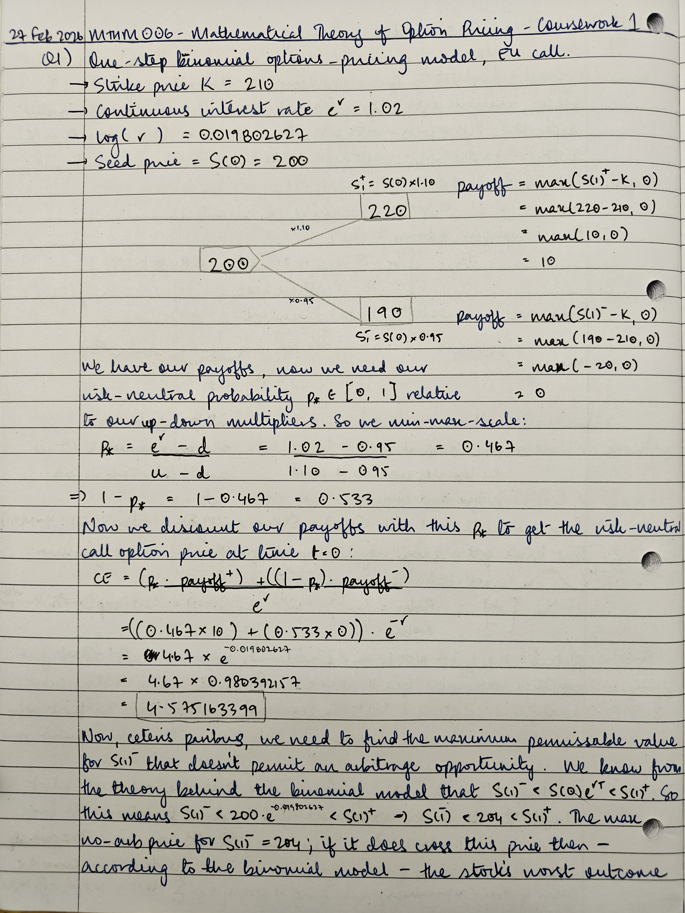
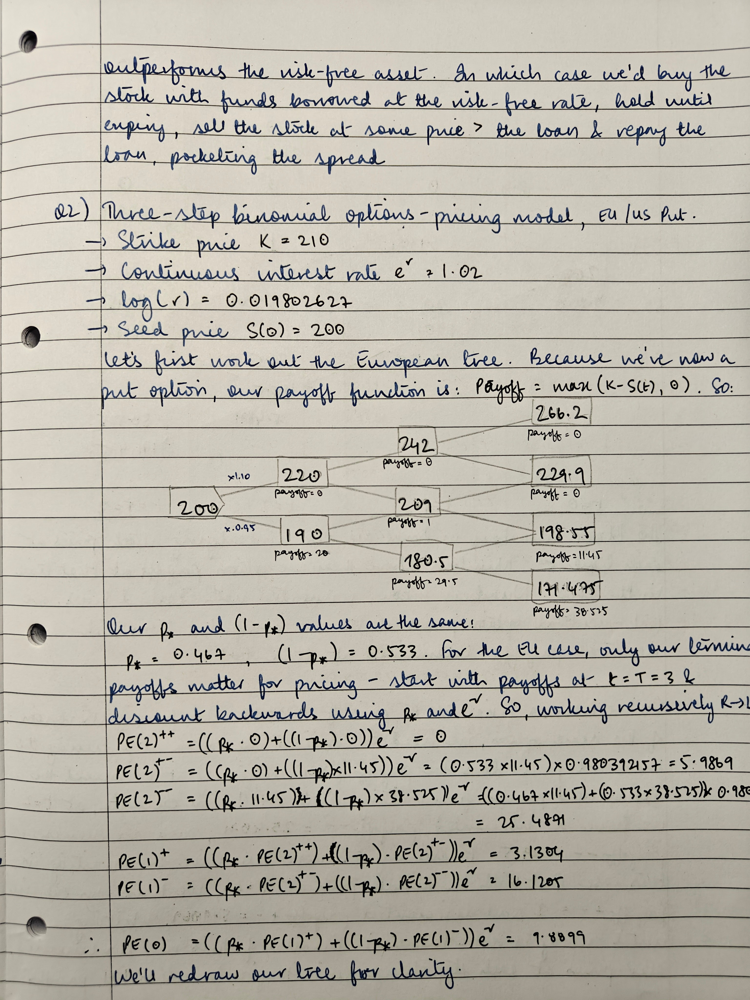
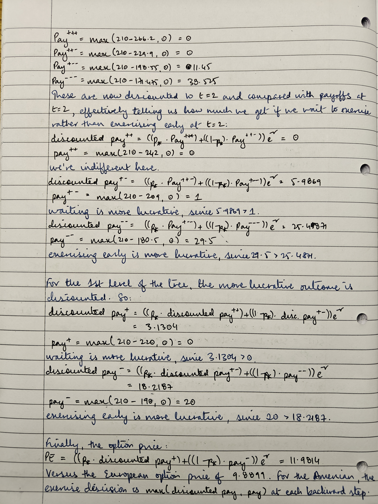
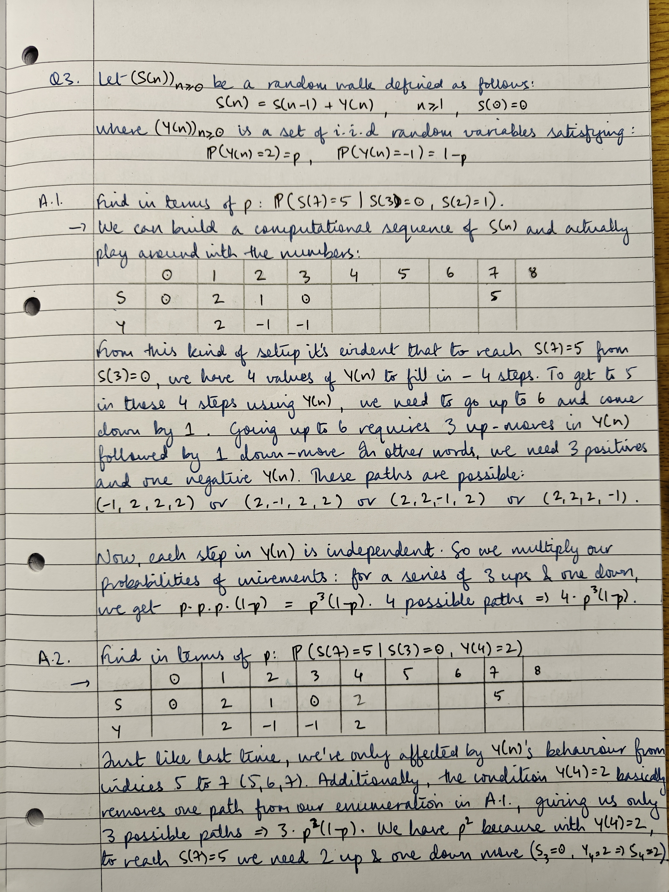
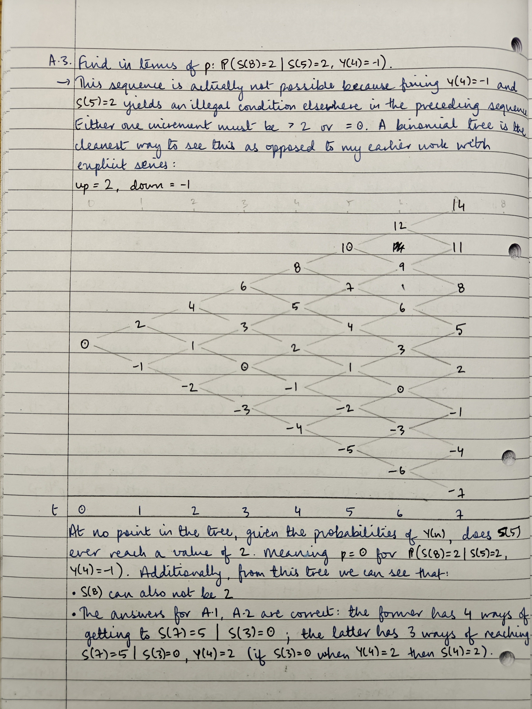
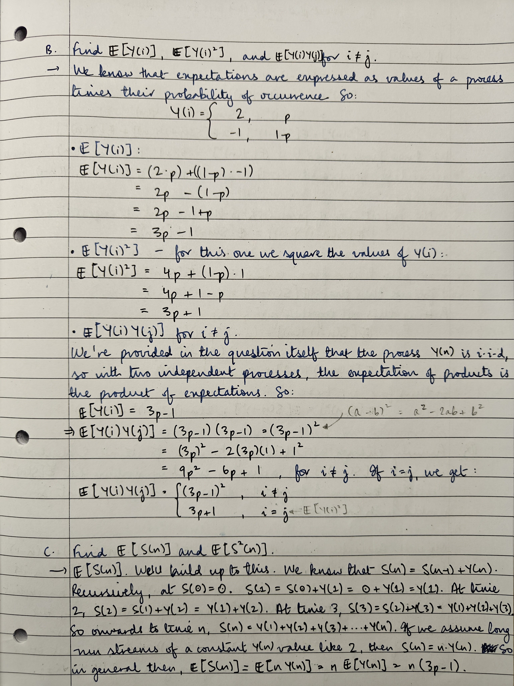
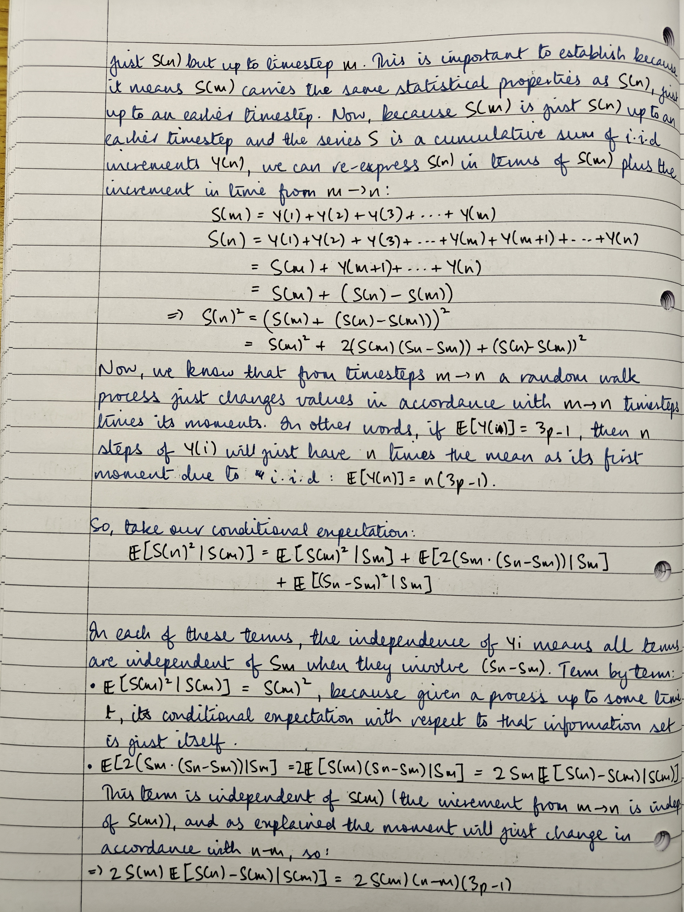
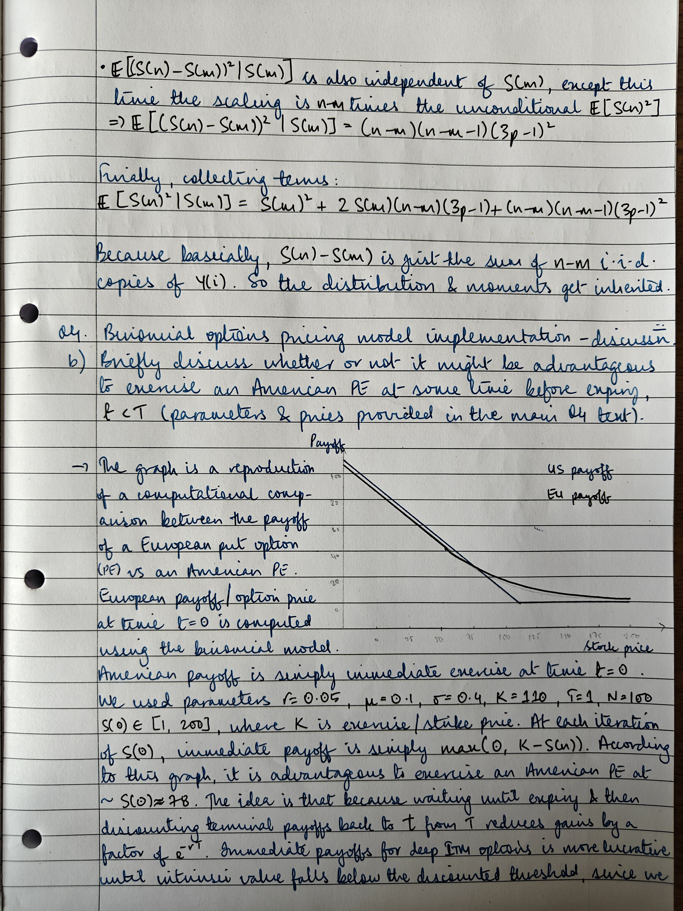
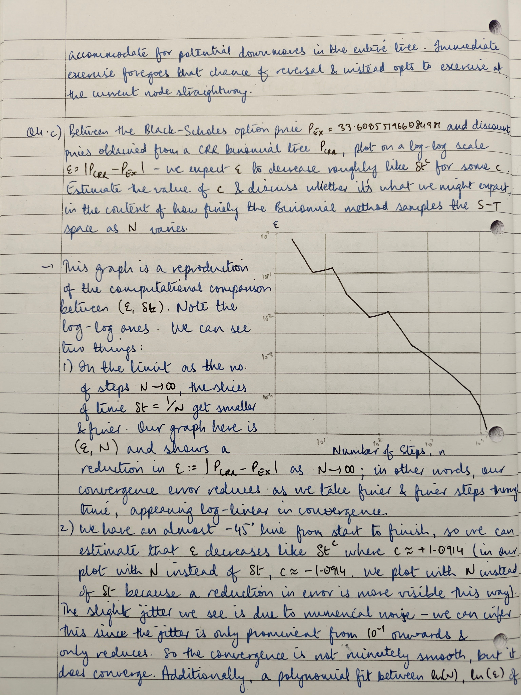
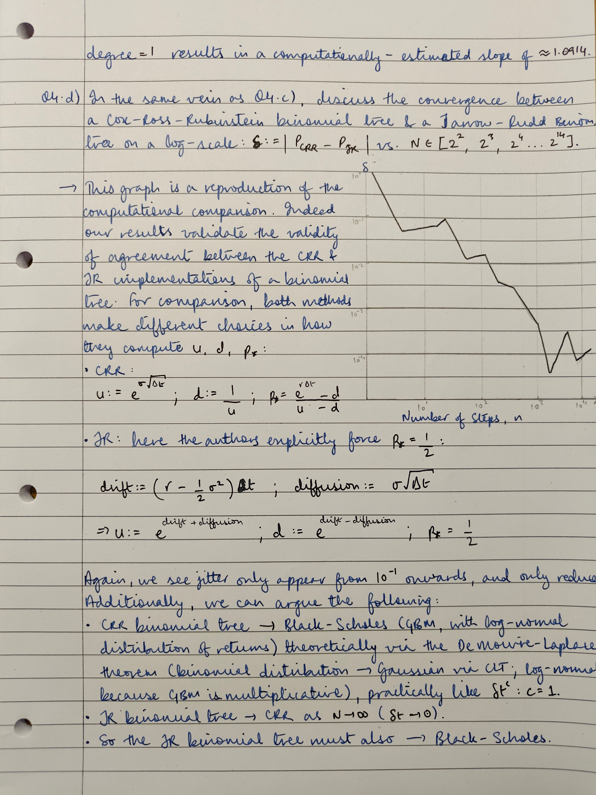

# Introduction
This submission is for MTHM006's first coursework over the year 2025-2026. Note that typesetting has been adapted from a Jupyter notebook, so some sections may not appear exactly (e.g., code blocks have been broken up here with explicit explanations to aid reasoning and preserve readability).

## Code Setup

```python
import logging
import matplotlib.pyplot as plt
import numpy as np

from datetime import datetime
from typing import Literal

# required for local testing
logging.basicConfig()
logger = logging.getLogger(__name__)
logger.setLevel(logging.INFO)

rng = np.random.default_rng(seed=42)
```

\newpage
# Question 1
Shares in a certain company are currently priced at 200 pence each. One year from now, their price will either have risen by 10% (with probability 0.3) or fallen by 5% (with probability 0.7). Take the annual risk-free interest rate as $r = \log(1.02)$ (compounded continuously).
1. Use the One-Step Binomial Model formula to find the value now of a European call option on one share with expiry date one year from now and with exercise price 210 pence.
2. Calculate the risk-neutral probability $p_*$ for the share, and verify that the risk-neutral expected discounted payoff of the call option in part (1) agrees with the value you have already found for this option.
3. Keeping all other parameters the same as in part (1), find the maximum value of $S^-$ that does not permit an arbitrage opportunity. Explain how a trader could take advantage of the arbitrage opportunity if $S^-$ rose above that value.

## Answer



\FloatBarrier



\FloatBarrier

# Question 2
Shares in a certain company are currently priced at 200 pence each. Every year their price will either rise by 10% (with probability 0.3) or fall by 5% (with probability 0.7). The annual risk-free interest rate is $r = \log(1.02)$ (compounded continuously).
1. Using the binomial model with the risk-neutral probability $p_*$ obtained in question 1, or otherwise, find the value now of a European put option on one share, with expiry date $T = 3$ years from now and with exercise price 210 pence.
2. Find the value now of an American put option on one share, with expiry date $T = 3$ years from now and with exercise price 210 pence. At each decision point in the binomial tree you will need to determine whether it is preferable to exercise the option or continue to hold.

## Answer


\FloatBarrier


\FloatBarrier


\FloatBarrier



\FloatBarrier

# Question 3
Let $(S(n))_{n \ge 0} be a random walk defined as follows:

$$ S(n) = S(n-1)+Y(n), \quad n \ge 1, \quad \text{ with } S(0)=0 $$

Where $(Y(n))_{n \ge 0}$ is a sequence of independent, identically distributed random variables satisfying:

$$ \mathbb{P}(Y(n)=2)=p, \quad \mathbb{P}(Y(n)=-1)=(1-p) $$

1. Find in terms of $p$ the following probabilities:
    1. $\mathbb{P}(S(7)=5 \vert S(3)=0,\ S(2)=1)$
    2. $\mathbb{P}(S(7)=5 \vert S(3)=0,\ Y(4)=2)$
    3. $\mathbb{P}(S(8)=2 \vert S(5)=2,\ Y(4)=-1)$
2. Find $\mathbb{E}[Y(i)],\ \mathbb{E}[Y(i)^2]$, and $\mathbb{E}[Y(i)Y(j)]$ for $i \neq j$.
2. Find $\mathbb{E}[S(n)],\ \mathbb{E}[S(n)^2]$.
2. Find $\mathbb{E}[S(n)^2 \vert S(m)]$ for $n>m$; give your answer in terms of $S(m), n, m,$ and $p$, and clearly state any properties of conditional expectations that you use.

## Answer



\FloatBarrier



\FloatBarrier



\FloatBarrier

![Answer to Q3, page 4. Please see the appendix for an iterative expansion of $\mathbb{E}[S(n)^2]$.](./images/hand_notes/IMG20260302020715.jpg)

\FloatBarrier



\FloatBarrier



\FloatBarrier

# Question 4

This question explores the accuracy of the binomial method and how it depends on the timestep size $\delta t$. You might find it helpful to refer to relevant literature or web resources to help answer parts (3) and (4). If you do so, then give properly formatted references with your answers.
1. In Matlab or Python, write a computer code, as a function, to compute the price of a European put option using the Cox-Ross-Rubenstein binomial method. The function should take as inputs the risk-free interest rate $r$, the asset price drift $\mu$, the assest price volatility $\sigma$, the asset price at the current time ($t = 0$) $S(0)$, the exercise price $E$, the expiry time $T$, and the number of steps $N$. The function should output the current price of the put option $P(0)$. Check your function by calling it with the input parameters $r = 0.1, \mu = 0.1, \sigma = 0.1, S(0) = 100, E = 100, T = 1, N = 100$; you should get the answer $0.7804$.

2. Write a script that will call your function with the parameters $r = 0.05, \mu = 0.1, \sigma = 0.4, E = 110, T = 1, N = 100$, and for different values of $S(0)$ ranging from 1 to 200. Hence, plot a graph of $P(0)$ versus $S(0)$. On the same set of axes, plot the payoff that would be obtained if it were possible to immediately exercise the put option at $t = 0$. Briefly discuss the implications of your results for whether or not it might be advantageous to exercise an American put option at some time before expiry $t < T$.

3. Set $S(0) = 75$ and the other parameters except $N$ as in part (2). You are given that the exact Black-Scholes price of the put option is then $P_{\text{ex}} = 33.608551966084981$. Use your function to compute the binomial method price of the put option $P_{\text{CRR}}$ for $N = 2^4, 2^8, 2^16, \dots, 2^213, 2^214$. For each value of $N$, compute the absolute error $\epsilon = |P_{\text{CRR}} - P_{\text{ex}}|$. We expect $\epsilon$ to decrease roughly like $\delta t^c$ for some $c$. By plotting $\epsilon$ versus $\delta t$ on a log-log plot, estimate the value of $c$. By thinking about how accurately the binomial model captures the log-normal distribution of $S(T)$, and how finely the binomial method samples the $S - t$ space as $N$ varies, or otherwise, discuss whether the observed value of $c$ is what you might expect theoretically. Comment also on the smoothness of the convergence.

4. Create a modified version of your function that uses the alternative binomial model parameters discussed by Higham (see Section 16.3 of his book - these alternative parameters are attributed to Jarrow and Rudd, 1983). Let the output of this modified function be called $P_{\text{JR}}$. For the same input parameters and the same values of $N$ as in part (3), compute $P_{\text{JR}}$. Hence plot the absolute dfference $\delta = |P_{\text{CRR}}-$P_{\text{JR}}|$ versus $\delta t$ on log-log axes. If the CRR parameters and the Jarrow-Rudd parameters are equally valid, then the results $P_{\text{CRR}}$ and $P_{\text{JR}}$ should agree with each other in the limit $\delta t \to 0$. Discuss whether your results support the idea that they are equally valid.

## Answer

A bit of guidance in our implementation of the CRR binomial model was taken from @HighamNineways.


\FloatBarrier

![Q4.2.: plot of EU discounted payoff vs. immediate exercise of a put option (PE). As described in the notes, immediate exercise is more lucrative for deep ITM PEs because the time value of money & discounting effect from $\tau \to t$ slightly reduce payoff, up to a limit ($S(t) \approx 78$) beyond which discounted payoff is more lucrative. This is because discounted payoffs account for prices potentially going ITM when waiting until expiry, whilst immediate exercise prevents any option of that happening.](./images/01Mar26-EU-US-payoffs.png)

\FloatBarrier




\FloatBarrier


\FloatBarrier

For reference, as mentioned in the handwritten notes, a 1-degree polynomial fit to $\ln(N), \ln(\epsilon)$ shows a coefficient of $\approx -1$, which means since $\delta t = 1/N, $c \approx 1$:

```python
>>> T = 1
>>> delta_ts = T / Ns
>>> slope, intercept = np.polyfit(np.log(Ns), np.log(eps), 1)
>>> print(f"Estimated convergence rate c: {slope:.4f}")
Estimated convergence rate c: -1.0914
```



\FloatBarrier


\FloatBarrier

# Appendix

## Q3(c): Finding $\mathbb{E}[S(n)^2]$

We have the following so far:

$$
\begin{align*}
    \mathbb{E}[Y(n)]&=3p-1 \\
    \mathbb{E}[Y(n)^2]&=3p+1 \\
    \mathbb{E}[Y(i)Y(j)]&=(3p-1)^2\; \forall\;  i \ne j \\
    S(n)&=S(n-1)+Y(n) \\
    S(0)&=0
\end{align*}
$$

We'll iterate through a few $n$ to see how $\mathbb{E}[S(n)^2]$ evolves.

\newpage
- $n=0$

$$
\begin{align*}
    S(0)&=0 \\
    \implies \mathbb{E}[S(0)]&=0 \\
    \therefore \mathbb{E}[S(0)^2]&=0
\end{align*}
$$

- $n=1$

$$
\begin{align*}
    S(1)&=S(0)+Y(1) \\
        &=0+Y(1) \\
        &=Y(1) \\
        \\
    \implies \mathbb{E}[S(1)]&=\mathbb{E}[Y(1)] \\
    \\
    S(1)^2&=(S(0)+Y(1))^2 \\
        &= S(0)^2+2(S(0)Y(1))+Y(1)^2 \\
        &= 0+0+Y(1)^2 \\
        &= Y(1)^2 \\
        \\
    \therefore \mathbb{E}[S(1)^2] &= \mathbb{E}[Y(1)^2] \\
        &= \boxed{ (3p+1) }
\end{align*}
$$

- $n=2$

$$
\begin{align*}
    S(2)&=S(1)+Y(2) \\
        &=Y(1)+Y(2) \\
    \\
    \implies \mathbb{E}[S(2)]
        &=\mathbb{E}[Y(1)]+\mathbb{E}[Y(2)] \\
        &=(3p-1)+(3p-1) \\
        &=2(3p-1) \\
        \\
    S(2)^2&=(S(1)+Y(2))^2 \\
        &=S(1)^2+2(S(1)Y(2))+Y(2)^2 \\
        &=Y(1)^2+2(Y(1)Y(2))+Y(2)^2 \\
        \\
    \therefore \mathbb{E}[S(2)^2]
        &= \mathbb{E}[Y(1)^2]
            +2\mathbb{E}[Y(1)Y(2)]
            +\mathbb{E}[Y(2)^2] \\
        &= (3p+1)+2(3p-1)^2+(3p+1) \\
        &= \boxed{ 2(3p+1)+2(3p-1)^2 }
\end{align*}
$$

- $n=3$

$$
\begin{align*}
    S(3)&=S(2)+Y(3) \\
        &=Y(1)+Y(2)+Y(3) \\
        \\
    \implies \mathbb{E}[S(3)]
        &= \mathbb{E}[Y(1)]
            +\mathbb{E}[Y(2)]
            +\mathbb{E}[Y(3)] \\
        &= (3p-1)+(3p-1)+(3p-1) \\
        &= 3(3p-1) \\
        \\
    S(3)^2 &= (S(2)+Y(3))^2 \\
        &= S(2)^2+2(S(2)Y(3))+Y(3)^2 \\
        &= Y(1)^2
            +2(Y(1)Y(2))
            +Y(2)^2
            +2((Y(1)+Y(2))(Y(3)))
            +Y(3)^2 \\
        \\
    \therefore \mathbb{E}[S(3)^2]
        &= \mathbb{E}[Y(1)^2]
            +2\mathbb{E}[Y(1)Y(2)]
            +\mathbb{E}[Y(2)^2]
            +2\mathbb{E}[(Y(1)+Y(2))(Y(3))]
            +\mathbb{E}[Y(3)^2]	\\
        &= 2(3p+1)
            +2(3p-1)^2
            +2\mathbb{E}[(Y(1)+Y(2))(Y(3))]
            +(3p+1) \\
        &= 3(3p+1)
            +2(3p-1)^2
            +2\mathbb{E}[(Y(1)+Y(2))(Y(3))] \\
        &= 3(3p+1)
            +2(3p-1)^2
            +2(\mathbb{E}[Y(1)+Y(2)]\mathbb{E}[Y(3)]) \\
        &= 3(3p+1)
            +2(3p-1)^2
            +2(
                (\mathbb{E}[Y(1)]+\mathbb{E}[Y(2)])
                \mathbb{E}[Y(3)]
            ) \\
        &= 3(3p+1)
            +2(3p-1)^2
            +2(
                ((3p-1)+(3p-1))
                (3p-1)
            ) \\
        &= 3(3p+1)
            +2(3p-1)^2
            +2(2(3p-1)(3p-1)) \\
        &= 3(3p+1)
            +2(3p-1)^2
            +2(2(3p-1)^2) \\
        &= 3(3p+1)+2(3p-1)^2+4(3p-1)^2 \\
        &= \boxed{ 3(3p+1)+6(3p-1)^2 }
\end{align*}
$$

- $n=4$

$$
\begin{align*}
    S(4)&=S(3)+Y(4) \\
        &= Y(1)+Y(2)+Y(3)+Y(4) \\
    \\
    \implies \mathbb{E}[S(4)]
        &= \mathbb{E}[Y(1)]
            +\mathbb{E}[Y(2)]
            +\mathbb{E}[Y(3)]
            +\mathbb{E}[Y(4)] \\
        &= (3p-1)+(3p-1)+(3p-1)+(3p-1) \\
        &= 4(3p-1) \\
        \\
    S(4)^2 &= (S(3)+Y(4))^2 \\
        &= S(3)^2+2(S(3)Y(4))+Y(4)^2 \\
        &= Y(1)^2
            +2(Y(1)Y(2))
            +Y(2)^2
            +2((Y(1)+Y(2))(Y(3)))
            +Y(3)^2 \\
            &\ +2((Y(1)+Y(2)+Y(3))(Y(4)))
            +Y(4)^2 \\
        \\
    \therefore \mathbb{E}[S(4)^2]
        &= \mathbb{E}[Y(1)^2]
            +2\mathbb{E}[Y(1)Y(2)]
            +\mathbb{E}[Y(2)^2]
            +2\mathbb{E}[(Y(1)+Y(2))(Y(3))]
            +\mathbb{E}[Y(3)^2] \\
            &\ +2\mathbb{E}[((Y(1)+Y(2)+Y(3))(Y(4))]
            +\mathbb{E}[Y(4)^2] \\
        &= 3(3p+1)
            +6(3p-1)^2
            +2\mathbb{E}[((Y(1)+Y(2)+Y(3))(Y(4))]
            +(3p+1) \\
        &= 4(3p+1)
            +6(3p-1)^2
            +2\mathbb{E}[((Y(1)+Y(2)+Y(3))(Y(4))] \\
        &= 4(3p+1)
            +6(3p-1)^2
            +2(\mathbb{E}[Y(1)+Y(2)+Y(3)]\mathbb{E}[Y(4)]) \\
        &= 4(3p+1)
            +6(3p-1)^2
            +2(
                (
                        \mathbb{E}[Y(1)]
                    +\mathbb{E}[Y(2)]
                    +\mathbb{E}[Y(3)]
                )
                \mathbb{E}[Y(4)]
            ) \\
        &= 4(3p+1)
            +6(3p-1)^2
            +2(((3p-1)+(3p-1)+(3p-1))(3p-1)) \\
        &= 4(3p+1)
            +6(3p-1)^2
            +2(3(3p-1)(3p-1)) \\
        &= 4(3p+1)+6(3p-1)^2+2(3(3p-1)^2) \\
        &= 4(3p+1)+6(3p-1)^2+6(3p-1)^2 \\
        &= \boxed{ 4(3p+1)+12(3p-1)^2 }
\end{align*}
$$

Notice that our final expression coefficients evolve like so:

| $n$ | $(3p+1)$ | $(3p+1)^2$ |
| --- | -------- | ---------- |
|   0 |        0 |          0 |
|   1 |        1 |          0 |
|   2 |        2 |          2 |
|   3 |        3 |          6 |
|   4 |        4 |         12 |

Which means coefficients of $(3p+1)$ scale like $n$, whilst coefficients of $(3p-1)^2$ scale like $n(n-1)$. Putting this all together, we get:
$$ \boxed{ \mathbb{E}[S(n)^2] = n(3p+1)+n(n-1)(3p-1)^2 } $$

# References
