# Introduction
This submission is for MTHM006's second coursework over the year 2025-2026. Note that typesetting has been adapted from a Jupyter notebook, so some sections may not appear exactly (e.g., code blocks have been broken up here with explicit explanations to aid reasoning and preserve readability).

## Code Setup

```python
import logging
import matplotlib.pyplot as plt
import numpy as np

from datetime import datetime
from scipy.stats import norm

logging.basicConfig()
logger = logging.getLogger(__name__)
logger.setLevel(logging.INFO)

rng = np.random.default_rng(seed=42)
```

# Answer 1

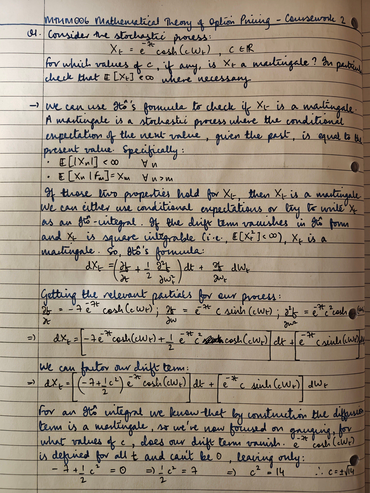

\FloatBarrier

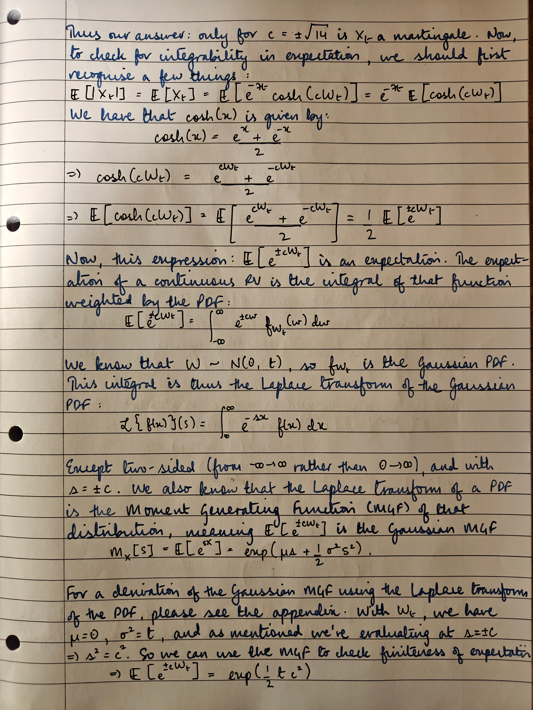

\FloatBarrier

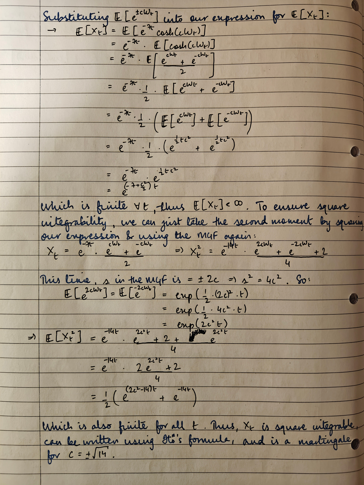

\FloatBarrier

# Answer 2

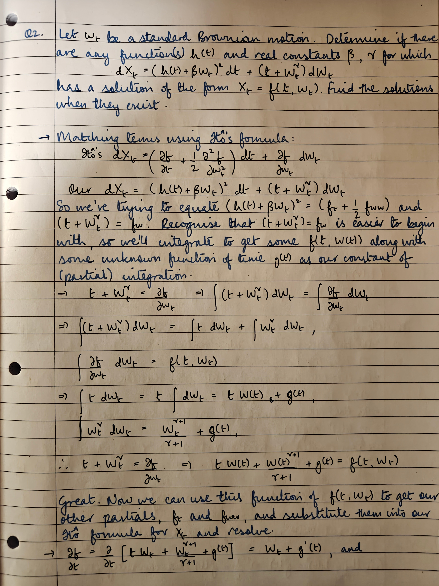

\FloatBarrier

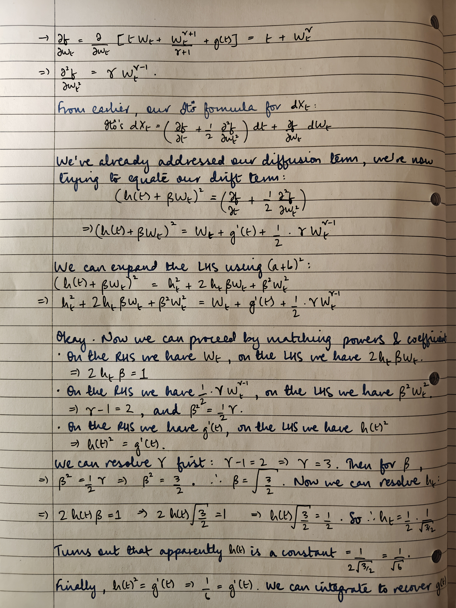

\FloatBarrier

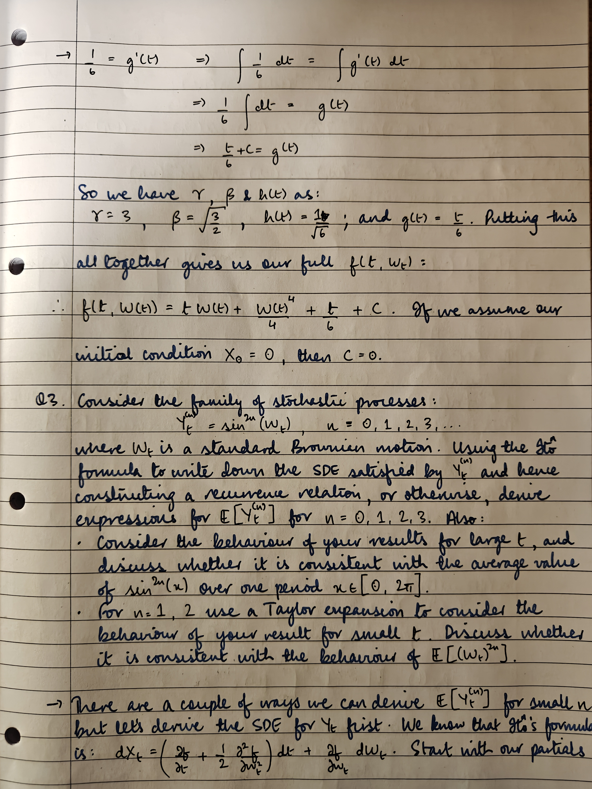

\FloatBarrier

# Answer 3


\FloatBarrier

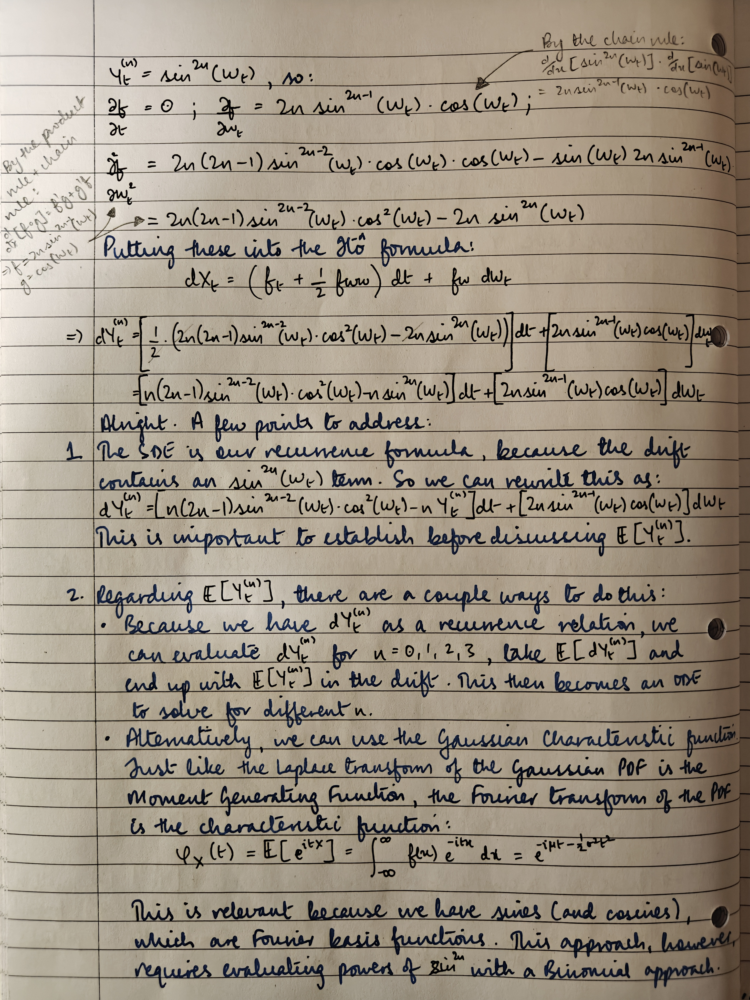

\FloatBarrier

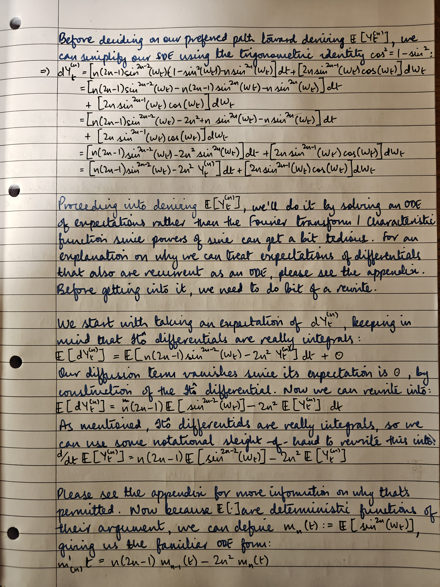

\FloatBarrier

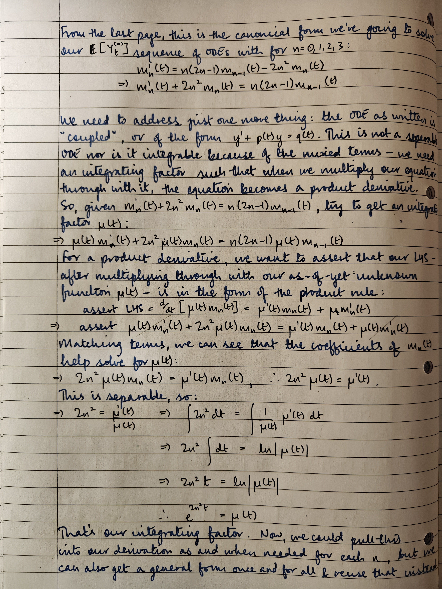

\FloatBarrier

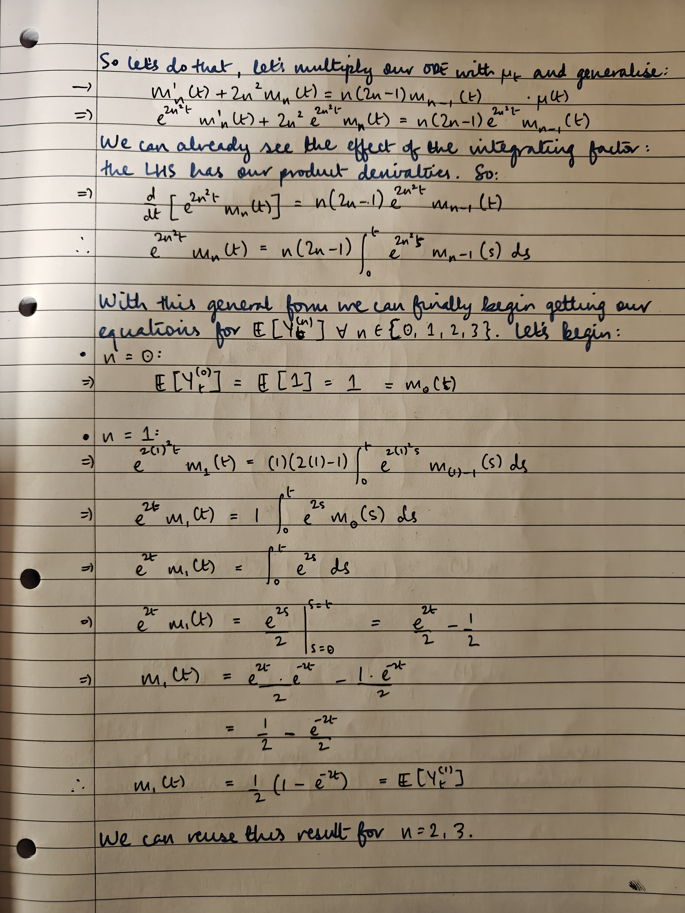

\FloatBarrier

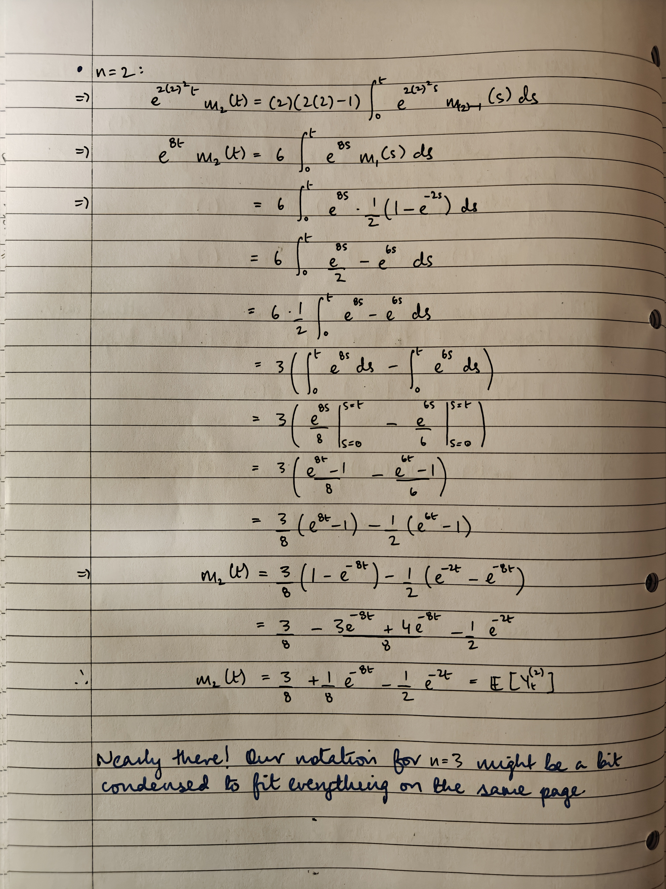

\FloatBarrier

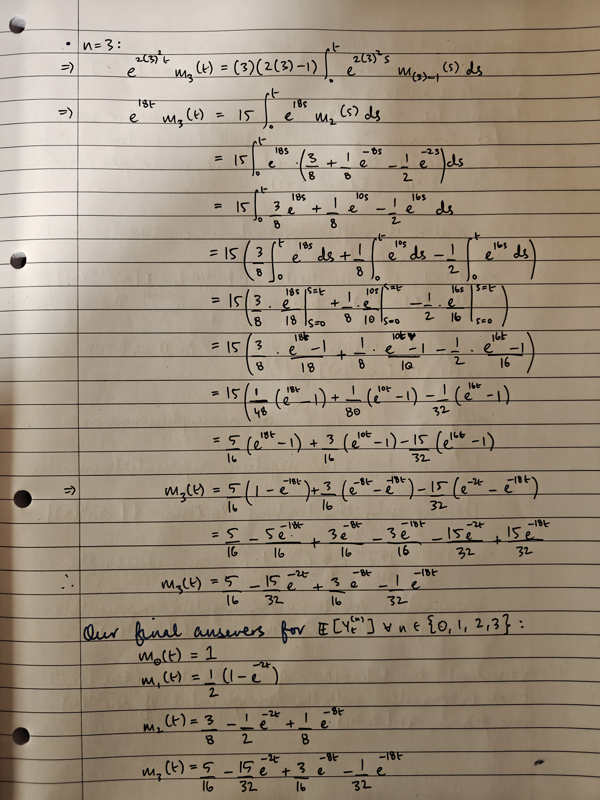

\FloatBarrier

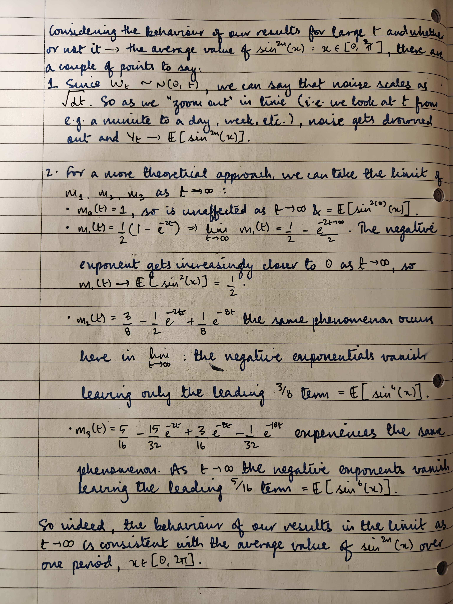

\FloatBarrier

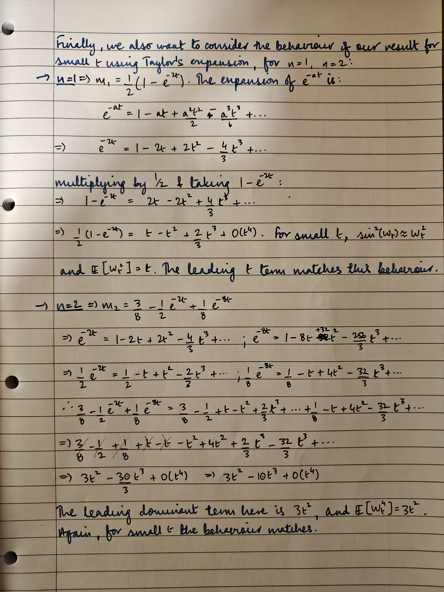

\FloatBarrier

# Answer 4

In this question you will investigate the use of the Monte Carlo method for pricing different options. When you discuss your results you should refer to appropriate mathematical and financial ideas. For this question use the following parameter values:

|          |         |        |                                |
| -------- | ------- | ------ | ------------------------------ |
| $r$      | `r`     | $0.01$ | Risk-free interest rate        |
| $\mu$    | `mu`    | $0.02$ | Drift parameter for asset      |
| $\sigma$ | `sigma` | $0.1$  | Volatility parameter for asset |
| $S_0$    | `S0`    | $100$  | Initial asset price            |
| $E$      | `E`     | $110$  | Exercise price                 |
| $T$      | `T`     | $5$    | Expiry time                    |

Write a function that will generate a single risk neutral asset price path of $N$ equal steps using the geometric Brownian Motion asset price model. Your function should take $N$ and any other relevant parameters as inputs. Write another function that will compute the payoff for a European call option. Your function should take the expiry time asset price $S_T$ and any other relevant parameters as inputs. Finally, write a function that will compute $C_{BS}(0)$, the exact Black-Scholes price of a European call option at time $t=0$, taking any relevant parameters as inputs.

1. Set $N=512$ and use your implementation of the Monte Carlo method to estimate $C_{MC}^{(M)}(0)$, the Monte Carlo price of a European call option at time $t=0$ based on $M$ independent asset price paths. Let $M$ take the values $\{4^k : k=1, 2, \dots, 10\}$. For each value of $M$ , compute the error

    $$ \varepsilon^{(M)} = \lvert C_{MC}^{(M)}(0) - C_{BS}(0) \rvert $$

    Discuss whether the Monte Carlo price appears to converge to the Black-Scholes price as $M$ becomes large for this problem, and, if so, whether it does so at the expected rate. You might find it helpful to plot $\varepsilon^{(M)}$ versus $M$ on suitably scaled axes.

2. Fix the number of asset price paths at $10^6$ and let $N$ take the values $\{1, 2, 4, 8,\dots, 1024\}$. Discuss how the Monte Carlo estimate for the price of the European call option depends on $N$, and whether this behaviour is what you would expect.

3. Do you expect the Monte Carlo method to exactly respect Put-Call Parity for European call and put options for finite $M$ and $N$? Write down a theoretical argument to justify your answer, stating clearly any conditions that you assume. Use your computer code to generate some example results that support your answer, giving a clear explanation.

4. Consider now a Down-and-Out call option with barrier $B$ and other parameters as above. Adapt your Monte Carlo code to compute $D_MC(0)$, the price at $t=0$ of this
Down-and-Out call option. Set $M=10^5$ and $N=512$ to compute $D_MC(0)$ for a suitable set of values of $B$ in the range $[0, 100]$. Plot a graph of the option price at
$t=0$ versus $B$, and give a financial interpretation.

5. For the Down-and-Out option, fix $B=95$, fix the number of asset price paths at $10^6$ and let $N$ take the values $\{1, 2, 4, 8, \dots, 1024\}$. Discuss how the Monte Carlo price depends on $N$, whether this behaviour is what you expect, and how the behaviour compares with that seen in part (2).

## Answer

Henceforth, "Monte Carlo" is abbreviated "MC"; "call option" is abbreviated "CE" (likewise, "PE" for a "put option"); "Black-Scholes" is abbreviated "B-S"; "Put-Call Parity" is abbreviated "PCP".

1. On the convergence of EU CE pricing with MC vs the exact B-S price.

    We have the following log-log graph:

    

    \FloatBarrier

    A few comments on our implementation: first and foremost, EU option pricing only requires terminal prices $S_T$. Simulating a bunch of _paths_ with GBM is redundant since we only need $S_T$; we can leverage the exact GBM solution to get it:

    $$ S(T) = S(0) \exp ((mu - \frac{1}{2}\sigma^2)T + \sigma \sqrt{T} W(t)) $$

    We are still dependent however on how many terminal prices we opt to generate: too few and our statistical estimates are noisy, whilst large enough $M$ lets us refine our average. The visible jitter in the line for $\varepsilon$ is due to numerical noise. Mathematically then, with a large enough sample size $M$ we aymptotically approach the exact, analytical B-S price.

    Financially, one might point out that using GBM as the asset price path generator is flawed because it doesn't allow for time-varying volatility/drift parameters, nor does it pick on the heavy-tailed or peaked behaviour of empirical asset returns. However, the comparison between simulated GBM and B-S is well-founded because classical B-S is, in fact, based on GBM.

2. On the dependence of the MC-estimated EU CE price on $N$, the number of time steps taken between $[0, T]$.

    This question is rather suspicious (and memory intensive). EU option pricing depends only on $S_T$ and not the entire price path of the underlying from time $[0, T-\delta t]$. $N$, the number of steps taken between $[0, T]$ is thus irrelevant. In other words, the resolution of the time grid for a price path is irrelevant to how accurate an MC estimate of an EU option price is. As such, increasing $N$ (making $\Delta t$ finer) just yields a (theoretically) constant MC estimate since $M=10^6$ is a constant, _ceteris paribus_.

    Given the way the simulation is setup, however: first with $N=1$, then $N=2$, $N=4$, $\dots N=1024$, each iteration will result in a different set of terminal prices because the Wiener array $W(t)=$`rng.standard_normal(size=n_sims)` is different. So due to the random draws of $W(t)$, numerically the estimate will vary which is what we see:

    ![Q4.2.: MC-estimated EU CE price vs. the number of time steps $N$ from $[0, T]$. $\{N=1, 2, 4, \dots, 1024\}$. The relationship between $\Delta t$ and $N$ is $\Delta t = N^{-1}$. Note the miniscule variation of the y-axis: from 6.955 to 6.995 (+0.040), showing that despite $N$ growing ($\Delta t$ getting finer), the only variation in EU CE price comes from the random draws of the Wiener array W(t).](./images/17Mar26-mc-eu-ce-price-dependence-on-numsteps-N.png)

    \FloatBarrier

3. On the exactness between MC and PCP for EU option pricing, given a finite number of simulated paths $M$ and time steps $N$.

    The MC method of option pricing is usually run computationally. Computational work is subject to computational noise due to the representation of floating-point numbers, and chains of computational operations tend to propagate numerical inaccuracy through. Pricing via PCP or otherwise is exact and analytic; as such, expecting the MC method to exactly respect PCP for EU CE/PE options for a _finite_ $M$ and $N$ is an unrealistic expectation because numerical noise amplifies computational artefacts in calculations. For an infinite $M$ and $N$ however the expectation (should) hold(s) @PyIEEE754_floats.

    Financially, put-call parity is interesting: if we go to an index's option chain and attempt to reconcile PE and CE prices using PCP, we would never expect an exact match because PCP is an idealised no-arbitrage identity, whilst market prices have no obligation to behave "risk-neutrally". There are numerous physical factors that play into slight differences in market prices from the theoretical PCP price, the most impactful being liquidity and depth of market (DoM). As such, one could interpret the noisy behaviour of MC simulations as a representation of physical market noise; nevertheless finite $M, N$ MC simulations should not be expected to match PCP exactly.

4. On the behaviour of a Down-and-Out CE price as the barrier price $B \to S(0)$

    ![Q4.4.: Price of a down-and-out CE as the barrier $B$ gets closer to $S(0)$. Tested values of $b \in [0, 10, 20, \dots, 100]$. We can see that the closer $B$ gets to the price of the underlying at contract initiation (the "initial price"), the less the option is worth because effectively, the underlying is choked: $B$ being broken negates completely any potential payoff, and $B$ being too close to $S(0)$ means even the slightest unfavourable move negates the entire option. Financially, certainly no investor would pay heavily for such a contract.](./images/17Mar26-dno-ce-price-as-barrier-approaches-s0.png)

    \FloatBarrier

5. On the dependence of the MC-estimated down-and-out CE price on $N$.

    First and foremost, versus part (2) wherein we considered GBM for a EU CE, here indeed the down-and-out option pricing is path-dependent. Whilst part (2) had no dependence on $N$ since EU option pricing only requires $S_T$, here we should see dependence.

    Because of this dependence on $N$, as $N \uparrow$ (i.e. as $\Delta t$ gets finer), we take more and more steps at a higher resolution over $[0, T]$. With GBM, noise scales multiplicatively with each step, so it's understandable that the more steps we take, the more statistical realism we get: a single point estimate is just one random price point that may or may not have breached $B$. With larger $N$, we have more "temporal space" to potentially breach $B$ with the parameters of our simulation. So we get a finer look at potential behaviour _in one path_, with MC averaging over multiple paths bringing our simulated option prices into a stable region of convergence:

    ![Q4.5.: MC-estimated down-and-out CE price vs. the number of time steps $N$ from $[0, T]$. $\{N=1, 2, 4, \dots, 1024\}$. The relationship between $\Delta t$ and $N$ is $\Delta t = N^{-1}$.](./images/17Mar26-mc-dno-ce-price-dependence-on-numsteps-N.png)

    This is quite interesting because it essentially begs the question - given our structure - "is GBM ergodic?" Does GBM-simulated paths' time-average equal its space-average in the asymptotic limit as $M \to \infty$ whilst we hold $N$ fixed (or very small), or as $N \to \infty$ whilst we hold $M$ fixed (or very small)? A stochastic process is ergodic if time averages along a single path converge to ensemble averages; with GBM, log-returns are assumed to be stationary but this doesn't imply that price levels are stationary. This is also practically true: empirical asset returns over a long period of time are stationary whilst price still drifts. So naturally then when looking at price _level_, the longer we look at such a process the more information we can absorb, especially relative to some barrier $B$ that has an effect on our portfolio's payoff.

    \FloatBarrier

# Appendix
## Laplace Transforms of PDFs
We know that the Laplace transform @WikiLaplaceSSFormalDefinition $\mathscr{L}\{f(t)\}(s)$ of some function of time $f(t)$, is given by:

$$  \mathscr{L}\{f(t)\}(s) = \int_0^{\infty} e^{-st} f(t) dt $$

In question 1, we had an expectation of the form $\mathbb{E}[e^{cW_t}]$. Breaking this down, we have the Wiener process $W_t \sim  \mathcal{N}(0, t)$ raised to an exponential, $e^{W_t}$, and scaled with some scalar $c$.

Let's say we have some Normally distributed random variable (RV) $X$ that takes values $x$. In other words, each value $x \in X$ is Normally distributed, or $x \in X : X \sim \mathcal{N}(\mu, \sigma)$. The probability density function (PDF) of $X$ is the Gaussian PDF:

$$ f(x) = \int_{-\infty}^{\infty} \frac{1}{\sqrt{2  \pi  \sigma^2}} e^{-\frac{(x-\mu)^2}{2\sigma^2}} $$

The "expectation" of $X$ (its first moment/mean) is given by:

$$  \mathbb{E}[X] = \int_{-\infty}^{\infty} x f(x) dx $$

Or, all values $x \in X$ multiplied by the PDF of $X$. Now if we apply some function to $X$ like $g(x)$ (where $g(\cdot)$ might be $\sin(X)$, $e^X$, etc.) the general expectation is:

$$  \mathbb{E}[g(X)] = \int_{-\infty}^{\infty} g(x) f(x) dx $$

This is sensible because let's say for example $X$ can just assume two values:

| value of $X$ | probability |
| ------------ | ----------- |
| $0$          | 0.75        |
| $\pi/2$      | 0.25        |

Then

$$
\begin{align*}
    \sin(0)&=0 \\
    \sin(\pi/2)&=1
\end{align*}
$$

So in discrete terms, the expectation is just each value of $g(x)$ times its probability:

$$  \mathbb{E}[\sin(X)] = 0\cdot0.75 + 1\cdot0.25 = 0.25 $$

The continuous case just replaces the sum with an integral. Coming back to our case, the expectation of $e^X$ (where $g(\cdot) = e$) is thus:

$$  \mathbb{E}[e^X] = \int_{-\infty}^{\infty} e^x \frac{1}{\sqrt{2  \pi  \sigma^2}} e^{-\frac{(x-\mu)^2}{2\sigma^2}} dx $$

And likewise, if the expectation of a scaled exponential $X$, $\mathbb{E}[e^{cX}]$, is given by:

$$  \mathbb{E}[e^{cX}] = \int_{-\infty}^{\infty} e^{cx} \frac{1}{\sqrt{2  \pi  \sigma^2}} e^{-\frac{(x-\mu)^2}{2\sigma^2}} dx $$

Which is identical to the two-sided Laplace transform @WikiLaplaceSSBilateral $\mathscr{L}\{f(t)\}(s) \big|_{-\infty}^{+\infty}$ with $s=-c$. Crucially, notice that the Laplace transform and expectations both involve integrals.

## Gaussian MGF as its Laplace Transform
So let's work out the two-sided Laplace transform of the Gaussian PDF. We can do this without having to worry about limits because the Gaussian is symmetric.

$$
\begin{align*}
    \mathscr{L}\{f(x)\}(s=-t)
        &= \int_{-\infty}^{\infty} e^{-xt} \frac{1}{\sqrt{2\pi\sigma^2}} e^{-\frac{(x-\mu)^2}{2\sigma^2}} dx \\
        &= \frac{1}{\sqrt{2\pi\sigma^2}} \int_{-\infty}^{\infty} e^{-\frac{(x-\mu)^2}{2\sigma^2}-xt} dx \\
        &= \frac{1}{\sqrt{2\pi\sigma^2}} \int_{-\infty}^{\infty}
            e^{-\frac{(x-\mu)^2 -2\sigma^2 xt}{2\sigma^2}} dx \\
        &= \frac{1}{\sqrt{2\pi\sigma^2}} \int_{-\infty}^{\infty}
            e^{-\frac{x^2-2x\mu+\mu^2-2\sigma^2 xt}{2\sigma^2}} dx \\
        &= \frac{1}{\sqrt{2\pi\sigma^2}} \int_{-\infty}^{\infty}
            e^{-\frac{1}{2\sigma^2}(x^2-2x\mu+\mu^2-2\sigma^2 xt)} dx \\
        &= \frac{1}{\sqrt{2\pi\sigma^2}} \int_{-\infty}^{\infty}
            e^{-\frac{1}{2\sigma^2}(x^2-2x\mu-2\sigma^2 xt+\mu^2)} dx \\
        &= \frac{1}{\sqrt{2\pi\sigma^2}} \int_{-\infty}^{\infty}
            e^{-\frac{1}{2\sigma^2}(x^2-2(\mu+\sigma^2t)x+\mu^2)} dx \\
\end{align*}
$$

The only way we can continue from here is by completing the square: we have in parentheses something resembling $(x+A)^2$:

$$ x^2-2(\mu+\sigma^2t)x+? \stackrel{?}{=} (x+A)^2 $$

Clearly, $A = (\mu + \sigma^2 t)$. But we also have a $+\mu^2$ slapped onto the end, and of course if we're adding a term we ought to remove it (effectively adding 0). So:
- If $A = (\mu + \sigma^2 t)$, then:
    $$ (x-A)^2 = (x-(\mu+\sigma^2 t))^2 = x^2 - 2(\mu+\sigma^2 t)x + \boxed{ (\mu+\sigma^2t)^2 }$$
- That boxed term is the one we need to subtract to maintain parity, so we rewrite the parentheses as:
    $$ x^2 - 2(\mu+\sigma^2 t)x + (\mu+\sigma^2t)^2 - (\mu+\sigma^2t)^2 + \mu^2 $$

$$
\begin{align*}
    \mathscr{L}\{f(x)\}(s=-t)
        &= \frac{1}{\sqrt{2\pi\sigma^2}} \int_{-\infty}^{\infty}
            e^{-\frac{1}{2\sigma^2}(
                x^2 - 2(\mu+\sigma^2 t)x + (\mu+\sigma^2t)^2 - (\mu+\sigma^2t)^2 + \mu^2
            )} dx \\
        &= \frac{1}{\sqrt{2\pi\sigma^2}} \int_{-\infty}^{\infty}
            e^{-\frac{1}{2\sigma^2}(
                (x-(\mu+\sigma^2 t))^2 - (\mu+\sigma^2t)^2 + \mu^2
            )} dx \\
\end{align*}
$$

Now we can separate terms that depend on $x$ and those that don't:

$$
\begin{align*}
    -(\mu+\sigma^2t)^2 + \mu^2 &= -\mu^2 -2\mu \sigma^2 t -\sigma^4t^2 +\mu^2 \\
        &= -2\mu\sigma^2t-\sigma^4t^2
\end{align*}
$$

Substituting this expansion back into the parentheses and multiplying through by the leading $-1/2\sigma^2$:

$$
\begin{align*}
    \mathscr{L}\{f(x)\}(s=-t)
        &= \frac{1}{\sqrt{2\pi\sigma^2}} \int_{-\infty}^{\infty}
            e^{-\frac{1}{2\sigma^2}(
                (x-(\mu+\sigma^2 t))^2 -2\mu\sigma^2t-\sigma^4t^2
            )} dx \\
        &= \frac{1}{\sqrt{2\pi\sigma^2}} \int_{-\infty}^{\infty}
            e^{-\frac{1}{2\sigma^2}
                (x-(\mu+\sigma^2 t))^2 +\mu t +\frac{1}{2}\sigma^2t^2
            )} dx \\
\end{align*}
$$

Finally, pulling whatever doesn't depend on $x$ out of the integral:

$$
\begin{align*}
    \mathscr{L}\{f(x)\}(s=-t)
        &= \frac{1}{\sqrt{2\pi\sigma^2}} \cdot e^{\mu t+\frac{1}{2}\sigma^2t^2}
            \int_{-\infty}^{\infty} e^{-\frac{1}{2\sigma^2}(x-(\mu+\sigma^2 t))^2} dx \\
        &= e^{\mu t+\frac{1}{2}\sigma^2t^2} \cdot \underbrace{ \frac{1}{\sqrt{2\pi\sigma^2}}
            \int_{-\infty}^{\infty} e^{-\frac{1}{2\sigma^2}(x-(\mu+\sigma^2 t))^2} dx }_{\text{sums to 1}}
\end{align*}
$$

Shows us that the scaling factor times the integral is, quite literally, the integral of the Gaussian PDF. PDFs always integrate to $1$, meaning the only component that's left behind is:

$$ \therefore \mathscr{L}\{f(x)\}(s=-t) = e^{\mu t+\frac{1}{2}\sigma^2t^2} = M_X(t) $$

Which is the Gaussian Moment Generating Function (MGF), $M_X(t)$ @WikiLaplaceSSProbaTheory. To get our moments using an MGF, we differentiate $n$ times for the $n$th moment. In our case, we wanted $\mathbb{E}[e^{\pm cW_t}]$ and $\mathbb{E}[e^{\pm 2cW_t}]$ where $W_t \sim \mathcal{N}(0,t)$ (recall that $\sigma^2=t$ for the Wiener process). As shown in the coursework then:
- $\mathbb{E}[e^{\pm cW_t}] = \mathscr{L}\{f(x)\}(s=\pm c) = e^{\frac{1}{2}tc^2}$
- $\mathbb{E}[e^{\pm 2cW_t}] = \mathscr{L}\{f(x)\}(s=\pm 2c) = e^{\frac{1}{2}4c^2t} = e^{2c^2t}$

## Fourier Transforms of PDFs
To mention en passant, if we let the Laplace transform's argument $s$ take on imaginary values, i.e. if we let $s = i\omega$ (a Wick rotation, in some sense), we get the Fourier transform @WikiLaplaceSSFourier:

$$
\begin{align*}
    \mathscr{L}\{f(t)\}(s) &= \int_0^{\infty} e^{-st} f(t) dt \\
    \mathscr{F}\{f(t)\}(s) &= \int_{-\infty}^{\infty} e^{i\omega t} f(t) dt
\end{align*}
$$

The Fourier transform of a PDF is its characteristic function @WikiCharacteristicFunc which always exists, unlike the MGF which might not always exist. The characteristic function of the Gaussian is:

$$ \mathbb{E}[e^{-itx}] = e^{-i\mu t} e^{-\frac{1}{2}\sigma^2 t^2}$$

This is relevant because in question 3, we were trying to find $\mathbb{E}[\sin^{2n}(W_t)]$. The presence of trigonometric functions strongly hints towards the use of the Fourier transform which, in most cases, greatly simplifies analytics. In our case, representing $\sin^{2n}(W_t)$ as exponentials and taking powers requires repeated application of the binomial theorem when expanding $\sin^2(W_t), \sin^4(W_t), \sin^6(W_t)$ @WikiTrigIdsSSRelationToComplexExponential, @ChatGPTFourier:

$$
\begin{align*}
    \sin^{2n}(x) &= \left( \frac{e^{ix}-e^{-ix}}{2i} \right)^{2i} \\
    &= \frac{1}{2^{2n}} \sum \limits_{k=0}^{2n} \binom{2n}{k} (-1)^k e^{i(2n-2k)x}
\end{align*}
$$

Which can be relatively tedious in intuition versus solving a recursive chain of ODEs.

## How differentials of expectations can be treated as ODEs
In question 3, we found $\mathbb{E}[Y_t^{(n)}]$, where $Y_t^{(n)} = \sin^{2n}(W_t)$, with a recursion:

$$ \mathbb{E}[dY_t^{(n)}] = n(2n-1) \mathbb{E}[\sin^{2n-2}(W_t)]-2n^2 \mathbb{E}[Y_t^{(n)}] dt $$

We then defined $m_n(t) := \mathbb{E}[\sin^{2n}(W_t)]$ and rewrote that expectation expression into an ODE:

$$ m_n'(t) = n(2n-1) m_{n-1}(t) - 2n^2 m_n(t) $$

It might seem rather odd that we can treat expectations - functionals that work on probability distributions - as functions or ODEs. In general this is actually true because though an expectation is a functional that operates on a probability distribution, it's deterministic: an expectation doesn't sample, and expectation is just an integral. For example, the expectation of a Gaussian-distributed random variable (RV) $X \sim \mathcal{N}(0,1)$, that takes values $x \in X$, is:

$$ f(x) = \int_{-\infty}^{\infty} \frac{1}{\sqrt{2  \pi  \sigma^2}} e^{-\frac{(x-\mu)^2}{2\sigma^2}} $$

The "expectation" of $X$ (its first moment/mean) is given by:

$$
\begin{align*}
    \mathbb{E}[X] &= \int_{-\infty}^{\infty} x f(x) dx \\
    &= \int_{-\infty}^{\infty} x \frac{1}{\sqrt{2  \pi  \sigma^2}} e^{-\frac{(x-\mu)^2}{2\sigma^2}} \\
    &= \frac{1}{\sqrt{2  \pi  \sigma^2}} \int_{-\infty}^{\infty} x e^{-\frac{(x-\mu)^2}{2\sigma^2}} \\
\end{align*}
$$

Likewise, if we let $X$ assume just two values:

| value of $X$ | probability |
| ------------ | ----------- |
| $0$          | 0.75        |
| $\pi/2$      | 0.25        |

And apply a function like $\sin(X)$, then the (discrete) expectation $\mathbb{E}[\sin(X)]$ is just each value of $\sin(x)$ times its probability, summed:

$$
\begin{align*}
    \mathbb{E}[\sin(X)] &= \sin(0)\cdot0.75 + \sin(\pi/2)\cdot0.25 = 0.25 \\
        &= 0\cdot0.75 + 1\cdot0.25 \\
        &= 0.25
\end{align*}
$$

The continuous case just replaces the sum with an integral. So in our case, since $W_t \sim \mathcal{N}(0, t)$ (recall that $\sigma^2=t$ for the Wiener process), $\mathbb{E}[\sin^{2n}(W_t)]$ is:

$$ \mathbb{E}[\sin^{2n}(W_t)] = \frac{1}{\sqrt{2 \pi  t}} \int_{-\infty}^{\infty} \sin^{2n}(x) \cdot e^{-\frac{x^2}{2t}} $$

Which is a deterministic function. Now, coming to how we're treating our _SDE_ as a solvable recurrent ODE, recall that if a stochastic function $Y_t^{(n)}$ can be written as an Ito derivative:

$$ dY_t^{(n)} = A(t) dt + B(t) dW_t $$

For some arbitrary function of time $A(t)$ and Brownian motion $B(t)$, what that really means is @WikiItoCalcSSItoProcess:

$$
\begin{align*}
    Y_t^{(n)} - Y_0^{(n)} &= \int_0^t A(s) ds + \int_0^t B(s) ds \\
    Y_t^{(n)} &= Y_0^{(n)} + \int_0^t A(s) ds + \int_0^t B(s) dW_s \\
\end{align*}
$$

We need to do this because of how stochastic processes are defined: from one infinitesimally small slice of time to the next, random perturbations aren't smooth, so stochastic paths are nowhere differentiable and classical derivatives will fail. So with this in mind, if we now take expectations:
$$
\begin{align*}
    \mathbb{E}[Y_t^{(n)} - Y_0^{(n)}] &= \mathbb{E} \left[ \int_0^t A(s) ds + \int_0^t B(s) dW_s \right] \\
        \implies \mathbb{E}[Y_t^{(n)}] - \mathbb{E}[Y_0^{(n)}] &= \mathbb{E} \left[ \int_0^t A(s) \right] ds + \mathbb{E} \left[ \int_0^t B(s) \right] dW_s \\
        &= \mathbb{E} \left[ \int_0^t A(s) \right] ds + 0 \\
        &= \mathbb{E} \left[ \int_0^t A(s) \right] ds
\end{align*}
$$

The diffusion term vanishes due to properties of the Ito integral, and the independent increments of the Wiener process. In other words, $\int_0^t B(s) dW_s$ is a martingale with zero expectation and independent increments. Now, we can rewrite the RHS using the Ito isometry, which says that the expectation of an integral is the integral of the expectation:

$$
\begin{align*}
    \implies \mathbb{E}[Y_t^{(n)}] - \mathbb{E}[Y_0^{(n)}]
        &= \mathbb{E} \left[ \int_0^t A(s) \right] ds \\
        &= \int_0^t \mathbb{E}[A(s)] ds
\end{align*}
$$

And going back to differential notation:

$$ \implies d \mathbb{E}[Y_t^{(n)}] = \mathbb{E}[A(t)] dt \\ $$

$\mathbb{E}[Y_0^{(n)}]$ vanishes because its derivative is a constant, and the integral vanishes because we're differentiating with respect to $t$, the upper limit of the integral. So we just get the integrand at $t$. And finally, we can "move $dt$ to the LHS" (it is, after all, just an infinitesimally small quantity):

$$ \implies \frac{d}{dt} \mathbb{E}[Y_t^{(n)}] = \mathbb{E}[A(t)] $$

To get our ODE of expectations. As mentioned, expectations are deterministic functions so we can easily define $m_n(t) := \mathbb{E}[Y_t^{(n)}]$ and rewrite, which is what we did.

# References
