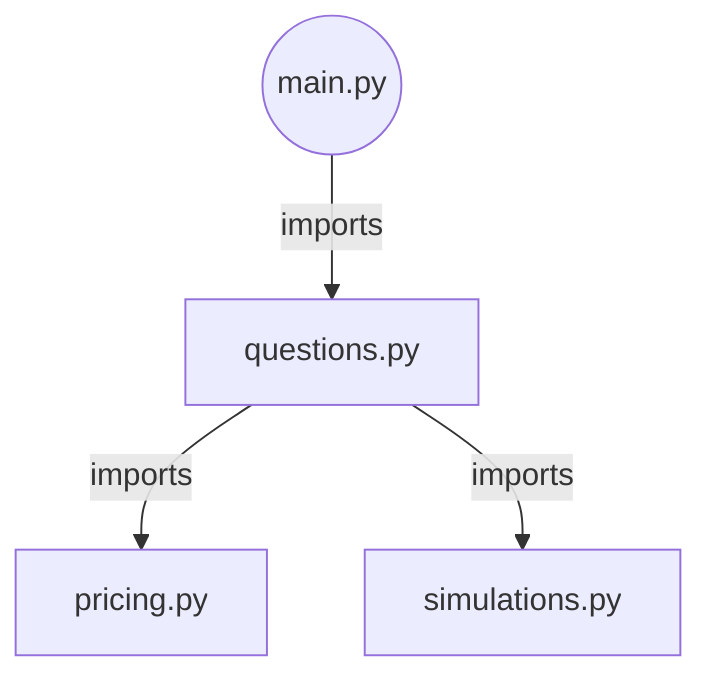

# MTHM006 Assignment 2 Code
Greetings once again! This document briefly sets out how to use the code in this folder.

## Folder Structure
Ensure all `.py` files are placed with each other:
```
/student_id
    /src
        ./__init__.py
        ./main.py
        ./pricing.py
        ./questions.py
        ./simulation.py
```

The graph of imports is:
- `main.py` imports from `questions.py`
- `questions.py` imports from both `pricing.py` and `simulation.py`



The top-level `__init__.py` ensures all files have the visibility they need. If you extracted the submission from a `.zip` archive, there's a good chance everything's setup already.

## Generating Submission Plots
This time, each question has been given its own separate function to make reproducing work easier. A few examples that show how to generate plots seen in the main submission PDF (note that due to the random nature of algorithms, graphs mightn't appear _exact_):

(**Note:** command line arguments have been provided with default values that match what's requested in the assignment brief. As such, only changes to the defaults are provided when calling `main.py`)

1. Question 4.1., on the convergence of European call option pricing with MC vs the exact Black-Scholes price:
    ```bash
    $> python main.py --nsteps=512 --question_1
    INFO:__main__:2026-03-17 21:35:18.309259: Running with params `S0=100`, `E=110`, `rf=0.01`, `sigma=0.1`, `T=5`, `B=95`, `n_steps (N)=252`, `n_sims (M)=1000000`.
    ```

2. Question 4.2., on the dependence of a Monte Carlo estimated EU call option price on $N$, the number of time steps taken between $[0, T]$:
    ```bash
    $> python main.py --question_2
    INFO:__main__:2026-03-17 21:35:27.626318: Running with params `S0=100`, `E=110`, `rf=0.01`, `sigma=0.1`, `T=5`, `B=95`, `n_steps (N)=252`, `n_sims (M)=1000000`.
    ```

    Note that `n_steps` is irrelevant here because we iterate over various $N$ values from $\{1, 2, 4, \dots, 1024\}$.

3. Question 4.4., on the behaviour of a Down-and-Out call option price as its barrier price $B$ approaches the "initial" option price $S(0)$:

    **Note:** it's recommended - and explicitly requested in the assignment brief - to run this with `--nsims=100000`, or $M=10^5$. The default is $M=10^6$.

    ```bash
    $> python main.py --nsteps=512 --nsims=100000 --question_4
    INFO:__main__:2026-03-17 23:26:36.649885: Running with params `S0=100`, `E=110`, `rf=0.01`, `sigma=0.1`, `T=5`, `B=95`, `n_steps (N)=512`, `n_sims (M)=100000`.
    ```

    Note that `B` is irrelevant here because we iterate over various $B$ values from $\{0, 10, 20, \dots, S(0)\}$ and the default $S(0)=100$.

4. Question 4.5., on the dependence of the Monte Carlo estimated Down-and-Out call option price on $N$, the number of time steps taken between $[0, T]$:

    **Note:** this one is memory-intensive so it might take a while.

    ```bash
    $> python main.py --dno_barrier=95 --question_5
    INFO:__main__:2026-03-17 23:24:14.779369: Running with params `S0=100`, `E=110`, `rf=0.01`, `sigma=0.1`, `T=5`, `B=95.0`, `n_steps (N)=252`, `n_sims (M)=1000000`.
    ```

    Note that `n_steps` is irrelevant here because we iterate over various $N$ values from $\{1, 2, 4, \dots, 1024\}$.

Finally, **note** that question 4.3, isn't provided for because that doesn't really require programmatic justification.

## Command Line Parameters
The program call signature is like so:

```bash
usage: main.py [-h] [--price0 PRICE0] [--strike STRIKE] [--rf RF] [--sigma SIGMA] [--maxtime MAXTIME] [--nsteps NSTEPS] [--nsims NSIMS] [--dno_barrier DNO_BARRIER] [--plot_gbm_path]
               [--question_1] [--question_2] [--question_4] [--question_5]
```

The command line arguments are:
- `--price0`: $S(0)$, the initial price of the underlying asset. Default=100.
- `--strike`: $E$, the strike price of a call option (CE) on the underlying. Default=110.
- `--rf`: $r$, the risk-free interest rate. Default=0.01, or 1%.
- `--sigma`: $\sigma$, the volatility of the underlying. Default=0.1.
- `--maxtime`: $T$, time to expiry of the call option. Default=5.
- `--nsteps`: $N$, the number of steps to take through time $[0, T]$ when simulating a price path. Default=252.
- `--nsims`: $M$, the number of price path simulations to generate. Default=$10**6$.
- `--dno_barrier`: $B$, the barrier price of a Down-and-Out call option on the underlying. Default=95.

Along with a few boolean flags:
- `--plot_gbm_path`: If this is passed (turned to `True`), the program simply generates a single GBM path and plots it. This is mainly for ensuring our implementation works as expected.
- `--question_1`: If this is passed (turned to `True`), the program only executes the function for Question 4.1 in the assignment brief.
- `--question_2`: If this is passed (turned to `True`), the program only executes the function for Question 4.2 in the assignment brief.
- `--question_4`: If this is passed (turned to `True`), the program only executes the function for Question 4.4 in the assignment brief.
- `--question_5`: If this is passed (turned to `True`), the program only executes the function for Question 4.5 in the assignment brief.

## If Dissecting Code
If instead you, dear beloved reader, wish to dissect this program & inspect each section of code yourself, here is the skeleton layout of the R&D Jupyter Notebook. `#cell ---` comments indicate which code snippets were in their own cell:

```python
# cell -------------------------------------------------------------------------
import logging
import matplotlib.pyplot as plt
import numpy as np

from datetime import datetime
from scipy.stats import norm

logging.basicConfig()
logger = logging.getLogger(__name__)
logger.setLevel(logging.INFO)

rng = np.random.default_rng(seed=42)

# cell -------------------------------------------------------------------------
def gbm(
        rng: np.random.Generator,
        mu: float=0.02,
        sigma: float=0.1,
        initial_value: float=100,
        T: int=5,
        n_steps: int=252,
        n_sims: int=1,
        quantise: bool=False,
    ) -> np.ndarray:
    """
    Vectorised exact implementation of GBM:
    $$
      dS_t = μ S_t dt + σ S_t dW_t \\
      ⟹S_{t+1} = S_0 exp((μ - 0.5σ^2)dt + σ ΔW_t)
    $$
    """
    # need to be v aggressive in reusing memory here:
    # 4^10=1048576, or 1.04 million sims
    # each sim has 512 elements, each element is a 64bit float
    # meaning 1048576*512*64 ~ 34359738368 bits, or ~4GB, and this is just dW
    # quantising with 16bit floats cuts it down to ~1GB
    # default effectively creates 2 arrays: one dW, one results. No need!
    # can just clobber one
    dt = T/n_steps

    if quantise:
        dW = (
            rng
            .normal(
                loc   = 0,
                scale = np.sqrt(dt),
                size  = (n_sims, n_steps)
            )
            .astype(np.float16)
        )
    else:
        dW = rng.normal(
            loc   = 0,
            scale = np.sqrt(dt),
            size  = (n_sims, n_steps)
        )

    dW = np.exp((mu - 0.5*sigma**2)*dt + sigma*dW)
    dW[:, 0] = initial_value
    return np.cumprod(dW, axis=1)

# cell -------------------------------------------------------------------------
sims = gbm(mu=0.01)

plt.figure(figsize=(6, 4))
plt.plot(sims.flatten())
plt.xlabel("Time")
plt.ylabel("Price level")
plt.title("GBM Simulated Price Path (exact solution)")
plt.grid()
plt.show()

# cell -------------------------------------------------------------------------
def eu_payoff(spot: np.ndarray, strike: float, r: float, T: int) -> np.ndarray:
    """
    Computes the payoff of a European call option: $max(0, S-E)$.
    """
    payoffs = np.maximum(0, spot-strike)
    return payoffs.mean() * np.exp(-r*T)


def exact_black_scholes(
        spot: float,
        strike: float,
        r: float=0.01,
        sigma: float=0.1,
        T: int=5,
        t: int=0,
    ):
    """
    Computes the exact Black-Scholes price of a European call option.
    """
    tau = T-t
    root_tau = np.sqrt(tau)

    strike_change = np.log(spot/strike)
    rf_vol_increment = (r + 0.5*sigma**2)*tau
    d1 = (strike_change+rf_vol_increment) / (sigma*root_tau)
    d2 = d1 - sigma*root_tau

    mprice_qtile = spot*norm.cdf(d1)
    strike_qtile = strike*np.exp(-r*tau)*norm.cdf(d2)
    cbs0 = mprice_qtile - strike_qtile
    return cbs0

# cell -------------------------------------------------------------------------
exact_black_scholes(100, 100, sigma=0.2, T=1)  # should be 8.43...

# cell -------------------------------------------------------------------------
def gbm_terminal(
        rng: np.random.Generator,
        mu: float=0.02,
        sigma: float=0.1,
        initial_value: float=100,
        T: int=5,
        n_sims: int=1,
        quantise: bool=False,
    ) -> np.ndarray:
    """
    Vectorised exact implementation of GBM, computing only terminal price:
    $$ S(T) = S(0) exp((μ - 1/2*σ^2)T + σ √T W(t)) $$
    """
    if quantise:
        W = rng.standard_normal(size=n_sims).astype(np.float16)
    else:
        W = rng.standard_normal(size=n_sims)

    return initial_value * np.exp((mu - 0.5*sigma**2)*T + sigma*np.sqrt(T)*W)

# cell -------------------------------------------------------------------------
k = np.arange(1, 11, 1)
M = np.pow(4, k)
r = 0.01
T = 5
S0 = 100
E = 110
N = 512

exact_bs = exact_black_scholes(spot=S0, strike=E)
errs = []

for i, m in enumerate(M):
    sims = gbm_terminal(
        initial_value = S0,
        mu            = r,
        n_sims        = m,
        quantise      = True,
    )

    eu_price = eu_payoff(spot=sims, strike=E, r=r, T=T)
    errs.append(np.abs(eu_price - exact_bs))

# cell -------------------------------------------------------------------------
plt.figure(figsize=(6, 4))
plt.loglog(M, [i.item() for i in errs])
plt.grid()
plt.xlabel("M simulated paths")
plt.ylabel("Error")
plt.title("Convergence of MC-simulated EU CE price vs. exact B-S")
plt.tight_layout()
plt.show()

# cell -------------------------------------------------------------------------
n_sims = 10**6
r = 0.01
T = 5
S0 = 100
E = 110

pows = np.arange(0, 11, 1)
Ns = 2**pows

eu_prices = []

for n in Ns:
    sims = gbm_terminal(
        initial_value   = S0,
        mu              = r,
        n_sims          = n_sims,
        quantise        = True,
    )

    eu_price = eu_payoff(spot=sims, strike=E, r=r, T=T)
    eu_prices.append(eu_price)

# cell -------------------------------------------------------------------------
plt.figure(figsize=(6, 4))
plt.plot(Ns, [i.item() for i in eu_prices])
plt.grid()
plt.xlabel("N steps")
plt.ylabel("EU CE price")
plt.title("Dependence of MC-simulated EU CE price and num steps")
plt.tight_layout()
plt.show()

# cell -------------------------------------------------------------------------
def dno_payoff(
        price_paths: np.ndarray,
        barrier: float,
        strike: float,
        r: float|None = None,
        T: int|None = None,
        return_sum: bool=False,
    ) -> float:
    """
    Computes the discounted price of a Down-and-Out call option:
    $$
        Payoff per path = {
            S(T)-E:  S(T)>E && S(t) >= barrier ∀t
            0     :  otherwise
        }
    $$

    If `return_sum` is true, returns the undiscounted sum of payoffs of a Down-
    and-Out call option. Useful for MC DnO pricing.
    """
    survived = ~np.any(price_paths < barrier, axis=1)
    terminal = price_paths[:, -1]
    eu_payoff = np.maximum(terminal-strike, 0.0)
    eu_prices = np.where(survived, eu_payoff, 0.0)

    if return_sum:
        return eu_prices.sum()
    else:
        if (r is None) or (T is None):
            raise ValueError(
                "Requested discounted prices but `r`, `T` not provided."
            )
        return eu_prices.mean() * np.exp(-r*T)

# cell -------------------------------------------------------------------------
M = 10**5
N = 512
Bs = np.arange(0, 100, 10)
E = 110
r = 0.01
T = 5

dno_prices = []

for i, b in enumerate(Bs):
    sims_dno = gbm(mu=r, n_sims=M, n_steps=N, quantise=True)
    dno_price = dno_payoff(sims_dno, barrier=b, strike=E, r=r, T=T)
    dno_prices.append(dno_price)

# cell -------------------------------------------------------------------------
plt.plot(Bs, [i.item() for i in dno_prices])
plt.xlabel("Barrier B")
plt.ylabel("Down-n-out CE price")
plt.title(r"Down and out CE price as $B \to S(0)$")
plt.grid()
plt.show()

# cell -------------------------------------------------------------------------
B = 95
M = 10**6
k = np.arange(0, 11, 1)
Ns = 2**k

dno_prices = []
chunk_size = 10**5
n_chunks = M//chunk_size
discounter = np.exp(-r*T)

for i, n in enumerate(Ns):
    total_payoff = 0
    logger.info(f"Num steps={n}")

    for _ in range(n_chunks):
        sims_dno = gbm(mu=r, n_sims=chunk_size, n_steps=n, quantise=True)
        dno_price = dno_payoff(
            sims_dno,
            barrier    = B,
            strike     = E,
            r          = r,
            T          = T,
            return_sum = True
        )
        total_payoff += dno_price

    average = (total_payoff/M)*discounter
    dno_prices.append(average)

# cell -------------------------------------------------------------------------
plt.plot(Ns, dno_prices)
plt.xlabel("N steps")
plt.ylabel("DnO CE Price")
plt.title(r"Dependence of MC-simulated down-n-out price and $N$ steps")
plt.grid()
plt.show()
```
