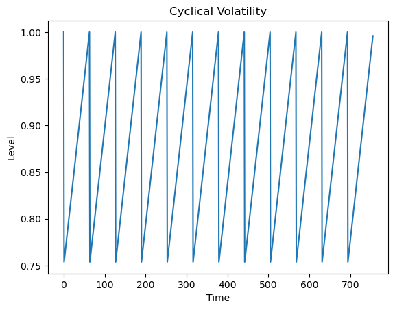

# Introduction
This submission is for MTHM059's second coursework over the year 2025-2026.

The purpose of this assignment is to provide professional advice to a risk-seeking investor on the effects of including fixed income in a portfolio, during a period of economic uncertainty. Specifically, we're interested in addressing the risk-seeking investor's tendency to act under a Gambler's Fallacy, and in that context, investigating the extent to which in inclusion of fixed income securities within a portfolio help a risk-seeking investor during a period of economic uncertainty. This report is structured like so:
1. The role of an investment advisor.
2. An understanding of the risk-reward tradeoff.
3. The behaviour of fixed income.
4. The role of fixed income in a portfolio.
5. Data-driven results.
6. A small, empirical commentary on the Gambler's fallacy.
7. An appendix with supplementary information.

# 1. The Role of the Investment Advisor
At the outset, an investment advisor (IA) is a professionally trained and registered member of a nation's financial system. A part of this training involves being exposed to the different type of investor rationales that participate in the financial markets, and the short- and long-term effects of their decisions through data collected over time by regulators and researchers.

For example, India's financial markets are regulated by the Securities and Exchange Board of India (SEBI), and via their National Institute of Securities Markets, requires financial advisors (amongst other participants) to undergo formal training before being registered as an IA @NISMCertifications. A part of that syllabus involves exploring ethical behaviour amongst IAs @NISMCertsIA_L1 and behavioural finance/investor psychology @NISMCertsIA_L2. In the UK, the Financial Conduct Authority (FCA) sets the training & competence regime for IAs. There isn't a regulated syllabus that parallels NISM's exam with psychology modules, but general relevant qualifications incorporate client-centric behaviour and interpersonal skills. Globally, the Chartered Financial Analyst (CFA) series of tests places a great deal of emphasis on ethical behaviour amongst IAs and portfolio management skills, both modules which inorporate a lot of formal reading on investor psychology @CFABehaviouralBiasesofIndividuals.

As such, IAs are made aware of the dynamics of certain rationales. Training to be impartial and awareness aside, the practices of an IA also involve a great deal of data-driven analysis and research; tools that are, by nature, impartial to the psychological beliefs of an uninformed investor. So as an IA, let's proceed with helping out our risk-seeking client.

# 2. The Risk-Reward Tradeoff
Returns are measured intertemporally as $\frac{t+n}{t}-1$. A high return is only possible if $t$ is small. Riskier assets have a lower investment price $CF(t=0)$, relative to which future prices exhibit higher returns, because no investor pays highly for a risky investment. Importantly, investors discount assets exposed to non-diversifiable (systematic) risk; diversifiable risk leaves price unchanged because it can be pooled to average out and hedged away cheaply.

We measure risk probabilistically. A restaurant's food spoilage risk, for example, can occur over a range of outcomes with associated likelihoods. Risk therefore concerns dispersion of events, and as such, the natural summary of dispersion is variance $\sigma^2$ (or standard deviation $\sigma$), which measures how far/likely outcomes are relative to their expected value:
$$ \sigma^2=\mathbb{E}\big[(X-\mathbb{E}[X])^2\big]. $$

$\sigma$ is preferred because it aggregates uncertainty into a single magnitude, is additive under linear combinations, and interacts cleanly with expectations. However, this classical view implicitly assumes stable distributions and weak temporal dependence. Empirically, markets often violate these assumptions: volatility clusters, extreme moves occur more frequently than Gaussian models predict, and risk depends on time scale as well as magnitude. In Mandelbrot's fractal view @MandelbrotBigBoi, volatility is not constant but arrives in bursts, meaning risk reflects both dispersion and the temporal structure of fluctuations.

Once events are treated as random variables, asset payoffs become vectors of state-contingent outcomes. Risk is then not only how large $\sigma$ is, but how deviations interact across states, placing correlation centrestage. Mathematically, we can say that an asset $\mathbf{X}$ combines diversifiable and systematic risk. Assuming one source of risk $x$ for now, our asset payoff is $\mathbf{X} = f(x)$. Adding a source of risk $f(x) \to f(x, z)$ doesn't mechanically raise returns; it depends on how $\mathbf{X}$ loads onto market states $\vec{y}$:
- If payoff with $z$ is low in bad states (high marginal utility), investors require a discount. A lower $CF(0)$ means higher expected returns.
- If payoff with $z$ is independent of market states, variance increases but investors charge no premium.
- If payoff with $z$ hedges bad states, investor demand increases. A higher $CF(0)$ means lower expected returns.

Formally then, risk pricing depends on the projection of payoff onto market states:
$$ \text{Proj} = (\mathbf{X}^{\top}\mathbf{X})^{-1} \mathbf{X}^{\top}\vec{y} $$

- Components aligned (correlated) with $\vec{y}$ are systematic risk and priced (reduced $CF(0)$).
- Orthogonal components are diversifiable risk and unpriced.
- Hedging components that are inversely correlated with $\vec{y}$ are expensive and thus reduce returns (increased $CF(0)$).

In practice, Mandelbrot's contribution doesn't replace this framework but refines it: $\sigma$ measures average dispersion whilst fractal market behaviour (via the Hurst exponent, $H_q$) determines how risk materialises through time, particularly during clustered or turbulent regimes. For our report, we use $\sigma$ as our measure of risk.

# 3. The Behaviour of Fixed Income
## 3.1 The Base Asset
We begin with this base asset:
$$ \text{FV} = \sum \limits_{i=1}^{\tau} CF(t) (1+r)^{(\tau-t)} $$

This expresses the future value of an investment $\text{FV}$ as the compounded value of all intermediate cash flows from the time they occur $CF(t)$, compounded at any prevailing or agreed upon interest rate $r$, up to maturity $\tau$. Maturity is when the investor chooses to dispose of the asset ($\tau > t$); holding forever $\implies \tau=\infty$. Resolving that expression for $CF(t)$ gives us the present value of an investment:

$$
\begin{align*}
\text{FV}
    &= \sum \limits_{t=1}^{\tau} CF(t) (1+r)^{(\tau-t)} \\
    &= \sum \limits_{t=1}^{\tau} CF(t) (1+r)^{\tau}(1+r)^{-t} \\
    &= \sum \limits_{t=1}^{\tau} \frac{CF(t) (1+r)^{\tau}}{(1+r)^{t}} \\
    &= (1+r)^{\tau} \; \underbrace{
            \boxed{ \sum \limits_{t=1}^{\tau} \frac{CF(t)}{(1+r)^{t}} }
        }_\text{PV} \\
    \therefore\text{PV} &= \sum \limits_{t=1}^{\tau} \frac{CF(t)}{(1+r)^t}
\end{align*}
$$

These expressions are foundational to financial valuation and expose a lot of machinery we can use to place fixed income a portfolio. We have 5 variables involved:
- A prevailing interest rate, $r$.
- A final "maturity" time $\tau$, by when we as an investor intend to dispose of our asset.
- The amount of the cash flow itself, $CF$, at a specific time period $t$.
- Implicitly: the number of compounding periods within a time $t$. Annual rates compounded monthly would mean an interest rate factor of $\left( 1+\frac{r}{12} \right)^{12}-1$, whilst annual rates paid in an equivalent monthly basis would mean an interest factor of $(1+r)^{1/12} - 1$.
- Implicitly: the amount of money we pay for the asset, commonly denoted $-CF(0)$.

Importantly, compounding assumes interim cash flows exist and are reinvested at $r$, otherwise valuation uses simple interest. Equity and fixed-income assets generate such intermediate cash flows.

## 3.2 Equity vs. Fixed Income
Equity fits our base asset with cash flows as dividends ($CF(t)=D(t)$), paid at company-chosen times $t$ over the holding horizon $\tau$. Crucially however, equity cash flows, timing, and firm survival are uncertain and not legally bound. Fixed income instead is legally binding: coupons $CF$, payment dates $t$, maturity $\tau$, and rate $r$ are contractually specified, leaving price risk primarily driven by market interest rates. Fixed income's advantage is legally defined income. Equity faces operational and default risks whilst fixed income doesn't; thus historically, equities are priced lower and deliver higher returns in exchange for this uncertainty, whilst fixed income is priced higher and delivers lower returns.

## 3.3 Fixed Income and Inflation
Fixed income's nature and sensitivity to interest rates thus exposes it greatly to inflation (for a ground-up treatment on how inflation emerges, please see food-world in the appendix). Inflation arises when the ratio of change in one quantity, the number of claims to a product, to change in another quantity, the amount of actual product available, is greater than zero @Chater_ThermalMacro:
$$ i = \frac{C_t}{F_t} > 0 $$

Where $C_t, F_t$ are the time derivatives of claims $C(t)$ and available product $F(t)$. Inflation erodes money's value; fixed income promises fixed future claims $C(t)$, so higher inflation reduces real payoffs. Equities are tied to production $F(t)$ and adjust more readily. Notably, $i<0$ is deflation. This is important to understand because during economic turmoil, supply-side inflation affects $F(t)$ lowering all asset values (e.g. wars, destroyed resources, currencies invalidated, etc.). Additionally, hyperinflation (adiabiatic) @DemirKeskin_RayChaudhuri, @Yakovenko_StatMech also depresses both asset types but affects $C(t), F(t)$ in tandem.

# 4. Fixed Income in a Portfolio
Within our framework then, what does "risk-seeking" mean? Risk preference splits into income consistency and magnitude. No rational investor would participate for unstable incomes, so focusing on magnitude:
- Risk-seeking investors target undiversifiable risks to maximise expected returns over $\tau$.
- Risk-averse investors avoid undiversifiable risks, accepting lower returns over $\tau$.

Both investors participate for income stability, the difference lies in their orientation relative to market states. Now we can address the main question: **to what extent can the inclusion of fixed income securities within a portfolio help a risk-seeking investor during a period of economic uncertainty?**

Within our framework, this is actually pretty straightforward: substantially. Fixed income is countercyclical, stabilising income and paying off in bad states. During uncertainty, this insurance-like behaviour smooths portfolio cashflows whilst risky assets retain upside. In stable environments, fixed income is priced high (high $CF(0)$, low yield), so it reduces expected return and offers limited benefit to a risk-seeker. Formally, fixed income payoffs are inversely correlated with market states: their payoff projection is concentrated in bad states, providing cash flow when other assets underperform and little incremental gain in good states. Hence fixed income carries a high $CF(0)$ when crises are unlikely but acts as a stabiliser when they occur.

# 5. Data Driven Results

## 5.1 Fixed Income Interest Rate Models
Most central banks favour a low, stable inflation rate to support economic growth through the movement of capital, rather than autarky @MoneyIsMemory1997. They intervene through various mechanisms to keep inflation within $\pm$ a certain value, resulting in mean-reverting behaviour: the prevailing rate $r(t)$ fluctuates stochastically around a long-run level $\mu$.Interest rate models capture this with a reversion term $\alpha(\mu-r(t))$, where $\alpha$ determines how quickly rates revert to the mean. Common formulations include:

- Vasicek (1977) with Gaussian mean reversion:
    $$ dr(t) = \alpha(\mu - r(t))dt + \sigma dW(t) $$

- Cox-Ingersoll-Ross (1985) with state-dependent volatility, which prevents negative rates:
    $$ dr(t) = \alpha(\mu - r(t))dt + \sqrt{r(t)} \sigma dW(t) $$

- Hull-White (1990), or extended Vasicek, with time-varying parameters:
    $$ dr(t) = \alpha_t (\mu_t - r(t))dt + \sigma_t dW(t) $$

These model the "short rate", an instantaneous point on the yield curve; broader frameworks such as HJM extend this to the full curve. Additionally, because fixed income prices depend directly on $r$, sensitivity is summarised by:

- Duration, the first derivative of fixed income price with respect to $r(t)$:
    $$ D = \frac{1}{PV} \cdot \frac{dPV}{dr} $$

- Convexity, the second derivative of fixed income price with respect to $r(t)$:
    $$ C = \frac{1}{PV} \cdot \frac{d^2 PV}{dr^2} $$

Higher duration implies greater rate sensitivity whilst convexity accounts for the fact that bond prices respond nonlinearly to stochastic interest-rate movements. Additionally, the mean-reversion speed parameter $\alpha$ helps infer the short-rate half-life:
$$ \lambda=\frac{\ln(2)}{\alpha}, $$

Which is the time required for $r(t)$ to move halfway toward its long-run mean $\mu$. These analytical results describe how fixed income should behave under uncertainty, but their portfolio impact depends on how interest rates, volatility, and market regimes evolve jointly over time. To evaluate this quantitatively, we also simulate stochastic market environments and compare portfolio outcomes across regimes, providing a data driven backing to the theory so far.

## 5.2 Simulation Parameters
We simulate an equity and bond instruments over a three-year horizon, looking at two economic regimes: stable ("good") and volatile ("bad"). Historical data from India's Nifty 50 (equity) and 10-year government securities (10Y Gsec), over 2000-01-03 to 2025-05-26, inform regime definitions, jump distributions, and volatility scales. Good regimes feature fewer and smaller jumps with lower market volatility and a greater chance of trends, while bad regimes exhibit frequent, larger jumps and higher volatility.

Over the 25 years of data, good regimes are 2003-06-01 to 2008-01-01, 2009-06-01 to 2020-01-01, and 2020-06-01 to date. Bad regimes are of course, everything left out: 2000-01-01 to 2003-05-31 (the dot-com crash), 2008-01-02 to 2009-05-31 (the 2008 credit meltdown), and 2020-01-01 to 2020-05-31 (the covid crash). Full distributional assumptions, parameter choices, and code are provided in the appendix. Dividends and bond coupons are excluded because the latter's implementation greatly exceeds the scope of this report.

### 5.2.1 Equity Simulation
Equity returns are modelled with a stochastic volatility with jump-diffusion (SVJD) process. Key features include:
- Time-varying volatility with mean-reversion around a cyclical quarterly earnings pattern. Volatility rises prior to earnings into a peak at announcement, then falls immediately after.
- Discrete jumps capturing rare, large price moves, with regime-dependent jump frequency and magnitude.

Equity jumps are defined as daily returns exceeding $\pm$ 3% within 1 year. Historical data shows clear regime dependence:
- Good regimes exhibit fewer and smaller jumps (~5–6 events/year), longer waiting times, and moderate jump magnitudes.
- Bad regimes exhibit more frequent and larger jumps (~7–8 events/year), shorter waiting times, and heavier tails.
- Jump magnitudes are modelled using a truncated exponential distribution, waiting times with a uniform distribution.

### 5.2.2 Bond Simulation
Bond returns are generated via a Vasicek short-rate model. The seed long-term target rate chosen was 5%, very close to India's quarterly SORR as of January 2026. Mean reversion speed $\alpha$ was chosen to mimic the RBI's repo-rate meeting schedule. Note that while the Hull-White model was originally considered for its time-varying volatility, its implementation exceeded the time available and Vasicek-based simulations with our empirical parameterisations sufficiently capture the relevant risk dynamics we're talking about.

### 5.2.3 Instrument Correlation
Equity and bond returns are correlated through their underlying Wiener processes. Data provides the following correlations:

- Good regime

|            | Equity | Equity Vol | Bonds |
| ---------- | ------ | ---------- | ----- |
| Equity     |  1.00  | -0.11      |  0.08 |
| Equity Vol | -0.11  |  1.00      | -0.04 |
| Bonds      |  0.08  | -0.04      |  1.00 |

- Bad regime

|            | Equity | Equity Vol | Bonds |
| ---------- | ------ | ---------- | ----- |
| Equity     |  1.00  | -0.01      |  0.18 |
| Equity Vol | -0.01  |  1.00      | -0.10 |
| Bonds      |  0.18  | -0.10      |  1.00 |

Global correlation between equity & bonds is ~0.11. In stable environments, declining equity volatility allows trends to form whilst bond performance remains largely unaffected. During volatile regimes, macroeconomic shocks raise volatility across markets, increasing co-movement between equities and bonds. This reflects both assets being jointly driven by inflation and interest-rate uncertainty.

These findings align with recent evidence @AlfieBrixtonAQR, @AmundiStockBondCorrel, @RoderickMolenaarSBCorrel that positive stock–bond correlation is historically common outside low-inflation environments. When discount-rate shocks dominate growth expectations, both asset classes respond in the same direction, weakening the traditional diversification assumption.

### 5.2.4 Metrics
Portfolio performance is measured using the Sharpe ratio, excess return, and CAGR percentiles. Both marginal & portfolio-weighted results are studied.

## 5.3 Simulation Results
Simulation outcomes show that marginally, equity returns display wider tails than bonds in both regimes:


\FloatBarrier


\FloatBarrier

With the following marginal CAGR percentiles:

- Good regime

    | Instrument | 5%      | 25%    | 50%    | 75%    | 95%    |
    | ---------- | ------- | ------ | ------ | ------ | ------ |
    | Equity     | -0.1048 | 0.0369 | 0.1504 | 0.2888 | 0.5064 |
    | Bonds      |  0.0507 | 0.0507 | 0.0507 | 0.0507 | 0.0507 |

- Bad regime

    | Instrument | 5%      | 25%     | 50%     | 75%    | 95%    |
    | ---------- | ------- | ------- | ------- | ------ | ------ |
    | Equity     | -0.3089 | -0.1646 | -0.0603 | 0.0587 | 0.2588 |
    | Bonds      |  0.0504 |  0.0504 |  0.0504 | 0.0504 | 0.0504 |

Empirical parameter choices result in bonds being extremely efficient with almost zero return dispersion, behaving closer to a stable carry asset whose relative attractiveness rises when the market deteriorates. Correspondingly, we have the following marginal Sharpe ratios:

- Good regime

    | Metric    | Equity  | Bond   |
    | --------- | ------- | ------ |
    | Mean      |  0.7141 | 1.5358 |
    | Std. Dev  |  0.6436 | 0.0441 |
    | Median    |  0.7102 | 1.5337 |
    | 5% Ptile  | -0.3433 | 1.4672 |
    | 95% Ptile |  1.8099 | 1.6144 |

- Bad regime

    | Metric    | Equity  | Bond   |
    | --------- | ------- | ------ |
    | Mean      | -0.1089 | 1.2176 |
    | Std. Dev  |  0.6968 | 0.0334 |
    | Median    | -0.1196 | 1.2169 |
    | 5% Ptile  | -1.2922 | 1.1650 |
    | 95% Ptile |  1.0601 | 1.2737 |

Again, equity drives return dispersion and upside potential whilst bonds dominate risk-adjusted performance. Clearly then investors need equity risk tolerance to prefer stocks at all; or, in other words, equities outperform _in good regimes_ only for return-seeking investors, whilst bonds remain the dominant risk-adjusted allocation across regimes, especially bad ones. Our marginal nested, and excess returns', histograms make this visually apparent:


\FloatBarrier


\FloatBarrier

Because of our bonds' stability, a portfolio sweep based on the Sharpe ratio ends up favouring bonds across all economic climates, just with different weights: 93% in bonds during good regimes (7% in equity), 99% in bonds during bad regimes (1% in equity):

| Metric                 | Good Regime | Bad Regime |
| ---------------------- | ----------- | ---------- |
| Equity weight          |  7%         |  1%        |
| Mean Sharpe            |  1.7432     |  1.2194    |
| Median Sharpe          |  1.7428     |  1.2216    |
| Median CAGR            |  5.95%      |  4.96%     |
| Volatility             |  3.36%      |  4.04%     |
| Expected Shortfall     | -0.0043     | -0.0053    |
| Excess Return $P(S>B)$ |  50.84%     |  49.45%    |

Magnitudes & bond hyperefficiency aside, when uncertainty rises Sharpe-optimal allocations shift almost fully into fixed income. The investor is bond-heavy because Sharpe-optimal allocations reflect risk efficiency, not investor utility maximisation. Additionally, though tail risk and variance increase in bad regimes even after optimisation ($-0.0043 \to -0.0053 \approx -23\%$), CAGR barely drops ($5.95\% \to 4.96\% \approx 1\%$) meaning fixed income preserves wealth rather than sacrificing growth, which is what a countercyclical hedge should produce. Nevertheless, equities clearly improve when conditions are good and in fact demonstrate an order of magnitude more CAGR during good regimes.

# 6. The Gambler's Fallacy
The Gambler's Fallacy is the belief that if an i.i.d. event has occurred less frequently than expected, it becomes more likely to occur next. In the markets, this appears as the intuition that prolonged losses increase the probability of an imminent rebound - e.g., "prices must reverse soon because the drawdown has lasted too long." This reasoning only holds under independence. Casino games are engineered to produce i.i.d. outcomes, but financial markets are large, path-dependent, coupled dynamic systems that continuously violate this assumption. Empirically observed features such as volatility clustering (autocorrelation in squared returns), fractal scaling, long memory, and persistence contradict independent increments @MandelbrotBigBoi @MoneyIsMemory1997. Behaviourally, prices are also shaped by interacting agents responding to shared information, making markets fundamentally endogenous systems better described by complex adaptive or agent-based frameworks @Farmer_MakingSenseOfChaos. In practice, the assumption of i.i.d. returns is an academic convenience rather than a market reality.

We test this directly using Nifty 50 data by estimating the probability of an upmove conditional on the length of the preceding sequence of negative returns. Put simply, "after $N$ consecutive down days, how likely is an up day tomorrow?" A Chi-squared test of independence is applied to a contingency table relating run length to next-day direction. Using ~25 years of daily data (~6,300 observations), returns are reduced to direction only (up vs. non-up). For each day, we count how many consecutive negative days preceded it (the run length), then record whether the next day is positive. Under a memoryless random walk, next-day direction should be independent of prior streak length; this forms the null hypothesis.

The test yields a p-value of $2.95\times10^{-5}$ (see appendix for more information), decisively rejecting independence. The probability of a positive return varies with the length of losing streaks, consistent with economically intuitive mechanisms such as eventual valuation-driven accumulation during selloffs. This does not imply exploitable alpha - run length remains unpredictable - but it does show that strict directional independence is empirically false. The Gambler's Fallacy is therefore wrong in theory but not entirely detached from market reality: markets possess memory, even if that memory might not be directly tradable.

# 7. Conclusion
So to revisit the central question: to what extent does fixed income help the portfolio of a risk-seeking investor in times of economic turbulence? Substantially.

Risk-seeking investors accept exposure to undiversifiable market risk, as opposed to risk-averse investors that avoid undiversifiable risk. During turbulent regimes, fixed income provides counter-cyclical payoffs that stabilise portfolio cash flows while preserving long-run growth. Bonds do not primarily hedge through negative correlation; instead, their value arises from stable carry and resilience to discount-rate shocks that simultaneously destabilise equities. Phrased differently, bonds enable risk-seeking behaviour to remain sustainable during uncertainty.

Additionally, the classical narrative of equities dominating in good economic environments whilst bonds are preferable in stressed conditions remains valid, but for modern reasons: both assets are ultimately governed by the same discount-rate dynamic, and allocation decisions depend more on risk efficiency, rather than simple maximal return expectations. Data-driven simulations also underscore that regime awareness, rather than static diversification beliefs, is central to portfolio construction in contemporary markets. Finally, we also show that there is truth to the Gambler's Fallacy in the financial markets.

# Appendix
## Food World
Let's build up to a mathematical understanding of economic inflation, roughly along the lines of @PeterSchiff.

Say we setup a little simulation with 10 "people", each with a level of food at time $t=0$ of 100 per person. The total level of food in the world is 1000. Every day these people consume 5 units of food and go out to hunt. Some come back with more than the amount they've eaten, some exact, some less and some none at all - this is a stochastic outcome. As such, the total level of food changes each day, but always in proportion to the amount of food farmed/hunted. Obviously, those with a surplus can store their food for later. I've also capped the amount of food each person eats to 5 units, but it exponentially decreases when they have very little food remaining (they eat less when they have less to extend their existence), meaning they can outlast the probability of not finding food - they're always guaranteed to, eventually. A system of exchange also exists such that people can trade food freely amongst themselves whenever they wish to. Crucially however, when someone falls dangerously low on food, others have an increasing propensity to lend them some food. So the food per person isn't fixed based off their hunting, it also depends on how much they trade, if at all. Finally, there is a concept of wastage: the environment itself is fully circular, but "food" is a transient state of the environment. If "food" is stored for long enough $t$, it becomes inedible - still usable by the environment, but unfit for personal consumption. Correspondingly, "animals" or "food" reappears for hunting purposes after the remainder of the time has passed, because the environment just recycles itself (e.g. if food exists for 25% of the time, spoilage/soil/steel/anything else that's inedible exists for 75% of the time).

We won't see runaway inflation at all in this kind of system. The idea is that within a closed system, thermodynamically, energy can neither be created nor destroyed but redistributions can occur - as such, there cannot be asymmetry caused by inflation unless inflation is the asymmetry, representing the amount of disconnect between actual physical producible goods and the amount of "claim" going around @YakovenkoDebate, @Chater_ThermalMacro. At time 0 everyone has 100 units of food. The next day, everyone has 95 before they head out to hunt. Some come back with 6 units, some 10, some 4, some 5, some 0. The ones with 6 end the day at 96, the ones with 10 end the day at 105, the ones with 4, 99; the ones with 5, 100; and the ones with 0, 95. The next day, everyone consumes 5 again and goes out to hunt. The same thing happens again, but not to the same people. To avoid wastage, some people with a surplus lend to those who are worse off because their food will spoil if they don't. Some refuse to lend and instead their food spoils, reducing their personal supply of food. When food spoils it's a personal loss for the person. Their food reduces, but they either end up eating less because they have less, or someone lends to them, or they had so much to begin with that once a lumpsum spoils, they still have a lot left over so they don't need to eat less or borrow.

Let's reintroduce repayments; not just at par, but at excess: anyone receiving food from someone else must pay them back exactly that amount plus one more unit of food per payment. Now let's assume that someone gets lent 5 units of food because they had only 15 remaining. The next day, this person consumes 5, goes to hunt, and comes back with nothing. This repeats for the next couple of days with another loan coming in: two days ago, 15->20 after a loan, back to 15 in the day and they stay there overnight until the next day. Then they eat 5 units and have 10 left, get another loan of 5 and end the day at 15 with a total debt of 10. The next day they eat 5, have 10, and come back with 25. They pay off both loans instantly and store the extra 5 for a total of 15, debt-free. Alternatively, that person pays off their loan in instalments rather than lumpsum, with each instalment also having a +1. So over time, total food grows not only on the basis of lenders getting their stocks back, but also repayments - and total food is distributed.

At this point it's clear that over time, enough mixing of resources happens between people that no persistent disparity can arise. Mathematically, this system is fully ergodic, so there really is no inflation because nothing is exceeding physical supply. In other words, no corner of the system can be permanently excluded because it fully mixes over the time the simulation runs. Now let's make a few more changes:
1. Sometimes, some people produce offspring and some others die. When there is offspring, the parents must hunt for more to feed it until it's capable of hunting for itself. This locally stresses a family for a few years.
2. For a few timesteps in a year, wastage increases in a seasonal fashion: the edible vs. inedible percentage changes. Instead of a constant ratio of edible 25% of the time, inedible 75% of the time (where 75% is the length of time it takes for material to become food again), it's 5% and 95% for some time, or 50% and 50%, in addition to its regular 25% and 75%. We have 3 effective seasons.
3. We introduce IOUs as letters betwixt people that allow them to redeem such letters for a certain amount of food, on demand.

That 3rd change is the only real thing that can introduce inflation, because all other risks can be cheaply hedged away or adjusted to. Thermodynamically the thing is that once you take on a microstate, the total energy in the system hasn't reduced, but usable free energy exponentially declines. Cosmologically even, an expanding universe means lesser density of "stuff" per cubic unit measured because overall space is expanding. The key thing here is that these IOUs were actually very well-intentioned: either someone doesn't want to carry food around to repay loans, or they're not physically available for repayment at the time, or any number of other reasons that make them a useful tool. The issue arises when the amount of IOUs in circulation outpaces the amount of food in circulation. The only way this might be curbed is by a reset.

When using IOUs, an asymmetry is introduced (actually, multiple asymmetries are introduced at once such that the entire asymmetric bundle is unable to stabilise itself and mix away into the system) - no energy is created or destroyed, but some food is expended as energy to create an IOU that is not representative of the value of the underlying food unit, and give it to somebody else. The total food supply doesn't drastically change and immediate redistribution isn't affected either. What becomes affected is the actual owing: someone says "I'll pay you this amount in the future", with no guarantee of whether they'll have that much in the future or not. It's a simple enough fix: only the most reputable people with the most food stocks can, and should, issue IOUs - just as those people with actual food stocks used to lend, and not those without stocks. And of course, IOUs must only cover the amount of physical food such people have available. Then there's still a 1:1 connection that cannot runaway. In fact, mistakes from people owing more than they actually have can easily be corrected by the surplus of others - insofar as _total claim doesn't outpace total surplus_. @Yakovenko_StatMech

But let's say we're sick and tired of all of this IOU business - we want dynamical systems, not economic thought! The main dynamic at play here is the fact that there is one quantity growing at a rate that outpaces another. If we instead enforced that only 50 units of "animals" are available at any given point of time to hunt - as we started with - but instead of 10 people we now have 20 (which by the way actually happened: when I said people can have offspring, I never actually changed the total huntable food amount!), then each person no longer gets a cool 5 units of food, they get a lukewarm 2.5 units. One ratio must outpace another for inflation to become a palpable dynamic, and even then it must really outpace the other for it to become a problem. We can also see how the sense of "things are more expensive" emerges: with 20 people to eat 50 animals vs. with 10 people, each person now gets 2.5 units of food instead of 5. Meaning it takes 2 of "something" to get 5 units instead of just 1 before. Likewise with the IOUs, if a person promises less than or exactly their full stock of food to someone else (assuming they kept aside some for themselves) it's still a 1:1 promise, but if they promise twice their current stock then it's again 1:0.5, meaning each unit of stock now requires 2 times "something" to get a 1:1 amount.

As such, most central banks prefer a low and stable rate of inflation because it tends to spur economic growth through the movement of capital, rather than isolation/autarky @MoneyIsMemory1997. For instance, fixing your money in a deposit for a bank to lend out and repay you rather than keeping it idle. We can see this in our two cases: with 10 people and 50 animals (or without any extra IOUs on food stock), food is exchanged 1:1. Hoarding up to the wastage ceiling is rational. But if someone starts issuing just ever so slightly more IOUs than they have stock, or if the population is controlled (perhaps via an N-child policy...) to only ever grow up to say, 12-15 people instead of 20, food ever so slightly reduces in exchange ratios because it now requires just ever so slightly more of "something" to get the same amount. And because of this constant little differential between one rate and the other, an adjustment to quantities of food ("level") happens but not the rate; the presence of the invariant doesn't invalidate the encouragement of activity, because every period still penalises inactivity. In fact, the reason we don't feel the pinch most of the time until either a lot of money is involved or a long period of inactivity has transpired is precisely because of the low & stable rate of inflation. If I take a 3-month hiatus from work, or a year-long sabbatical, I'm not excessively worse off. A 2% annual rate of inflation effective per quarter is basically $(1.02)^{4/12}-1 \approx 0.0066$, or 0.66% _per quarter_, or 0.165% per month - it's barey noticeable. But over 20 years, 2% inflation results in $(1.02)^{240/12}-1 \approx 0.48595$, or a 49% loss in purchasing power! Likewise in food-world, issuing just a very mild excess of IOUs causes a deterioration in "purchasing power", but encourages activity.

How does this relate to our fixed income & equity investments? Observe: inflation changes the value of future food relative to present food. Fixed income promises fixed future claims. If inflation - the ratio between differentials - rises, then future IOUs get even less food than they do now, and the fixed income agreement is also worth less. For equity to make sense, we need to add one more dynamic: when an IOU is repaid, it's not anulled. Person A might give an IOU to person B, person B repays person A, but holds the IOU and can exchange it to somebody else, rather than that specific IOU contract being invalidated and now worth nothing. In this case, if instead of fixed IOUs people hunted in groups or "companies" (and equivalently, issued IOUs as companies) then when inflation rises, these companies would experience an increase in the number of IOUs _they own_, so they can ask for more from others. For example without inflation there's a 1:1 payoff between food and an IOU. With inflation - when 1 food unit is worth 2 IOUs - if a "company" hunts 10 animals, they effectively have to service 20 IOUs. It's a reduction in wealth no doubt, but with their 20 exchangable IOU "notes", they can ask for 10 animals from somebody else. In fact, this dynamic is symmetry preserving because the exercise of those 20 IOUs doesn't itself impact inflation - it just redistributes food amongst the populace.

Thus, equities are self-adjusting to inflation because the directly control the actual factor of activity: food. They're immune to changes in claims. Bonds - IOUs - are literally fixed claims, and are only extremely sensitive (i.e., they lose tremendous value) in the face of a supply-side shock; for example, an earthquake hits food-world and destroys half of the total food supply. They're stable when inflation is low and supply is available, and in fact gain in value during times of social turbulence because of their fixed and guaranteed nature. Equities on the other hand don't have such a nature: a company can fragment at any time, or come under social stress for whatever reason and be forced to disband. An IOU is fixed and must be honoured despite changing social (aka "political") attitudes. So a risk-seeking investor during times of crises would actually seek to expose, or project, themselves onto all available axes of risk, even those that cannot be hedged, in pursuit of higher expected returns. Because political risk is an axis that bonds payoff heavily over, holding bonds is, in fact, a good idea for a risk-seeker during times of political crises - insofar as the risk of failure isn't supply-side (e.g. they can still lose tremendously if a nation enters an adiabatic phase and runaway inflation emerges @DemirKeskin_RayChaudhuri, or if currencies are devalued/no longer accepted somewhere, etc.)

Finally, if we wanted our system to truly become nonergodic - and therefore, actually realistic @OlePetersErgodicity - , we'd introduce two seemingly benign and minimal, but practically severe changes: people lend increasing amounts of food only to those people who return with excess food per hunt than they consumed that day, twice in a row. Otherwise they lend 1:1, and for people who have bad streaks, lines of credit slowly dry up. This introduces memory @MoneyIsMemory1997 and results in debt traps, effectively cutting off portions of the populace from the rest and resulting in absorbing states. If we try and counter this by introducing an "angel lender" who lends 1:1 with everyone else so as to maintain their own surplus, but 1.5:1 with people only dangerously close to starvation _and_ who have had a bad streak (basically, only people seriously worse off get very favourable terms), we end up making the system even more disparate.

## Simulation Data
As mentioned, historical data from India's Nifty 50 (equity) and 10-year government securities (10Y Gsec), over 2000-01-03 to 2025-05-26, inform regime definitions, jump distributions, and volatility scales. Nifty 50 index data was sourced from @RS_Kaggle, India 10Y Gsec data was sourced from @InvestingCom.

Over the 25 years of data, good regimes are 2003-06-01 $\to$ 2008-01-01, 2009-06-01 $\to$ 2020-01-01, and 2020-06-01 $\to$ date. Bad regimes are of course, everything left out: 2000-01-01 $\to$ 2003-05-31 (the dot-com crash), 2008-01-02 $\to$ 2009-05-31 (the 2008 credit meltdown), and 2020-01-01 $\to$ 2020-05-31 (the covid crash).

## Simulation Code

### Code Setup

```python
import matplotlib.pyplot as plt
import numpy as np
import pandas as pd

from scipy.stats import chi2_contingency

rng = np.random.default_rng(seed=42)
```

### Correlated $dW(t)$

```python
def gen_correlated_Wt(
        regime: str,
        n_sims: int,
        T: int,
        dt: float,
        rng: np.random.Generator
    ) -> tuple[np.ndarray, np.ndarray, np.ndarray]:
    """
    Returns 3 arrays of correlated Brownian motion(s).
    """
    if regime == "good":
        rho_stock_svol  = -0.11
        rho_svol_bonds  = -0.04
        rho_stock_bonds =  0.08
    elif regime == "bad":
        rho_stock_svol  = -0.01
        rho_svol_bonds  = -0.10
        rho_stock_bonds =  0.18
    else:
        raise ValueError(f"Unknown `regime`: {regime}")

    ndt = int(T/dt)+1

    cor_mat = np.array([
        [           1.0 , rho_stock_svol, rho_stock_bonds],
        [rho_stock_svol ,            1.0, rho_svol_bonds ],
        [rho_stock_bonds, rho_svol_bonds,            1.0 ],
    ])

    # we know this set of parameters works and is PSD, meaning Cholesky is gg
    C = np.linalg.cholesky(cor_mat)
    Z = rng.normal(size=(n_sims, ndt, 3))
    dW = Z @ C.T * np.sqrt(dt)

    dW_stock = dW[..., 0]
    dW_vol   = dW[..., 1]
    dW_rate  = dW[..., 2]
    return dW_stock, dW_vol, dW_rate
```

### Equity Jump Engine
In good regimes, the Nifty 50 showed that:
- We have an average of 5 jumps over 3% a year with a standard deviation of +6 (can't have negative number of jumps).
- We have an average of 6 jumps under 3% a year with a standard deviation of +8 (can't have negative number of jumps).
- Our positive jump counts are exponentially distributed.
- Our negative jump counts are exponentially distributed.
- Our jumps over 3% - time to the next jump - is exponentially distributed. $\lambda$ is possibly 1.5.
- Our jumps under 3% - time to the next jump - is exponentially distributed. $\lambda$ is possibly 2.5.
- Positive jumps themselves have intensities that are exponentially distributed. $\lambda$ is possibly 1.0. Minimum intensity of 3%, Maximum 9%.
- Negative jumps themselves have intensities that are exponentially distributed. $\lambda$ is possibly 1.5. Minimum intensity of 4%, Maximum 12% (flip signs because these must be negative).

In bad regimes:
- We have an average of 8 jumps over 3% a year with a standard deviation of +4 (can't have negative number of jumps).
- We have an average of 7 jumps under 3% a year with a standard deviation of +6 (can't have negative number of jumps).
- Our positive jump counts are log-normally distributed, but we can use exponential to keep code parity. This is depth I don't have time for, unfortunately.
- Our negative jump counts are log-normally distributed, but we can use exponential to keep code parity. This is depth I don't have time for, unfortunately.
- Our jumps over 3% - time to the next jump - is exponentially distributed. $\lambda$ is possibly 2.0.
- Our jumps under 3% - time to the next jump - is exponentially distributed. $\lambda$ is possibly 2.5.
- Positive jumps themselves have intensities that are exponentially distributed. $\lambda$ is possibly 1.0. Minimum intensity of 4%, Maximum 13%.
- Negative jumps themselves have intensities that are exponentially distributed. $\lambda$ is possibly 1.5. Minimum intensity of 3%, Maximum 15% (flip signs because these must be negative).

However, a few practical concessions were made:
1. In implementation a regular exponential distribution either generated values clustered close to the mode, or missed the maximum empirical numbers entirely. As such, to cover the entire empirical range(s) and maintain the exponential-type behaviour, we use a truncated exponential based off the inverse-uniform distribution. Notably there was also volatility clustering with $\rho_1 \approx 0.30$, but that was quite involved to implement given the scope of this assignment.
2. The end result of SVJD is a model of $dS(t)$, or stock returns over time. As such, our jumps are also in percentage-return space. In other words, if we get a jump value of $4.32$ somewhere it means the current stock level must be 4.32% greater than the previous level, or an increase of $S(t-1) \cdot 1.0432$. We also need to keep in mind that the jump statistics collected are based on the number of jumps _in a year_, and our $\tau=3$ years, so we need 3 jump "paths" per simulation, out of $1,000$ sims.
3. Exponential waiting times between jumps didn't work because although implementation was smooth, the Exponential distribution itself picks values close to 1. This is fine, but what ends up happening is that all our jumps cluster at the beginning and never get past the first 10-12 timesteps. Coupled with the fact that we only have a few jumps within a year, we exhaust the list of jumps (without replacement) very quickly - all at the beginning. So we've replaced that with a Uniform distribution across the entire series (`pos = rng.integers(0, N_S, N_J)`), accounting for the remaining timesteps so that all jumps get used before the end of the time series.
4. Jump positions are accumulated using `np.add.at`, allowing multiple jumps to coincide in position over a year whilst leaving non-jump periods unchanged. This ensures that periods without jumps get the regular GBM drift/diffusion treatment, periods with jumps are added onto the underlying GBM process.

```python
def truncated_exponential(
        lam: float,
        maxval: float,
        minval: float,
        rng: np.random.Generator,
        size: int=1
    ) -> float|np.ndarray:
    """
    Implementation of a truncated exponential distribution. Min-max scales
    samples drawon from a uniform distribution to lie within exponentially-
    adjusted `minval, maxval`.
    """
    u = rng.random(size=size)
    min_exp = np.exp(-lam*minval)
    max_exp = np.exp(-lam*maxval)
    x = -np.log(min_exp-u * (min_exp-max_exp)) / lam
    return x


def jump_generator(regime: str, rng: np.random.Generator) -> np.ndarray:
    """
    Generates arrays containing jump positions relative to `regime`.
    """
    if regime == "good":
        num_positive = 5
        max_positive = 11
        positive_intense = 1.0
        positive_min = 3
        positive_max = 9

        num_negative = 4
        max_negative = 10
        negative_intense = 1.5
        negative_min = 3
        negative_max = 9
    elif regime == "bad":
        num_positive = 8
        max_positive = 12
        positive_intense = 2.0
        positive_min = 3
        positive_max = 13

        num_negative = 7
        max_negative = 13
        negative_intense = 1.0
        negative_min = 4
        negative_max = 15
    else:
        raise ValueError(f"Invalid `regime`: {regime}")

    # first, how many jumps?
    n_positive_j = truncated_exponential(
        lam    = 1/num_positive,
        maxval = max_positive,
        minval = 0.0,
        rng    = rng
    )

    n_negative_j = truncated_exponential(
        lam    = 1/num_negative,
        maxval = max_negative,
        minval = 0.0,
        rng    = rng
    )

    # next, how intense?
    positive_j = truncated_exponential(
        lam    = positive_intense,
        maxval = positive_max,
        minval = positive_min,
        size   = int(n_positive_j[0]),  # guaranteed shape=1
        rng    = rng
    )

    negative_j = truncated_exponential(
        lam    = negative_intense,
        maxval = negative_max,
        minval = negative_min,
        size   = int(n_negative_j[0]),  # guaranteed shape=1
        rng    = rng
    ) *-1

    combined_j = np.concatenate([positive_j, negative_j])
    return combined_j


def jump_engine(
        T: int,
        dt: float,
        regime: str,
        rng: np.random.Generator
    ) -> np.ndarray:
    """
    Assembles jump arrays over `T` with steps `dt`, relative to `regime`.
    Returns an array sized `(T/dt)+1`.
    """
    ndt = int(T/dt)+1
    sections = np.zeros(ndt).reshape(T, -1)

    for section in sections:
        t = 1
        N_S = len(section)
        jumps = jump_generator(regime=regime, rng=rng)
        N_J = len(jumps)
        pos = rng.integers(0, N_S, N_J)
        np.add.at(section, pos, jumps)

    sections = sections.flatten()
    return sections/100
```

### Equity Stochastic Volatility Engine
Equity volatility is modelled to reflect quarterly earnings cycles, where volatility rises before announcements and falls afterward. A deterministic quarterly cycle (one peak every 63 trading days) defines the baseline volatility pattern across the three-year horizon:



The underlying model for equity is GBM with a time-varying volatility parameter @WikipediaStochVolBasicModel:

$$
\begin{align*}
    dS(t) &= \mu S(t) dt + \sqrt{\nu(t)} S(t) dW(t) \\
    d\nu(t) &= \alpha_{\nu}(t) dt + \sigma_{\nu} dB(t)
\end{align*}
$$

$\alpha_{\nu}(t)$ is the cyclical function for volatility:

$$ d\nu(t) = \theta(\mu - x(t))dt + \sigma dW(t) $$

Stochastic volatility is introduced through a mean-reverting Ornstein–Uhlenbeck process in log-space. Rather than adding independent noise directly to the cycle, we assert that volatility evolves smoothly around its cyclical path, preserving positivity, persistence, and realistic clustering. The resulting variance process $\nu(t)$ feeds directly into the GBM process with jumps, producing an SVJD model where returns combine drift, stochastic volatility, and discrete shocks. Unlike jumps which are modelled per year, earnings cycles are deterministic and generated once over the full simulation horizon (3 years).

```python
def gen_quarterly_cycles(T: float, dt: float) -> np.ndarray:
    """
    Generates a quarterly cyclical pattern over `T` with `dt` steps. Returns an
    array shaped `(T/dt)+1`.
    """
    ndt = int(T/dt)+1
    time_idx = np.linspace(0, T, ndt)

    quarter_steps = 252/4               # 252 days in a year
    quarter = quarter_steps*dt          # need in terms of DT
    sections = time_idx.reshape(T, -1)  # section out quarters

    cycles = (quarter - (sections%quarter)) % quarter
    cycles = cycles.flatten()
    return 1-cycles


def stoch_vol_engine(
        T: float,
        dt: float,
        vol_shape: np.ndarray,
        kappa: float,
        sigma: float,
        rng: np.random.Generator,
        n_sims: int=1,
        dW: np.ndarray|None = None
    ) -> np.ndarray:
    """
    Simulates:
    $$ d\nu = \kappa(\nu(t) - x(t))dt + \sigma dW(t) $$

    Where $\nu(t)$ is `vol_shape`, a deterministic cycle.
    """
    ndt = int(T/dt)+1

    if dW is None:
        dW = rng.normal(loc=0.0, scale=np.sqrt(dt), size=(n_sims, ndt))

    results = np.empty(shape=(n_sims, ndt))
    results[:, 0] = np.log(vol_shape[0])

    for t in range(1, ndt):
        drift = kappa*(np.log(vol_shape[t-1]) - results[:, t-1])*dt
        diffn = sigma*dW[:, t]
        results[:, t] = results[:, t-1] + drift + diffn

    return np.exp(results)


def simulate_gbm_with_sv_jumps(
        rng: np.random.Generator,
        jumps: np.ndarray, # entire series
        nu: np.ndarray,    # stoch vol (entire series)
        mu: float=0.5,     # stock mu (drift)
        sigma: float=0.3,  # stock sigma (diffusion)
        T: int=2,
        dt: float=0.001,
        initial_value: float=100,
        n_sims: int=1,
        dW: np.ndarray|None = None
    ) -> tuple[np.ndarray, np.ndarray]:
    """
    Vectorised Euler-Maruyama implementation of GBM with jumps and stoch vol
    """
    ndt = int(T/dt)+1

    if dW is None:
        dW = rng.normal(loc=0.0, scale=np.sqrt(dt), size=(n_sims, ndt))

    # multiplicative (log) increment with additive jumps
    log_increments = (mu - 0.5*nu)*dt + np.sqrt(nu)*dW + jumps
    increments = np.exp(log_increments)
    increments[:, 0] = 1.0


    results = initial_value * np.cumprod(increments, axis=1)
    return results
```

### Bond Pricing Engine
We use the Vasicek short-rate model with its equivalent risk-neutral pricing form.

```python
def vasicek_B(T: int, t: np.ndarray, theta: float) -> np.ndarray:
    """
    $$ B(t, \tau) = \frac{1 - e^{-\theta(\tau-t)}}{\theta} $$
    """
    exp = np.exp(-theta*(T-t))
    numer = 1-exp
    denom = theta
    return numer/denom


def vasicek_A(
        T: int,
        t: np.ndarray,
        sigma: float,
        B: np.ndarray,
        steady_state: float,
        theta: float
    ) -> np.ndarray:
    """
    $$
    A(t, \tau) = \exp \left(
        \left( \mu - \frac{\sigma^2}{2 \theta^2} \right)
        \cdot [B(t, \tau) - (\tau - t)]
        - \frac{\sigma^2}{4 \theta} B^2(t, \tau)
    \right)
    $$
    """
    time_diff = T-t  # np.ndarray
    first = steady_state - (sigma**2) / (2*theta**2)  # scalar
    secnd = B - time_diff  # must be ok in shapes
    third = (sigma**2) / (4*theta) * (B**2)  # np.ndarray
    final = first * secnd - third
    return np.exp(final)


def vasicek_price(
        A: np.ndarray,
        B: np.ndarray,
        rate_paths: np.ndarray
    ) -> np.ndarray:
    """
    $$ P(t, \tau) = A(t, \tau) e^{-B(t, \tau)r(t)} $$
    """
    px = A[None, :]*np.exp(-B[None, :]*rate_paths)
    return px


def vasicek_ou(
        T: float,
        dt: float,
        mu: float,          # long_term_repo
        theta: float,       # reversion speed
        sigma: float,       # repo rate vol
        init_value: float,  # long_term_repo
        rng: np.random.Generator,
        n_sims: int=1,
        dW: np.ndarray|None = None
    ) -> np.ndarray:
    """
    Implementation of the Vasicek mean-reverting model of short-rates. Returns
    an array wherein the mean-reverting proeess oscillates around `mu`, with
    reversion speed `theta`.
    """
    ndt = int(T/dt)+1

    if dW is None:
        dW = rng.normal(loc=0.0, scale=np.sqrt(dt), size=(n_sims, ndt))

    results = np.empty(shape=(n_sims, ndt))
    results[:, 0] = init_value

    for t in range(1, ndt):
        drift = theta*(mu - results[:, t-1])*dt
        diffn = sigma*dW[:, t]
        results[:, t] = results[:, t-1] + drift + diffn

    return results
```

### Main

```python
def main(
        T: int,
        steps: int,
        regime: str,
        rng: np.random.Generator,
        vol_scale: float,
        vol_kappa: float,
        long_term_repo: float,
        n_sims: int=1,
    ) -> dict:
    """
    Main simulation implementation.
    """
    if regime == "good":
        vol_sigma       = 0.11
        stock_mu        = 0.14
        stock_vol       = 0.21
        repo_vol        = 0.055
        reversion_speed = 1.35
    elif regime == "bad":
        vol_sigma       = 0.12
        stock_mu        = 0.015
        stock_vol       = 0.27
        repo_vol        = 0.085
        reversion_speed = 1.75

    # PREP ---------------------------------------------------------------------
    grid = np.linspace(0, T, steps)
    dt = np.diff(grid)[0]

    # VOLATILITY ---------------------------------------------------------------
    # regime dependent
    dW_stock, dW_vol, dW_rate = gen_correlated_Wt(
        regime = regime,
        n_sims = n_sims,
        T      = T,
        dt     = dt,
        rng    = rng
    )

    # STOCKS -------------------------------------------------------------------
    # regime dependent
    jumps = np.zeros((n_sims, steps))
    for i in range(n_sims):
        jumps[i] = jump_engine(T=T, dt=dt, regime=regime, rng=rng)

    vol_earnings = gen_quarterly_cycles(T=T, dt=dt)
    theta_t = (vol_scale*vol_earnings)**2
    nu = stoch_vol_engine(
        T         = T,
        dt        = dt,
        vol_shape = theta_t,
        kappa     = vol_kappa,
        sigma     = vol_sigma,
        rng       = rng,
        n_sims    = n_sims,
        dW        = dW_vol
    )

    svjd_paths = simulate_gbm_with_sv_jumps(
        rng    = rng,
        jumps  = jumps,
        nu     = nu,
        mu     = stock_mu,
        sigma  = stock_vol,
        T      = T,
        dt     = dt,
        n_sims = n_sims,
        dW     = dW_stock
    )

    stock_ret = np.diff(svjd_paths, axis=1) / svjd_paths[:, :-1]

    # BONDS --------------------------------------------------------------------
    rates = vasicek_ou(
        T          = T,
        dt         = dt,
        mu         = long_term_repo,
        theta      = reversion_speed,
        sigma      = repo_vol,
        init_value = long_term_repo,
        rng        = rng,
        n_sims     = n_sims,
        dW         = dW_rate
    )

    v_B = vasicek_B(T=T, t=grid, theta=reversion_speed)

    v_A = vasicek_A(
        T            = T,
        t            = grid,
        sigma        = repo_vol,
        B            = v_B,
        steady_state = long_term_repo,
        theta        = reversion_speed
    )

    bond_price = vasicek_price(A=v_A, B=v_B, rate_paths=rates)
    bond_ret = np.diff(bond_price, axis=1) / bond_price[:, :-1]

    ret = {
        "stock_sim": {
            "paths" : svjd_paths,
            "return": stock_ret,
        },
        "bond_sim": {
            "rates" : rates,
            "price" : bond_price,
            "return": bond_ret,
        }
    }

    return ret
```

### Constant Parameters
These parameters are not regime dependent.

```python
T = 3                  # 3 years
STEPS = 252*T          # 252 days in a year
N_SIMS = 1_000
VOL_SCALE = 0.25       # keep this fixed, we scale the vol cycle with this
VOL_KAPPA = 5          # vol mean-reversion speed; just looks right
LONG_TERM_REPO = 0.05  # 5% long-term interest rate
```

### Performance Metrics

```python
def sharpe(
        returns: np.ndarray,
        rf: float=0.0,
        dt: float=1/252
    ) -> tuple[np.ndarray, dict]:
    """
    Computes pathwise Sharpe ratios over all simulated paths in `returns`.
    """
    steps_per_year = int(1/dt)
    mean_ret = returns.mean(axis=1)
    std_ret = returns.std(axis=1, ddof=1)
    sharpe_per_sim = (mean_ret / std_ret) * np.sqrt(steps_per_year)

    stats = {
        "mean": sharpe_per_sim.mean(),
        "sdev": sharpe_per_sim.std(),
        "median": np.median(sharpe_per_sim),
        "ptile_5": np.percentile(sharpe_per_sim, 5),
        "ptile_95": np.percentile(sharpe_per_sim, 95)
    }

    return sharpe_per_sim, stats


def excess_returns(
        stock_ret: np.ndarray,
        bond_ret: np.ndarray,
        dt: float=1/252
    ) -> tuple[np.ndarray, float]:
    excess = stock_ret - bond_ret
    excess_flat = excess.flatten()

    plt.figure(figsize=(10, 7))
    plt.grid()
    plt.hist(excess_flat, bins=120, density=True)
    plt.axvline(0, color='k', linestyle='--')
    plt.title("Histogram of stock - bond excess returns (flattened)")
    plt.xlabel("Excess return per period")
    plt.ylabel("Density")
    plt.show()

    # Probability stock > bond (empirical)
    p_stock_gt_bond = (excess_flat > 0).mean()
    return excess_flat, p_stock_gt_bond


def cagr(
        years: int,
        stock_paths: np.ndarray,
        bond_paths: np.ndarray
    ) -> tuple[np.ndarray, np.ndarray]:
    # final / initial
    final_over_init_stock = stock_paths[:, -1] / stock_paths[:, 0]
    cagr_stock = final_over_init_stock ** (1.0 / years) - 1.0

    final_over_init_bond = bond_paths[:, -1] / bond_paths[:, 0]
    cagr_bond = final_over_init_bond ** (1.0 / years) - 1.0

    print(
        "Stock CAGR percentiles (5,25,50,75,95):",
        np.percentile(cagr_stock, [5,25,50,75,95])
    )
    print(
        "Bond  CAGR percentiles (5,25,50,75,95):",
        np.percentile(cagr_bond,  [5,25,50,75,95])
    )

    return cagr_stock, cagr_bond


def portfolio_sweep_metrics(
        stock_ret: np.ndarray,
        bond_ret: np.ndarray,
        years: int,
        dt: float=1/252,
        ptile: int=5
    ) -> tuple[list[dict], dict]:
    weights = np.linspace(0.0, 1.0, 101)
    steps_per_year = int(1/dt)
    results = []

    for w in weights:
        # portfolio returns ----------------------------------------------------
        port_ret = w*stock_ret + (1-w)*bond_ret

        # Sharpe ---------------------------------------------------------------
        mean_ret = port_ret.mean(axis=1)
        std_ret  = port_ret.std(axis=1, ddof=1)
        sharpe_sim = (mean_ret/std_ret) * np.sqrt(steps_per_year)

        # Volatility -----------------------------------------------------------
        vol = std_ret.mean()*np.sqrt(steps_per_year)

        # CAGR -----------------------------------------------------------------
        wealth = (1+port_ret).cumprod(axis=1)
        final_over_init = wealth[:, -1] / wealth[:, 0]
        cagr_sim = final_over_init**(1.0 / years) - 1.0

        # Expected Shortfall (ES) ----------------------------------------------
        flat_ret = port_ret.flatten()
        var_cut = np.percentile(flat_ret, ptile)
        es = flat_ret[flat_ret<=var_cut].mean()

        # Excess vs bonds ------------------------------------------------------
        excess = (port_ret-bond_ret).flatten()
        p_outperform = (excess>0).mean()

        results.append({
            "weight": w,
            "mean_sharpe": sharpe_sim.mean(),
            "median_sharpe": np.median(sharpe_sim),
            "cagr_median": np.median(cagr_sim),
            "volatility": vol,
            "ES": es,
            "P(port > bond)": p_outperform,
        })

    # best allocation by mean Sharpe
    best = max(results, key=lambda x: x["mean_sharpe"])
    return results, best
```

## Inspecting the Gambler's Fallacy

```python
>>> r = nifty["close"].pct_change().dropna()
>>> # sign of returns
>>> down = (r<=0)
>>> # are current bool values == previous?
>>> shifted = down != downs.shift()
>>> s_cumsum = shifted.cumsum()
>>> # length of consecutive down streaks
>>> runlen = down.groupby(s_cumsum).cumcount()+1
>>> runlen = runlen.where(down, 0)
>>> # next-day outcome
>>> next_up = (r.shift(-1)>0)
>>> df = pd.DataFrame({"runlen": runlen, "next_up": next_up}).dropna()
>>> # conditional proba
>>> p_by_k = df.groupby("runlen")["next_up"].mean()
>>> # test of indep
>>> pval = chi2_contingency(pd.crosstab(df.runlen, df.next_up))
>>> print(pval)
2.9493e-05
```

# References