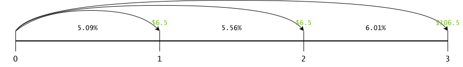
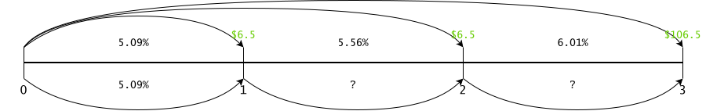

# Introduction
This submission is for MTHM059's third coursework over the year 2025-2026.

# Case 1: Amazon Alexa
This case study @RusselWalker talks about the profileration of voice-assisted AI tools in society's daily life from the perspective of Amazon Echo, eventually, Alexa. It's a comprehensive, engaging read that shows how such tools have removed previously unnoticeable frictions and mechanical work in favour of convenience. Naturally, the case also presents the ever-pertinent data and digital safety issues that come alongside such tools entering society.

The case presents pure facts about how voice tools have exposed and sealed a latent inconvenience: there is cognitive load @CognitiveLoad in having to pause baking prep and (re)set a timer, or check the weather before embarking on a leisure activity, or constantly remain updated with sports news. Alexa (and other voice tools), with its data integrations and infrastructure, makes such activities less disruptive: instead of fiddling with a phone, scrolling through menus, or interacting with overcomplicated UIs, a thought can be acted upon through voice, delegating mechanics to an automata. The popularity of such tools, even in spheres beyond just household activities, speaks for itself. Research has also noticed a further reduction in congitive load with respect to dialect and voice pitch @SeniorDialect, @DrivingPitch.

There are also interesting macro effects with AI tools that are apparent, and as discussed in the case. For starters, a salient point with the advent of AI tools is how the development of technology - a uniquely human endeavour - has made automata more human. For instance, we went from robotic-style ways of interaction with computers:

```bash
$ gcc -g -Wall -O3 program.c -o ./program 2>&1 | tee compile.log | grep -E "malloc|error|warning"
```

To a more intuitive prompt-based style of interaction carrying a greater tinge of humanity:

```txt
Hi, can you please read through my C program file and identify any memory errors that might arise?
```

Naturally, the capabilities of ourselves and such tools have grown alongside each other, and the case study very plainly showcases this: initial consumers of products like Alexa paid for their novelty, and ended up finding unprecedented convenience because of the way these tools can tailor their behaviour to the person using them. Over time, convenience became the USP.

On the other hand, there is also the macro effect of frustration and real pain from the breakneck speed of adoption of these tools, and the corresponding impact on labour force adjustments and regulation. The common doomsday argument is that AI tools become so proficient that they "overtake" humanity; however, a sharper framing comes from recognising why such a fear is warranted. The concern is less about domination and more about velocity @WIPO: systems improving faster than regulations, labour markets, and society as a whole can realistically adapt, creating the perception of obsolescence rather than the reality of short-term displacement. Hence the real challenge of technological development bringing about exponential gains in productivity, which in turn accelerate the creation of even more capable tools. The gap between societal absorption and technological advancement is where the fear originates; in fact, this differential forces us to clarify what we want out of such technologies @AndrewRossQuality, @KemingChenChina.

Data protection, for example, as described in the study, is a genuine threat @UCL. An argument can be made along these lines, using the example from the study: if one can overhear a couple's conversation from a neighbouring house then tell their overseas friends about it, there's no difference from their conversation reaching an Amazon data centre overseas. The argument can be extended: will I share my bank account details with a stranger for no good reason? Of course not. Will I tell them what kind of blender I like? I already do by making such a purchase in-store, and receipt copies are a store of data. Will I tell them what my dentist said about my teeth a few visits ago? Maybe only once I get to know them, which is what such tools do through their personalisation subroutines. However, such arguments do not account for two angles:
1. The actual threat posed by data leakages wherein peoples lives and financial livelihoods have been materially affected by such leaks.
2. The fact that for the most part, users are unaware of _what_ data is being collected about them and how it's being processed. Physically purchasing a blender or discretionarily telling someone about a dentist visit is a conscious decision to share information; having my conversation recorded by a tool that I understand to be inactive is an invasion of privacy.

User data might be collected and used in ways that are technically well understood, but from a regulatory, protective, and societal aspect, the effects are as of yet unknown. Just as I pay for a blender in-store and expect my receipts to be safeguarded by the company, likewise I expect my data - medical, financial, or otherwise - to be safeguarded. Data protection regulations aim to reconcile this discrepancy between data management malpractice and consumer expectations @ValentinRupp. Such effects beget a point worth considering: the coexistence of such tools with society is the default, but how well it works depends on whether society can keep up with its own tools.

# Case 2: Calculating & Disclosing Bond Yields: Ethics and Mechanics
This is a layered case study that puts its readers in the shoes of Claudia, a budding financial professional seeing both sides of their chosen coin: how a consumer of financial services interacts with the industry, and how established professionals in the industry interact with their consumers. The case presents its dichotomy quite viscerally: Claudia, through education is aware of the nuances in computing bond returns and begins to doubt whether her grandfather's reported yields reflect economic reality or merely compliant disclosure. A review of bond pricing from Claudia's perspective is necessary before continuing.

A bond is, in essence, a loan that exchanges cash today for fixed future payments. For instance, a 4% coupon bond issued at par of $1000 implies annual interest (coupon) payments on the principal and full repayment at maturity (annualised here for simplicity). Despite fixed cash flows, bond prices are highly sensitive to interest rates, as they equal the present value of these payments discounted at the market yield.

$$ PV = \sum \limits_{t=1}^{\tau} \frac{C_t}{(1+r)^t} + \frac{F}{(1+r)^{\tau}} $$

Where $C$ denotes coupons, $F$ principal, $r$ interest rate, $\tau$ time to maturity, and $t$ years. In our case:

| $C_1$ | $C_2$ | $C_3$ | $C_4+F$ | $r$   | $PV$ (in $) |
| ----- | ----- | ----- | ------- | ----- | ----------- |
| 40.00 | 40.00 | 40.00 | 1040.00 | 3.50% | **1018.37** |
| 40.00 | 40.00 | 40.00 | 1040.00 | 4.00% | **1000.00** |
| 40.00 | 40.00 | 40.00 | 1040.00 | 4.50% |  **982.06** |

The price of a bond reflects whether its return outpaces the prevailing interest rate: above $r$ is a premium, below is a discount. In practice, an exact $r$ is rarely available: bond prices & terms, and interest rates from various equivalent investments are, but the applicable $r$ is Yield To Maturity (YTM; aka Internal Rate of Return, IRR), obtained by inverting the $PV$ formula and solving for $r$:

$$
\begin{align*}
    PV &= \sum \limits_{t=1}^{\tau} \frac{C_t}{(1+r)^t} + \frac{F}{(1+r)^{\tau}} \\
    0 &= -PV + \sum \limits_{t=1}^{\tau} \frac{C_t}{(1+r)^t} + \frac{F}{(1+r)^{\tau}} \\
    0 &= -PV(1+r)^{\tau} + \sum \limits_{t=1}^{\tau} C_t(1+r)^{(\tau-t)} + F
\end{align*}
$$

(Alternatively we can set $x := (1+r)$, solve the polynomial in $x$, then recover $r=x-1$).

The IRR gives an investment's intrinsic return; for bonds, YTM assumes it's held to maturity and not sold in the interim for a higher market price, and that coupons are reinvested at the IRR itself (see MIRR @WikiMIRR). Claudia's grandfather spends his coupons since he lives off his interest. YTM is more important when buying a bond midlife; e.g. if we missed the par issue 2 years ago and our exemplar bond costs $1095, its YTM is -0.70% since at maturity we only receive $1040 + one $40 coupon vs. an outlay of $1095.

Though Claudia's grandfather's bonds aren't callable, we must be aware that some bonds include embedded options letting the issuer call or put the bond before maturity. These callable or puttable bonds are valued using lattices (or otherwise) that account for early termination (see appendix for an example). Limited upside reduces price, and as such the Yield To Call (YTC) may differ from YTM.

The brokerage reports the current yield @WikiCurrentYield, showing how much a coupon earns relative to the bond's market price. This measure ignores holding-to-maturity, reinvestment of coupons, and reinvestment risk, but is relevant if the bond is sold at market. Clean versus dirty pricing also matters: accrued interest affects the settlement price, so a quoted $1095 may not reflect the full owed amount.

With these nuances in mind, Claudia can evaluate her grandfather's holdings: Were his bonds purchased as fresh issues or on the secondary market? What is the realistic YTM given his purchasing prices and non-reinvested coupons? Would selling for reinvestment improve returns, or is the fund already optimising this? Does his spending plan require rebudgeting to capture better yields?

The case study is layered because it forces us to contend with a contemporary issue: just because something is legally mandated doesn't mean responsibility ends there @SEC, @CFA3A. The general investor's concern is straightforward: how much money have I put in, and how much am I getting back? But by being educated in the nuances of investing, financial professionals shoulder the fundamental obligation of presenting the nuances of an investment clearly to their clients for their benefit; open academies like @ZerodhaVarsity, @NSEAcademy portray this well. Claudia's grandfather's brokerage has a clear ethical responsibility to report not just legally mandated numbers, but also the numbers relative to her grandfather's portfolio. Financial regulations, like requiring the disclosure of "yield to worst", makes investors aware; but the responsibility of a financial professional lies in covering the gap between regulation and empathy.

As an investor, I might not know how a company capitalises interest costs and what that might entail; much like as a software user, I might not know how implicit downcasting in a packed struct can lead to adjacent memory corruption and data loss @KnightCapital, @Ariane5_501, @Therac25, @IntelFDIV. But as a software user I trust the developers much like I trust my financial advisor. And misuse of that trust can just as easily turn into a legal nightmare as reporting only "current yield" is easily compliant.

# Case 3: History Lessons Can Help Investors Respond to Inflation
This case study @CarlaFried highlights the fact that most equity market participants lack an understanding of how high inflation affects their portfolios (nor their debt @DebtErosion), at least until they're shown inflation's impact on equities over history. Before we discuss the crux of the case study, a brief overview of inflation is warranted. Heuristically, we can describe inflation in the spirit of @ChaterThermalMicro as:
$$ i = \frac{\partial C}{\partial F} > 1 $$

Where $C$ is the number of claims $C(F, t)$ to an amount of physical product, $F(t)$. In an inflationary environment, the number of claims increases quicker than the amount of physical product available. Deflation is the opposite, where the amount of physical product grows quicker than the number of claims to it:
$$ i = \frac{\partial C}{\partial F} < 1 $$

For simplicity, assume an isolated world with 50 food units shared amongst 10 people. If an earthquake destroys 25 units and kills no one, each person only gets 2.5 units: the value of food has increased. If a volcano spews ash and fertilises the ground adding 25 food units, suddenly each person gets 7.5 units: the value of food has reduced. Money is, functionally, just like any other commodity, the only differences being fiat assurance that it can be used as a medium of exchange, and policy-governed supply. As such, inflation is intrinsically linked to the amount of physical product available and has a material impact: high inflation erodes the real future value of money as perceived today. Note that "inflation" in this sense is the short term differential exceeding $1$ (and where our focus lies); in the long term, $C$ and $F$ evolve codependently and endogenously as well. For the case study, this presents a few interesting points:

1. The study shows unaware investors that equities underperform during periods of high inflation. Indeed inflation affects individuals and corporates alike. Addressing fixed income first, bonds are rigid claims $C$ on future nominal payments at a rate determined today; inflation directly erodes money's future real value in general, and central bank rate hikes directly hurt bond prices. Equities (and their risk premia) are multidimensional, entangling both $C$ and $F$. The idea that companies can self-adjust to wholesale inflation by increasing prices doesn't account for their risk of demand churn; moreover, equities don't constitute a direct claim on physical output, unlike commodities which live in $F$. Equities are thus a poor inflation hedge @CFAinflation.

    A robust investment strategy in an isolated economy then, is playing the denominator $F$: physical assets like precious metals, water, grain, etc. generally accrete nominal value during inflation. As long as centralised sources of money don't inject too much at once, an isolated economy can remain in a quasi-stationary statistical equilibrium with slowly changing parameters @YakovenkoStatmech. Globally, adiabatic nations in hyperinflation find it easier to escape if they start trading with others @RayChaudhuri. Money moving from an expensive nation to a cheaper one results in two aggregate effects @ChaterThermalMicro:
    1. The cheaper nation witnesses a reduction in their value of money because there are now more claims than their physical product.
    2. The expensive nation witnesses an increase in their value of money, because they can now buy more things for less money.

    Supplementing a commodity-first investment strategy with judicious diversification is thus also beneficial (provided the other nation isn't itself going through an inflationary period) because it exploits the differential between economic structures, and helps ease inflation. The case study demonstrates this: investors reduced equity exposure and increased commodities and foreign market exposure. As a departure from this narrative, cryptocurrencies have apparently performed as well as metals during inflation @NickJames22 despite lacking a direct link to $F$.

2. The study provided historical stock and commodity returns to investors, and to a select subgroup provided an additional "narrative explanation of what factors drove those returns". It's crucial to recognise that using historical information to hold an expectation about the future is only possible if the underlying process is ergodic enough for such averaging to make sense - the markets, and wealth, aren't like that @OlePeters. Investors who understood the drivers of their portfolio (e.g. whether a company will actually push wholesale inflation pressure onto its customers; is a company insulated from inflation; how much can one budget for commodities; how dependent, linearly and nonlinearly, is a portfolio on commodities already; etc.) during inflation navigated inflationary regimes more tactically.

3. Behaviourally, the study has also interestingly underscored the reflexive nature of markets @ReflexivityEconomics, @GeorgeSoros. Indeed inflation is a fundamental factor that has a baseline effect on aggregate economic performance, but by reducing equity exposure by ~8-10% in fear of inflation affecting their wealth, the survey's investors have directly caused a reduction in equity prices, potentially circularly affecting wealth over and above inflation's baseline effect.

This case study succinctly explores the immediate and long-term behavioural changes apparent from investors once they're adequately educated in the factors that directly affect their portfolios. A pertinent follow-up would be investigating changes in NFT investment habits, and whether they've become more structural in nature.

# Case 4: Analyzing the NFT Mania: Is a JPG Worth Millions?
This case study @Case4_MadelineRae, like most writings on NFTs, examines them as an asset class. Much contemporary commentary predates their market crash @Gaurdian_NFTsWorthless and often grossly misrepresented the technology, misunderstandings that arguably helped inflate the bubble. It's important that investors understand their product; the best analogue to this end being the humble Git VCS (and by extension, DBMSs like PostgreSQL).

Fundamentally in data management, digital items (videos, images, books, retail stock, etc.) are associated with a locally unique ID @DatabaseNormalisation. "Locally" means unique within a limited namespace (like a table or Git repository); global uniqueness emerges through conditionally joined sets of such keys. Git and blockchains generate unique IDs using Content-Addressable Storage @ContentAddressableStorage: instead of a filepath and filename, the contents of the file are hashed and the hash is used as a unique ID for that specific file. For example, using SHA256:

```bash
$ printf 'Hello, MTHM059!\n'                     # actual text
Hello, MTHM059!

$ printf 'Hello, MTHM059!\n' | sha256sum         # unique id
342bd2a2fa05d90dc227d0a4782c3a6263cadb108f0f7ffbcea093ee894ff79b

$ xdg-open university_of_exeter_logo.png         # actual image

$ cat university_of_exeter_logo.png | sha256sum  # unique id
81f1e816d9ac21ffdb5ab3e07ec628f9b7ed3236d28618a8949b1e5a2456feaa
```

| id           | file                            |
| ------------ | ------------------------------- |
| `342bd2a...` | `hello_mthm059.txt`             |
| `81f1e81...` | `university_of_exeter_logo.png` |

Crucially, hashing algorithms are irreversible. Whilst a specific hash is only obtainable given the exact data that generated it, the hash itself is just an alphanumeric sequence @WYAG. For example, computing the length of a sentence is easy, but there's no way to retrieve the exact original sentence given only its length. When an image is made into an NFT, a few things happen:
1. The actual image is uploaded onto a server supporting some standardised protocol like @IPFS, @OpenZeppelinERC721, @NMKR; the image's contents are hashed, and the image is thus assigned a Content ID (CID, like a Git blob OID).
2. The CID is packed into metadata containing the artist's name, a timestamp, image owner, transaction data, etc. (like a Git commit).
3. That metadata is also content-hashed and "minted" onto a blockchain (like pushing a commit into a Git repository).
4. The blockchain's Smart Contract issues the mint with its own unique _token_ and metadata IFF certain prerequisites are met (like a Git repository only accepting signed, verifiable commits).

The token in (4) is the NFT. For example, @RS_GitCommit has a unique commit ID tied to its author at that point in time. This is technically identical to an NFT (additionally, that @RS_GitCommit has an abbreviated hash of 7 digits is itself an extremely rare phenomenon @JonathanFinch). For context, a Git commit contains a tree of blobs' content hashes (blob OIDs), a parent commit's hash, information on the commit's author and committer, and a commit message @Masak, @Graphite. Because each commit and its content hash contains hashes of parent commits (save for the initial commit in a Git branch), a Git repository forms a verifiable chain: any change to previous content fundamentally alters it. Blockchains are identical: each block carries the hash of a parent block, transaction data, author information, and a timestamp; their difference being a Proof-of-Work system @CryptoNoncePOW that renders replications of existing blockchains impossible. For further reading about Git, please see @GitBlog, @Konrad126, @ProGit, @KenMuse, @WhydRF, @MatthewBrett. In fact, Git and blockchains can be used as databasese themselves @ReplacePSQLGit, @BlockchainOpennessMVCC.

As explained, NFTs are just hashes of hashes: owning a Git commit in no technical sense constitutes ownership of the actual source or project. Understanding this is imperative because prior to the NFT market crash, such misunderstanding led to gross misallocations of capital. Some merit is warranted, however, because new technology always brings about a learning curve, and traversing the learning curve must incur misallocation of capital for mistakes to be realised as mistakes. Unless a legal understanding between counterparties exists (e.g. BoredApes or CryptoPunks @WikiNFTCopyright), NFT owners own no fundamentally valuable asset; the irreversibility of hashes cementing the fact. However, the case study does highlight some real use-cases of NFTs that justify their _technological_ hype, and indeed such use-cases are actively being pursued: India's national rollout of a Digital Rupee (and other nations' CBDCs) @RBIeRupee, @WikiCBDC, is a simple example. The tokenisation of real estate, gold, creative art (in a non-exploitative manner), etc. can - with legal backing - ensure that founders, owners or creators of such assets get royalties properly attributed to them despite future sales @UBC, @OutlookIndia owing to the verifiable chain of ownership. Perhaps the most striking examples of tokenisation that genuinely accretes societal value are DeFi @WikiDeFi and Carbon Credits @BloombergJPMC, @JPMGkinexys.

So in review, is the hype surrounding NFT investment justified? If by "NFT investment" we mean investing in the technology and its legal bases, absolutely so; and we have grown to reflect this. Have NFTs challenged notions of ownership and value? Indeed, though their challenge is nuanced: if anything, NFTs - like almost all technology - have clarified what ownership means, and where blurry lines lend themselves to misconduct. Just like VCSs have substantially increased the level of povenance and responsibility in the tech industry, so too can blockchains, NFTs and related technologies aid provenance in the financial industry.

# Concluding Thoughts
A recurring theme across these case studies is caveat emptor, but the deeper ethical question is more intriguing: how can a tech developer, or finanical advisor, or otherwise, expect their clients (consumers, investors, etc.) to really be informed when it takes an entire degree in the subject to understand just the basics of it? Phrased differently, how can a patient ever really be informed without a medical degree @ForbesReclaiming, @StanfordPhilosophy, @LSEInformedConsent? Perhaps a deeper truth is that informed consent is always provisional: clients, like patients, can never fully inhabit the expert's perspective. Ethics, then, is maybe less about whether clients can understand everything and more about how systems, guidance, and intermediaries mediate that understanding responsibly.

# Appendix
## Callable Bonds
As discssued in Case 2, some bonds come embedded with an option for the issuer to exercise them, effectively terminating the bond and giving the bondholder, at that point in time, just the principal and coupon. These kinds of bonds are usually priced with lattices @WikiLatticeBonds. Consider the recombining price lattice in Figure 1.

![Pricing a callable bond with a lattice tree. The image depicts a callable bond worth $100 par face value with 8.5% annual coupons, callable in 1 year onwards at a price over $100. In other words, if the price of the bond ever exceeds $100 from 1 year after issuance onwards until maturity, the issuer exercises the bond and only pays the holder principal + that year's coupon. Interest rates at each level of the tree are obtained via statistical bootstrapping, fitting a model to an existing historical interest rate curve and generating paths forward.](./images/callable_lattice.svg)

At the right end of the lattice, we have the bond's expected payoff at maturity assuming it's held to maturity: the final coupon plus face value (principal). Each level of the tree is 1 year and contains, in order:
1. The estimated price of the bond at that time, given that possible interest rate. Black prices (on the top) indicate the actual estimated price.
2. The actual price of the bond, call decision included. Red prices indicate the bond has been called, because the actual estimated price exceeds the call price.
3. The coupon obtainable in that year.
4. A possible interest rate for that year.

The way we obtain the estimated prices is by starting from the right end of the tree (maturity) and working backwards, applying:

$$ V_{t-1} = \frac{0.5 \cdot (V_t^+ + V_t^-) + C}{1+r_{t-1}} $$

At each step, where $V_t$ indicates the value of the bond at time $t$, $V^+, V^-$ are the upper and lower nodes at the current time, $C$ is the coupon and $r_{t-1}$ is the interest rate of the preceeding node. For example, starting from the end we can obtain the prices in the 3rd year like so:

$$
\begin{align*}
    V_{3}^{++} &= \frac{0.5 \cdot (100 + 100) + 8.50}{1.09603} =  98.994 \\
    V_{3}^{+-} &= \frac{0.5 \cdot (100 + 100) + 8.50}{1.07862} = 100.591 \\
    V_{3}^{--} &= \frac{0.5 \cdot (100 + 100) + 8.50}{1.06437} = 101.938
\end{align*}
$$

Notice how the last 2 estimated prices exceed the call price of $100, so we've replaced them with the call price since that's the effective payoff we're entitled to, as a callable bondholder. And likewise for year 2, using those computed (callable) prices in year 3:

$$
\begin{align*}
    V_{2}^{+} &= \frac{0.5 \cdot (98.994 + 100) + 8.50}{1.08481} = 99.554 \\
    V_{2}^{-} &= \frac{0.5 \cdot (100    + 100) + 8.50}{1.09199} = 101.455
\end{align*}
$$

Again the lower path's price is callable, so we replace that to get our discounted price today. As demonstrated, the price at each level of the tree is a function of the next two nodes' prices. Puttable bonds will be priced the same way except with a direction change: instead of being exercised if price exceeds a given strike, the bond will be exercised if price falls below a given strike. An alternative way to price bonds with embedded options is using Black's formula @Black76. Either way, as discussed in our case analysis, pricing bonds with embedded options takes into consideration the fact that upside is limited for the investor. The way we'd compute Yield To Call then, is just by taking the earliest call date possible. In our case, it's possible for the issuer to call the bond just in year 1 (this doesn't always turn out to be the case), meaning our YTC polynomial is:

$$ 0 = -100.72(1+r) + 108.5 = 7.72\% $$

If we look at our upper pathway where we get to hold to maturity without any prior exericse, the YTM is:

$$ 0 = -100.72(1+r)^3 + 8.5(1+r)^2 + 8.5(1+r) + 108.5 = 8.22\% $$

### Relationship to regular bond pricing
Pricing with a lattice can be a little disorienting at first, so here we discuss how lattices relate to the regular notion of bond valuation. The common expression for the PV of a bond is

$$ PV = \sum \limits_{t=1}^{\tau} \frac{C_t}{(1+r)^t} + \frac{F}{(1+r)^{\tau}} $$

Assuming a 3 year, $100 par 6.5% annual coupon bond with these rates:

| Period | 1     | 2     | 3     |
| ------ | ----- | ----- | ----- |
| Rate   | 5.09% | 5.56% | 6.01% |

That regular PV formula then becomes:

$$ PV = \frac{6.5}{(1.0509)^1} + \frac{6.5}{(1.0556)^2} + \frac{6.5 + 100}{(1.0601)^3} \approx 101.413 $$

Which translates to this kind of operation:



But we can also do this:



The way rates in general are presented implicitly imply that each rate is applicable from today $t=0$ to maturity $t=\tau$. In our case, the rates actually mean this:

| Period | $t=0 \to 1$ | $t=0 \to 2$ | $t=0 \to 3$ |
| ------ | ----------- | ----------- | ----------- |
| Rate   | 5.09%       | 5.56%       | 6.01%       |

With the alternative formulation, we're trying to find the interim rates: from $t=1 \to 2$ and $t=2 \to 3$. We can do this easily using the same approach for FRAs: under no arbitrage pricing, the far rate $r_f$ must equal the near rate $r_n$ times the unkown intermediate rate - just like an FRA:

$$
\begin{align*}
    \left( 1+r_n \cdot \frac{t_n}{360} \right) \left( 1+FRA \cdot \frac{t_{FRA}}{360} \right) &= \left( 1+r_f \cdot \frac{t_f}{360} \right) \\
    \implies 1+FRA \cdot \frac{t_{FRA}}{360} &= \left( 1+r_f \cdot \frac{t_f}{360} \right) \left( 1+r_n \cdot \frac{t_n}{360} \right)^{-1} \\
    \implies FRA \cdot \frac{t_{FRA}}{360} &= \left( 1+r_f \cdot \frac{t_f}{360} \right) \left( 1+r_n \cdot \frac{t_n}{360} \right)^{-1} -1 \\
    \therefore FRA &= \left[ \left( 1+r_f \cdot \frac{t_f}{360} \right) \left( 1+r_n \cdot \frac{t_n}{360} \right)^{-1} -1 \right] \cdot \frac{360}{t_{FRA}} \\
\end{align*}
$$

In our case, our intermediate rates are:

$$
\begin{align*}
    r_1 &= \frac{1.0509}{1} -1 = 5.09\% \\
    r_2 &= \frac{1.0556^2}{1.0509} -1 = 6.03\% \\
    r_3 &= \frac{1.0601^3}{1.0556^2} -1 = 6.92\% \\
    \implies PV &= \frac{6.5}{1.0509} + \frac{6.5}{1.0509 \times 1.0603} + \frac{106.5}{1.0509 \times 1.0603 \times 1.0692} \approx 101.413
\end{align*}
$$

The reason we want this granularity - effectively zooming into the linear interest rate schedule - is because now we can decide the outcome of an interest rate derivative at each point in time (each year/quarter/etc.), for example, with a callable bond. This is the point of the tree, it facilitates making a decision at each step through it. Additionally, what we have here is a single path of interest rates; if instead we stochastically simulate a bunch of them at once @WienerProcess, we can place them appropriately and end up with the tree from earlier.

# References