\begin{center}
Submitted to the University of Exeter as a dissertation for the degree of MSc Mathematical Finance.
\end{center}

I certify that all material in this report which is not my own work has been identified, and
that no material has previously been submitted and approved for the award of a degree by
this or any other University.

This assessment is AI-assisted. I acknowledge the following uses of GenAI tools in this assessment:
* To assist with research or gathering information,
* To give me feedback on a draft, and
* To assist with coding.

I declare that I have referenced the use of GenAI outputs within my assessment in line with
the University referencing guidelines.

---

\begin{center}
Dedicated in full to my late father, my Papa Bear,

\par\vspace{1em}

\textbf{\textit{Satish Singh.}}

\par\vspace{1em}

\textit{He said, "come to the edge." They said, "we're afraid!"}

\textit{He said, "come to the edge." They said, "we might fall!"}

\textit{He said, "come to the edge!"}

\textit{And they came. And he pushed. And they flew.}
\end{center}

\newpage

\begin{center}
\textbf{ABSTRACT}
\end{center}

This dissertation examines cross-sectional and evolutionary modelling approaches of India's Nifty 50 implied volatility (IV) surfaces from a practical perspective. (Surface) Stochastic Volatility Inspired (SSVI) and a neural stochastic differential equation (NSDE), based on the FuNVol framework, are examined as the cross-sectional and dynamic models respectively. Empirical Nifty implied volatility surfaces are examined through the behaviour of their functional principal components (FPCCs), SSVI through a purely hyperbolic lens, and the NSDE through the effective rank of its weight matrices and Finite-Time Lyapunov Exponents. Results suggest that FPCC increments exhibit heavier-than-Gaussian but lighter-than-$t$ tails, motivating a Normal Inverse Gaussian Levy alternative to Brownian diffusion. FPCC increments also demonstrate transient low-dimensional dynamics. Though classical ARX(1)-GARCH(1,1) linear models outperform, on average, the NSDE in terms of predictive error and simplicity, results show that the NSDE's greater expressive power helps encapsulate state-dependent dynamics in a way that renders predictive error insufficient in quantifying the value of neural parameterisations. Finally, the dissertation also demonstrates the amount of insight that can be gained through the application of Scientific Machine Learning to complicated systems. Code and supplementary material not included here, due to space constraints, will be made available on the author's GitHub @rasi96GH in due time. A full GenAI project is available at @ChatGPTgenAI.

# Introduction {#sec:introduction}
Option contracts bestow upon their owner the right, but not the obligation, to trade in their underlying asset (which may be equity, volatility, skew, interest rates, swaps, etc.) at a predetermined price (the strike price), at a specific date (the expiry or exercise date, or maturity) in the future. Option payoffs, and consequently their prices, are functions of their underlying's price, with the element of time to expiry accentuating the impact of their underlying's volatility. The Black-Scholes options pricing model is commonly used to obtain the model-implied volatility (IV) measurement of a given option contract; a collection of such measurements, calculated on a specific day for a specific option, constitutes an "IV smile", so called due to the kind of skew in the geometrical shape. When multiple expiries are considered, the geometry is a three-dimensional surface indexed by (log-)moneyness, time, and implied volatility. The volatility surface is our analytical object of interest.

Empirical surfaces are notoriously ambiguous to model due to the objective at hand informing liquidity, smoothing choices, and arbitrage constraints. Cross-sectional modelling is well-studied whilst modelling the evolution of a surface is a greater challenge still. A popular cross-sectional approach is the parametric SSVI, introduced by Gatheral in 2014 @GatheralSSVI (a close second, especially for interest rate derivatives, is SABR, introduced by Hagan et al. (@HaganSABR, @HaganArbSABR)). Recent efforts towards modelling the evolution of an implied volatility surface have leveraged neural stochastic differential equations (neural SDEs): a surface, whose true dynamics may be too complicated to impose structure upon, is only assumed to evolve as per some SDE that is parameterised with neural networks. A recent work in this regard is FuNVol by Choudhary et al. @FuNVol, which also adopts a Functional Data Analysis (FDA) route.

This dissertation hence contains two verticals: examining the behaviour of SSVI, and investigating the practical viability of a neural SDE inspired by FuNVol's principles. Both approaches are evaluated around a specific macroeconomic event: on the 20 September 2019, just shortly after market opening, India's Finance Ministry announced an unexpected corporate tax rate cut, triggering a sustained market reversal from then until the onset of the COVID-19 crash in February 2020. Though considerably less extreme than say, the 2008 Global Financial Crisis or the COVID-19 crash, a moderate macroeconomic event is still significant to options desks. The examination entails studying model structure, its assumptions, and behaviour around the macroeconomic event. That models reproduce observed prices is a necessary but insufficient criterion; it is equally important that a model's mechanics and limitations be understood prior to commissioning. As such, hedging exercises are not a priority in this dissertation. The rest of the study is structured as follows:

* @sec:tax_cut introduces the September 2019 macroeconomic event.
* @sec:market_data describes the market data and preprocessing procedure(s) used to construct the empirical implied volatility observations.
* @sec:ssvi develops the theoretical foundations of SSVI before presenting its implementation and empirical results.
* @sec:funvol_start introduces the FDA framework underpinning FuNVol, the neural network, and presents the resulting dynamic analysis.
* @sec:conclusions concludes with directions for further research.

## India's 2019 Corporate Tax Rate Cut {#sec:tax_cut}
Harking back to the contemporary sentiment of 2019, multiple countries -- India included -- faced financial tightening, weakening manufacturing, and the looming threat of a US-China trade war (@WEOApril19, @RBIApril19). Though optimistic about the second half of 2019, the International Monetary Fund (IMF) and the Reserve Bank of India (RBI) both noted further macroeconomic deterioration by then; in India, several risks flagged in April 2019 began to materialise and thus forced the RBI to adjust its 2019-20 growth projection lower (@WEOOctober19, @RBIOctober19). Note that macroeconomic reports are lagging indicators of instantaneous economic performance.

Against this backdrop, on 20th September 2019 and just shortly after market opening, India's Ministry of Finance announced an unexpected corporate tax rate cut (@PIBAnnouncement, @BBCAnnouncement, @BloombergAnnouncement, @CNBCAnnouncement, @FridayWindow) from the earlier 35% down to 22% (on paper), consequently foregoing ~US$15 bn in projected revenue. Such substantial fiscal intervention at a time of tightening was unprecedented; indeed, the RBI Governor had cautioned against fiscal expansion the day prior @GuvNoFiscal. @fig:TaxRatePriceAction depicts the intraday and short-term daily price action, following the announcement, on the Nifty 50 index (introduced in @sec:market_data). On identical terms, @fig:TaxRateVIX depicts the action of Nifty 50's Volatility Index (@NSEVixMethod). This is the central event to the dissertation. @sec:market_data formally introduces the Nifty 50 and discusses data collection and preprocessing in detail.

{#fig:TaxRatePriceAction}

{#fig:TaxRateVIX}

## Market Data and Reconstructing Implied Volatility {#sec:market_data}
In @sec:tax_cut we established the dissertation's market event of interest. This section formally introduces the Nifty 50 index and subsequently describes the construction of its options dataset.

The Nifty 50 (Nifty) is India's flagship equity index, managed by the National Stock Exchange of India (NSE) @Nifty50intro. It is a free-float, market-capitalisation weighted index of India's 50 largest blue-chip firms, providing investors with exposure to multiple sectors of the Indian market in one efficient portfolio. Derivatives trading was launched in 2000, with futures contracts being the first ones available. European-style options contracts followed in 2001, and over subsequent decades the derivatives segment matured extraordinarily: Nifty options have been the world's largest traded contract for multiple years, and the NSE was recognised as the world's largest derivatives exchange by contract volume in 2019 and 2020 @NSEBig. Unfortunately, despite the world-leading scale of Nifty's derivatives segment, it remains underrepresented in the academic literature on volatility modelling which is rife with studies on US and EU markets.

Our data sources consist of:
1. NSE Equity Derivative Bhavcopies for each day from 2010-01-04 to 2019-10-31, sourced from the NSE @NSEReports and filtered to only include Nifty 50 options contracts;
2. The closing price history of Nifty over the same time period, sourced from Investing.com @InvestingCom (or equivalently, from YahooFinance @DPGuthrie);
3. The dividend yield history of Nifty over the same period, sourced from TrendLyne @TrendLyneDY. Whilst the index doesn't pay dividends, its constituents' dividend payments still affect the index through proportionate price drops on ex-dividend dates. Nifty's dividend yield is also computed using free-float market-capitalisation weighting.

Closing price and dividend yields are straightforward time series. A Bhavcopy (literally, "moneycopy") provides a tabulated end-of-day snapshot of all traded derivatives on the NSE, includes open interest (OI) and OHLC prices, but importantly does not include volume or bid/ask spreads (L2 data). Volume portrays how many trades were executed during a specified period, whilst a bid-ask spread provides the most accurate measurement of liquidity of an asset: a small bid-ask spread allows investors to enter and exit the market instantaneously. The lack of direct measures of liquidity leaves OI as the closest proxy, which may be stale: IFF an investor closes out their position completely will OI reduce @0dha, otherwise for an investment opened and held over months, OI remains nonzero, thus reflecting positions that are not necessarily actively priced. Only those strikes with nonzero OI in each Bhavcopy are retained. The raw dataset for this dissertation, prior to any form of preprocessing discussed in this, or subsequent, chapter(s), has been made publicly available on Kaggle @KaggleData. From the remaining strikes with nonzero OI, for each expiry date within a Bhavcopy, the number of years to expiry $\tau$ is calculated as the difference from the current date $t_0$ until that expiry $t_{\text{T}}$, divided by 365:
$$ \tau = \frac{t_{\text{T}}-t_0}{365} $$

We now have sufficient data to numerically invert the Black-Scholes option pricing model and obtain implied volatility. In what follows, please let:
* $\tau$ denote the years to expiry, computed as given above;
* $T$ denote the date of maturity/expiry of an option contract,
* $S_t$ denote the closing price of the underlying asset at time $t\le T$. In our case, $S_t$ denotes the daily closing price of the Nifty 50 equity index;
* $K$ denote the strike price of an option contract written on the Nifty 50 equity index,
* $C_{\text{M}}$ denote the market price of a call option contract at strike $K$, written on the Nifty 50 equity index (and likewise $P_{\text{M}}$ for the market price of a put option contract at strike $K$),
* $r$ denote the risk-free interest rate, set to 10% as per NSE guidance, and
* $q$ the dividend yield of the Nifty 50 equity index at time $t\le T$.

Since the original Black-Scholes options pricing model does not account for carrying costs of the underlying asset, the Black-76 pricing model is used instead. The prices of a call and put options (CE, PE) are:
$$
\begin{align*}
    C_{\text{B76}}(S_t, t) &= e^{-r\tau} \left(F_T \mathcal{N}(d_+)-K \mathcal{N}(d_-)\right)
    \\
    P_{\text{B76}}(S_t, t) &= e^{-r\tau} \left(K \mathcal{N}(-d_-) - F_T \mathcal{N}(-d_+)\right)
\end{align*}
$$

With:
$$
F_T := S_te^{(r-q)\tau}, \qquad
d_+ = \frac{1}{\sigma\sqrt{\tau}} \cdot \left[\ln \left( \frac{F_T}{K} \right) + \frac12 \sigma^2\tau\right], \qquad
d_- = d_+ - \sigma \sqrt{\tau}
$$

Where $\mathcal{N}(\cdot)$ is the cumulative distribution function (CDF) of a standard Normal distribution. Black-76 preserves the assumptions of the original Black-Scholes model, in particular the assumptions of constant volatility and a log-normal pricing process, but includes carrying costs of the underlying as a drag-like force on the drift. The Bhavcopy column `cp_flag: Literal["CE", "PE"]` is retained to distinguish between call and put options. Asymptotics must be considered before numerical inversion, especially $\tau\to 0$:
1. **The limit as $\tau\to 0$:** As we approach expiry, the forward price $F_T\to S_T$ which implies $\ln(F_T/K) \to \ln(S_T/K)$. The additive factor $\frac12\sigma^2\tau\to 0$ which becomes a negligible effect. The fraction $\left(\sigma\sqrt{\tau}\right)^{-1}$ becomes infinitesimally large, in which case behaviour now depends on the relationship of $S_T$ and $K$:
    * If $S_T>K$, then $\ln(S_T/K) > 0$ and the option is In The Money (ITM). A positive numerator with a vanishingly small denominator tends to $+\infty$, which results in $d_+\to+\infty$ (and subsequently, $d_-\to+\infty$ as well since $\sqrt{\tau}\to 0$). Then, $C_{\text{B76}}$ becomes $e^{-r\tau} \left(S_t \mathcal{N}(+\infty)-K \mathcal{N}(+\infty)\right)$ where $e^{-r\tau}\to 1$, resulting in $C_{\text{B76}}(S_T, T)=S_T-K$, the exact behaviour of a European ITM CE at expiry. The put option, in contrast, tends to $0$ since $P_{\text{B76}}(S_T, T)=(K \mathcal{N}(-\infty) - S_T \mathcal{N}(-\infty))=0$, which is correct because at expiry, if $S_T>K$, put options are worthless.
    * If $S_T=K$, then $\ln(S_T/K) = 0$ and the option is At The Money (ATM). $d_+, d_-\to 0$ as $\tau\to 0$ and thus call and put options expire worthless. This is consistent with ATM expiries: calls and puts have zero intrinsic value.
    * If $S_T<K$, then $\ln(S_T/K) < 0$ and the option is Out of The Money (OTM). A negative numerator with a vanishingly small denominator tends to $-\infty$, which results in $d_+, d_-\to-\infty$. Then, $C_{\text{B76}}=\left(S_t \mathcal{N}(-\infty)-K \mathcal{N}(-\infty)\right)=0$, which is correct because at expiry, if $S_T<K$, call options are worthless. The put option, in contrast, tends to $P_{\text{B76}}(S_T, T)=(K \mathcal{N}(+\infty) - S_T \mathcal{N}(+\infty))=K-S_T$, the exact behaviour of an ITM European PE at expiry.

2. **The limit as $S\to\infty$:** As the price of the underlying grows endlessly, $F_T$ grows exponentially and thus $\ln(F_T/K)$ grows linearly to $+\infty$. Then, $d_+, d_-\to+\infty$ and $C_{\text{B76}}(S_t, t)=e^{-r\tau} \left(F_T \mathcal{N}(+\infty)-K \mathcal{N}(+\infty)\right)=e^{-r\tau}(F_T-K)$. Since $K$ is fixed and does not depend on $S$, as $S\to\infty$ the effect of $-K$ becomes negligible. A put option, in contrast, will be worthless in this scenario.

3. **The limit as $S\to 0$:** As the price of the underlying crashes to zero, $F_T$ slowly creeps to zero as well, and thus $\ln(F_T/K)$ grows increasingly negative to $-\infty$. Then, $d_+, d_-\to-\infty$ and $C_{\text{B76}}(S_t, t)=e^{-r\tau} \left(F_T \mathcal{N}(-\infty)-K \mathcal{N}(-\infty)\right)=0$, which is correct because call options on a crashing stock are worthless. A put option, in contrast, becomes $P_{\text{B76}}(S_t, t)=e^{-r\tau} (K \mathcal{N}(+\infty) - F_T \mathcal{N}(+\infty))=e^{-r\tau} (K-F_T)$; the payout of which is simply $K$, the strike price.

4. **The limit as $q\to r$:** In the event that an asset pays a dividend yield equal to the risk-free rate, the only quantity that gets affected is $F_T$, in that $F\to S_t$ since $e^{(r-q)\tau}\to 1$. Therefore, under Black-76, if a company pays a dividend yield equivalent to the risk-free rate, there is no difference between investing $S_t$ in a bank or the stock.

5. **The limit as $\sigma\to\infty$:** If the volatility of an asset is ever-increasing, then $\left(\sigma\sqrt{\tau}\right)^{-1}\to 0$, and the additive factor $\frac12\sigma^2\tau \to \infty$, with a slope of $\frac12\tau$. Putting these two effects together, as $\sigma\to\infty$, $d_+\to+\infty$ at a slope of $\frac12\sqrt{\tau}$. $d_-$, on the other hand, will slowly tend to $-\infty$ with a slope of $-\frac12\sqrt{\tau}$, resulting in $C_{\text{B76}}=e^{-r\tau} \left(F_T \mathcal{N}(+\infty)-K \mathcal{N}(-\infty)\right)=e^{-r\tau} (F_T-0)=F_Te^{-r\tau}$. A put option, in contrast, behaves as $P_{\text{B76}}(S_t, t)=e^{-r\tau} (K \mathcal{N}(+\infty) - F_T \mathcal{N}(-\infty))=e^{-r\tau} (K-0)=Ke^{-r\tau}$.

The limit as $\sigma\to 0$ results in options contracts behaving completely deterministically with $C_{\text{B76}}\to e^{-r\tau}(F-K)$ and $P_{\text{B76}}\to e^{-r\tau}(K-F)$. The limit as $\sigma\to-\infty$ has no financial interpretation because by definition, volatility $\sigma\ge 0$ (studying such an asymptote will actually show a reversal of roles between $d_+, d_-$).

For fixed set of parameters $F_T, K, \tau, r, q$, the Black-76 model is continuous and strictly increasing in $\sigma$. Consequently, every admissible market price for an option corresponds to a unique non-negative implied volatility. A bounded scalar optimiser is used to obtain $\sigma$, ensuring $\sigma\in[10^{-3},\ 2]$. The objective function measures the squared loss between actual and estimated market prices: $\mathcal{O} = \left(C_{\text{B76}} - C_{\text{M}}\right)^2$. This subroutine is effected over all available options in a day's Bhavcopy, for all available Bhavcopies. All strikes $K$ are then transformed into log-forward-moneyness space:
$$ k = \ln\left(\frac{K}{F_T}\right) $$

With $k<0$ for OTM puts and $k>0$ for OTM calls. The combination of OTM call and put IVs for a certain day and along $k$, yields an IV smile. @fig:NiftySampleEmpiricalSmiles demonstrates some empirical samples. @sec:ssvi next examines SSVI with regards to these empirical smiles. Note that fixing $r=10\%$, as per NSE guidance, is a deliberate design choice for this dissertation only. Practically speaking, the contemporaneous risk-free discount curve, or its corresponding zero/forward-rate representation where required, would be used instead.

![Sample empirical IV smiles for the 2nd week in September 2019, from 09th September 2019 to 13th September 2019. Each row corresponds to one day, each column corresponds to a specific weekly expiry in October 2019. $x$-axis is log-forward-moneyness, $y$-axis is implied volatility. One smile is formed by plotting empirical OTM CE and PE IVs together, with empty boxes indicating no strikes were traded on that day. This illustrates that smiles evolve as liquidity develops, and that empirical implied volatility is neither smooth, nor guarantees arbitrage-free prices.](./images/24Apr26-nifty-sample-smiles.png){#fig:NiftySampleEmpiricalSmiles}

# Methodology {#sec:methodology}
## (Surface) Stochastic Volatility Inspired {#sec:ssvi}
In @sec:tax_cut we established the dissertation's market event of interest. In @sec:market_data we described the construction of this dissertation's dataset. This section examines the behaviour of SSVI, our tool for cross-sectional modelling of IV surfaces.

Introduced by Gatheral and Jacquier in 2014 @GatheralSSVI, Surface Stochastic Volatility Inspired (SSVI) extends earlier Stochastic Volatility Inspired (SVI) models with explicit constraints that guarantee an IV surface free of static arbitrage. We must first establish the meaning of static arbitrage before discussing the history of SVI.

### Static Arbitrage {#sec:statarb}
Arbitrage refers to a trading opportunity that requires no positive initial investment, produces no loss in any future state, and produces a strictly positive payoff in at least one state. Alongside, the Law of One Price states that identical claims should have the same price: if two portfolios generate the same future cash flows but have different prices today, an investor can buy the cheaper portfolio and sell the expensive one to lock in a risk-free profit. In derivatives pricing, these replicating relationships lead to fundamental inequalities on option prices that must hold. To illustrate, please consider a European call option with maturity $T$. Denoting its value at time $t\le T$ by $C(t, S, K)$, its terminal value at expiry is given by:
$$ C(T, S, K) = \max(S_T-K, 0) = (S_T-K)^+ $$

Where:
* $T$ is the terminal time of option maturity,
* $(S)_{0\le t\le T}$ is the underlying asset price and is a martingale under a risk-neutral measure $\mathbb{Q}$; and
* $K$ is the option strike price.

For this section only, the simplifying assumption of zero dividends and interest rates (i.e, $r=q=0$) is made. For any time $t<T$, the present value of said call option is an expectation under $\mathbb{Q}$:
$$ C(t, S, K) = \mathbb{E}_t^{\mathbb{Q}}[(S_T-K)^+ | \mathcal{F}_t] $$

Where $\mathcal{F}$ is a filtration adapted to $S$. Since $S$ is a $\mathbb{Q}$-martingale, $\mathbb{E}^{\mathbb{Q}}[S_T | \mathcal{F}_t] = S_t$. From the expression for $C(t, S, K)$, we can derive the pricing inequalities for a call option relevant to SSVI.

**Call-Spread arbitrage:** Given two different strike prices $K_1, K_2$ such that $K_1<K_2$ and holding $T$ fixed, the following inequality holds:
$$ C(t, S, K_1) \ge C(t, S, K_2) $$

This is a straightforward consequence of the inequality in strikes: for $K_1<K_2$, the call payoffs satisfy, pathwise, $(S_T-K_1)^+ \ge (S_T-K_2)^+$, because a lower strike can never produce a lower payoff. In particular, $S_T > K_2 \implies (S_T-K_1)^+ - (S_T-K_2)^+ = K_2-K_1 > 0$. Therefore, under $\mathbb{Q}$ and for all times $t<T$:
$$ C(t, S, K_1) = \mathbb{E}^{\mathbb{Q}}[(S_T-K_1)^+] \ge \mathbb{E}^{\mathbb{Q}}[(S_T-K_2)^+] = C(t, S, K_2) $$

In the continuous strike limit, the absence of call-spread arbitrage is given by:
$$ \frac{\partial C}{\partial K}\le 0 $$

**Calendar-Spread arbitrage:** Given two different expiry times $T_1, T_2 : T_1<T_2$ and holding $K$ fixed, the following inequality holds:
$$ C(T_1, S, K) \le C(T_2, S, K) $$

We can see this by conditioning on $T_1$: the option written until time $T_1$ must necessarily expire before the option written until $T_2$, and consequently, $\Delta T:=T_2-T_1>0$. We can then write $\mathbb{E}_{T_1}^{\mathbb{Q}}[(S_{T_2}-K)^+] \ge (S_{T_1}-K)^+$. That option payoffs are convex allows the use of Jensen's inequality:
$$
\left(\mathbb{E}[S]-K\right)^+ \le \mathbb{E}[(S-K)^+]
\quad \implies \quad
\left(\mathbb{E}_{T_1}^{\mathbb{Q}}[S_{T_2}]-K\right)^+ \le \mathbb{E}_{T_1}^{\mathbb{Q}}[(S_{T_2}-K)^+]
$$

And because $S$ is a $\mathbb{Q}$-martingale, $(S_{T_1}-K)^+ \le \mathbb{E}_{T_1}^{\mathbb{Q}}[(S_{T_2}-K)^+]$. Taking expectations under $\mathbb{Q}$ gives $C(T_1, S, K) \le C(T_2, S, K)$. In the continuous-time limit, the absence of calendar-spread arbitrage is given by:
$$ \frac{\partial C}{\partial T}\ge 0 $$

**Butterfly arbitrage:** Given three different strike prices $K_1, K_2, K_3$ such that $K_1<K_2<K_3$ and $K_2 = \frac12 (K_1+K_3)$. Then, holding $T$ fixed, the following inequality on the prices of all three options holds:
$$ C(t, S, K_1) - 2C(t, S, K_2) + C(t, S, K_3) \ge 0 $$

Which is the standard portfolio $\Pi$ of a butterfly trade, and a constraint on the convexity of options prices relative to strike price. The butterfly constraint can also be seen as a comparison between two adjacent call spreads:
$$ \frac{C(K_1)-C(K_2)}{K_2-K_1} \ge \frac{C(K_2)-C(K_3)}{K_3-K_2} $$

Which is equivalent to the following inequality:
$$ (S_T-K_1)^+ - 2(S_T-K_2)^+ + (S_T-K_3)^+ \ge 0 $$

$\Pi$ payoff is zero for $S_T\le K_1$, increases linearly for $K_1 < S_T < K_2$, decreases linearly for $K_2 < S_T < K_3$, and returns to zero for $S_T\ge K_3$. For equally spaced strikes, this payoff must be nonnegative for every $S_T$. Taking expectations under $\mathbb{Q}$ preserves this property, giving $C(t, S, K_1) - 2C(t, S, K_2) + C(t, S, K_3) \ge 0$. In the continuous-strike limit, we can write:
$$ \frac{\partial^2 C}{\partial K^2} \ge 0 $$

Put-Call Parity provides the corresponding conditions for put options:
$$
\frac{\partial P}{\partial T}\ge 0, \quad
\frac{\partial P}{\partial K}\ge 0, \quad
\frac{\partial^2 P}{\partial K^2}\ge 0
$$

The simplifying assumption of $r=q=0$ is impractical, which is why the Black-76 pricing model was used to obtain implied volatility @sec:market_data. A pricing model that successfully satisfies the presented constraints simultaneously is deemed free of static arbitrage. Importantly, note that arbitrage constraints are restrictions on option prices, not implied volatility. SSVI is particularly useful because Gatheral and Jacquier derive the constraints in log-forward-moneyness and implied-variance space, subsequently ensuring that prices derived from their model's surface are free of static arbitrage.

### SVI Variables {#sec:svi_variables}
With an understanding of arbitrage established, there are two transformations central to SVI:
1. Log-forward-moneyness $k$, rather than spot prices $S_t$:
    $$ k = \ln\left(\frac{K}{F_T}\right) $$

    Where $K$ is an option's strike price and $F_T := S_t e^{(r-q)\tau}$.

2. Total implied variance $\sigma_{\text{B76}}^2\tau$, rather than implied volatility $\sigma_{\text{B76}}$:
    $$ w(k, T) = \sigma_{\text{IV}}^2(k, T)T $$

    Where $\text{IV}$ refers to implied volatility obtained with any suitable model, and $T\mapsto\tau$ here is time to expiry. The monicker "total" without an explicit integral is appropriate, because with constant volatility, $\int_0^{T} \sigma^2\ dt = \sigma^2T$.

These representations are dimensionless, express term structure through accumulated variance over time, and make static arbitrage derivations tractable. To demonstrate the difference between implied volatility and total implied variance, @fig:IVCurvesTWP and @fig:IVarCurvesTWP depict the daily evolution of each over the business week from 16th to 25th September 2019. Interestingly, near-expiry total variance curves must theoretically be lower than the far-expiries without intersecting, because intersections suggest arbitrage opportunities. The market announcement apparently triggered many intersections, suggesting a large number of mispricings occurred during the fallout.

{#fig:IVCurvesTWP}

{#fig:IVarCurvesTWP}

The grey dashed-dotted line is the phase-aligned average of all the days' IV smiles, computed using an implementation @RasiTWP of Time Warp Profile (TWP) averaging by Sioros and Nymoen (2021) @TWPAveraging: a conventional pointwise average of all smiles implicitly assumes that features like skew and ATM curvature occur at identical values of $k$, which is untrue. TWP uses Dynamic Time Warping to decouple differences in amplitude from local phase before constructing the mean curve, resulting in a phase-aligned average between samples that need not be the same length. The phase variable is $k$ rather than chronological time.

@GatheralBook and @GatheralPathIntegral highlight an interesting relationship between Dupire's local variance $\sigma_L^2$, and the Black-Scholes implied variance $\sigma_{\text{BS}}^2$:
$$ \sigma_{\text{BS}}^2 \approx \frac{1}{T} \int_0^T \sigma_L^2(\tilde{x}_t)\ dt $$

Where $\tilde{x}_t$ maximises the Brownian Bridge density pinned at ($S_0, S_T=K$). In other words, $\sigma_{\text{BS}}^2$ approximately the integral from today, until expiry, of local variances along the most probable path for the stock price, conditioned on the stock price at expiration equalling the strike price of its call option. This intuition also carries over to Black-76.

Armed with the quantities $k,\; \sigma_{\text{B76}}^2\tau$, we briefly discuss the SVI family lineage.

### A Review of Hyperbolae {#sec:hyperbolae_review}
Recall the north-south pair of hyperbolae (left) and their corresponding circle (right):
$$
\frac{\left(y-l\right)^{2}}{b^{2}}-\frac{\left(x-k\right)^{2}}{a^{2}}=r^{2},
\qquad
\frac{\left(y-l\right)^{2}}{b^{2}}+\frac{\left(x-k\right)^{2}}{a^{2}}=r^{2}
$$

Each parameter controls the following:
* $l$ affects vertical displacement from the origin (along the $y$-axis),
* $k$ affects horizontal displacement from the origin (along the $x$-axis),
* $a$ affects horizontal scaling of the circle (along the $x$-axis), widening it and the wings of the hyperbolae;
* $b$ affects vertical scaling of the circle (along the $y$-axis), elongating it and narrowing the wings of the hyperbolae; and
* $r$ affects the radius of the circle, affecting the smoothness of the hyperbolae around the origin.

Hyperbolae can also be expressed in the more general form of a hyperbola:
$$ Ax^2+Bxy+Cy^2+Dx+Ey+F=0 $$

Which encapsulates the coefficients responsible for scaling and displacement ($A, C, D, E, F$), and rotation $B$. If $B=0$ and $A, C$ have the same sign, we get a circle/ellipse, otherwise a hyperbola. We can focus on one branch of the hyperbola by simply rewriting the expression in radical form, considering only the principal root, and using $\sqrt{xy}=\sqrt{x}\sqrt{y}$:

$$
\frac{(y-l)^2}{b^2}-\frac{(x-k)^2}{a^2} = r^2
\quad
\implies
\quad
y = l+b\left(\sqrt{r^2 + \frac{(x-k)^2}{a^2}}\right)
$$

We use this geometric lens to introduce the SVI family.

### Raw SVI {#sec:raw_svi}
The Raw SVI parameterisation of $\sigma_{\text{B76}}^2\tau$ was introduced by Gatheral in 2004 @GatheralMadrid as a model to price volatility derivatives:
$$ w(k; \chi_R) = \alpha+\beta\left( \rho(k-m) + \sqrt{(k-m)^2+\sigma^2} \right) $$

Where $(\alpha, m)\in\mathbb{R}$, $\beta\ge 0$, $|\rho|<1$, $\sigma>0$, and the condition that $\alpha+\beta\sigma\sqrt{1-\rho^2}\ge 0$ which ensures $w(k;\chi_R)\ge 0\ \forall\ k\in\mathbb{R}$. This is almost identical to the north-branch hyperbola:
$$ y = l+b\left(p(x-k)+\sqrt{(x-k)^2+r^2}\right) $$

With the following parameter correspondence:
* Hyperbolic $(l, k)\mapsto(\alpha, m)$ are origin-displacement parameters that control vertical and horizontal displacement respectively;
* Hyperbolic $b\mapsto\beta$ are vertical scaling parameters,
* Hyperbolic $r\mapsto\sigma$ controls curvature around the origin and, financially, ATM curvature;
* Hyperbolic $x\mapsto k$ is log-forward-moneyness, and
* Hyperbolic $y\mapsto w(k; \chi_R)$ is volatility level.

Notably, the hyperbolic $a=1$, and $\rho\mapsto p$ has been introduced. To understand why this was necessary, we can inspect Raw SVI through the general hyperbolic form:
$$
\begin{align*}
    w(k; \chi_R) &= \alpha+\beta\left(\rho(k-m)+\sqrt{(k-m)^2+\sigma^2}\right) \\
    & \Longleftrightarrow \quad
    y = l+b\left(p(x-k)+\sqrt{(x-k)^2+r^2}\right) \\
    &\implies \left(\frac{(y-l)}{b}-p(x-k)\right)^2-(x-k)^2=r^2 \\
    &\implies \frac{(y-l)^2}{b^2}-2\frac{(y-l)}{b}p(x-k)+(p^2-1)(x-k)^2=r^2
\end{align*}
$$

With parameters $A=(p^2-1),\ B=-\frac{2p}{b},\ C=\frac{1}{b^2}$, and nonzero $(D, E, F)$ coming from $(k, l, r)$. Lo, the parameter $\rho$ thus captures put-call skew by inducing a shear/rotation along the $x$-axis. The parsimony of Raw SVI must be appreciated: in a truly elegant fashion, ATM curvature, put-call skew, and implied volatility wing asymptotics are captured by an application of elementary geometry.

### Natural SVI {#sec:nat_svi}
Building upon Raw SVI with an emphasis on ATM skew, Gatheral in 2012 @GatheralNatSVI introduced Natural SVI:
$$ w(k, \chi_N) = \Delta+\frac{\omega}{2}\left(1+\zeta\rho(k-\mu)+\sqrt{\left(\zeta(k-\mu)+\rho\right)^2+\left(1-\rho^2\right)}\right) $$

With the following parameter mapping between it and raw SVI, as per @GatheralSSVI §3.2, lem. 3.1:
$$ (\alpha, \beta, \rho, m, \sigma) = \left(\Delta+\frac{\omega}{2}(1-\rho^2),\ \frac{\omega\zeta}{2},\ \rho,\ \mu-\frac{\rho}{\zeta},\ \frac{\sqrt{1-\rho^2}}{\zeta}\right) $$

And where $\omega\ge 0,\ (\Delta, \mu)\in\mathbb{R},\ |\rho|<1$ and $\zeta>0$. To the best of the author's ability, the contemporary literature does not discuss how Natural SVI conically relates to Raw SVI, which is most unfortunate. Proceeding to rectify this, we first make the following ansatz regarding $x$-axis scaling: $\zeta=\frac1a$. Then, working backwards to retrieve a general hyperbola:
$$
\begin{align*}
    w(k, \chi_N) &=
        \Delta+\frac{\omega}{2}\left(1+\zeta\rho(k-\mu)+\sqrt{\left(\zeta(k-\mu)+\rho\right)^2+\left(1-\rho^2\right)}\right) \\
    &\; \Longleftrightarrow \quad
    y = l+\frac{b}{2}\left(1+\zeta p(x-k)+\sqrt{\left(\zeta(x-k)+p\right)^2+\left(1-p^2\right)} \right) \\
    & \implies \left(\frac{2(y-l)}{b}-1-p\frac{(x-k)}{a}\right)^2-\left(\frac{(x-k)}{a}+p\right)^2=\left(1-p^2\right)
\end{align*}
$$

With coefficients $A=\frac{(p^2-1)}{a},\ B=-\frac{4p}{ab},\ C=\frac{4}{b^2}$, and an explicit linear term $E=\frac{-4}{b}$, amongst other terms induced by $(k, l)$. Notice:
* Natural SVI, Raw SVI, and the axis-aligned ellipse (and consequently, their hyperbolae) are all from the same conic family,
* Raw SVI introduces a rotation/cross-term $\rho$ to account for put-call skew, relative to an axis-aligned hyperbola;
* Natural SVI makes three changes:
    1. The $x$-axis is scaled with $a$ and is also affected by $\rho$: $\frac{(x-k)}{a} \to \frac{(x-k)}{a}+p$,
    2. The $y$-axis is shifted and scaled to remain symmetric: $\frac{(y-l)}{b} \to \frac{2(y-l)}{b}-1$,
    3. The radius is also shifted by $\rho$, but constrained to always equal 1. In other words, Natural SVI works exclusively with a unit hyperbola $r^2+p^2=1$.

This also shows that Natural SVI unravels the correlated effects of Raw SVI parameters $\beta, \rho, \sigma$, making identifiability of implied volatility level and smile clearer. Thus far, however, Natural and Raw SVI parameterise only a single IV smile. To create a volatility surface from multiple (smoothly) parameterised IV smiles requires some form of interpolation where each subsequent fit depends on the previous and next, with special attention to avoiding static arbitrage violations. Gatheral (2014) also shows that such efforts involve solving a quartic; Surface SVI was developed to alleviate this issue @GatheralSSVI.

### Surface SVI {#sec:surface_svi}
Surface SVI (SSVI) builds on Natural SVI as a time-dependent reparameterisation. The most apparent changes are the removal of the affine parameter $\Delta$ (hyperbolic $l$); and that $y$-axis level $\omega$ (hyperbolic $b$) is now assumed to be a smooth function of time, $\theta_t$:
$$ w(k, \theta_t) = \frac{\theta_t}{2}\left(1 + \rho\varphi(\theta_t)k + \sqrt{(\varphi(\theta_t)k+\rho)^2+(1-\rho^2)}\right) $$

With the following parameter mapping between it and Natural SVI as per @GatheralSSVI, §4 def. 4.1:
$$ (\Delta, \mu, \rho, \omega, \zeta) = (0, 0, \rho, \theta_t, \varphi(\theta_t)) $$

Note that $x$-axis scaling parameter $a^{-1}=1$ again. Working backwards to retrieve a general hyperbola:
$$
\begin{align*}
    w(k, \theta_t) &=
        \frac{\theta_t}{2}\left(1 + \rho\varphi(\theta_t)k + \sqrt{(\varphi(\theta_t)k+\rho)^2+(1-\rho^2)}\right) \\
    &\; \Longleftrightarrow \quad
    y = \frac{b_t}{2}\left(1 + pf(b_t)x + \sqrt{(f(b_t)x+p)^2+(1-p^2)}\right) \\
    &\implies \left(\frac{2y}{b_t}-1-pf(b_t)x\right)^2-(f(b_t)x+p)^2 = (1-p^2)
\end{align*}
$$

Where the choice of $f(b_t)$ is still indeterminate. @tbl:svi_hyperbolic_params compares the general hyperbolic coefficients of all SVI formulations.

Table: Comparison of general hyperbolic coefficients between Raw, Natural and Surface SVI.
{#tbl:svi_hyperbolic_params}

|     | Raw SVI                                         | Natural SVI                                                            | SSVI                    |
| --- | ----------------------------------------------- | ---------------------------------------------------------------------- | ----------------------- |
| $A$ | $p^2-1$                                         | $\frac{p^2-1}{a}$                                                      | $(p^2-1)f(b_t)^2$       |
| $B$ | $-\frac{2p}{b}$                                 | $-\frac{4p}{ab}$                                                       | $-\frac{4pf(b_t)}{b_t}$ |
| $C$ | $\frac{1}{b^2}$                                 | $\frac{4}{b^2}$                                                        | $\frac{4}{b_t^2}$       |
| $D$ | $\frac{2pl}{b}-2k(p^2-1)$                       | $\frac{4pl}{ab}-\frac{2k(p^2-1)}{a^2}$                                 | $0$                     |ca
| $E$ | $\frac{2pk}{b}-\frac{2l}{b^2}$                  | $-\frac{8l}{b^2}-\frac{4}{b}+\frac{4pk}{ab}$                           | $-\frac{4}{b_t}$        |
| $F$ | $\frac{l^2}{b^2}-\frac{2pkl}{b}+k^2(p^2-1)-r^2$ | $\frac{4l^2}{b^2}+\frac{4l}{b}-\frac{4pkl}{ab}+\frac{k^2(p^2-1)}{a^2}$ | $0$                     |

Which is most intriguing, especially given that $D=F=0$: through a restriction in degrees of freedom and under the assumption that $\varphi(\theta_t)$ is a smooth function in time, ATM curvature is emphasised and thus dictates the shape of a fitted smile, and permits native arbitrage constraints.

There are a few interesting roots behind the etymology of SVI, the most direct being that SVI is an exact solution for implied variance under the Heston model, in the limit as $T\to\infty$ @GatheralNatSVI. SVI also satisfies the following findings on the asymptotic behaviour of implied volatility @GatheralBook:
* Implied variance is bounded from above by a function linear in $k$ as $|k|\to\infty$. The hyperbolic nature of the SVI family satisfies this behaviour immediately.
* For long and short expirations, volatility skew behaviour is identical for all stochastic volatility models up to a factor of $\beta(v)$. In fact, for short expirations this is noticeable:

    | Model                            | Implied Variance $\lim \tau\to 0$     |
    | -------------------------------- | ------------------------------------- |
    | Balck-Scholes                    | $\frac{1}{2}\rho\eta\beta(v_0)$       |
    | Heston                           | const. $+ \frac12\rho\eta\beta(v_0)k$ |
    | Medvedev-Scaillet                | $\frac{1}{2\sigma}\rho\beta(v_0)$     |
    | Stochastic Alpha-Beta-Rho (SABR) | $\frac12\rho$                         |
    | Jump diffusion                   | $\frac{1}{\sigma}\left(\frac12 \rho\beta(v_0) - \mu_J\right)$ |

    Where $\mu_J$ in the jump diffusion implied variance limit is mean jump size, and $\beta(v_0)$ is an arbitrary function of volatility. Writing SVI models as a general hyperbola immediately exposes the presence of $\rho\beta(v_t)$.

Notably, SSVI does not include a jump-diffusion affine shift, and assumes that $\rho$ is static across maturities. Regarding only the latter, @eSSVI investigate the theoretical implications and a practical fitting methodology of assuming $\rho\mapsto\rho(\theta_t)$ (dubbed "eSSVI", or "extended SSVI"). Whilst indeed a promising and very useful extension of SSVI, for the sake of simplicity this dissertation has not opted for it. The former may be fruitful avenue for future research. Finally, the connection to stochastic volatility does not imply that SVI is a stochastic volatility SDE, rather that it reproduces several asymptotic features exhibited by more complex stochastic volatility SDEs.

### Static Arbitrage In Terms Of SSVI {#sec:ssvi_statarb}
Note that only the key results are reconstructed here since the complete proofs are algebraically involved.

**Calendar-Spread arbitrage-free SSVI constraints:** For calendar arbitrage, in terms of total implied variance and log-forward-moneyness, the relevant condition is monotonicity of total implied variance with maturity. Starting from:
$$ w(k, \theta_t) = \frac{\theta_t}{2}\left(1 + \rho\varphi(\theta_t)k + \sqrt{(\varphi(\theta_t)k+\rho)^2+(1-\rho^2)}\right) $$

Differentiating with respect to $\theta_t$  eventually gives:
$$
\begin{align*}
    &\frac{\partial w(k, \theta_t)}{\partial \theta_t} \\
    \qquad&=\ \frac12\biggl(
        1
        + \rho k(\varphi(\theta_t)+\theta_t\varphi'(\theta_t))
        + \sqrt{(\varphi(\theta_t)k+\rho)^2+(1-\rho^2)} \\
    &\quad
        +\ \theta_t\frac{
            (\varphi(\theta_t)k+\rho)k\varphi'(\theta_t)
        }{
            \sqrt{(\varphi(\theta_t)k+\rho)^2+(1-\rho^2)}
        }
    \biggr)
\end{align*}
$$

Introducing $x, \gamma(\theta_t), \psi_0(x, \rho), \psi_1(x, \rho)$ as defined in @GatheralSSVI §4 theorem 4.1:
$$
\begin{align*}
    x := k\varphi(\theta_t),
    &\quad
    \gamma(\theta_t) := \frac{\partial_{\theta}\left[\theta_t\ \varphi(\theta_t)\right]}{\varphi(\theta_t)},
    \\
    \psi_0(x, \rho) := 1 + \frac{1+\rho x}{\sqrt{x^2+2\rho x+1}},
    &\quad
    \psi_1(x, \rho) := x\left(\frac{x+\rho}{\sqrt{x^2+2\rho x+1}} +\rho\right)
\end{align*}
$$

Allows us to split $\partial_{\theta_t} [w]$ into two separate functions:
$$ 2\frac{\partial w(k, \theta_t)}{\partial \theta_t} = \psi_0(x, \rho) + \gamma(\theta_t)\psi_1(x, \rho) $$

Now we have two objectives that complete the proof:
1. Verify that $\psi_0 > 0$ for all $x\in\mathbb{R}$, and with $|\rho|<1$, and
2. Inspect the behaviour of $\psi_1$, whose sign changes according to the values of $x, \rho$, and sufficiently restrict it so that the cross-derivative $\partial_{\theta_t}\left[\theta_t\varphi(\theta_t)\right] > 0$.

For (1), one approach is to show that $\partial_{xx} [\psi_0]$ is convex, that its minima are strictly positive, and study the tails in the limit $\lim_{x\to\pm\infty} \psi_0(x, \rho)$. Indeed, differentiating $\psi_0$ gives $\psi_0'(x)=0$ at $x=0$; $\psi_0'(x)>0$ for $x<0$ and $\psi_0'(x)<0$ for $x>0$, so $x=0$ is the global maximum and $\psi_0(0)=2$. Asymptotically then, in large $x$:
$$
\lim_{x\to\pm\infty}\left[1 + \frac{1+\rho x}{\sqrt{x^2+2\rho x+1}} \right]
= \begin{cases}
    \lim_{x\to+\infty} \frac{1+\rho x}{|x|} = 1+\rho, \\
    \lim_{x\to-\infty} \frac{1-\rho x}{|x|} = 1-\rho
\end{cases}
$$

And since $\rho\in(-1, 1)$, $\psi_0>0\ \forall x\in\mathbb{R}$. For (2), graphical inspection shows that the sign of $\psi_1$ changes based on $(x, \rho)$ for the regions corresponding to $\mathcal{D}_{\rho}$ as specified in @GatheralSSVI §4 theorem 4.1. Consequently, it is necessary to examine the extrema of $-(\psi_0\div\psi_1)$ and compute bounds on $\gamma(\theta_t)$. Ultimately, an SSVI surface is free of Calendar-Spread arbitrage IFF:
1. $\partial_t\theta_t\ge 0\; \forall\; t\ge 0$;
2. $0\le\partial_{\theta}( \theta\varphi(\theta) )\le \rho^{-2}\left(1+\sqrt{1-\rho^2}\right)\varphi(\theta)\; \forall\; \theta>0$.

**Butterfly arbitrage-free SSVI constraints:** For butterfly arbitrage, in terms of option price vs. strike, the relevant condition is convexity in strike. In terms of log-forward-moneyness $k=\ln(K/F)$ and using $w(k)$ as volatility instead of $\sigma$, we have the (expanded) Black-Scholes pricing formula for a European call option:
$$
\begin{align*}
    C_{\text{BS}}(k, w(k)) &=
        S\mathcal{N}\left(
            -\frac{\ln(K/F)}{\sqrt{w(\ln(K/F))}}
            +\frac{\sqrt{w(\ln(K/F))}}{2}
        \right) \\
    &\quad-\; \frac{S}{F} K \mathcal{N}\left(
            -\frac{\ln(K/F)}{\sqrt{w(\ln(K/F))}}
            -\frac{\sqrt{w(\ln(K/F))}}{2}
        \right)
\end{align*}
$$

For real-valued $k$. Differentiating $C_{\text{BS}}$ twice with respect to $K$ lets us write:
$$ \frac{\partial^2 C_{\text{BS}}}{\partial K^2} = \frac{S}{F} \frac{\mathcal{N}'(d_-)}{K\sqrt{w(k)}} g(k) $$

Where $g(k)$ is:
$$ g(k) = \left(1-\frac{kw'(k)}{2w(k)}\right)^2 - \frac{w'(k)^2}{4}\left(\frac{1}{w(k)} + \frac14\right) + \frac{w''(k)}{2} $$

Substituting $z:=\varphi k$ into $g$ and working through the inequalities in implied variance space ultimately shows that an SSVI surface is free of Butterfly arbitrage if the following conditions are satisfied for all $\theta>0$:
1. $\theta\varphi(\theta)(1+|\rho|) < 4$;
2. $\theta\varphi(\theta)^2(1+|\rho|)\le4$.

### Empirical SSVI Fits {#sec:empirical_ssvi}
In order to ensure an SSVI surface is free of static arbitrage (i.e., is free of both calendar-spread and butterfly arbitrage simultaneously), the choice of $\varphi(\theta_t)$ must satisfy all the following constraints simultaneously:
1. Calendar-Spread arbitrage-free constraints:
    1. $\partial_t\theta_t\ge 0,\; \forall\, t\ge 0$;
    2. $0\le\partial_{\theta}( \theta\varphi(\theta) )\le \rho^{-2}\left(1+\sqrt{1-\rho^2}\right)\varphi(\theta),\; \forall\, \theta>0$.

2. Butterfly arbitrage-free constraints:
    1. $\theta\varphi(\theta)(1+|\rho|) < 4$;
    2. $\theta\varphi(\theta)^2(1+|\rho|)\le4$.

The following example function is used, provided in @GatheralSSVI Eq. 4.5:
$$ \varphi(\theta) = \frac{\eta}{\theta^{\gamma}(1+\theta)^{1-\gamma}} $$

Provided $\eta(1+\lvert\rho\rvert)\le 2$. The objective function measures the sum-of-squared errors: $\mathcal{O}(\rho, \eta, \gamma) = \sum_i \left(w(k_i, \theta_i) - w_{\text{M}}(k_i, \tau_i)\right)^2$, where $w_{\text{M}}(k_i, \tau_i) = \sigma_{\text{B76}, \text{M}}^2(k_i, \tau_i)\tau_i$. Because SSVI emphasises ATM total implied variance, we do not have to optimise $(\rho, \eta, \gamma)$ for each day's individual IV smile. We can instead:
1. Compute ATM total implied variance $\theta_i = \sigma_{\text{B76, ATM}}^2\tau$,
2. Fit the common parameters $(\rho, \eta, \gamma)$ across all expiries,
3. Linearly interpolate $\theta(\tau)$ between observed expiries,
4. Evaluate the same fitted SSVI parameterisation at the interpolated $\theta$: $w(k,\tau) = w(k;\,\theta(\tau),\, \hat{\rho},\, \hat{\eta},\, \hat{\gamma})$
5. And finally, retrieve implied volatility:
    $$ \sigma_{\text{SSVI}}(k,\tau) = \sqrt{\frac{w(k\tau)}{\tau}} $$

ATM total implied variance is that $\sigma_{\text{B76}}^2\tau$ value corresponding to the option contract with $k$ closest to $0.0$; "closest" defined as $\lvert k - 0.0\rvert\le(\text{atol} + \text{rtol}*\lvert 0.0\rvert)$ with relative and absolute tolerances $(\text{rtol}=\text{atol})=10^{-3}$. For step (2), we use a differential evolution optimiser subject to the nonlinear constraint on $\eta(1+\lvert\rho\rvert)$, with the following bounds:
$$ \rho \in (-1, 1), \qquad \eta \in (10^{-6}, 5), \qquad \gamma \in (10^{-6}, 1) $$

The numerical condition at $\tau=0$ (since daily data is collected after market close) is $\theta_0:=\lim_{\tau\to 0} \theta_t=0$, because an ATM option at expiry has no value. During fitting, data records for options that have expired on the day being fit to have simply been filtered out. @fig:SSVIsurfaceWindow showcases full SSVI IV surfaces. As with individual smiles, surface-level skew inversion is apparent. Because SSVI is calibrated independently for each day, it captures the swing in skew instantaneously. However, it is purely cross-sectional and imposes no evolutionary law on volatility surfaces. This latter, complementary problem is addressed by FuNVol.

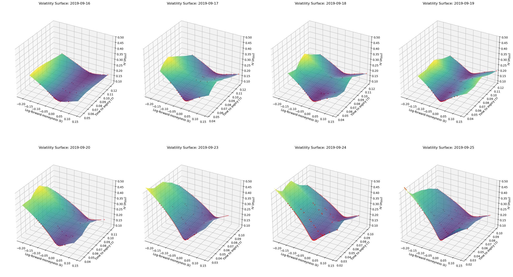{#fig:SSVIsurfaceWindow}

Finally, @fig:SSVIparams showcases SSVI parameters fit to individual October expiries, for days in September. The last box is a $25\Delta$ Risk Reversal metric:
$$ \text{RR}_{\Delta}(x) = \sigma^{\text{CE}}_{x\Delta} - \sigma^{\text{PE}}_{x\Delta} $$

Recall that $\Delta<0$ for puts, $\Delta>0$ for calls, and where $\sigma$ denotes any measure of volatility. for $|\text{RR}|$ to increase, one side of the option chain must carry higher volatility than the other side. $\text{RR}$ has been measured only with SSVI's parameterised smile because empirical IV smiles are prone to sampling noise. Inferring behaviour of $\eta, \gamma$ over the 30 day sample size isn't statistically rigorous, however we can observe a nonrandom drop in $\rho$ and a corresponding increase in the $25\Delta$ RR exactly on the day of the announcement. Addressing a possible contradiction: SSVI mightn't assume time-dependent parameters over days; we are visualising each day's distinct parameter set.

{#fig:SSVIparams}

## Functional Volatility Modelling {#sec:funvol_start}
In @sec:tax_cut we established the dissertation's market event of interest. In @sec:market_data we described the construction of this dissertation's dataset. In @sec:ssvi we studied SSVI. This section investigates FuNVol, our tool for modelling the evolution of IV surfaces.

Introduced by Choudhary et al. in 2024 @FuNVol, FuNVol models the evolution of an IV surface by melding two complementary data-driven approaches: Scientific Machine Learning (SciML) and Functional Data Analysis (FDA). SciML supplements classical modelling techniques with modern machine learning methods. Classically, we may have $\dot{x} = f(x, t; \Theta)$ with parameters $\Theta$ whilst a purely data-driven approach might try to map $x\mapsto\dot{x}$ entirely; SciML permits $\dot{x} = f(x, t; \Theta) + f_{\text{DD}}(x, t; \theta)$, where $f_{\text{DD}}$ is a data-driven approach with parameters $\theta$. @ChrisRackSciML introduces this viewpoint by embedding neural networks within differential equations and jointly optimising their parameters; @PINNs enriches objective functions with physical constraints like conservation laws or symmetries. FDA @RamsaySilvermanFDA, on the other hand, treats discrete data as realisations of underlying smooth functions, enabling functional-analytic methods to be applied to their continuous representations. FuNVol combines these perspectives: each observed volatility surface is treated as a realisation of a random function and projected onto a suitable basis. Functional principal components (FPCs) are extracted to provide a lower-dimensional representation of a surface, and a neural SDE then models the evolution of these FPCs.

It is important to note immediately that:
1. FuNVol, by design, operates strictly under the physical measure $\mathbb{E}^{\mathbb{P}}$ and not a risk-neutral measure $\mathbb{E}^{\mathbb{Q}}$. From a pricing perspective, deriving and implementing a suitable change-of-measure is not entirely trivial (and is perhaps another fruitful direction for future research).
2. The methodology used to create surfaces for FuNVol is distinct from SSVI and is discussed in @sec:optionmetrics. This decision was made purely to stay as close to the reference implementation as possible, and for simplicity; the behaviour of $\operatorname{FuNVol}\left(w(k, \theta)\right)$ is also a potentially fruitful direction for future research.

### OptionMetrics' Implied Volatility Surfaces {#sec:optionmetrics}
OptionMetrics creates IV surfaces using Kernel Density Estimation (KDE) @OMetricsIV. Raw option prices are arranged on a standardised grid of days to expiry and call-equivalent delta, and a Gaussian kernel then interpolates implied volatility between grid points. The grid coordinates are:
$$
\tau = [10, 30, 60, 91, 122, 152, 182, 273, 365, 547, 730], \qquad
\Delta\in\left\{0.10k \mid k\in\{1, 2, \dots, 9\}\right\}
$$

Where $\tau$ is days to expiry, and $\Delta>0$ for calls, $\Delta<0$ for puts. The 11 $\tau$ and 34 $\Delta$ coordinates (including $-\Delta$) form a $11\times34=374$ node meshgrid. At each grid point $j$, smoothed volatility $\hat{\sigma}_j$ is calculated as:
$$
\hat{\sigma}_j =
    \frac
        {\sum \limits_i \nu_i \sigma_i \Phi\left(x_{ij}, y_{ij}, z_{ij}\right)}
        {\sum \limits_i \nu_i \Phi\left(x_{ij}, y_{ij}, z_{ij}\right)},
\qquad
\Phi(x, y, z) =
    \frac{1}{\sqrt{2\pi}}
    e^{-\left[
         \left(\frac{x^2}{2h_1}\right)
        +\left(\frac{y^2}{2h_2}\right)
        +\left(\frac{z^2}{2h_3}\right)
    \right]}
$$

Where $i$ indexes all options for that day, $\nu_i$ is option vega, and $\sigma_i$ is any kind of model-implied volatility (in our case, constructed in @sec:market_data). Kernel parameters $(x_{ij}, y_{ij}, z_{ij})$ measure the distance between empirical values and grid points:
$$
x_{ij} = \ln\left(\frac{T_i}{T_j}\right), \qquad
y_{ij} = \Delta_i-\Delta_j, \qquad
z_{ij} = I_{\text{CP}_i = \text{CP}_j}
$$

$T_i,T_j$ denote option and grid-point days to expiry respectively; $\Delta_i,\Delta_j$ their call-equivalent deltas; $\mathrm{\text{CP}}_i,\mathrm{\text{CP}}_j$ their call/put identifiers, and $I$ is an indicator function: $I=1$ if a surface is being created for calls but put data is sent in, $I=0$ if call data is being used for a call-specific surface (@sec:market_data discusses the use of a binary `cp_flag` column). Kernel bandwidths $h_1=0.05$, $h_2=0.005$ and $h_3=0.001$ as per OM, and options with $\nu_i<0.5$ are excluded to provide a more stable surface. Under Black-76 model and in forward-space, the discounting factor is irrelevant giving option forward-delta as:
$$ \frac{\partial C}{\partial F} = \Delta_{\text{CE}} = \mathcal{N}(d_+), \qquad \frac{\partial P}{\partial F} = \Delta_{\text{PE}} = -\mathcal{N}(-d_+) = \mathcal{N}(d_+)-1$$

Hence a numerical subroutine need only return $\mathcal{N}(d_+)$ for calls and puts, simply subtracting 1 from $\Delta_{\text{PE}}$ to get a symmetric grid of $\Delta\in\{-0.90, -0.10\}\cup\{0.10, 0.90\}$ for put and call surfaces respectively. Forward vega $\nu$ is:
$$ \frac{\partial C}{\partial \sigma} = \frac{\partial P}{\partial \sigma} = F_T\ \mathcal{N}'(d_+)\sqrt{\tau} $$

A numerical boundary condition arises as $\tau\to 0$: $\nu\to 0$ simply whilst $\lim_{\tau\to 0}\ \mathcal{N}(d_+)\to 1$, and $\lim_{\tau\to 0}\ \mathcal{N}(d_-)\to 0$. Some numerical implementations of $\mathcal{N}(\cdot)$ may elide an explicit check.

There are two especially important consequences of OM's approach: one, generated surfaces are in no way guaranteed to provide static arbitrage-free prices, unlike SSVI. Two, the method inherently provides two sub-surfaces, one each for calls and puts, unlike SSVI. Combining an OM surface requires some consideration because introducing a $\Delta=0$ coordinate, interpolating across it, and removing $z_{ij}$ are inequivalent means:
1. $\Delta=0$ arises IFF $d_+ = -\infty$, which is the most extreme OTM boundary for an option. $\Delta=0\implies\nu=0$, so there is also zero influence from underlying asset volatility. Both quantities can subsequently cause numerical issues for $\Phi$, and there is no reason why $\sigma_{\text{CE}}(0)$ must equal $\sigma_{\text{PE}}(0)$, empirically or otherwise.
2. Interpolating across $\Delta=0$, assuming linear interpolation for simplicity and $\pm\delta_0=\pm 0.10$:
    $$
    \begin{align*}
        \hat{\sigma}_{\text{OM}}(0) &=
            \sigma_{\text{PE}}(-\delta_0)+ \frac{
                0 - (-\delta_0)
            }{
                \delta_0 - (-\delta_0)
            }\left[
                \sigma_{\text{CE}}(\delta_0) - \sigma_{\text{PE}}(-\delta_0)
            \right] \\
        &= \sigma_{\text{PE}}(-\delta_0)+ \frac12\left[
                \sigma_{\text{CE}}(\delta_0) - \sigma_{\text{PE}}(-\delta_0)
            \right] \\
        &= \frac{\sigma_{\text{PE}}(-\delta_0) + \sigma_{\text{CE}}(\delta_0)}{2}
    \end{align*}
    $$

    Because the standardised $\Delta$ grid for calls and puts is symmetric. This results in a distinct value for $\hat{\sigma}_{\text{OM}}(0)$.
3. The use of call-equivalent delta removes identifiability of $\sigma(0)$, and removing $z_{ij}$ exacerbates the issue in (1) since competing nonunique values at $\sigma_{\text{CE}}(0)$ and $\sigma_{\text{PE}}(0)$ will be weighted only by $\nu$.

Additionally, the authors of FuNVol model only a call-side surface. This dissertation models calls and puts, but treats them as two separate sub-surfaces replete with separate pipelines (and as such, does not interpolate between them). For what follows in this, and all subsequent sections, please let:
$$ \sigma_{\text{OM}}^C(\Delta_{\text{CE}}, \tau), \qquad \sigma_{\text{OM}}^P(\Delta_{\text{PE}}, \tau) $$

Denote the sequences of historical OM implied volatility call- and put-side subsurfaces respectively, and please let $\sigma_{\text{OM}}(\Delta, \tau)$ without superscript denote a generic OM IV surface. Effecting OM's methodology over the period of data described in @sec:market_data results in $2,409$ daily surfaces. @fig:OMetricsWindow depicts a collection of these, which exhibit similar behaviour to SSVI surfaces, especially the skew inversion on 20th September 2019. This addresses an important, implicit assumption: the macro event is, indeed, captured by OM's methodology; if this were not the case, the downstream neural SDE would effectively have modelled nothing of interest. This also shows that the macro event isn't model-implied.

\FloatBarrier
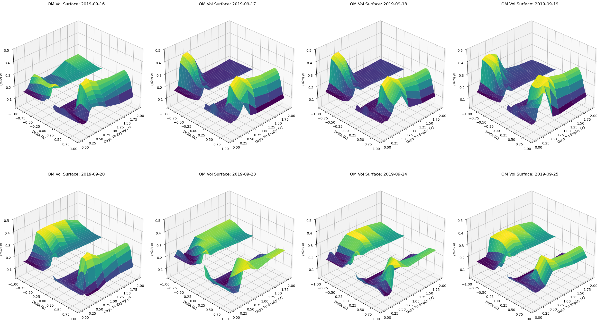{#fig:OMetricsWindow}

### Functional Data Projection {#sec:fda_projection}
From @sec:optionmetrics we obtain a discrete dataset of IV surfaces $\sigma_{\text{OM}}$. Following the theory in @FuNVol §2, we now represent them in continuous-space using Legendre polynomials as a basis, and subsequently apply functional principal component analysis (FPCA) to decorrelate dynamics. For a formal theoretical background on functional data projection other than @FuNVol §2, please see @JaneWang or @Kokoza. Guided by @FuNVol §5.1, since Legendre polynomial orthogonality $\langle L_n, L_m\rangle=\delta_{mn}$ is only defined over $L^2[-1, 1]$, each sub-surface's axes must first be transformed to fully lie within this interval. Following the transformations in @FuNVol, §5.1:
$$
\begin{align*}
    \overline{\Delta}_{\text{CE}} &:=  2\Delta_{\mathrm{CE}}-1,
    &\quad \overline{\tau}=2\left(\sqrt{\frac{\tau}{\max\{\tau\}}}\right)-1
    \\
    \overline{\Delta}_{\text{PE}} &:= -2\Delta_{\mathrm{PE}}-1
\end{align*}
$$

With $\overline{\Delta}\in[-0.8, 0.8]$ for both calls and puts. Identifability is unaffected because calls and puts are processed independently. @FuNVol §5.1 also transforms $\sigma_{\text{OM}}\mapsto\overline{\sigma}_{\text{OM}} := c_0 + c_1\ln(e^{\sigma_{\text{OM}}}-1)$, choosing $c_{0, 1}$ as per @FuNVol Eq. 33, such that only 10% of the data lies outside the range $[-1, 1]$ (i.e., $P(\overline{\sigma}_{\text{OM}}<-1)=P(\overline{\sigma}_{\text{OM}}>1)=0.1$). However, in our case:
1. $P(\overline{\sigma}_{\text{OM}}<-1)=P(\overline{\sigma}_{\text{OM}}>1)=0$; and
2. Observations surrounding 20 September 2019 lie exceed the 2.5th--97.5th percentile range, across different strikes, which means our event lies outside the range implied by the prescribed transformation.

Now to construct the Legendre basis design matrix $\mathbf{B}$, please let:
$$ \text{ल}_{m,n}(\overline{\Delta},\overline{\tau}) = L_m(\overline{\Delta}) L_n(\overline{\tau}) $$

Denote a two-dimensional basis function. Retaining $0\le m+n\le n_o$ with $n_o=4$ gives 15 basis functions, as in @FuNVol §2.1, which we collocate at each sub-surface's $187$ grid nodes to obtain $\mathbf{B}\in\mathbb{R}^{187\times 15}$. Note that $\text{ल}_{0,0}$ is the normalised constant Legendre polynomial, so absorbs affine offsetzs. The regression of each surface $\sigma_{\text{OM}}$ onto $\mathbf{B}$ is efficiently solved by leveraging the identical OM grid across dates. Writing $\sigma_t\mapsto\text{स}\in\mathbb{R}^{187\times T}$ and using a reduced QR factorisation:
$$ \mathbf{R}\widehat{\mathbf{A}}^{\top} = \mathbf{Q}^{\top}\text{स} $$

Where each row $\mathbf{a}_t\in\widehat{\mathbf{A}}^{T\times 15}$ is a 15-element vector of projection coefficients for a day's IV surface. Call- and put-side coefficient matrices are henceforth denoted by $\widehat{\mathbf{A}}^C$ and $\widehat{\mathbf{A}}^P$ respectively, with $\widehat{\mathbf{A}}$ denoting the generic matrix. @fig:LpolysCoeffsAll plots $\widehat{\mathbf{A}}$ over the full dataset, with major Indian macroeconomic events highlighted.

{#fig:LpolysCoeffsAll}

Of note is that $\kappa(\widehat{\mathbf{A}}^C)\approx 90.84,\; \kappa(\widehat{\mathbf{A}}^P)\approx 224.80$ suggesting high collinearity. @fig:lpolys_vifs depicts the Variance Inflation Factor (VIF) of each basis function in $\widehat{\mathbf{A}}^{C, P}$. To decorrelate these features, we resort to FPCA. Please let $\mathbf{X}^{-\mu}$ denote a mean-centred $\widehat{\mathbf{A}}$; then, its sample covariance matrix is
$$ \frac{{\mathbf X^{-\mu}}^\top\mathbf X^{-\mu}}{T-1} $$

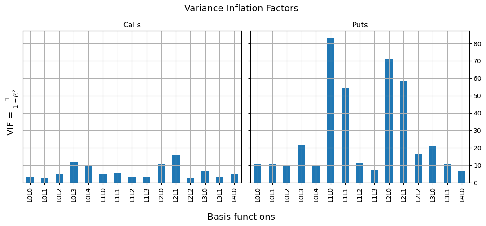{#fig:lpolys_vifs}

Which we eigendecompose into eigenvalues $\mathbf{e}_X$ and eigenvectors $V_X$. Retaining the smallest number of components explaining at least $99.5%$ of the variance gives $M=12$ components for calls and $M=11$ for puts. Mapping the corresponding eigenvectors back through the Legendre basis produces the eigensurfaces shown in @fig:CallsEigensurfaces and @fig:PutsEigensurfaces.

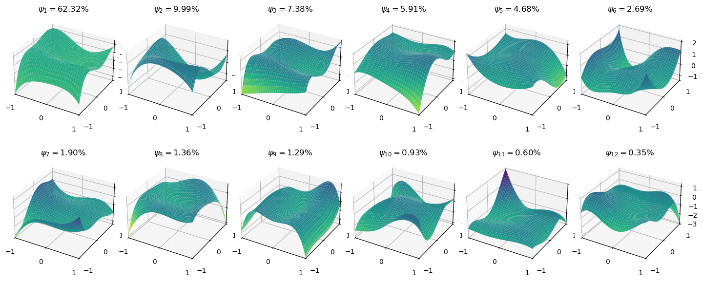{#fig:CallsEigensurfaces}

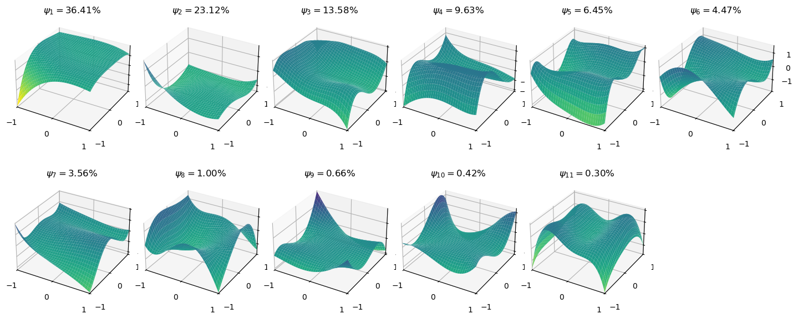{#fig:PutsEigensurfaces}

The FPCC matrix is denoted $\Xi=\mathbf X^{-\mu}V_X$, with $\Xi^C$ and $\Xi^P$ for the call- and put-side matrices respectively, and $\Xi$ the generic matrix. @fig:FPCCsWindow zooms into the period around the macro event, showing that the announcement's impact is palpable. Finally, $\kappa(\Xi^C)\approx 13.43,\; \kappa(\Xi^P)\approx 10.96$ providing no evidence of ill-conditioning.

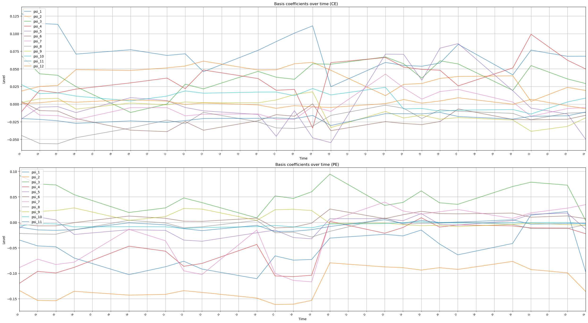{#fig:FPCCsWindow}

Some basic time series analyses of $\Xi$ and $d\Xi$ are warranted. Specifically, we inspect stationarity and serial correlation in @sec:fpcc_autocorrel, tail behaviour and quantile-quantile (QQ) comparisons @sec:fpcc_tails, and a rolling singular value spectrum in @sec:fpcc_spectrum.

### Stationarity & Serial Correlation {#sec:fpcc_autocorrel}
Augmented Dickey-Fuller (ADF) tests @ADFTest are used to test for stationarity of $d\Xi$. The null hypothesis $H_0$ is that $Y_t$ sports a unit root, $H_1$ is that $Y_t$ is stationary. A maximum of $p=5$ lags were tested across all 23 FPCCs (call- and put- side), with each FPCC rejecting the null hypothesis beyond the 1% level. FPCC levels $\Xi$ and squared increments $(d\Xi)^2$ are tested for serial correlation with a Ljung-Box (LB) test @LjungBoxText. LB is applied at lags of $(1, 5, 10)$ days. Across all 23 FPCCs, both $\Xi$ and $(d\Xi)^2$ exhibit highly significant serial correlation at all lags with $p<0.01$. That $(d\Xi)^2$ exhibits strong volatility clustering is a well-known feature of financial time series, however serial correlation in $\Xi$ despite the ADF tests strongly rejecting a unit root is interesting: an $\operatorname{AR}(1)$ process is $Y_t=\phi_1 Y_{t-1} + \epsilon_t, \quad |\phi_1|<1$ whilst a unit-root process is $Y_t=Y_{t-1} + \epsilon_t$, corresponding to $\phi=1$. ADF tests explicitly rule out $\phi=1$. Consequently, quasi-differencing $d^{\phi}Y_t:=-\phi_1 Y_{t-1}$ ought to be a more principled approach to obtaining $d\Xi$, however we continue to assume $\phi=1$ for two reasons:
1. A simple $\operatorname{AR}(1)$ may incompletely capture the persistence of FPCC level, nor may not distinguish $|\phi<1|$ from $\phi=1$ accurately enough over finite samples, though a slightly more sophisticated model might; and
2. The FuNVol SDE explicitly works with continuous-time $d\Xi$, which is equivalent to discrete-time first differences.

### Tail Analysis {#sec:fpcc_tails}
Coming to tail behaviour, In discussing Figure 8 of @FuNVol, Choudhary et al. identify small but systematic spikes at the extremes of the neural SDE's Gaussian PITs, indicating insufficient tail weight in the model. They suggest that this may arise from the neural SDE's Brownian forcing. Anderson-Darling tests and Gaussian quantile-quantile (QQ) plots similarly reject Gaussianity for $d\Xi$. A common heavier-tailed benchmark is Student's $t$-distribution, however @fig:NeuralCEStudentT and @fig:NeuralPEStudentT show that most interestingly, $d\Xi$ exhibits lighter-than-$t$ tails. Naturally, some tail analysis is warranted.

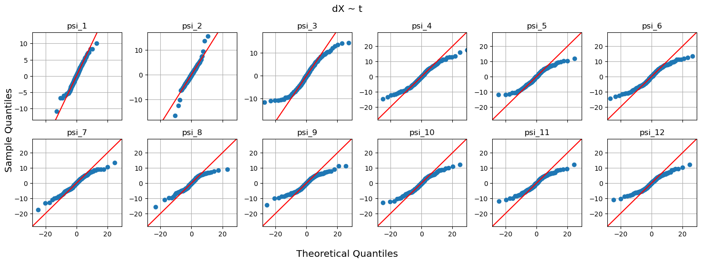{#fig:NeuralCEStudentT}

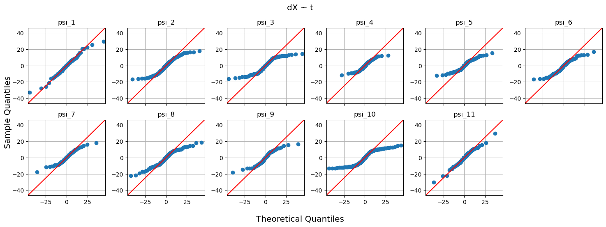{#fig:NeuralPEStudentT}

Considering Gaussian asymptotics for a single random variable $X\sim\mathcal{N}(\mu,\, \sigma)$ with $z:=\frac{x-\mu}{\sigma\sqrt{2}}$, we can write:
$$
\begin{align*}
    1 - P(X\le x) = P(X\ge x) &= 1 - \frac12\left[1+\operatorname{erf}(z)\right] \\
    &= \frac12 - \frac{1}{\sqrt{\pi}} \int_0^z e^{-t^2}\ dt
\end{align*}
$$

Manipulating the integral over $[-\infty, \infty]$ of $e^{-t^{2}}$ gives:
$$
\begin{align*}
    \int_{-\infty}^{\infty} e^{-t^{2}}\ dt = \sqrt{\pi}\quad
    &\implies \quad\frac{1}{\sqrt{\pi}} \int_0^{\infty}e^{-t^{2}}\ dt=\frac12, \\
    \implies P(X\ge x) &= \frac{1}{\sqrt{\pi}}\int_z^{\infty} e^{-t^{2}}\ dt
\end{align*}
$$

Integrating by parts repeatedly gives an expansion:
$$ I(z) = \frac{e^{-z^{2}}}{2z} \left(1 - \frac{1}{2z^2} + \frac{3}{4z^4} - \dots \right) $$

Which shows exponential-quadratic first-order behaviour in $e^{-z^{2}}$. Back-substituting $z$ and taking logs makes this apparent:
$$
\begin{align*}
    \ln\left[P(X\ge x)\right] &\approx \ln\left\{
        \frac{\sigma}{(x-\mu)\sqrt{2\pi}}\exp\left[
            -\frac12\left(\frac{x-\mu}{\sigma}\right)^2
        \right]
    \right\}
        \\
    &\approx -\frac{(x-\mu)^2}{2\sigma^2}-\ln(x-\mu)+C
\end{align*}
$$

Ergo, for large $x$ the Gaussian log-tail is asymptotically quadratic as $-\frac{x^2}{2}$. For $n$ Gaussian random variables $\{X_i\}$ and with appropriate scaling parameters $(a_n, b_n)$, as $n\to\infty$ the Gaussian lies within the Gumbel domain of attraction. For Student's $t$, starting with the density we have:
$$
\lim_{x\to\infty}\left[C_{\nu}\left(1+\frac{x^2}{\nu}\right)^{-(\nu+1)/2}\right]
\approx C_{\nu}\left(\frac{x^2}{\nu}\right)^{-(\nu+1)/2}
$$

Expanding the parentheses gives $C_{\nu}\,\nu^{\frac{\nu+1}{2}} x^{-(\nu+1)}=C_{\nu}x^{-(\nu+1)}$. Integrating to derive the CDF for $P(X\ge x)$ gives:
$$
\begin{align*}
    P(X\ge x) \approx C_{\nu}\int_x^{\infty}t^{-(\nu+1)}\ dt
    &= \frac{C_{\nu}x^{-\nu}}{\nu} \\
    &= K_{\nu}x^{-\nu}
\end{align*}
$$

Which shows power-law behaviour in $x^{-\nu}$. Taking logs makes this apparent: $\ln[P(X\ge x)] \approx \ln(K_{\nu})-\nu\ln(x)$. Evidently for large $x$, the $t$ log-tail is asymptotically linear as $-\nu\ln(x)$. For $n$ $t$-distributed random variables and suitable scaling parameters $(a_n, b_n)$, Student's $t$-distribution lies in the Frechet domain of attraction. To estimate the domain of attraction empirical $d\Xi$ lies within, we use Peak-Over-Thresholding (POT) with a Generalised Pareto Distribution (GPD) @scipygpd. The GPD parameter $\xi$ helps discern, via the Generalised Extreme Value distribtion @EVTBook, a dataset's domain of attraction: $\xi=0\implies$ Gumbel, $\xi>0\implies$ Frechet, $\xi<0\implies$ Weibull. We estimate the GPD $\xi$ by first searching for thresholds over the $[90, 99.5]$ percentiles, in 0.5 increments, to identify a stable parameter region. The 97.5th percentile, for calls and puts, appears stable with 61 exceedances that we fit the GPD to. Across all 23 FPCC tails, estimated $\xi$ values range from $-0.175$ to $0.767$, but the associated 95% bootstrap confidence intervals are very wide and cross zero. Hence, evidence for a departure from the Gumbel domain of attraction is weak, motivating the following constraints on a potentially suitable distribution for $d\Xi$:
* Lies in the Gumbel domain of attraction,
* Log-tail decay is between the Gaussian $-\frac{x^2}{2}$ and the $t$-distribution $-\nu\ln(x)$; and
* Is infinitely divisible such that a Levy process is admissible.

The Normal Inverse Gaussian (NIG) distribution is a viable candidate. Using $y:=(x-\mu)$, its density can be segregated as follows for large $y$:
$$
\begin{align*}
    f_X(x) = \frac{
        \alpha\delta\exp\left(\delta\sqrt{\alpha^2-\beta^2}+\beta y\right)
    }{
        \pi\sqrt{\delta^2+y^2}
    } K_1\left(\alpha\sqrt{\delta^2+y^2}\right)\; : \;
    &(\mu, \alpha, \beta, \delta)\in\mathbb{R}, \\
    &\alpha>|\beta|
\end{align*}
$$

* $\frac{\alpha\delta}{\pi}$ is a constant,
* $\frac{1}{\sqrt{\delta^2+y^2}}$ behaves as $y^{-1}$,
* $\exp\left[\delta\sqrt{\alpha^2-\beta^2}+\beta y\right] = e^{\delta\sqrt{\alpha^2-\beta^2}}e^{\beta y}=C_1\, e^{\beta y}$, and
* The Bessel function $K_1(u)\to\sqrt{\frac{\pi}{2u}}e^{-u}$, so $K_1(\alpha\sqrt{\delta^2+y^2})\approx C_2\, y^{-1/2}e^{-\alpha y}$.

Back-substituting $y$ and considering large $x$ gives $f_X(x) \approx Cy^{-3/2}e^{-(\alpha-\beta)y} = Cx^{-3/2}e^{-(\alpha-\beta)x}$. Using $\lambda:=(\alpha-\beta)$ and integrating to derive the CDF, first-order behaviour is approximately:
$$
P(X\ge x)
\approx C \int_x^{\infty} t^{-3/2}e^{-\lambda t}\ dt
\approx \frac{C}{\lambda}x^{-3/2}e^{-\lambda x}
$$

Taking logs shows $\ln\left[P(X\ge x)\right]=C-\frac32\ln(x)-\lambda x$, which sits between the Gaussian log-tail $-0.5x^2$ and $t$-distribution $-\nu\ln(x)$. @fig:NeuralCENIG and @fig:NeuralPENIG show remarkable call- and put-side fits. In fact, fits of Gaussian, $t$, NIG, Laplace, and Generalised Hyperbolic (GH) distributions to $d\Xi$, evaluated by log-likelihood and the BIC, show that the GH maximises log-likelihood but the NIG is most parsimonious. Fitted NIG parameters show that the right- and left-tail decay rates, governed respectively by $\alpha-\beta$ and $\alpha+\beta$, differ systematically between calls and puts. In particular, $d\Xi^P$ exhibits slower right-side tail decay than $d\Xi^C$, consistent with the earlier observation of more erratic put-side behaviour.

It must be appreciated that there is something rather pleasing about hyperbolae making a reappearance in parsimony after @sec:ssvi, this time as a family of distributions parameterising empirical $d\Xi$. Additionally, the possibility of markets transitioning between distributional families depending on the macroeconomic environment is very likely, motivating a rolling-window analysis of empirical data. Unfortunately, a full investigation into such a possibility, and into a NIG-driven neural-Levy process, is beyond the scope of this dissertation, as is an examination of the Variance-Gamma distribution.

<!-- look at $-\frac{x^2}{2}$, $-\frac32\ln(x)-2x$, and $-2\ln(x)$ on Desmos! middle is NIG. also for variance gamma: $\ln(|x|^{l-1}e^{-a|x|})$ with $l=1, a=1$ -->

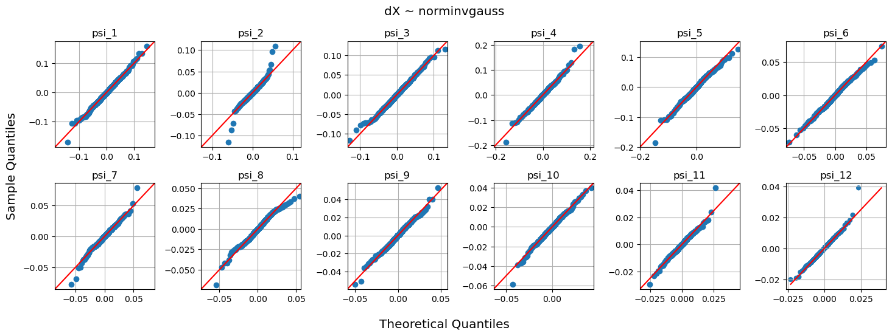{#fig:NeuralCENIG}

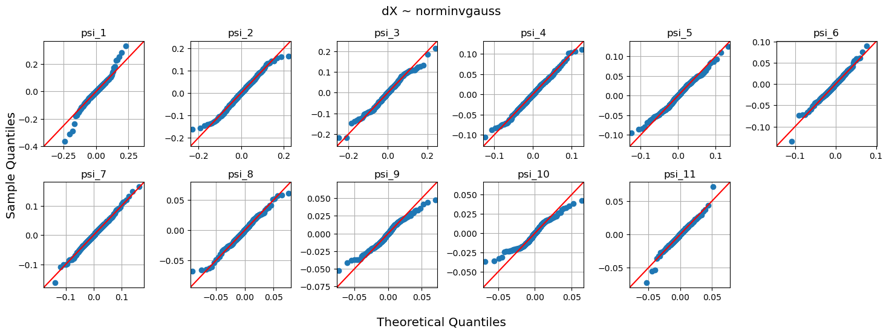{#fig:NeuralPENIG}

### Rolling Singular-Value Spectra {#sec:fpcc_spectrum}
Here we inspect the singular value spectrum of $d\Xi$ over rolling monthly windows. Inspired by the work of @Bouchaud and @Ipsen, the stable rank of a matrix is computed as:
$$ \operatorname{sr}(\mathbf{A}) = \frac{||\mathbf{A}||^2_F}{||\mathbf{A}||_2^2} = \frac{\sum\limits_i \text{ए}_i^2}{\text{ए}_{\text{max}}^2} $$

Where $||\mathbf{A}||^2_F$ is the Frobenius norm of matrix $\mathbf{A}$, and $\text{ए}$ are the singular values of $\mathbf{A}$. Stable rank is bounded between $1\le \operatorname{sr}(\mathbf{A})\le \operatorname{rank}(\mathbf{A})$: if a matrix has one dominant singular value -- indicating low-dimensional dynamics -- $\operatorname{rank}(\mathbf{A})$ might still be full whilst $\operatorname{sr}(\mathbf{A})$ will collapse toward 1. $\operatorname{sr}(d\Xi)$ is computed over rolling 30-observation windows with stride one, denoted `[30::1]`, and subsequently mean-aggregate the resulting series over 15-day periods. This retains the granularity of the stride-one calculation relative to directly using `[30::15]` windows. The Nifty Volatility Index (VIX) is aggregated identically. @fig:sr_all showcases call- and put-side stable ranks alongside the VIX.

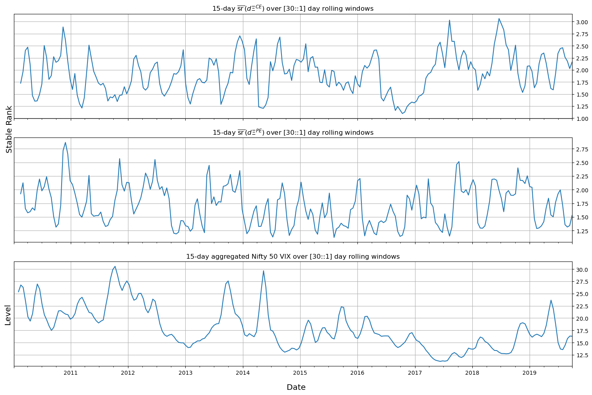{#fig:sr_all}

Peaks in VIX tend to coincide with declines in $\operatorname{sr}(d\Xi)$ whilst calmer periods tend to exhibit higher stable rank. More strikingly, although the retained FPCC representations have $M=12$ call- and $M=11$ put-side components, every rolling window has full algebraic rank whilst the maximum observed stable rank is only approximately $3.0$ and $2.8$ respectively. The apparent dimensionality of surface FPCC dynamics is dramatically lower than that required to represent the surfaces up to 99.5% variance. A potential direction for future research could investigate the relationship between the effective dimensionality of FPCC dynamics and their autoregressive (AR) structure: for example, high-volatility regimes may correspond to lower-order, highly persistent dynamics, whilst calmer periods may support richer AR($p$) structure.

### Introducing Nifty Prices {#sec:nifty_prices}
In @FuNVol §3, Choudhary et al. introduce their underlying assets' detrended price series as covariates for $\Xi$. Please let $\text{प}_t$ denote the close prices of the Nifty 50 (introduced in @sec:market_data). @FuNVol §5.1 lays out the following transformation for equity prices:
$$
\begin{align*}
    \overline{\text{प}}_t = c_0 + c_1\ \text{प}_t, \qquad\qquad
        c_0 &= \frac{Q_{0.9}+Q_{0.1}}{Q_{0.9}-Q_{0.1}}, \\
    c_1 &= \frac{2}{Q_{0.9}-Q_{0.1}}
\end{align*}
$$

So that $\overline{\text{प}}\in[-1, 1]$ with 90% probability (i.e., $P(\overline{\text{प}}<-1)=P(\overline{\text{प}}>1)=0.1$). The reference implementation then detrends price by regressing a linear-time trend onto $\text{प}_t$:
$$ \tilde{\text{प}}_t = \overline{\text{प}}_t - \hat{\text{प}}_t, \qquad \hat{\text{प}}_t := \beta_0 + \beta_1 t + \epsilon_t $$

Where $\tilde{\text{प}}_t$ is detrended price. For what follows, please let:
* $\text{न} : \left[\Xi + \tilde{\text{प}}_t\right]$ denote the generic neural design matrix,
* $\text{न}^C\in\mathbb{R}^{M^*}$ and $\text{न}^P\in\mathbb{R}^{M^*}$ for call- and put-side neural design matrices respectively, and
* $M^*=M+1$ the number of dimensions in $\text{न}$, now with detrended price.

Condition numbers of the OLS detrending matrix $[\mathbf{1}, t]\approx 4,100$ whilst $\kappa(\text{न}^C)\approx34.76$, and $\kappa(\text{न}^P)\approx26.41$. Rolling 30-day empirical rank-based copulae between $\Xi$ and $\tilde{\text{प}}_t$ did not exhibit any deterministic repetition, but did exhibit nonlinear and regime-specific behaviour. Put-side copulae were more erratic than call-side, supporting the choice of a neural network as a universal function approximator.

### Neural Modelling {#sec:neural_sde}
We finally introduce the famed neural SDE, staying as close as possible to reference. Following @FuNVol §3 and using the dataset $\text{न}$ from @sec:nifty_prices, FPCCs are assumed to satisfy:
$$ d\text{न} = \overrightarrow{\mu}_t\ dt + \Sigma_t\ dW_t $$

Where $\overrightarrow{\mu}\in\mathbb{R}^{M+1}$ and $\Sigma\in\mathbb{R}^{(M+1)\times (M+1)}$. Because we now have $M+1$ features following @sec:nifty_prices, we have an $M+1$-dimensional system of coupled SDEs. Conditional dynamics are:
$$
P(\text{न}_t\mid\mathcal{F}_{t-1}) =
    \text{न}_{t-1} + \int_{t-1}^t \overrightarrow{\mu}_s\ ds + \int_{t-1}^t\ \Sigma_s\ dW_s
$$

From which we derive the conditional mean and variance:
$$
\begin{align*}
    \mathbb{E}\left[\text{न}_t\mid\mathcal{F}_{t-1}\right]
        &= \text{न}_{t-1} + \int_{t-1}^t \overrightarrow{\mu}_s\; ds, \\
    \operatorname{Var}\left(\text{न}_t\mid\mathcal{F}_{t-1}\right)
        &= \mathbb{E}\left[\left(\int_{t-1}^t \Sigma_s\ dW_s\right)\left(\int_{t-1}^t \Sigma_s\ dW_s\right)^{\top}\right]
        = \int_{t-1}^t \Sigma_s\Sigma_s^{\top}\ ds
\end{align*}
$$

And obtain:
$$
\therefore \mathbb{P}(\text{न}_t\mid\mathcal{F}_{t-1})\sim\mathcal{N}\left(
    \text{न}_{t-1} + \int_{t-1}^t \overrightarrow{\mu}_s\ ds\,,\;
    \int_{t-1}^t \Sigma_s\Sigma_s^{\top}\ ds
\right)
$$

Which is discretised using Euler's scheme: $\text{न}_{t+\delta t}\mid\mathcal{F}_t\sim\mathcal{N}\left(\text{न}_t+\overrightarrow{\mu}_t\ \delta t\,,\, \Sigma_t\Sigma_t^{\top}\delta t\right)$. Evidently, the biggest benefit of decorrelating the Legendre basis with FPCA in @sec:fda_projection is that we need not accommodate covariance between FPCCs; had this been necessary, we'd have needed $\Sigma_t\Sigma_t^{\top}\delta t\mapsto\Sigma_t R\Sigma_t^{\top}\delta t$ for some nonzero covariance marix $R$.

The drift and diffusion are parameterised by two separate neural networks: a stack of three Gated Recurrent Units (GRUs, @ChoGRU) layers topped with a Feed Forward Network (linear unit, FFN) constitute a subnet, with drift and diffusion each parameterised by their own subnet. The diffusion subnet models the lower-triangular Cholesky decomposition $L$ of $\Sigma_t\Sigma_t^{\top}\ \delta t$, ensuring positive-definiteness by exponentiating $\operatorname{diag}(L)$ before inverting $LL^{\top}$. The diffusion component's weights are uniformly initialised over $[-0.01, 0.01]$ and its biases are set to $0.001$. There are 7 weight matrices in the neural SDE per subnet (6 per GRU: 3 input $\to$ hidden and 3 hidden $\to$ hidden, for a 3-layer GRU, plus 1 linear), for a total of 14 weight matrices.

### Dataloader {#sec:dataloader}
The dataloader is straightforward. Since we assume non-Markovian dynamics on $\text{न}$, $\ell=10$ lags are used as a historical slice for each subnet. $\text{न}$ is divided into a 90%-10% train-test split, with the testing data prepended with the last $\ell$ observations from the training set. Please let $X$ denote a generic data split; then, $X$ is median-IQR scaled and the dataloader returns a tuple of $(X_{t-\ell:t},\; \delta X_{t+1},\; \delta\tau_{t+1})$ with $X_{t-\ell:t}\in\mathbb{R}^{B\times \ell\times M^*}$, $\delta X_{t+1}\in\mathbb{R}^{M^*}$, $\delta\tau_{t+1}\in\mathbb{R}$, and batch size $B=64$.

### Training {#sec:training_spec}
As per @FuNVol §3.2, the neural SDE was trained in 3 stages: drift only with mean-squared error (MSE) loss; diffusion only, with negative log-likelihood (NLL) and probability integral transform (PIT) losses; and a combined stage with NLL+PIT losses. In stage 1, suppressing the drift component of $d\hat{\text{न}}_t$ gives us:
$$
d\hat{\text{न}}_t
    = \hat{\overrightarrow{\mu}}_{\theta,\, t}\ dt + \hat{\Sigma}_{\theta,\, t}\ dW_t
    \quad\Longrightarrow\quad
    d\hat{\text{न}}_t = \hat{\overrightarrow{\mu}}_{\theta,\, t}\ dt
$$

Please let $X$ denote a generic data split as in @sec:dataloader; then, the stage 1 loss is:
$$
\mathcal{L}_1
    = \frac1N \sum_t \lvert|
        \delta X_{t+1}
        - \hat{\overrightarrow{\mu}}_{\theta,\,t+1}\delta_{\tau_{t+1}}
    |\rvert_2^2
    = \operatorname{MSE}\left(
        \delta X_{t+1},\;
        \hat{\overrightarrow{\mu}}_{\theta,\,t+1}\delta_{\tau_{t+1}}
    \right)
$$

In stage 2, we combine NLL and PIT losses. We have an $M^*$ dimensional Wiener proces, so the multivariate Gaussian log-likelihood is applicable. Please let $m_t:=\hat{\overrightarrow{\mu}}_{\theta,\,t}\delta_{\tau_{t}}$ and $\Omega_t:=\hat{\Sigma}_t\hat{\Sigma}_t^{\top}\delta_{\tau_{t}}$, then:
$$
\mathcal{L}_{\operatorname{NLL}} =
    -\frac1N \sum_t \ln \Phi\left(
        \delta X_{t+1};\,m_{t+1},\,\Omega_{t+1}
    \right)
$$

The multivariate Gaussian CDF is analytically intractable and unavailable in some implementations, so @FuNVol §3.2, prop. 5 instead computes the marginal CDF of each feature, performs Gaussian KDE to smooth the PITs, and finally compares with a standard Uniform CDF via quadrature:
$$
\begin{align*}
    \mathcal{L}_2(\alpha) = \mathcal{L}_{\text{LLF}}+\alpha\mathcal{L}_{\text{PIT}}:
    &\qquad
    \mathcal{L}_{\operatorname{PIT}} = \sum_{i=1}^{M^*} \int_0^1\left(\rho_i(u)-1\right)^2du,
    \\
    \rho_i(u) = \frac{1}{nh}\sum_{i=1}^n K\left(\frac{u-\operatorname{PIT}_i}h\right),
    &\qquad
    \operatorname{PIT}_i = \Phi\left( \frac{\delta X_{t+1,\, i}-m_t}{\sqrt{(\hat{\Sigma}_t\hat{\Sigma}_t^{\top})_{ii}\,\delta_{\tau_{t+1}}}} \right)
\end{align*}
$$

Where $K$ is the Gaussian kernel, $h$ is 10% of Silverman's bandwidth estimate, and $\alpha=1$ as in the reference implementation. In stage 3, drift & diffusion subnets are optimised jointly by $\mathcal{L}_2$ with $\alpha'$ computed as the order of magnitude of the absolute ratio between stage 2 NLL and PIT losses:
$$
\mathcal{L}_3 = \mathcal{L}_2(\alpha'):
\alpha' = 10^{\lfloor\ln_{10} r\rfloor},
\quad
r = \frac{\mathcal{L}_{\operatorname{NLL}}}{\mathcal{L}_{\operatorname{PIT}}}
$$

We use $1,000$ epochs per stage and AdamW @AdamW as the optimiser. For training diagnostics, we track losses, algebraic rank, effective rank, and stable rank (as described in @sec:fpcc_spectrum) of each weight matrix, per epoch. Effective rank @EffectiveRank is:
$$
\operatorname{erank}(\mathbf{A}) = \exp\left\{ -\sum_{k=1}^Q p_k\ln(p_k) \right\},
\qquad
p_k = \frac{\text{ए}_k}{\sum_{k=1}^Q|\text{ए}_k|}
$$

Where $\text{ए}$ is a singular value of matrix $\mathbf{A}$. Stable rank normalises the sum of squared singular values with $\text{ए}_1$, whilst effective rank computes the informational entropy of the the contribution of each singular value to the spectrum. Both quantities approach 1 if $\mathbf{A}$ becomes highly singular, just at different rates.

# Results {#sec:results}
In @sec:tax_cut we established the dissertation's market event of interest. In @sec:market_data we described the construction of this dissertation's dataset. In @sec:ssvi we studied SSVI. In @sec:funvol_start we investigated FuNVol's modelling principles. This section discusses the results applying FuNVol's modelling principles.

## Training Outcomes {#sec:training_outcomes}
Training on an AMD RX 5600X completes in under 15 minutes; on a CPU, under 25. For calls and puts, the drift subnet's weight matrices maintain an algebraic rank of $M^*$ (full rank) throughout training. Effective rank, however, starts just less than $M^*$ and collapses with each successive layer by epoch 50, culminating in the final linear layer having an $\operatorname{erank}\approx 4$. This suggests that the optimal drift mapping of $d\text{न}_t$ uses relatively few effective parameter directions. Diffusion weight matrices, however, exhibit dimensional expansion: an initial drop in $\operatorname{erank}$ is subsequently recovered by epoch ~600 to finish just under $M^*$. This suggests that neural parameters are able to characterise a rich diffusion component. Finally, during joint optimisation, only a small subset of matrices continues to increase in $\operatorname{erank}$ appreciably. with some diffusion matrices approaching $M^*$, whilst others remain stable without decay. This suggests that indeed, the third stage helps refine the model, and that a region of parameter stability is achievable.

@fig:weight_spectra_calls and @fig:weight_spectra_puts showcase the trained layers' singular value histograms, inspired by WeightWatcher @WeightWatcherTheory, SETOL @SETOL. Power law fits to the tail of spectra are infeasible due to the low number of singular values. The collapse in drift dimension is palpable, and clearly suggests overparameterisation. The deeper diffusion histograms concentrate, but not as severely as the drift. Put-side is visibly more concentrated than call-side, echoing the finding in @sec:fpcc_spectrum.

{#fig:weight_spectra_calls}

{#fig:weight_spectra_puts}

## Linear Stability Analysis {#sec:lsa}
In @FuNVol §3.3, Choudhary et al. state that they generate future IV surfaces by recursively applying the one-step transition $\hat{\text{न}}_{t+1}\mid\mathcal{F}_t\sim\mathcal{N}(\hat{\text{न}}_t+\hat{\mu}_t\,\delta t,\;\hat{\Sigma}_t\,\delta_t)$ by sampling from a multivariate normal.

There are two approaches to forecasting: teacher-forcing, or direct; and recursive. With teacher-forcing, $X_{t-\ell\,:\,t}\mapsto\hat{X}_{t+1}$, $X_{t-\ell+1\,:\,t}\mapsto\hat{X}_{t+2}$, etc.; subsequent one-step predictions are conditioned on observed history. Recursive forecasting initialises with $X_{t-\ell\,:\,t}\mapsto\hat{X}_{t+1}$, after which each forecast $\hat{X}$ is fed back into the model to produce subsequent timesteps. Direct forecasting is a variant of teacher-forcing which shifts lags to produce $N$-step teacher-forced forecasts: $X_{t-\ell-1,:,t-1}\mapsto\hat{X}_{t+2}$, $X_{t-\ell-2,:,t-2}\mapsto\hat{X}_{t+3}$, etc., without using a forecasted $\hat{X}_{t+h}$ as an input. Since @FuNVol explicitly uses recursive forecasting, a finite-time Lyapunov exponent (FTLE) analysis is in order. We use a finite perturbation to measure the deviation of forecast trajectories, rather than the neural SDE's Jacobian or variational equations.

Our FTLE is a fairly simple adaptation of the theory @Strogatz: for a testing dataset $X^{\text{test}}$, first select an arbitrary time $t_0$ to begin forecasting from and a forecast horizon $h$. Run a recursive forward pass through the model using $X^{\text{test}}_{t_0}$ to obtain $X^*_{t+1:h}$. Then, perturb $X^{\text{test}}_{t_0}$ to obtain $\tilde{X}^{\text{test}}_{t_0} = X^{\text{test}}_{t_0}+\epsilon\lvert|\vec{p}|\rvert$, where $\lvert|\vec{p}|\rvert=1$ and $\vec{p}\sim\mathcal{N}(0, 1)$, and run a recursive forward pass with $\tilde{X}^{\text{test}}_{t_0}$ to obtain $\tilde{X}^*_{t+1:h}$. Repeat $N$ times. Our $t_0$ is randomly selected, and $h=20,\, N=60,\, \epsilon=10^{-4},\; \vec{p}\sim\mathcal{N}(0, 1)$. For each trajectory $n\in N$, compute:
$$
\delta_{m,n} = \tilde{X}^*_{m,\,t+1:h}-X^*_{m,\,t+1:h},
\qquad
\lambda_{m,n}(t) = \frac1T \ln\left(\frac{\lvert|\delta_{m,n}(t)|\rvert}{\epsilon}\right)
$$

For all features $m\in M$ (as explained in @sec:fda_projection). We discount evaluating Nifty's stability because our interest is specifically concerned with FPCCs and surface behaviour. @fig:lsa_calls_DeltaNorm and @fig:lsa_puts_DeltaNorm depict the batch- and feature-wise 2-norm of $\delta_{m,n}$, specifically $\lvert|\chi^{\delta}|\rvert_2$, as a function of $h$. Call-side separation emerges after $h>\approx10$ timesteps ahead. Put-side separation emerges after $h>\approx3$, though a threshold of $\approx9$ is also acceptable. Difference between magnitudes notwithstanding, this suggests that short-$h$ forecasts are relatively robust to small perturbations. The difference between magnitudes suggests put-side long-$h$ forecasts are an order more stable than call-side, assuming no misspecification. Finally, over the tested 20-day horizon the empirical magnitude $|\lambda_m(t)|\to0$ for each FPCC.

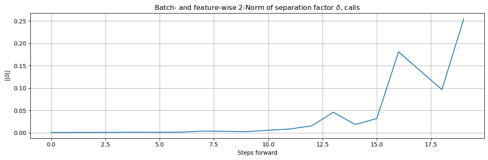{#fig:lsa_calls_DeltaNorm}

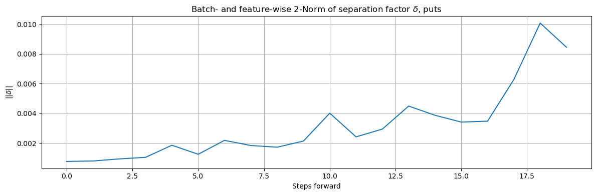{#fig:lsa_puts_DeltaNorm}

## Drift Analysis {#sec:drift_analysis_ar1}
Now we employ teacher-forcing (discussed in @sec:lsa) and disable the diffusion component. Given the findings of @sec:training_outcomes, it is natural to compare the neural drift with a naive $\operatorname{ARX}(1)$ model:
$$ Y_{t+1} = \beta_0 + \beta_1 Y_{t} + \langle \beta_X,\, X_t \rangle + \epsilon_{t+1} $$

Where $Y$ is a particular FPCC, regressed against all other features in $\text{न}$ (as constructed in @sec:nifty_prices). @tbl:forced_rmse shows the root-mean-squared-error (RMSE) loss for each call- and put-side FPCC. As mentioned in @sec:lsa, we discount evaluating Nifty's predicted drift because our interest is specifically concerned with FPCCs and surface behaviour.

Table: Root Mean Square Error of each FPCC, call- and put-side, predicted with teacher-forcing.
{#tbl:forced_rmse}

| FPCC                           | $\psi_1$   | $\psi_2$   | $\psi_3$   | $\psi_4$   | $\psi_5$   | $\psi_6$   | $\psi_7$   | $\psi_8$   | $\psi_9$   | $\psi_{10}$   | $\psi_{11}$   | $\psi_{12}$   |
| ------------------------------ | ---------- | ---------- | ---------- | ---------- | ---------- | ---------- | ---------- | ---------- | ---------- | ------------- | ------------- | ------------- |
| Calls, drift                   | `0.0251`   | `0.0133`   | `0.0167`   | `0.0235`   | `0.0193`   | `0.0089`   | `0.0085`   | `0.0081`   | `0.0075`   | `0.0059`      |` 0.0037`      | `0.0035`      |
| Calls, $\operatorname{ARX}(1)$ | `0.0252`   | `0.0130`   | `0.0162`   | `0.0198`   | `0.0184`   | `0.0086`   | `0.0083`   | `0.0078`   | `0.0079`   | `0.0059`      |` 0.0037`      | `0.0034`      |
| Puts, drift                    | `0.0263`   | `0.0136`   | `0.0215`   | `0.0167`   | `0.0149`   | `0.0081`   | `0.0244`   | `0.0081`   | `0.0068`   | `0.0037`      |` 0.0061`      |               |
| Puts, $\operatorname{ARX}(1)$  | `0.0259`   | `0.0135`   | `0.0187`   | `0.0168`   | `0.0144`   | `0.0079`   | `0.0253`   | `0.0075`   | `0.0068`   | `0.0036`      |` 0.0062`      |               |

This result is debatable: either FPCCs are truly low-dimensional $\operatorname{ARX}(1)$, potentially with mean-reversion, or this is a consequence of teacher-forcing. @sec:training_outcomes and this inspection suggest the former, however we inspect the recursive trajectories of both models to differentiate. @tbl:rec_rmse shows the corresponding RMSEs.

Table: Root Mean Square Error of each FPCC, call- and put-side, predicted recursively.
{#tbl:rec_rmse}

| FPCC                           | $\psi_1$   | $\psi_2$   | $\psi_3$   | $\psi_4$   | $\psi_5$   | $\psi_6$   | $\psi_7$   | $\psi_8$   | $\psi_9$   | $\psi_{10}$   | $\psi_{11}$   | $\psi_{12}$   |
| ------------------------------ | ---------- | ---------- | ---------- | ---------- | ---------- | ---------- | ---------- | ---------- | ---------- | ------------- | ------------- | ------------- |
| Calls, drift                   | `0.0865`   | `0.0313`   | `0.0420`   | `0.0531`   | `0.0316`   | `0.0149`   | `0.0232`   | `0.0215`   | `0.0176`   | `0.0192`      | `0.0125`      | `0.0086`      |
| Calls, $\operatorname{ARX}(1)$ | `0.0562`   | `0.0344`   | `0.0334`   | `0.0397`   | `0.0269`   | `0.0289`   | `0.0192`   | `0.0163`   | `0.0204`   | `0.0101`      | `0.0113`      | `0.0067`      |
| Puts, drift                    | `0.0668`   | `0.0357`   | `0.0492`   | `0.0345`   | `0.0306`   | `0.0323`   | `0.0402`   | `0.0179`   | `0.0088`   | `0.0079`      | `0.0069`      |               |
| Puts, $\operatorname{ARX}(1)$  | `0.0622`   | `0.0379`   | `0.0386`   | `0.0494`   | `0.0296`   | `0.0209`   | `0.0446`   | `0.0158`   | `0.0123`   | `0.0063`      | `0.0075`      |               |

The average call- and put-side $\operatorname{ARX}(1)$ RMSEs are $\approx0.0253$ and $\approx0.0296$, and $\approx0.0302$ and $\approx0.0301$ for the corresponding neural drifts. It would seem that in general, $\operatorname{ARX}(1)$ performs competently on RMSE; however, @fig:neural_arx_recursive_norms appears as though the neural drift has captured richer recursive dynamics than $\operatorname{ARX}(1)$, with a noticeable "blip" around event time as if the model has absorbed the macro event of interest. RMSE is thus perhaps insufficient to portray the value of learned dynamics, and that there is some benefit to the expressive power of neural parameterisation. This dichotomy matters in practice, because waiting for the next observation merely to produce a one-step-ahead forecast is a nonactivity of professional options desks.

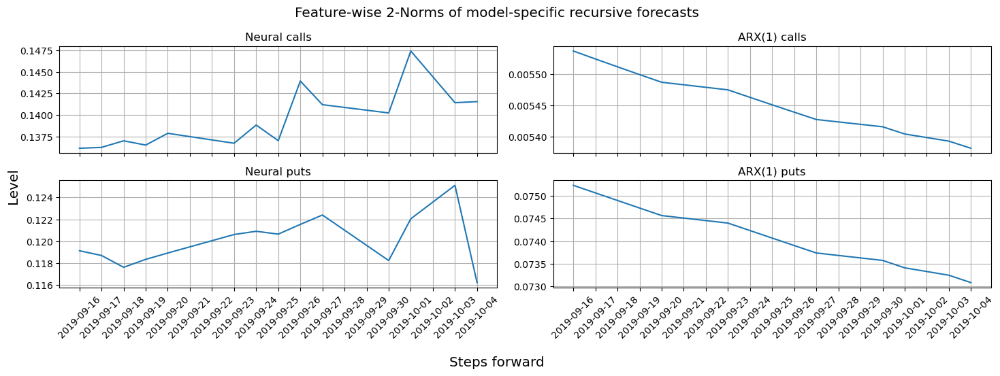{#fig:neural_arx_recursive_norms}

In light of these results, we also consider how predicted trajectories behave as we approach the date of the event. @fig:event_horizons_neural and @fig:event_horizons_arx show the feature-wise 2-norm trajectories of recursive forecasts from the neural drift and $\operatorname{ARX}(1)$, as we approach the event's horizon. The rolling lookback period $t_{0-\ell}$, as established in @sec:dataloader, contains the event for trajectories starting on 20 and 23 September 2019, but the models are not retrained with, or following, the event. The call-side neural trajectory starting on 20 September 2019 (gold) has a very large affine offset, and the equivalent put-side trajectory exhibits the largest growth. 23 September 2019 (cyan), the next business day after the event, is more volatile on both call and put sides. In contrast, $\operatorname{ARX}(1)$ trajectories demonstrate no such behaviour, which provides further evidence that the neural drift parameterisation captures state-dependent dynamics absent from an $\operatorname{ARX}(1)$ specification, or from RMSE as a loss quantifier.

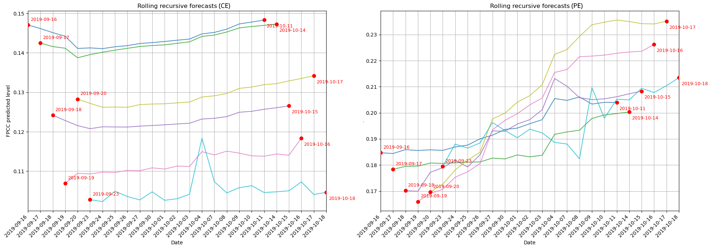{#fig:event_horizons_neural}

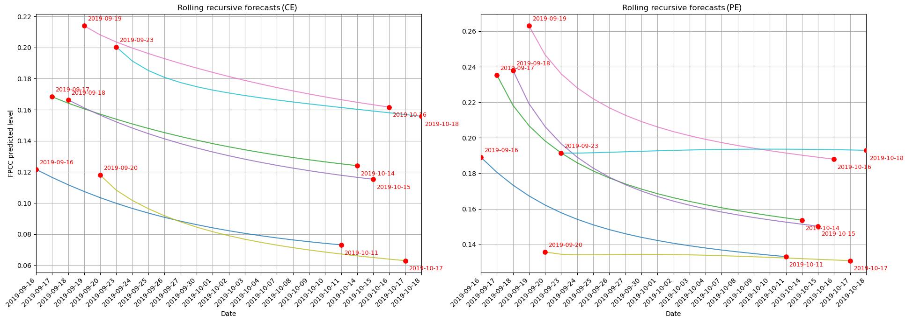{#fig:event_horizons_arx}

## Diffusion Analysis {#sec:diffusion_analysis_garch}
We simulate 750 level paths (i.e. we run 750 forward passes) over the test horizon (@sec:dataloader discusses constructing the test set) to obtain $\hat{X}\in\mathbb{R}^{750\times h\times M}$ that we difference and pool into $d\hat{X}\in\mathbb{R}^{750h\times M}$. As mentioned in @sec:lsa, we discount evaluating Nifty's estimated diffusion because our interest is specifically concerned with FPCCs and surface behaviour. @fig:simdX_empirical_qq_calls and @fig:simdX_empirical_qq_puts show evidence that $d\hat{X}$ misses ever-so-slightly the empirical tails.

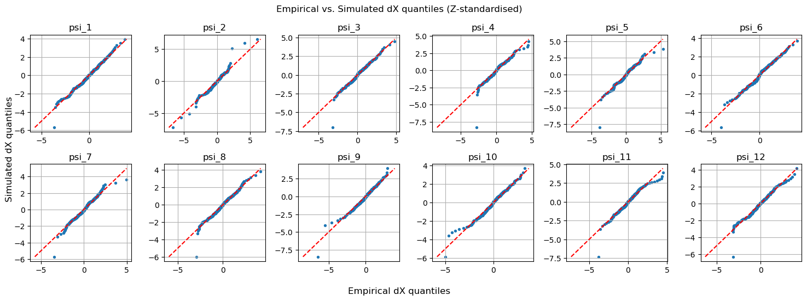{#fig:simdX_empirical_qq_calls}

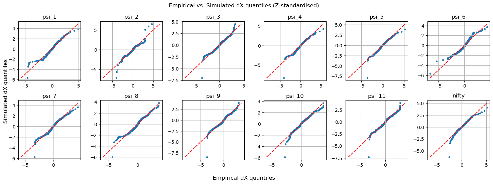{#fig:simdX_empirical_qq_puts}

QQ plots of $d\hat{X}$ versus a Gaussian and Student's $t$, on the other hand, show that the neural diffusion has captured the heavier-than-Gaussian, lighter-than-$t$ behaviour discussed in @sec:fpcc_tails. The tail misses matter because as mentioned in @sec:fda_projection, our macro announcement lies in the tails. @tbl:announcement_ranks shows the empirical percentiles of $d\Xi$ for 20 September 2019, calculated over the entire test set.

Table: Percentiles of the 20 September 2019 FPCC increments $d\Xi$, computed against the entire test dataset. The impact of the event lies entirely within the tails.
{#tbl:announcement_ranks}

| FPCC            | psi_1 | psi_2 | psi_3 | psi_4 | psi_5 | psi_6 | psi_7 | psi_8 | psi_9 | psi_10 | psi_11 | psi_12 |
| --------------- | ----- | ----- | ----- | ----- | ----- | ----- | ----- | ----- | ----- | ------ | ------ | ------ |
| Calls, $d\Xi^C$ | 0.8   | 10    | 50.4  | 99.6  | 29.2  | 0.4   | 18    | 96.8  | 0.4   | 5.6    | 0.4    | 42     |
| Puts, $d\Xi^P$  | 96.8  | 100   | 95.6  | 100   | 98.8  | 99.6  | 100   | 93.6  | 0.4   | 96.8   | 87.6   |        |

We also inspect the "innovations", $z_t$: if a distribution law $z_t$ is scaled by a conditional volatility component $\sigma$ and modelled as $\epsilon=\sigma z_t$, then then $\epsilon\sigma^{-1}=z_t$, where $\operatorname{Var}(z_t)=1$. For our SDE, using the test set $dX_t$:
$$
\begin{align*}
    dX_t = \vec{\mu}_t\ dt + \Sigma_t\ dW_t
    &\implies \hat{\Sigma}_t^{-1} \left( dX_t - \hat{\vec{\mu}}_t\ dt \right) = dW_t \\
    &\implies \left(\hat{\Sigma}_t\sqrt{dt}\right)^{-1} \left(dX_t - \hat{\vec{\mu}}_t\ dt\right) = Z_t
\end{align*}
$$

Please let $Z_t^C,\,Z_t^P$ denote call and put innovations respectively, and $Z_t$ the generic innovation set. Anderson-Darling tests and Gaussian QQ plots of $Z_t$ expectedly show that $Z_t$ sports heavier tails; $t$-distribution QQ plots of $Z_t$ show some FPCCs' innovations have heavier and some lighter tails; and NIG QQ plots show a slightly tighter fit. A jump component may address this, as suggested in @FuNVol §5.3. Given these findings, it is natural to compare $Z_t$ with a naive GARCH(1,1) model:
$$
\begin{align*}
    Y_t = &\beta_0 + \beta_1 Y_{t-1} + \langle \beta_X, X_t \rangle + \epsilon_t:
    \\
    \epsilon_t = \sigma_t z_t, \qquad &z_t \sim D(0, 1), \qquad
    \sigma_t^2 = \omega + \alpha_1\,\epsilon_{t-1}^2 + \gamma_1\sigma_{t-1}^2
\end{align*}
$$

Where $Y_t\sim\operatorname{ARX}(1)$ as in @sec:drift_analysis_ar1, $\sigma_t^2$ is conditional variance, and $D(0, 1)$ is a given distribution for $z(t)$. We compare neural innovations $Z_t$ versus GARCH innovations $z_t$, with $D(0,1)\sim[\mathcal{N}(\cdot),\, t(\cdot)]$, for calls and puts. LB statistics suggest $z_t^2$ exhibits much less serial correlation than $Z_t^2$ across lags $(1, 5, 10)$: $Z_t^2$ call- and put-side tests find very strong evidence of serial correlation across all lags ($p=0$) for 16 out of 23 FPCCs, whilst $z_t^2$ call- and put-side tests demonstrate serial correlation ($p=0$) for 9 out of 23 FPCCs. This suggests that the specified neural diffusion is insufficient to capture FPCC heteroscedasticity. $D(0,1)\sim t$ improves the fit over $D(0,1)\sim\mathcal{N}(0,1)$, though QQ plots indicate that it still underestimates extreme tails. If anything, the entirety of @sec:results, @sec:fpcc_tails, @sec:fpcc_spectrum should provide reasonable doubt on, and motivate further inquiry into, whether neural supremacy is entirely warranted, especially for professional desks where interpretability is paramount.

## Surface Reconstruction {#sec:surface_reconstruct}
Our last comparison, but certainly not the least, is between surfaces. We generate 250 surface paths, teacher-forced and recursive, holding $t_0$ fixed (unlike in @sec:drift_analysis_ar1). @fig:tf_surfacegen and @fig:rec_surfacegen showcase the average surface with other sampled surfaces as a ghastly aura.

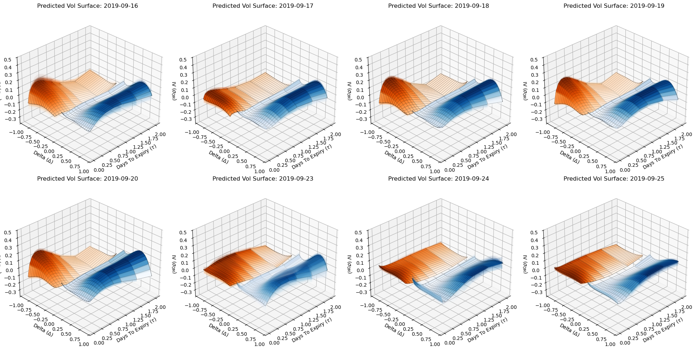{#fig:tf_surfacegen}

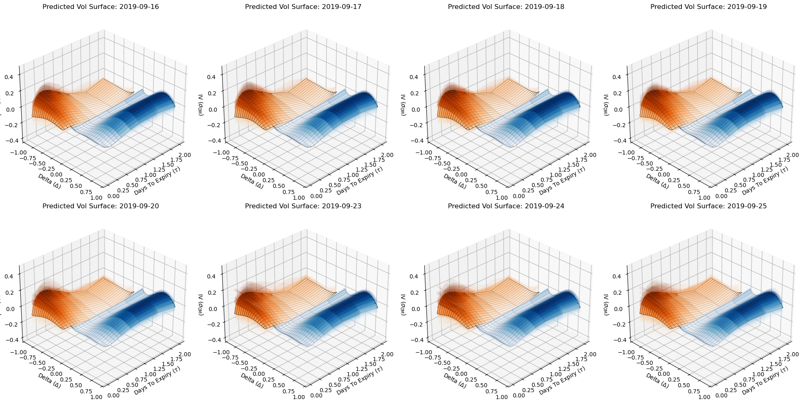{#fig:rec_surfacegen}

Teacher-forced surfaces demonstrate some apparent call-side skew on 20 September 2019 and beyond, whilst recursively generated surfaces don't exhibit any kind of apparent evolution.

# Conclusions {#sec:conclusions}
In @sec:tax_cut we established the dissertation's market event of interest. In @sec:market_data we described the construction of this dissertation's dataset. In @sec:ssvi we studied SSVI. In @sec:funvol_start we investigated FuNVol's modelling principles. In @sec:results we discussed the results applying FuNVol's modelling principles. Here, we provide some closing thoughts.

This dissertation covers a lot of ground. For starters, @sec:ssvi and specifically @tbl:svi_hyperbolic_params give a formal treatment of the SVI family as a set of conics; @Schadner being the only other related work which discusses direct hyperbolic fits. @sec:empirical_ssvi and specifically @fig:SSVIsurfaceWindow showcase SSVI fits to Nifty 50 implied volatility surfaces; these fits are to a market that is unfortunately underexplored in the literature, and are around a macroeconomic event of practical significance @sec:tax_cut. We hope this motivates future formal research into Indian market dynamics.

Empirically, the biggest takeaway is the amount of insight to be gained through SciML applications to difficult problems; other approaches in this regard are VolGAN @VolGAN, Deep Hedging @DeepHedging and DYSANOS @DYSANOS. Using FuNVol's approach, @sec:fpcc_tails finds that Nifty 50 IV FPCCs do not, at least globally, follow a Brownian diffusion law. A Normal Inverse Gaussian distribution is instead proposed, with asymptotic log-tail behaviour $C-\frac32\ln(x)-\lambda x$ lying between the Gaussian $-0.5x^2$ and Student's $t$ $-\nu\ln(x)$. Other candidate families however, including Variance-Gamma, CGMY, and $\alpha$- or tempered-stable processes, warrant investigation. The neural parameterisation of Nifty IV surfaces vis-a-vis classical $\operatorname{ARX}(1)$-GARCH(1,1) offers many findings that directly probe the narrative of neural supremacy: inspired by Random Matrix Theory, @sec:fpcc_spectrum and @sec:training_outcomes show that rolling monthly IV surfaces exhibit low effective dimensionality, which is also reflected in the neural SDE's drift weight spectra as per @sec:training_outcomes, @fig:weight_spectra_calls, and @fig:weight_spectra_puts. @sec:drift_analysis_ar1 and specifically @tbl:forced_rmse and @tbl:rec_rmse show that $\operatorname{ARX}(1)$ and the neural parameterisation achieve comparable RMSE, but @fig:neural_arx_recursive_norms, @fig:event_horizons_neural and @fig:event_horizons_arx showcase dynamics that the neural net captures but that $\operatorname{ARX}(1)$ misses. @sec:diffusion_analysis_garch shows that versus FuNVol, finite-time linear GARCH models with an appropriate innovation distribution capture more serial dependence than a neural diffusion component. This is significant because it contests not only a neural parameterisation, but also the continuous-time nature of an SDE. This hopefully motivates further formal research into the neural specification in @sec:neural_sde.

A few curiosities and open problems remain: the derivation of a risk-neutral measure $\mathbb{E}^{\mathbb{Q}}$ for FuNVol, as noted in @sec:funvol_start, is nontrivial and of practical importance to pricing desks. The transient low-dimensionality identified in @sec:fpcc_spectrum motivate higher-order discretisations such as Milstein's. Recently, Muon as a weight matrix optimiser (@MuonMain, @MuonDOI) has shown great prowess in numerically stabilising neural weight matrices; something that @sec:lsa and @fig:event_horizons_neural may benefit from. Finally, all of the presented results suggest that market dynamics may move between distributional regimes as the macroeconomic environment changes, motivating models that are flexible in distribution as well.

In all, this dissertation has made serious empirical contributions to empirical financial research: the narrative of neural supremacy is directly contested in the context of IV surface modelling, and the SVI family has been formally explored through a hyperbolic lens that, arguably, elevates its parameterisation from purely financial to geometric; all of this from a world-class market that remains underrepresented in the literature. If not for any of this, at the very least, this dissertation has shown a leitmotif: that hyperbolae parsimoniously model IV surfaces, as shown in @tbl:svi_hyperbolic_params and @sec:fpcc_tails.

# References