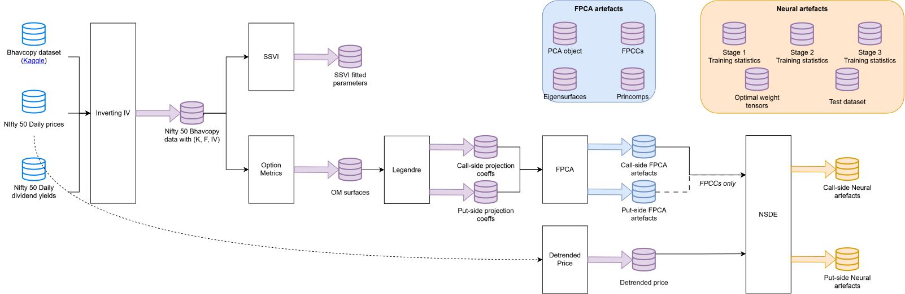

# Dissertation Code
There are many moving parts in this dissertation. This document is to help orient you, dear reader, with my code structure.

I've this using a pipeline-artefact type design. Each portion of the pipeline takes in data, transforms it, and saves an artefact to disk for subsequent pipes to consume and transform. Artefacts can also be analysed separately from the main pipeline. I chose this for a few reasons:
1. My R&D originally involved about 4 to 6 distinct Jupyter notebooks, with overlaps in responsibilities (processing Bhavcopies, inspecting data, fitting SSVI, preparing OM surfaces, examining the NSDE, etc.). This had to be streamlined.
2. Each Jupyter notebook included sets of plots and results tables that I couldn't fit in my thesis. I wanted to retain this exploratory layer, but without holding unnecessary data in memory.

With this approach, there are clear start and end points for each section of the pipeline with well-defined data artefacts (see @fig:code_flow). Most conveniently, a Jupyter notebook now sits on top as an analytical layer, consuming only those artefacts necessary to recreate the plots in my thesis and results that I couldn't include due to space constraints.

{#fig:code_flow}

If you, dear reader, source my Bhavcopy data from [my Kaggle upload](https://www.kaggle.com/datasets/rasi96/nse-f-and-o-bhavcopies-2010-2019), then you should get a folder named `nse_bhavs`. The assumed folder structure for this entire pipeline is as follows (assuming we start in the current folder, `./code`):

```
code/
    data/
        nse_bhavs/
        nifty-daily.csv
        nifty-div-yields.csv
        nifty-vix.csv
    funvol/
    inverting_iv/
    ssvi/
```

The CSVs `nifty-daily`, `nifty-div-yields`, `nifty-vix` will have to be sourced from other locations, most straightforwardly the ones mentioned in my thesis in §1.2.
