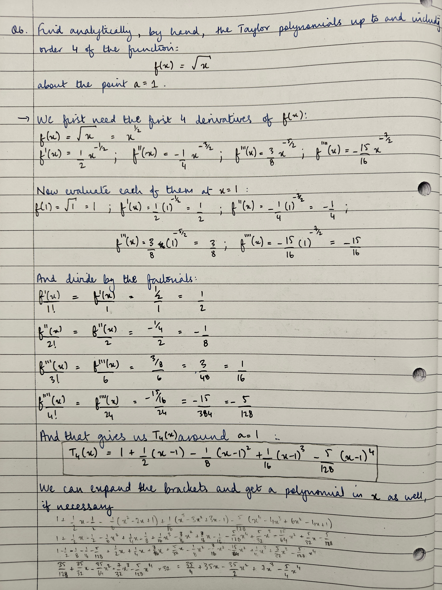

---
header-includes:
  - \usepackage{float}
  - \floatplacement{figure}{htbp}
  - \usepackage[export]{adjustbox}
  - \let\includegraphicsbak\includegraphics
  - |
    \renewcommand*{\includegraphics}[2][]{%
      \includegraphicsbak[frame,keepaspectratio,max width=\textwidth,max height=0.9\textheight,#1]{#2}%
    }
  - \usepackage{needspace}
  - \usepackage{listings}
  - |
    \lstset{
      basicstyle=\ttfamily\small,
      breaklines=true,
      breakatwhitespace=true,
      columns=fullflexible,
      keepspaces=true,
      upquote=true,
    }
  - \usepackage{setspace}
  - \setstretch{1.05}
  - \usepackage{microtype}
  - \usepackage{amsmath,amssymb}
  - \usepackage{needspace}
  - \usepackage{fontspec}

geometry: margin=0.75in
fontsize: 12pt
wrap: auto
mainfont: "Liberation Serif"
sansfont: "Liberation Sans"
monofont: "Hack"
monofontoptions: "Scale=0.6"
listings: true
highlight-style: pygments

title: "MTHM003 25/26 Coursework 1 Submission"
author: "Rahul Singh"
bibliography: "31Oct25-submission-CW1.bib"
csl: "apa.csl"
link-citations: true
---

# Introduction
This submission is for MTHM003's first coursework over the year 2025-2026. Note that typesetting has been adapted from a Jupyter notebook, so some sections may not appear exactly (e.g., code blocks have been broken up here with explicit explanations to aid reasoning and preserve readability).

## Code Setup

\Needspace{18\baselineskip}
```python
import logging
import matplotlib.pyplot as plt
import numpy as np

from collections.abc import Iterable
from datetime import datetime
from matplotlib.ticker import (AutoMinorLocator, MultipleLocator)
from typing import Any

# required for local testing
logging.basicConfig()
logger = logging.getLogger(__name__)
logger.setLevel(logging.INFO)
# logger.setLevel(logging.DEBUG)

rng = np.random.default_rng(seed=42)
```

\newpage
# Question 1
The truncated Riemann-Zeta function, $\zeta_n (s)$, is given by the following series:
$$ \zeta_n(s) = \sum_{k=1}^{n} \frac{1}{k^s} $$

Calculate $\zeta_n (4)$ using vectorised operations, and show with a plot that $\zeta_n (4) \approx \frac{\pi^4}{90}$ for sufficiently large $n$. Find the smallest $n$ such that $\lvert \zeta_n (4) - \frac{\pi^4}{90} \rvert < 10^{-6}$.

## Answer
The first thing to note is that we're permitted the use of vectorised operations, and on modern (i.e., SIMD and beyond) CPUs, there are extremely flexible options and ways to leverage this. In Python, `numpy` (NumPy; Numerical Python) offers fully vectorised operations (@harris2020array) (amongst other packages like `torch`, `polars`, etc.), from basic arithmetic to indexing and boolean operations. This means all NumPy N-dimensional arrays (nd-arrays, or simply arrays) can be treated as we would scalars, for all kinds of arithmetic.

Something specific to keep in mind for our implementation is that there are two ways to test convergence of a Riemann-Zeta sum to a given quantity: we can either take the difference between the cumulative sum and the quantity, and compare it to a certain tolerance (as the question is phrased); or, we can simply measure the "closeness" of each element in the cumulative sum vector to the quantity. Both approaches are mathematically/mentally the same, but have vastly different computational implementations:
1. If we take the absolute difference between the cumulative sum and the quantity, and compare it to a certain tolerance, we perform one single vectorised op (subtraction) over the entire cumsum array, generate another vector holding the differences, and then perform another single vectorised op comparing the differences to the given tolerance. In other words, this would be `diff = abs(cumsum - quantity); diff <= 1e-6`.
2. If we measure the "closeness" of each cumsum element to the given quantity (which we can do using `np.isclose()`), NumPy also performs additional checks to handle `NaN` values and comes with two tolerances: `atol` and `rtol`, with the result being computed as `absolute(a - b) <= (atol + rtol * absolute(b))` along the whole vector. As such, there are more operations involved here which makes this a lot slower.

There are more operations and overhead involved in the 2nd approach (tested), so we'll proceed with (1):

\Needspace{46\baselineskip}
```python
def riemann_zeta(
        s: int,
        maxn: int = 100,
        target: float = None,
        atol:float = 1e-6
    ) -> np.ndarray|int:
    """
    Quick implementation of the Riemann-Zeta function. Computes:
    $$ \zeta_n(s) = \sum_{k=1}^{n} \frac{1}{k^s} $$

    Parameters:
    - s: int
        The exponent to raise $k$ to. Note that if `s<=1` the series diverges.

    - maxn: int (default=100)
        The number of sums to include in computation. Raises if `maxn<1`.

    - target: float (optional)
        If provided, the closest `n` needed to reach `target` (within `atol`)
        is returned. If not provided, the cumulative sum is returned.

    - atol: float (default=1e-6)
        Absolute tolerance to use when comparing the approximation to `target`.
        Only used if `target` is provided. Raises if `atol < 0`.
    """
    _validate_rz_inputs(s=s, maxn=maxn, atol=atol)  # sanity checks

    sums = np.arange(1, maxn+1, 1)
    frac = 1/(sums**s)
    csum = np.cumsum(frac)

    if target is not None:
        diff = np.abs(csum-target)
        close_array = diff <= atol  # `close_array` is a bool array.
        if not close_array.any():
            # If no value in `csum` is close to `target` within `atol`, then
            # comparisons will return an array of `False`. We cannot correctly
            # use `np.argmax` because it will return 0 - this does not mean the
            # first index, it means no value is close. This must fail explicit.
            raise ValueError(f"{datetime.now()}: Failed to converge.")
        first_n = np.argmax(close_array)  # index of first `True` in bool array.
        return sums[first_n]
    else:
        return csum
```

For posterity, it makes sense to validate inputs for our implementation because:
1. Although the original Riemann-Zeta function is defined for complex-type s-values, here we're only deaing with $\mathbb{R}$. This requires an explicit fail because it's out of scope of the given program.
2. Given that `maxn` is a function parameter with an overridable default, we need to make sure we have at least 1 term to sum over. $\text{maxn} <= 1$ is an illegal value, and should be an explicit fail.
3. Given that `atol` (absolute tolerance) is also a function parameter, it's important to ensure `atol` is both finite and $\ge 0$. Otherwise our implementation will never converge, or will produce undefined behaviour. This too is an explicit fail condition.

\Needspace{34\baselineskip}
```python
def _validate_rz_inputs(s: Any, maxn: Any, atol: Any) -> None:
    """
    Validates inputs to the Riemann-Zeta implementation. Ensures data types and
    finiteness. Raises if any check fails.
    """
    if not isinstance(s, int):
        # while the original R-Z function is defined for complex-type s-values
        # (which are floats), here we're only doing the integer version. Fail
        # explicitly because we explicitly do not support non-integral `s`.
        raise TypeError(
            f"{datetime.now()}: Invalid input: expected `s` to be of type `int` "
            f"received `{type(s)}` instead."
        )

    if maxn < 1:
        # need at least 1 summation term minimum, and we cannot make assumptions
        # about data boundaries. Fail explicitly so that the user knows they have
        # invalid data flow from somewhere.
        raise ValueError(
            f"{datetime.now()}: Invalid input: expected `maxn >= 1`, received "
            f"`{maxn}`."
        )

    if atol < 0 or not np.isfinite(atol):
        # we can't have negative tolerance. Fail explicitly because even though
        # we have a non-convergence branch, the real issue is here is an invalid
        # input, i.e. programmer error. Coercing silently can skew downstream.
        raise ValueError(
            f"{datetime.now()}: Invalid input: expected `atol > 0` and finite, "
            f"received `{atol}`."
        )
    return
```

We can test this implementation like so:

\Needspace{11\baselineskip}
```python
s = 4
maxn = 100
target = (np.pi**4)/90
atol = 1e-6
closest_n = riemann_zeta(s=s, maxn=maxn, target=target, atol=atol)
logger.info(
    f"{datetime.now()}: {closest_n} out of {maxn} summations ≈ π⁴/90 for "
    f"(tol={atol})."
)
```

And get an exact answer, $n=69$; or, in other words, 69 summation terms are needed for the Riemann-Zeta function to converge close to $\pi^4/90$ within a tolerance of $10^{-6}$.

We can visualise convergence with a plot. For our viz, we'd like something that lets us view trajectory and error rate over time as a function of $n$; one easy & very intuitive approach is a scatterplot. Each dot/data point at $n$ will be scaled by the amount of error, `err`. It makes sense to min-max scale `err` such that it lies between $[0, 1]$. We can then just bump up the global size of each dot to make it visible before plotting. To guide the eye, we can also include a basic line plot across $n$ connecting our dots, along with colouring each dot under two regimes: if `err` $> 10^{-6}$, it's blue; if `err` $< 10^{-6}$, it's green:
```python
plot_x = np.arange(1, maxn+1, 1)
plot_y = riemann_zeta(s=4, maxn=maxn)

err = target-plot_y
colours = np.where(err<atol, "#3182bd", "#e6550d")
max_err = np.max(err)
min_err = np.min(err)
normalised_err = (err-min_err) / (max_err-min_err)
marker_sizes = normalised_err * 1e3+25

fig, ax = plt.subplots(figsize=(15, 6))

ax.plot(plot_x, plot_y, label="riemann approx", alpha=0.7)
ax.scatter(plot_x, plot_y, c=colours, s=marker_sizes)
```

As additional visual aids and orientation, we can include a horizontal line at our target value $\frac{\pi^4}{90}$, letting us see our approximation asymptote; and a horizontal line at $n=\text{maxn}$ so that we know where the best $n$ is:
```python
ax.axhline(
    y     = target,
    xmin  = 0,
    xmax  = plot_x.max(),
    ls    = "--",
    c     = "#d62728",
    label = r"target: $\frac{\pi^4}{90}$"
)

ax.axvline(
    x     = closest_n,
    ymin  = 0,
    ymax  = plot_y.max(),
    ls    = '--',
    c     = "#d62728",
    label = f"closest_n ({closest_n})",
    alpha = 0.5
)

ax.set_xlim(0, maxn+1)
ax.xaxis.set_major_locator(MultipleLocator(5))
ax.xaxis.set_minor_locator(AutoMinorLocator(1))
ax.set_xlabel(r"Number of summations, $n$")
ax.set_ylabel(f"Riemann-Zeta summation value at s={s} ($y=\\zeta_n(4)$)")
```

Finally, housekeeping:
```python
ax.legend()
ax.minorticks_on()
ax.grid(which="both")
ax.grid(which="minor", alpha=0.3)

title = (
    f"Comparison between the first $n={maxn}$ Riemann-Zeta summations and "
    f"$\\frac{{\\pi^4}}{{90}}$"
)

subtitle = (
    f"Scaling by error $\\in [{marker_sizes.max()}, {marker_sizes.min()}]$"
)

ax.text(28.0, 1.093, title, va="center", fontsize="large")
ax.text(42.5, 1.088, subtitle, va="center", fontstyle="italic")

fig.tight_layout()
plt.show()
```


\newpage
# Question 2
Let $A$ and $B$ be arbitrary $n \times n$ matrices. Let $\vec{a}$ and $\vec{b}$ be arbitrary column vectors of length $n$. Find single-line commands for the following expressions:
- The inner product, $s = \vec{a}^{\top} \vec{b}$.
- The outer product, $W = \vec{a} \vec{b}^{\top}$.
- The $n \times n$ matrix $C: C_{ij} = A_{ij}B_{ij} \;\; \forall \; i,j \in 1, \dots, n$.
- The $n \times n$ matrix $D: D_{ij} = \min(A_{ij}B_{ij}) \;\; \forall \; i,j \in 1, \dots, n$.
- The matrix $E = AB^{\top} - BA^{\top}$.
- The row vector $v$ which contains all elements of $B$ in row order, then all elements of $A$ in column order.
- The row vector $w$ which contains all elements of $A$ and $B$ in sorted, non-increasing order.

Give those results for:
$$
  A = \begin{bmatrix}
    3 & 1 & -2 \\
    -1& 4 & 2  \\
    6 & -3& 2
  \end{bmatrix}, \;\;
  B = \begin{bmatrix}
    0 & 1 & -1 \\
    2 & 0 & 1  \\
    1 & 0 & 1
  \end{bmatrix}, \;\;
  \vec{a} = \begin{bmatrix}
    1 \\
    2 \\
    -2
  \end{bmatrix}, \;\;
  \vec{b} = \begin{bmatrix}
    3 \\
    0 \\
    -3
  \end{bmatrix}
$$

## Answer
First, we define our matrices and vectors:
\Needspace{16\baselineskip}
```python
A = np.array([
    [ 3,  1, -2],
    [-1,  4,  2],
    [ 6, -3,  2]
])

B = np.array([
    [0, 1, -1],
    [2, 0,  1],
    [1, 0,  1]
])

a = np.array([1, 2, -2])
b = np.array([3, 0, -3])
```

And then compute the prescribed operations:

\Needspace{47\baselineskip}
```python
# inner product ----------------------------------------------------------------
s = np.dot(a, b)  # np.dot(a, b) == a@b == np.inner(a, b)
print(s)
# np.int64(9)

# outer product ----------------------------------------------------------------
W = np.outer(a, b)
print(W)
# array([[ 3,  0, -3],
#        [ 6,  0, -6],
#        [-6,  0,  6]])

# elementwise (Hadamard) product -----------------------------------------------
C = A*B
print(C)
# array([[ 0,  1,  2],
#        [-2,  0,  2],
#        [ 6,  0,  2]])

# minimum elementwise (Hadamard) product ---------------------------------------
D = np.minimum(A, B)
print(D)
# array([[ 0,  1, -2],
#        [-1,  0,  1],
#        [ 1, -3,  1]])

# E = AB^T - BA^T --------------------------------------------------------------
E = (A@B.T) - (B@A.T)  # @ is NumPy dot/inner product
print(E)
# array([[  0,   2,   6],
#        [ -2,   0, -13],
#        [ -6,  13,   0]])

# row vec of all elements of B in row order, then all elements of A in col order
v = np.hstack( (B.flatten(), A.T.flatten()) )  # note the transpose, `A.T`
print(v)
# array[ 0,  1, -1,  2,  0,  1,  1,  0,  1,  3, -1,  6,  1,  4, -3, -2,  2,  2]

# row vec of all elements of A and B in sorted, non-increasing order -----------
w = np.hstack((A.flatten(), B.flatten()))
w = np.sort(w)
print(w)
# array[-3, -2, -1, -1,  0,  0,  0,  1,  1,  1,  1,  1,  2,  2,  2,  3,  4,  6]
```

\newpage
# Question 3
Write a function that returns the indices corresponding to the longest segment of successive increments of a sequence: `function [start,finish] = longest increment(sequence)`.

The input `sequence` is a $1 \times n$ row vector, $v$. The outputs `start` and `finish` are such that `sequence(start:finish)` is the longest part of the vector $v: v_i < v_{i+1} \; \forall \; i \in \{\text{start}, \dots, \text{finish}-1\}$. If there are several segments with the same maximum length, the
function should return the first of these. If there is no segment of successive increments, the function should return start and finish as empty variables.

Give two implementations of the function: `longest_increment_loops` and `longest_increment_noloops`. The first must only use `for` loops (no `max` or `find`, or similar built-ins). The second must use no `for` or `while` loops, but can make any use of built-ins. Give examples to show that both functions
work properly. Usage example (MATLAB):

\Needspace{6\baselineskip}
```matlab
>> [s,f] = longest_increment([3, 1, 2, 0, 5])
s=2
f=3
% two sequences of length 2, first one starts at index s=2, ends at index f=3
```

## Answer

### Looped
If we look close enough, the crux of the matter at hand is that we're trying to find the longest increasing montonic subsequence in a given sequence of numbers. This has a large number of applications across quant, perhaps most intuitively to identify runaway trends without any reversal of close price (price over $\tau$ timesteps is purely increasing). Computationally speaking, such monotonicity implies each successive value is greater than the last one.

This first implementation is looped. Since we're traversing a given array over each element and updating two stores - one `start` index, one `finish` index - of an increasing monotonic sequence, the biggest _computational_ issue (besides storage and mallocs, but those are different discussions) is knowing whether we already have a valid `start` index set or not. To clarify: given some integers (a, b, c), if $b>a$ and $c>b$, it follows that $c>a$. In this looped implementation, since we're always testing pairwise, we shouldn't have to always store a fresh `start` value after every comparison.

In other words, the following 2 approaches are identical **IFF** we somehow can "know" that $a$ is, in fact, the `start` of the current monotonic sequence so far (note that $i$ means "iteration"):
1. Approach 1:
   ```python
   i=0: b>a? start=a, finish=b
   i=1: c>b? start=b, finish=c
   ```
2. Approach 2:
   ```C
   i=0: b>a? start=a, finish=b
   i=1: c>b? start=a, finish=c
   ```

The difference between the 2 is that in approach 1, after we traverse the input array once, we would still need to traverse the result store again to merge subsequent indices so that we get one contiguous range between `start` and `finish`. This is both computationally & mentally taxing. Instead, if we can just "know" that $a$ is the `start` of the current monotonic sequence, we can easily only update `finish` values and call it a day. We can achieve this with a simple boolean `flag`.

In this looped implementation we also need to pay attention to array bounds: since Python is zero-indexed and we're checking both $i$ and $i+1$ values, we need to iterate until $N-1$ where `N = len(input)`. Finally, something extra we can do in the main algorithm to make our work much easier is to record the length of the prevailing monotonic range alongside the valid `start, finish` pair of indices. This decision is again computational in nature, because it saves us the trouble of manipulating an N-dimensional array later on to compute column-wise differences or ranges after-the-fact.

Our looped implementation is thus:

\Needspace{46\baselineskip}
```python
def longest_increment_loops(arr: np.ndarray) -> tuple[None|int]:
    """
    Finds the first longest increasing subsequence in `arr`. Returns (start,
    finish) indices. See examples.

    Parameters:
    - arr: np.ndarray
        The input NumPy array.

    Examples:
    >>> longest_increment_loops([1, 2, 3, 7, 4, 5, 0])  # output=(0, 3).
    >>> longest_increment_loops([3, 1, 2, 0, 5])        # output=(1, 2).
    """
    if len(arr)<=0:
        raise ValueError(f"{datetime.now()}: `arr` is empty.")

    N = len(arr)-1  # we're indexing with i+1, so we need N-1 as a boundary
    intervals = []
    active_iter = []
    flag = False

    for i in range(N):
        if arr[i+1] > arr[i]:
            if flag:  # if start is flagged, only update finish
                active_iter[1] = i+1
            else:  # otherwise update both and flag start
                active_iter.extend([i, i+1])
                flag = True
        else:  # if i+1 < i, break. Compute ranges if any, store, and reset
            if len(active_iter) > 0:
                diff = np.diff(active_iter).item()
                active_iter.append(diff)
                intervals.append(tuple(active_iter))
            active_iter = []
            flag = False
            continue

    # Process any non-empty tracking arrays once we reach the end of the input.
    if len(active_iter) > 0:
        diff = np.diff(active_iter).item()
        active_iter.append(diff)
        intervals.append(tuple(active_iter))

    return _find_max_diff(intervals)
```

Once we have our set of indices marking increasingly monotonic intervals, we need to return just the `start, finish` pair that is the _first maximum_ of the entire set. We aren't permitted to use vectorised functions or built-ins for this implementation, but a greedy `max()` function is rather straightforward to write, especially since, as mentioned, we've already stored the length of all valid monotonic subsequences along with `start, finish` index pairs. Our specific implementation here mandates 3D inputs (since we have `(start, finish, length)` in our data structure):

\Needspace{39\baselineskip}
```python
def _find_max_diff(intervals: Iterable[tuple[int, int, int]]) -> tuple[None|int]:
    """
    Minimal greedy implementation of `max` to find the first maximum value in a
    given set of 3D `intervals`. See the description of `intervals`. Returns a
    2-tuple of ints; if `intervals` is empty, returns a 2-tuple of (None, None).

    Parameters:
    - intervals: Iterable[tuple[int, int, int]]
        A iterable of 3-tuples of integers, e.g. [(a1, b1, c1), (a2, b2, c2)].
        The 3rd element (cN) in each interval is iterated over and used to find
        the first maximum.

    Example:
    >>> intervals = np.random.randint(low=1, high=10, size=(3, 2))
    >>> diffs = np.diff(intervals, axis=1)
    >>> stacked = np.hstack((intervals, diffs))
    >>> stacked
    array([[ 8,  7, -1],
           [ 3,  4,  1],
           [ 9,  6, -3]])
    >>> _find_max_diff(stacked)
    (3, 4)
    """
    if len(intervals) == 0:  # if we get an empty set, no sequence was valid.
        return (None, None)

    max_diff = 0
    best_i = 0
    for i, triple in enumerate(intervals):
        _, _, diff = triple
        if diff > max_diff:
            max_diff = diff
            best_i = i

    ret = np.array(intervals[best_i][:2])
    ret += 1  # comply with 1-based indexing
    return tuple(ret)
```

Combining these two functions gives us prescribed result(s). Note at the end, we increment results by 1 for more compliant 1-based indexing. We can test our implementation like so:

\Needspace{44\baselineskip}
```python
tests = {
    1: {
        "array": [1, 2, 3, 7, 4, 5, 6, 10, 2, 1],
        "expected": (1, 4)
    },
    2: {
        "array": [3, 1, 2, 0, 5],
        "expected": (2, 3)
    },
    3: {
        "array": [1,2,3,7,4,5,0,3,4,5,6,7,8,1,8,7,6,5,4,12,13,14,15,16,17,18,19],
        "expected": (19, 27)
    },
    4: {
        "array": [6, 6, 6, 6, 6, 6, 6, 5],
        "expected": (None, None)
    },
    5: {
        "array": [0, -1, -2, -3, -4, -5, -6, -7],
        "expected": (None, None)
    },
    6: {
        "array": [5, 5, 5, 5, 5],
        "expected": (None, None)
    }
}

for i, test in tests.items():
    logger.info(f"{datetime.now()}: Testing with {test["array"]}")

    longest_increment = longest_increment_loops(arr = test["array"])
    result = np.array_equal(test["expected"], longest_increment)

    if result:
        logger.info(
            f"{datetime.now()}: test {i} passed: expected {test["expected"]}."
        )
    else:
        logger.warning(
            f"{datetime.now()}: test {i} failed: expected {test["expected"]}, "
            f"got {longest_increment}."
        )
```

And our deterministic tests pass:

\Needspace{15\baselineskip}
```log
INFO:__main__:2025-11-04 19:50:11.686577: Testing with [1, 2, 3, 7, 4, 5, 6, 10, 2, 1]
INFO:__main__:2025-11-04 19:50:11.688468: test 1 passed: expected (1, 4).
INFO:__main__:2025-11-04 19:50:11.689923: Testing with [3, 1, 2, 0, 5]
INFO:__main__:2025-11-04 19:50:11.691192: test 2 passed: expected (2, 3).
INFO:__main__:2025-11-04 19:50:11.691869: Testing with [1, 2, 3, 7, 4, 5, 0, 3, 4, 5, 6, 7, 8, 1, 8, 7, 6, 5, 4, 12,
13, 14, 15, 16, 17, 18, 19]
INFO:__main__:2025-11-04 19:50:11.692801: test 3 passed: expected (19, 27).
INFO:__main__:2025-11-04 19:50:11.693516: Testing with [6, 6, 6, 6, 6, 6, 6, 5]
INFO:__main__:2025-11-04 19:50:11.694260: test 4 passed: expected (None, None).
INFO:__main__:2025-11-04 19:50:11.694889: Testing with [0, -1, -2, -3, -4, -5, -6, -7]
INFO:__main__:2025-11-04 19:50:11.695784: test 5 passed: expected (None, None).
INFO:__main__:2025-11-04 19:50:11.696369: Testing with [5, 5, 5, 5, 5]
INFO:__main__:2025-11-04 19:50:11.697145: test 6 passed: expected (None, None).
```

We can also test our implementation with randomly generated vectors (recall our random seed for this worksheet is `42`):

\Needspace{10\baselineskip}
```python
n_tests = 5
vec_len = 10
random_tests = rng.integers(low=-10, high=10, size=(n_tests, vec_len))

for i, array in enumerate(random_tests):
    logger.info(f"{datetime.now()}: {i} - Testing with {array}")
    longest_increment = longest_increment_loops(arr = array)
    logger.info(f"{datetime.now()}: Longest increment={longest_increment}")
```

With the following results (again, recall the results assume 1-based indexing):

\Needspace{12\baselineskip}
```log
INFO:__main__:2025-11-04 19:50:11.712743: 0 - Testing with [-9  5  3 -2 -2  7 -9  3 -6 -9]
INFO:__main__:2025-11-04 19:50:11.714589: Longest increment=[1 2]
INFO:__main__:2025-11-04 19:50:11.715935: 1 - Testing with [ 0  9  4  5  4  5  0 -8  6 -1]
INFO:__main__:2025-11-04 19:50:11.717440: Longest increment=[1 2]
INFO:__main__:2025-11-04 19:50:11.718160: 2 - Testing with [ 0 -3 -7  8  5  2 -2  6  0 -2]
INFO:__main__:2025-11-04 19:50:11.719544: Longest increment=[3 4]
INFO:__main__:2025-11-04 19:50:11.720260: 3 - Testing with [-1 -6 -9  1  7 -9  7  6 -5  2]
INFO:__main__:2025-11-04 19:50:11.721609: Longest increment=[3 5]
INFO:__main__:2025-11-04 19:50:11.722674: 4 - Testing with [-7  5  4 -3 -9  9 -2  7  3  5]
INFO:__main__:2025-11-04 19:50:11.724551: Longest increment=[1 2]
```

### Vectorised
Building on our work in the looped version, since we're now permitted to use _only_ vectorised operations, we can slightly shift our focus from direct arithmetic comparisons onto the magnitude of change (the _difference_) between subsequent values in order to ensure increasing monotonicity. This makes our vectorised work slightly mentally easier, because now we're only concerned with the _sign_ of the difference in values (note that when we were doing this manually, whether or not we had differences, sign-of-differences, or the raw array, we still had to iterate over the entire vector). As long as the next value is greater than the current one - or, in other words, as long as $x_{i+1} - x_i > 0$ - we can assume the sequence is increasingly monotonic. Then all we need to do is find the _first_ longest range of $i$ values that satisfies that constraint, and voila. To paraphrase:

\begin{align*}
\vec{a} &= \left[ 1, 2, 3, 7, 4, 5, 6, 10, 2, 1 \right] \\
\text{d}a &= a_{i+1} - a_i \\
            &= \left[ 1, 1, 4, -3, 1, 1, 4, -8, -1 \right] \\
\text{sign}(\text{d}a) &= \left[ 1, 1, 1, -1, 1, 1, 1, -1, -1 \right]
\end{align*}

We can notice 2 things:
1. The vectors $\text{d}a$, and by extension $\text{sign}(\text{d}a)$, are 1 less than the length of $\vec{a}$ because of the nature of differencing. Therefore, if $\vec{a}$ was 0-indexed, $\text{d}a$'s indexing begins from 1.
2. There are 2 ranges of values that are increasing, according to $\text{sign}(\text{d}a)$: from $[\text{d}a_1..\text{d}a_3]$, and $[\text{d}a_5..\text{d}a_7]$. Both of these ranges have 3 values in them ($[1, 2, 3]$, and $[5, 6, 7]$), and correspond to $\vec{a}$ indices of $[0..3]$ and $[4..7]$.

And that's all there is to it. We just need to keep in mind the indexing: Python by default is 0-indexed, while differences and dependencies are 1 less than the length of the original array (and thus are 1-indexed relative to the original). As for why we're using $\text{sign}$ at all, it's because it's more straightforward, especially when dealing with NumPy/vectorised ops, to compare $[1, -1]$ with $0$ than it is any other range of values.

Our implementation here is going to have to switch between manipulating indices using values and vice-versa cleanly:
1. Once we have the sign of differences in a given input array, we can use its zero-crossings to help identify the longest stretch of differences that are $>0$. From the example above, indices $[3, 7, 8]$ are the zero-crossings of $\text{sign}(\text{d}a)$, which means indices $[0..3]$ are the first set of increasingly monotonic values, $[4..7]$ is the next, etc.
2. Once we have these stretches, we need to transform them into a set of lengths which we can do using some elementary index manipulation.
3. From the set of lengths, we simply pick the first set of zero-crossings that has the _maximum_ length - the `start, finish` pair for that section is the first longest increasingly monotonic subsequence.

Therefore, our vectorised version:

\Needspace{43\baselineskip}
```python
def longest_increment_noloops(arr: np.ndarray) -> tuple[None | int]:
    """
    Vectorised search over `arr` for the first longest increasing subsequence.
    Returns (start, finish) indices. See examples.

    Parameters:
    - arr: np.ndarray
        The input NumPy array.

    Examples:
    >>> longest_increment_loops([1, 2, 3, 7, 4, 5, 0])  # output=(0, 3).
    >>> longest_increment_loops([3, 1, 2, 0, 5])        # output=(1, 2).
    """
    if len(arr)<=0:
        raise ValueError(f"{datetime.now()}: `arr` is empty.")

    N = len(arr)-1  # Python's 0-indexed but lengths are real measurements
    diff = np.diff(arr)
    if np.all(diff==0):
        return (None, None)

    sign = np.sign(diff)
    if np.all(sign<=0):
        return (None, None)

    zero_crossings = np.where(sign<=0)[0]
    # We prepend [-1] because length=N-1 due to 0-indexing, and we need correct
    # diffs. E.g prepending 0 to [3, 7, 8] gives us [0, 3, 7, 8] -> [3, 4, 1],
    # but in fact range [0..3] is 4-long. NOTE: Results are *not indices*.
    aligned_crosses = np.concatenate( ([-1], zero_crossings, [N]) )
    ranges = np.diff(aligned_crosses)
    # `np.argmax` here gives us the location of the maximum range, starting from
    # -1. NOTE: Results are *indices*. E.g. 0 means all values before the first
    # zero-crossing are the longest monotonic subsequence.
    longest_monotonic_range = np.argmax(ranges)
    start = aligned_crosses[longest_monotonic_range]+1
    finish = aligned_crosses[longest_monotonic_range+1]

    result = np.array([start, finish])
    result += 1  # comply with 1-based indexing
    return np.array([start, finish])
```

As with the looped implementation, notice at the end we're incrementing our final index pair by 1 to comply with a more intuitive 1-based indexing paradigm. Using the same testing harness from last time, we can test our vectorised version:

\Needspace{17\baselineskip}
```python
for i, test in tests.items():
    logger.info(f"{datetime.now()}: Testing with {test["array"]}")

    longest_increment = longest_increment_loops(arr = test["array"])
    result = np.array_equal(test["expected"], longest_increment)

    if result:
        logger.info(
            f"{datetime.now()}: test {i} passed: expected {test["expected"]}."
        )
    else:
        logger.warning(
            f"{datetime.now()}: test {i} failed: expected {test["expected"]}, "
            f"got {longest_increment}."
        )
```

And see again that all deterministic tests pass:

\Needspace{15\baselineskip}
```log
INFO:__main__:2025-11-04 19:50:11.763525: Testing with [1, 2, 3, 7, 4, 5, 6, 10, 2, 1]
INFO:__main__:2025-11-04 19:50:11.765707: test 1 passed: expected (1, 4).
INFO:__main__:2025-11-04 19:50:11.767822: Testing with [3, 1, 2, 0, 5]
INFO:__main__:2025-11-04 19:50:11.769380: test 2 passed: expected (2, 3).
INFO:__main__:2025-11-04 19:50:11.770469: Testing with [1, 2, 3, 7, 4, 5, 0, 3, 4, 5, 6, 7, 8, 1, 8, 7, 6, 5, 4, 12,
13, 14, 15, 16, 17, 18, 19]
INFO:__main__:2025-11-04 19:50:11.772903: test 3 passed: expected (19, 27).
INFO:__main__:2025-11-04 19:50:11.774178: Testing with [6, 6, 6, 6, 6, 6, 6, 5]
INFO:__main__:2025-11-04 19:50:11.776792: test 4 passed: expected (None, None).
INFO:__main__:2025-11-04 19:50:11.777543: Testing with [0, -1, -2, -3, -4, -5, -6, -7]
INFO:__main__:2025-11-04 19:50:11.779776: test 5 passed: expected (None, None).
INFO:__main__:2025-11-04 19:50:11.780848: Testing with [5, 5, 5, 5, 5]
INFO:__main__:2025-11-04 19:50:11.783262: test 6 passed: expected (None, None).
```

Reusing our random test vectors as well:

\Needspace{6\baselineskip}
```python
for i, array in enumerate(random_tests):
    logger.info(f"{datetime.now()}: {i} - Testing with {array}")
    longest_increment = longest_increment_noloops(arr = array)
    logger.info(f"{datetime.now()}: Longest increment={longest_increment}")
```

We can see again that all random tests pass too (again, results assume 1-based indexing):

\Needspace{12\baselineskip}
```log
INFO:__main__:2025-11-04 19:50:11.792589: 0 - Testing with [-9  5  3 -2 -2  7 -9  3 -6 -9]
INFO:__main__:2025-11-04 19:50:11.796078: Longest increment=[1 2]
INFO:__main__:2025-11-04 19:50:11.796965: 1 - Testing with [ 0  9  4  5  4  5  0 -8  6 -1]
INFO:__main__:2025-11-04 19:50:11.798355: Longest increment=[1 2]
INFO:__main__:2025-11-04 19:50:11.799326: 2 - Testing with [ 0 -3 -7  8  5  2 -2  6  0 -2]
INFO:__main__:2025-11-04 19:50:11.800845: Longest increment=[3 4]
INFO:__main__:2025-11-04 19:50:11.801824: 3 - Testing with [-1 -6 -9  1  7 -9  7  6 -5  2]
INFO:__main__:2025-11-04 19:50:11.804818: Longest increment=[3 5]
INFO:__main__:2025-11-04 19:50:11.805666: 4 - Testing with [-7  5  4 -3 -9  9 -2  7  3  5]
INFO:__main__:2025-11-04 19:50:11.807180: Longest increment=[1 2]
```

And most importantly, that the results from the vectorised function are exactly equal to the results from the looped implementation.

\newpage
# Question 4

\newpage


\newpage
# Question 5

\newpage


\newpage
# Question 6 - Part 1


\newpage
# Question 6 - Part 2
Plot the function:
$$ f(x) = \sqrt{x} $$

Together with its Taylor polynomials $T_0, T_1, T_2, T_3$ and $T_4$ on the interval $[0, 2]$.

## Answer
Revisiting the analytical derivation of $T_0..T_4$ for completeness, we begin with finding the first 4 derivatives of $f(x) = \sqrt{x}$:

\begin{align*}
f(x)     &=  \sqrt{x} = x^{\frac{1}{2}}  \\
f'(x)    &=  \frac{1}{2}x^{-\frac{1}{2}} \\
f''(x)   &= -\frac{1}{4}x^{-\frac{3}{2}} \\
f'''(x)  &=  \frac{3}{8}x^{-\frac{5}{2}} \\
f''''(x) &= -\frac{15}{16}x^{-\frac{7}{2}}
\end{align*}

Then we evaluate each of them at $x=a=1$:
\begin{align*}
f(1)     &=  (1)^{\frac{1}{2}}               = 1            \\
f'(1)    &=  \frac{1}{2}(1)^{-\frac{1}{2}}   =  \frac{1}{2} \\
f''(1)   &= -\frac{1}{4}(1)^{-\frac{3}{2}}   = -\frac{1}{4} \\
f'''(1)  &=  \frac{3}{8}(1)^{-\frac{5}{2}}   =  \frac{3}{8} \\
f''''(1) &= -\frac{15}{16}(1)^{-\frac{7}{2}} = -\frac{15}{16}
\end{align*}

And finally divide by the factorials:
\begin{align*}
\frac{f(1)}{0!}     &= \frac{1}{1} = 1                        \\
\frac{f'(1)}{1!}    &= \frac{ \frac{1}{2}}{1} =  \frac{1}{2}  \\
\frac{f''(1)}{2!}   &= \frac{-\frac{1}{4}}{2} = -\frac{1}{8}  \\
\frac{f'''(1)}{3!}  &= \frac{ \frac{3}{8}}{6} =  \frac{1}{16} \\
\frac{f''''(1)}{4!} &= \frac{-\frac{15}{16}}{24} = -\frac{5}{128}
\end{align*}

Those are our Taylor polynomials $T_0..T_4$:
\begin{align*}
T_0(f) &= 1                                                               \\
T_1(f) &= 1 + \frac{1}{2}(x-1)                                            \\
T_2(f) &= 1 + \frac{1}{2}(x-1) - \frac{1}{8}(x-1)^2                       \\
T_3(f) &= 1 + \frac{1}{2}(x-1) - \frac{1}{8}(x-1)^2 + \frac{1}{16}(x-1)^3 \\
T_4(f) &= 1 + \frac{1}{2}(x-1) - \frac{1}{8}(x-1)^2 + \frac{1}{16}(x-1)^3 - \frac{5}{128}(x-1)^4
\end{align*}

Or, in a different way:
\begin{align*}
T_0(f) &= 1                         \\
T_1(f) &= T_0 + \frac{1}{2}(x-1)    \\
T_2(f) &= T_1 - \frac{1}{8}(x-1)^2  \\
T_3(f) &= T_2 + \frac{1}{16}(x-1)^3 \\
T_4(f) &= T_3 - \frac{5}{128}(x-1)^4
\end{align*}

Now because we already have the analytic forms, we can implement them directly rather than doing a computational derivation:

\Needspace{34\baselineskip}
```python
def T_0(x: np.ndarray) -> np.ndarray:
    """Taylor polynomial T_0 of $f(x)=\sqrt{x}$. $T_0=1$."""
    ret = np.ones(x.shape)
    return ret

def T_1(x: np.ndarray) -> np.ndarray:
    """
    Taylor polynomial T_1 of $f(x)=\sqrt{x}$.
    $$ T_1 = T_0 + \frac{1}{2}(x-1) $$
    """
    return T_0(x) + 0.5*(x-1)

def T_2(x: np.ndarray) -> np.ndarray:
    """
    Taylor polynomial T_2 of $f(x)=\sqrt{x}$.
    $$ T_2 = T_1 - \frac{1}{8}(x-1)^2 $$
    """
    return T_1(x) - (1/8)*((x-1)**2)

def T_3(x: np.ndarray) -> np.ndarray:
    """
    Taylor polynomial T_3 of $f(x)=\sqrt{x}$.
    $$ T_3 = T_2 + \frac{1}{16}(x-1)^3 $$
    """
    return T_2(x) + (1/16)*((x-1)**3)

def T_4(x: np.ndarray) -> np.ndarray:
    """
    Taylor polynomial T_4 of $f(x)=\sqrt{x}$.
    $$ T_4 = T_3 - \frac{5}{128}(x-1)^4 $$
    """
    return T_3(x) - (5/128)*((x-1)**4)
```

We can plot our results like so:

\Needspace{29\baselineskip}
```python
x = np.linspace(0, 1, num=2000)
original = np.sqrt(x)
poly_0 = T_0(x)
poly_1 = T_1(x)
poly_2 = T_2(x)
poly_3 = T_3(x)
poly_4 = T_4(x)

fig, ax = plt.subplots(nrows=1, ncols=1, figsize=(15, 6))

ax.set_title(
    r"Taylor Polynomials up to, and including, order 4 of $f(x) = \sqrt{x}$"
)
ax.plot(x, original, label="original", lw=4   )
ax.plot(x, poly_0  , label="T_0"     , ls='-' )
ax.plot(x, poly_1  , label="T_1"     , ls="--")
ax.plot(x, poly_2  , label="T_2"     , ls="-.")
ax.plot(x, poly_3  , label="T_3"     , ls=':' )
ax.plot(x, poly_4  , label="T_4"              )

ax.legend(loc="lower right")
ax.grid()
ax.set_xlabel(r"$x$ value $\in [0, 1]$")
ax.set_ylabel(r"Nth Taylor polynomial value $y=T_N(x) \; \forall N \in 1..4$")

fig.tight_layout()
plt.show()
```

![First 4 Taylor approximations of $f(x)=\sqrt{x}$ within the interval $[0, 1]$.](./images/img-2-taylor-polys.png)

\newpage
# References